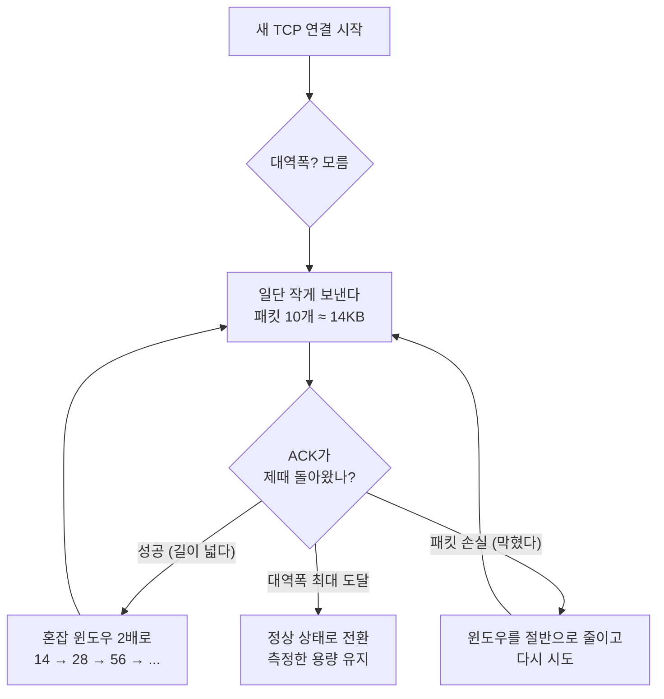

[이 전 블로그 포스팅](/2021/01/brotli-better-html-compression)을 통해서 brotli가 무엇인지, 왜 좋은지, 왜 써야 하는지에 대해서 알아봤다. 그러나 한 가지 더 궁금한 것이 있다. 과연 비단 IE 에서 지원하지 않는다는 이유만으로 쓰지 않는 것일까? 시스템 엔지니어들이 게을러서 brotli 지원을 안해주는 것일까?

Gzip은 웹 압축에 있어서 일종의 디팩토처럼 자리잡고 있다. 이 글을 처음 쓰던 2021년 무렵에는 웹사이트의 약 80% 정도가 gzip으로 서빙되고 있었고, 아예 압축이 안되어 있는 사이트가 60% 쯤 정도 됐다. (허허) [참고](https://almanac.httparchive.org/en/2019/compression) (다행히 [2025년](https://almanac.httparchive.org/en/2025/page-weight)에는 모바일 페이지의 약 72%가 제대로 텍스트 압축을 하고 있어, 압축조차 안 하는 사이트는 그때보다 많이 줄었다.)

아무튼 지간에, Gzip도 충분히 효과적인 압축 알고리즘이지만, brotli가 gzip보다 더 크게 압축해 주는 알고리즘으로 등장했다.

그리고 이전 글에서 말했듯이, brotli를 받아주지 못하는 거의 유일한 브라우저가 IE였는데, 이 글을 쓰던 2021년에도 이미 사이트의 93%가 IE 외 환경에서 서비스되고 있었다. 6%는 무시하라는 말처럼 들릴 수도 있지만(?) brotli를 받아줄 수 없는 브라우저의 경우 gzip으로 fallback 되게 할 수 있다. (그리고 잘 알려진 대로 IE는 2022년 6월에 완전히 은퇴했다. 즉 지금은 사실상 모든 브라우저가 brotli를 받을 수 있어, 이 "IE 핑계"는 더 이상 유효하지 않다.) fallback 방법은 나중에 다룬다.

그런데 왜, 많은 사이트들이 brotli를 사용하지 않는 것일까? brotli로 전환하는 것은 얼마나 중요한 것일까?

## 작다는 것이 반드시 더 빠르다는 것은 아니다.

물론, 일반적으로는 작은 파일이 더 빠르게 도착하는 것이 사실이다. 그렇다고 파일 크기를 20% 줄였다고 20% 더 빠르게 도착하는 것은 아니다. 다시 말해 파일 크기는 웹 성능을 측정하는 한가지 측면일 뿐, 이 외에도 리소스 대기시간, 패킷손실과 같은 다른 많은 요소와 상수가 웹 성능에 영향을 미친다. 크기를 절약하는 것은 데이터를 더 빠르게 도착하게 하는 것에 도움이 되지만, latency 에 제한이 있는 경우에는 데이터 청크가 도달하는 속도에 영향을 미치지 않는다.

## TCP, Packet, Round trip

먼저 tcp에 대해 알아보자. 서버에서 파일을 받을 때는 한번에 전체 파일을 가져오지 않는다. HTTP가 위치한 TCP는 파일을 세그먼트 또는 패킷으로 나눈다. 이러한 패킷은 순서대로 클라이언트에 전송된다. 패킷은 클라이언트가 모든 패킷을 가질 때 까지, 다음 패킷을 전송하기 전에 각 패킷을 확인하고 전송하며, 클라이언트가 이러한 패킷을 조립하여 하나의 파일로 조립하게 된다. 이러한 일련의 패킷은 라운드 트립 방식으로 전송된다.

여기서 한가지 헷갈리기 쉬운 점이 있다. "서버는 보낼 파일이 몇 KB인지 아는데, 왜 대역폭은 모른다는 거지?"라는 의문이 들 수 있다. 그런데 파일 크기(보낼 데이터의 양)와 대역폭(그 데이터를 흘려보낼 길이 얼마나 빠른가)은 전혀 다른 정보다. 택배로 치면 보낼 짐의 무게는 알지만, 지금 고속도로가 얼마나 막히는지는 출발해보기 전엔 모르는 것과 같다. 게다가 그 길은 나 혼자 쓰는 게 아니라 수많은 다른 트래픽과 공유하기 때문에, 가용 대역폭은 실시간으로 계속 변한다. 그래서 서버는 파일 크기를 알아도 "이걸 얼마나 빨리 보낼 수 있는지"는 직접 보내보면서 측정하는 수밖에 없다.

각각의 새로운 TCP 연결은 현재 사용 가능한 대역폭이 무엇인지, 연결을 얼마나 신뢰할 수 있는지를 알 수 있는 방법이 없다. (예: 패킷 손실 등) 만약 서버가 한 연결당 1메가 비트 짜리 연결을 통해 메가바이트급 전송을 시도한다면, 서버 연결 요청이 쇄도하여 혼잡이 발생하게 될 것이다. 만약 1메가 바이트의 사용가능한 연결을 바탕으로 1메가 비트의 데이터를 전송하려고 한다면, 용량이 낭비되고 말 것이다.

이를 해결하기 위해 [TCP는 slow start를 사용한다.](https://ko.wikipedia.org/wiki/%ED%98%BC%EC%9E%A1_%EC%A0%9C%EC%96%B4) 각각의 새로운 TCP연결은 첫번째 왕복에서 데이터 패킷 10개만 사용하도록 제한된다. (약 14kb) 10개가 성공적으로 도착한다면, 그 다음에는 20개의 패킷을, 그다음에는 40, 80, 160 으로 기하급수적으로 증가하는데 이 증가는 다음 수준에 다다를 때 까지 발생한다.

1. 패킷손실이 발생. 이 지점에서 서버는 마지막 패킷 수를 절반으로 줄이고 다시 시도
2. 대역폭 최대에 다다라서 최대 용량을 사용가능한 경우

이러한 전략은 웹 애플리케이션이 만드는 모든 새로운 TCP연결에 활용된다. 그림으로 그리면 이런 흐름이다.

결국 서버가 대역폭을 처음부터 알았다면 이 탐색 루프 자체가 필요 없다. "모르니까 작게 보내보고 ACK로 추론한다"는 것이 핵심이다.

다시 브라우저로 돌아와서, 새 TCP 연결의 초기 대역폭 용량은 14kb다. 리액트로 예를 들어서, 아래의 표를 보자.

| Round Trip | TCP Capacity (kb) | Cumulative Transfer (kb) | React DOM               |
| ---------- | ----------------- | ------------------------ | ----------------------- |
| 1          | 14                | 14                       |                         |
| 2          | 28                | 42                       | Gzip(37kb) Brotli(33kb) |
| 3          | 56                | 98                       |                         |
| 4          | 112               | 210                      | Uncompressed (119kb)    |
| 5          | 224               | 434                      |                         |

(둘다 최대 치로 압축)

**압축은 brotli가 4kb나 더 되었지만, TCP 작동 원리에 따라서 모두 두 번째 왕복에 다운로드가 완료 되었다. 따라서, 모든 왕복시간이 거의 균일하다면, Gzip이나 brotli나 모두 전송시간에 차이가 없다는 결론이 나오게 된다.**

따라서 요점은 파일 크기가 아니라, TCP, 즉 패킷 및 왕복에 관한 것이다. 파일을 더 작게 만드는 것이 문제가 아니고, 파일을 의미있게 작게 만들어서 더 낮은 왕복 버킷에 집어 넣어야 한다. 결과적으로, brotli가 gzip보다 더욱 효과적이라면 파일을 왕복 임계값 아래로 (위의 예제에서는 14kb급으로), 더욱 공격적으로 압축을 할 수 있어야 한다.

이 규칙은 또한 새로운 TCP 연결에만 적용되며, primed TCP 연결로 가져온 파일은 영향을 받지 않는다. 여기서 primed 연결이란, 위의 slow start 과정을 이미 거쳐서 혼잡 윈도우가 충분히 커진 "데워진(warm)" 연결을 말한다. 갓 만들어진 연결이 14KB부터 시동을 거는 차가운 엔진이라면, primed 연결은 이미 고속도로에서 달리고 있는 차여서 가속 구간 없이 바로 빠르게 받을 수 있다. 즉 14KB 왕복 버킷 제약은 갓 만들어진 연결에서만 빡빡하게 걸린다. 이는 두가지 중요한 점을 제시한다.

1. 정적자산을 자체 호스팅 하는것이 중요하다. 이렇게 하면 이미 워밍업되어 있는 (새로 연결되어 있는) TCP에 연결 할 수 있으므로, 시작속도가 느려지는 것을 방지할 수 있다. 여기서 핵심은 "내 서버에 둬라"가 아니라 자산을 여러 third-party 도메인에 흩뿌려 연결을 잘게 쪼개지 말라는 것이다. 도메인이 늘어날 때마다 DNS 조회, TCP/TLS 핸드셰이크, 차가운 slow start를 처음부터 다시 치러야 하기 때문이다. CDN을 버리라는 뜻은 아니다. 오히려 자산을 하나의 CDN origin으로 모으면 연결 재사용과 엣지 근접 이점을 둘 다 챙길 수 있다.
2. 기하 급수적으로 패킷이 커지면 얼마나 거대한 대역폭에 빠르게 도달할 수 있다. 연결을 더 많이 쓰고 재사용할 수록 용량이 빠르게 늘어난다.

| Round Trip | TCP Capacity (kb) | Cumulative Transfer (kb) |
| ---------- | ----------------- | ------------------------ |
| 1          | 14                | 14                       |
| 2          | 28                | 42                       |
| 3          | 56                | 98                       |
| 4          | 112               | 210                      |
| 5          | 224               | 434                      |
| 6          | 448               | 882                      |
| 7          | 896               | 1778                     |
| 8          | 1792              | 3570                     |
| 9          | 3584              | 7154                     |
| 10         | 7168              | 14322                    |
| ...        | ...               | ...                      |
| 20         | 7340032           | 14680050                 |

10 회 왕복정도면, TCP는 7168kb이고, 14322kb를 전송했다. 이는 일반적인 웹 브라우징에 적합하다. 여기서 말하는 `일반적인`이라는 것은 대역폭 한계에 도달하기 전에 전체 웹페이지와 모든 하위 리소스를 로드 하는 것이다. 따라서, 1gbps 급 속도는 대부분 사용하지 않기 때문에 일상적인 브라우징이 더 빨라졌던가 하는 것은 느끼지 못하게 된다.

## 실제 세계에서의 실험

brotli로 제공되는 사이트에 brotli 사용을 중지하면 된다. https://www.webpagetest.org/ 에서 `content-encoding`에 `gzip`을 명시해주면 된다.

- 압축을 완전히 비활성화: `accept-encoding: 랜덤문자열`
- brotli비활성화 및 gzip: `accept-encoding: gzip`
- brotli: 비워 둔다.

결과: https://docs.google.com/spreadsheets/d/18A_dP1DuavmMjmFnHXf4gdw6ThTne5e6UyzUUgxKI5s/edit#gid=0

- gzip 크기 감소 vs 비압축: 73% 감소
- gzip fcp vs 비압축: 23.3% 감소
- brotli 크기 감소 vs gzip: 5.8% 감소
- brotli fcp vs gzip: 3.5% 감소

gzip은 비압축 대비 약 73% 정도의 크기 감소를 이뤄 냈고, 이에 더해 brotli는 gzip 대비 5.8%를 더 감소시켰다.

## 그 사이에 바뀐 것들 (2026년에 다시 보며)

이 글은 2021년에 쓴 것이라, 몇 가지는 그 사이에 꽤 달라졌다.

**brotli는 이제 "안 쓰는" 기술이 아니다.** [HTTP Archive Web Almanac](https://almanac.httparchive.org/en/2024/markup)에 따르면 2024년 기준 모바일 페이지의 약 37%가 brotli로 서빙되고 있다 (2023년 28%에서 상승). 특히 [2025년 CDN 챕터](https://almanac.httparchive.org/en/2025/cdn)를 보면, CDN을 거치는 요청은 46%가 brotli, 42%가 gzip으로 brotli가 이미 gzip을 추월했다. 반면 CDN 없이 원본 서버가 직접 응답하는 경우는 여전히 brotli 39% / gzip 61%로 gzip이 우세하다. 즉 "버튼 하나 누르면 켜지는" CDN 환경에서는 brotli가 사실상 기본값이 됐고, 직접 nginx/apache를 운영하는 쪽이 상대적으로 뒤처져 있는 셈이다.

**이제는 zstd라는 선택지도 생겼다.** 페이스북이 만든 [Zstandard(zstd)](https://en.wikipedia.org/wiki/Zstd)는 2025년 CDN 요청의 약 12%까지 올라왔다. 압축률과 압축 속도의 트레이드오프를 더 유연하게 조절할 수 있어서, 이제 "그런데 왜 brotli를 안 쓸까?"라는 질문은 "그런데 왜 zstd를 안 쓸까?"로 한 단계 옮겨가고 있다.

**왕복(RTT) 버킷 논리에는 전제가 있다.** 위에서 설명한 "작아도 같은 왕복 버킷에 들어가면 전송 시간은 같다"는 분석은 _새 TCP 연결 하나로 파일 하나를 받는 HTTP/1.1_ 상황을 가정한 것이다. HTTP/1.1에서는 한 연결로 한 번에 파일 하나씩만 주고받을 수 있었기 때문에(그래서 브라우저는 보통 한 도메인당 연결을 6개쯤 따로 열어 병렬로 받았다), "이 파일이 14KB 버킷 안에 들어가나"라는 파일 하나 단위의 분석이 비교적 잘 들어맞았다.

그런데 HTTP/2의 멀티플렉싱이나 HTTP/3(QUIC)에서는 하나의 연결 안에 여러 리소스를 잘게 쪼개 동시에 실어 나른다. 이렇게 되면 그 연결의 congestion window는 모든 리소스가 함께 나눠 쓰는 "공용 예산"이 된다. 즉 개별 파일이 어느 왕복 버킷에 들어가는지보다, 전체 리소스의 총량이 이 공용 window를 얼마나 빨리 키우고 소진하느냐(누적 전송량)가 더 중요해진다. 한 트럭에 모든 짐을 같이 싣는다고 생각하면, 짐 하나하나의 크기보다 트럭에 실린 총 무게와 트럭이 짐을 다 부리는 시점이 관건인 셈이다.

그래서 단일 파일만 떼어 보면 묻혔던 brotli의 5~20% 절감이, 수많은 리소스에 걸쳐 합쳐지면 누적 전송량을 의미 있게 줄여 실제 체감 차이로 이어질 여지가 커진다. 번들이 크고 리소스가 많을수록 더 그렇다.

**동적 콘텐츠에서 brotli를 안 켜는 진짜 이유는 CPU다.** brotli의 최대 압축 레벨(11)은 gzip 최대치보다 압축 시간이 훨씬 오래 걸린다. 그래서 미리 압축해 두고 그대로 내보낼 수 있는 정적 자산에는 레벨 11을, 매 요청마다 즉석에서 압축해야 하는 동적 응답에는 비용이 낮은 레벨(보통 4~5)을 쓰거나 아예 gzip을 유지하는 것이 합리적이다. "왜 brotli를 안 쓰나"의 실무적인 답은 IE보다 오히려 이 CPU 비용 쪽에 가깝다.

## 결론

gzip에 비해 brotli가 갖는 이점은, 적어도 새 연결로 단일 파일을 한 번 받는 관점에서는 생각보다 크지 않다.

brotli를 활성화 하는 것이 CDN 관리자 메뉴의 버튼 하나를 누르는 것 만큼 간단하다면 지금 바로 실행하는 것이 좋다. 최소한의 개선이라도 없는 것보단 낫고, fallback 제공도 잘 되어 있다.

가능한 경우 정적 자산의 경우 가능한 가장 큰 압축 수준을 사용하며, 동적인 요소에 대해서는 중간 정도의 압축을 해주는 것이 좋다. 만약 nginx 를 사용중이라면, 현재 압축수준이 1로 (기본값으로) 되어 있는지 확인해보는 것이 좋다.

brotli를 구현하기 위해 너무 애쓸 필요는 없다. 압축할 수 있는 모든 항목에 대해 gzip이 제공되고 있다면, 그것만으로도 충분할 수 있다.

— 라는 것이 2021년의 답이었다. 그런데 이 글의 제목으로 돌아가 보면, "왜 brotli를 안 쓸까?"라는 질문 자체가 이제는 시효를 다했다. 앞서 봤듯이 CDN을 쓰고 있다면 brotli는 고민할 것도 없이 이미 켜져 있을 가능성이 높기 때문이다. 그래서 2026년의 답은 정반대에 가깝다. 이제는 대부분 쓰고 있고, 정말로 안 쓰고 있다면 그건 CDN 없이 origin을 직접 굴리고 있거나, 동적 응답의 CPU 비용을 아끼고 있거나 — 아니면 이미 그다음인 zstd를 저울질하고 있다는 뜻이다.

이 글은 csswizardry의 [Real-world effectiveness of Brotli](https://csswizardry.com/2020/04/real-world-effectiveness-of-brotli/)를 바탕으로, 그 이후 바뀐 상황과 설명을 보태 다시 정리한 것이다.
