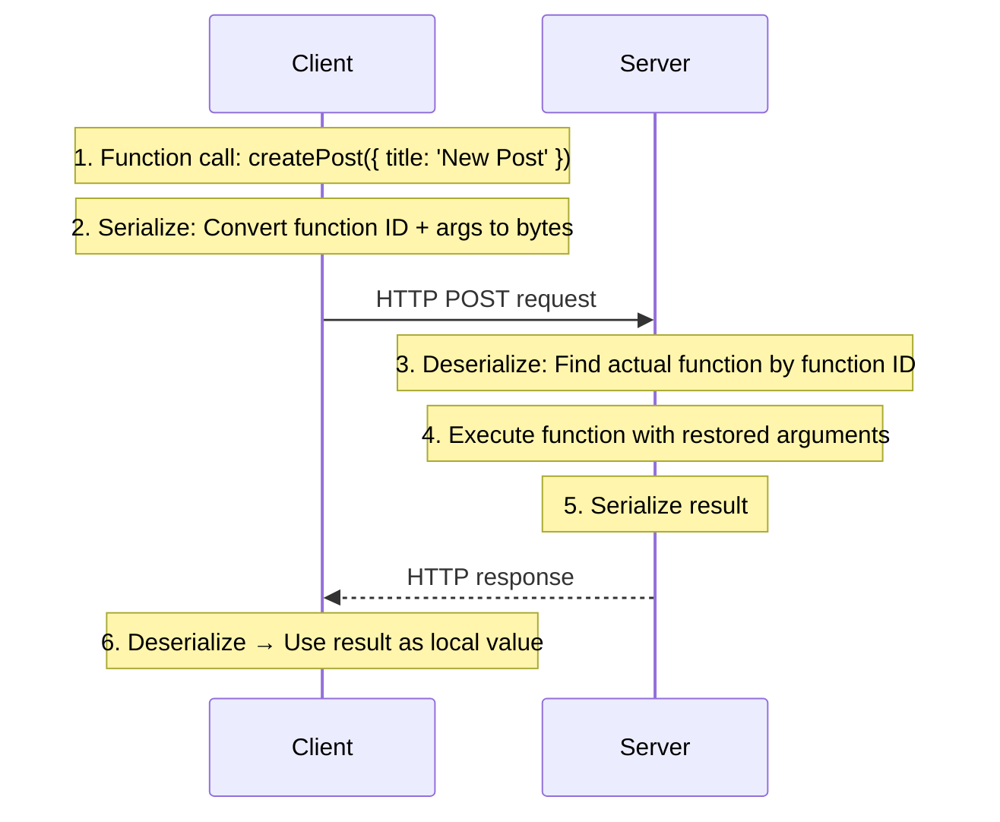
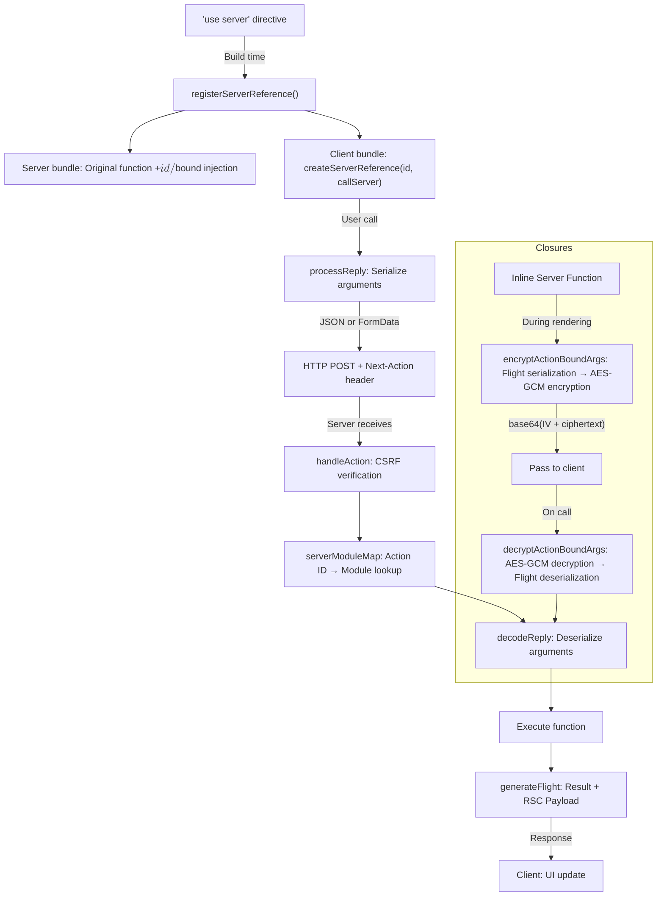

## Table of Contents

## Introduction

```tsx
async function createPost(formData: FormData) {
  'use server'
  const title = formData.get('title')
  await db.posts.create({title})
}
```

A single line: `"use server"`. The moment you write this as the first line of a function body, this function is no longer an ordinary function. It becomes a **server endpoint** that can be called from the client. All the traditional backend processes of defining routes, setting up middleware, parsing requests, and serializing responses are hidden behind this single line.

React's official documentation clarified the terminology starting in September 2024[^1]:

- **Server Function**: Any async function marked with `"use server"`
- **Server Action**: Server functions that are passed to an `action` prop or called within an action

In other words, all Server Actions are Server Functions, but not all Server Functions are Server Actions. This article uses the official term "Server Functions."

This article dissects everything that single line of `"use server"` creates. How code is transformed at build time, what happens on the network when called from the client, how arguments are serialized, how closure variables are encrypted, and why security deserves special attention.

> The source code analysis in this article is based on **React 19.2** and **Next.js 16.1**. Internal implementations may vary across versions.

## RPC: The Roots of Server Functions

To understand Server Functions, you need to understand RPC (Remote Procedure Call) first. RPC is "a protocol for calling functions on a remote server as if they were local functions."

```ts
// Traditional approach: Write all HTTP request details manually
const response = await fetch('/api/posts', {
  method: 'POST',
  headers: {'Content-Type': 'application/json'},
  body: JSON.stringify({title: 'New Post', content: 'Content'}),
})
const post = await response.json()

// RPC approach: Hide the existence of the network
const post = await createPost({title: 'New Post', content: 'Content'})
```

The core of RPC is **abstracting** network communication. The caller doesn't need to know whether this function executes locally or on a server on the other side of the globe. The technologies that make this abstraction possible are **Serialization** and **Deserialization**.



gRPC, JSON-RPC, and XML-RPC are representative RPC protocols. React's Server Functions use essentially the same mechanism, but differ in that they integrate with a custom serialization format called **Flight Protocol** and the React component tree.

Flight Protocol is a **custom streaming serialization format** created by the React team for RSC (React Server Components). It's used for bidirectional communication: sending server component rendering results to the client (Server → Client) and passing arguments and return values when calling server functions (Client → Server). Going beyond JSON's limitations (no support for functions, `undefined`, `Date`, circular references, etc.), it can stream React element trees, server references, Promises, `Map`, `Set`, etc. in line-based chunks. The prefix tokens like `$h`, `$D`, `$n` covered in this article are all encoding rules of Flight Protocol.

### The Old Trap of RPC: Eight Fallacies of Distributed Computing

RPC is a concept introduced in 1984. There have been countless attempts—Java RMI, CORBA, DCOM—and most failed. Why did they fail? The "Eight Fallacies of Distributed Computing"[^2] summarized in 1994 hits the core. Eight assumptions developers unconsciously make about networks are all wrong.

Let's first look at four fallacies that directly clash with Server Functions:

- **"The network is reliable"** — Server function calls can fail at any time. Without `try/catch`, users see a frozen screen with no feedback.
- **"Latency is zero"** — Local function calls take nanoseconds, but server functions take milliseconds to seconds. Calling 100 times in a `for` loop results in 100 network round trips.
- **"Bandwidth is infinite"** — Serialized arguments and responses have size. Passing huge objects as arguments directly becomes network cost.
- **"The network is secure"** — Server function arguments are passed as HTTP requests. They can be intercepted and manipulated.

The remaining four (topology changes, administrative control, transport costs, network heterogeneity) can't be ignored in large-scale services, but the above four are what frontend developers experience.

The React team knows these issues. The official documentation guides using Server Functions with `useActionState` or `useTransition`[^1]. This explicitly addresses network-specific issues like pending states, error handling, and optimistic updates. **"Hide the network, but expose network characteristics"** — this is the lesson learned from past RPC failures.

## Build-time Transformation: What "use server" Actually Does

The `"use server"` directive has no effect at runtime. The real work happens at **build time**.

### registerServerReference: Stamping Functions with Metadata

When the bundler (webpack, Turbopack) discovers a `"use server"` directive, it calls React's `registerServerReference` function to **inject metadata as properties** into that function object. The actual implementation of this function is in the `react-server-dom-webpack` package[^3].

```js
// react-server-dom-webpack/src/ReactFlightWebpackReferences.js

const SERVER_REFERENCE_TAG = Symbol.for('react.server.reference')

export function registerServerReference(reference, id, exportName) {
  return Object.defineProperties(reference, {
    $$typeof: {value: SERVER_REFERENCE_TAG},
    $$id: {
      value: exportName === null ? id : id + '#' + exportName,
      configurable: true,
    },
    $$bound: {value: null, configurable: true},
    bind: {value: bind, configurable: true},
  })
}
```

The key is `Object.defineProperties`. It overwrites three special properties on top of the original function object.

| Property   | Value                                  | Description                                             |
| ---------- | -------------------------------------- | ------------------------------------------------------- |
| `$$typeof` | `Symbol.for('react.server.reference')` | Tag identifying this function as server reference       |
| `$$id`     | `"moduleId#exportName"`                | Unique identifier for finding function on server        |
| `$$bound`  | `null`                                 | Arguments bound with `.bind()`. Initial value is `null` |

The format of `$$id` is important. It's `moduleId + '#' + exportName`. For example, if you export `createPost` from `app/actions.ts`, the ID becomes something like `"app/actions.ts#createPost"`. In Next.js, this ID is hashed and converted to a **42-character string**.

### Different Implementation on Client/SSR Side

There's an important caveat here. The above code is the implementation for the **RSC server layer**. The client/SSR layer has a **completely different implementation** with the same name[^4].

```js
// react-client/src/ReactFlightReplyClient.js

function registerBoundServerReference(reference, id, bound, encodeFormAction) {
  knownServerReferences.set(reference, {
    id: id,
    originalBind: reference.bind,
    bound: bound,
  })
  Object.defineProperties(reference, {
    $$FORM_ACTION: {value: encodeFormAction || defaultEncodeFormAction},
    $$IS_SIGNATURE_EQUAL: {value: isSignatureEqual},
    bind: {value: bind},
  })
}
```

Here's a summary of the differences between the two implementations:

|                         | RSC Server (`ReactFlightWebpackReferences`)                              | Client/SSR (`ReactFlightReplyClient`)                               |
| ----------------------- | ------------------------------------------------------------------------ | ------------------------------------------------------------------- |
| **Runtime Environment** | RSC server (during Flight serialization)                                 | Browser, SSR                                                        |
| **Metadata Storage**    | Directly on function via `Object.defineProperties`                       | Stored in `WeakMap` (`knownServerReferences`)                       |
| **Injected Properties** | `$$typeof`, `$$id`, `$$bound`, `bind`                                    | `$$FORM_ACTION`, `$$IS_SIGNATURE_EQUAL`, `bind`                     |
| **Purpose**             | Identify server reference during Flight serialization (`$$typeof` check) | Progressive Enhancement (`$$FORM_ACTION`), HMR signature comparison |

The RSC server checks `$$typeof === Symbol.for('react.server.reference')` when serializing component trees and converts them to `$h` tokens. The client/SSR side doesn't need to serialize server references, so `$$typeof` is unnecessary. Instead, it needs `$$FORM_ACTION` for form submission without JS. WeakMap is used to avoid exposing unnecessary properties on function objects.

Turbopack also uses the same `$$typeof`/`$$id`/`$$bound` pattern in `react-server-dom-turbopack/src/ReactFlightTurbopackReferences.js`. However, since Turbopack loads RSC and SSR layers as **different module evaluation contexts within the same chunk file**, static analysis (grep) of build artifacts only shows the client-side WeakMap implementation. The `$$typeof` version is loaded at runtime in the RSC context.

### .bind() Override: Accumulating Bound Arguments

When you want to pre-bind values known at render time to server functions, you use `.bind()`. For example, binding each post's ID to delete buttons in a post list.

```tsx
// Server Component
export default async function PostList() {
  const posts = await db.posts.findMany()
  return posts.map((post) => (
    <form key={post.id} action={deletePost.bind(null, post.id)}>
      <button type="submit">Delete</button>
    </form>
  ))
}
```

The problem is that using regular `Function.prototype.bind` directly would lose server reference metadata like `$$typeof` and `$$id` from the returned function. Since React uses this metadata to determine "whether this function is a server reference," the result of `.bind()` must still be recognized as a server reference. So `registerServerReference` overrides `.bind()` with a custom implementation that maintains metadata while **accumulating** bound arguments in the `$$bound` array. (On the client side, they accumulate in the WeakMap's `bound`.)

```js
// RSC server side: react-server-dom-webpack/src/ReactFlightWebpackReferences.js

function bind() {
  const newFn = FunctionBind.apply(this, arguments)
  if (this.$$typeof === SERVER_REFERENCE_TAG) {
    const args = ArraySlice.call(arguments, 1)
    return Object.defineProperties(newFn, {
      $$typeof: {value: SERVER_REFERENCE_TAG},
      $$id: {value: this.$$id},
      $$bound: {
        value: this.$$bound ? this.$$bound.concat(args) : args,
      },
      bind: {value: bind, configurable: true},
    })
  }
  return newFn
}
```

Arguments are properly accumulated even when chaining `.bind()` multiple times.

```ts
const fn1 = deletePost.bind(null, userId) // $$bound: [userId]
const fn2 = fn1.bind(null, postId) // $$bound: [userId, postId]
```

### Separation of Server and Client Bundles

Let's see specifically how the original code is separated at build time.

```tsx
// Original: app/actions.ts
'use server'

export async function createPost(formData: FormData) {
  const title = formData.get('title')
  await db.posts.create({title})
}
```

**Server Bundle**: Contains the original function with metadata injected via `registerServerReference`.

```js
// Server bundle
import {registerServerReference} from 'react-server-dom-webpack/server'

async function createPost(formData) {
  const title = formData.get('title')
  await db.posts.create({title})
}

registerServerReference(createPost, 'abc123def456...', 'createPost')
```

**Client Bundle**: Function body is completely removed, and a proxy function is created with `createServerReference`.

```js
// Client bundle
import {createServerReference} from 'react-server-dom-webpack/client'

export const createPost = createServerReference(
  'abc123def456...#createPost',
  callServer, // Callback provided by framework (Next.js)
)
```

Neither `db.posts.create` nor the logic of `formData.get` exists in the client bundle. What the client receives is only a **proxy function** that sends HTTP requests to the server.

## Server References on the Client: The Identity of callServer

What actually happens when a server function is called from the client? Let's examine the implementation of `createServerReference` we saw above.

```js
// react-client/src/ReactFlightReplyClient.js

export function createServerReference(id, callServer, encodeFormAction) {
  let action = function () {
    const args = Array.prototype.slice.call(arguments)
    return callServer(id, args)
  }
  registerBoundServerReference(action, id, null, encodeFormAction)
  return action
}
```

Surprisingly simple. When a server function is called, it **collects arguments into an array** and calls `callServer(id, args)`. That's it.

`callServer` is not provided by React but is a **callback injected by the framework (Next.js)**[^4]. It's passed when initializing React's Flight client.

```js
// When initializing React Flight client
this._callServer = callServer !== undefined ? callServer : missingCall

function missingCall() {
  throw new Error(
    'Trying to call a function from "use server" but the callServer ' +
      'option was not implemented in your router runtime.',
  )
}
```

Without `callServer`, you get an error. This means you can't call server functions with React alone without Next.js. React defines the protocol, Next.js implements it.

### When There Are Bound Arguments

When there are arguments bound via `.bind()` or closures, `createBoundServerReference` is used. In this case, bound arguments are prepended to arguments from the call site.

```js
// react-client/src/ReactFlightReplyClient.js

export function createBoundServerReference(metaData, callServer) {
  const {id, bound} = metaData

  let action = function () {
    const args = Array.prototype.slice.call(arguments)
    const p = bound

    if (!p) {
      return callServer(id, args)
    }

    // bound is Promise<Array<any>>
    if (p.status === 'fulfilled') {
      const boundArgs = p.value
      return callServer(id, boundArgs.concat(args))
    }

    return Promise.resolve(p).then(function (boundArgs) {
      return callServer(id, boundArgs.concat(args))
    })
  }

  registerBoundServerReference(action, id, bound)
  return action
}
```

The reason `bound` is a `Promise` is because decryption of closure variables is an asynchronous operation (covered in detail later). The `p.status === 'fulfilled'` check is an optimization for handling already resolved Promises synchronously.

## Argument Serialization: processReply

When a server function is called from the client, its arguments must be transmitted over the network. This serialization is handled by the `processReply` function.

### JSON vs FormData: Two Paths

`processReply` serializes in two different ways depending on the complexity of the arguments.

```js
// react-client/src/ReactFlightReplyClient.js

export function processReply(
  root,
  formFieldPrefix,
  temporaryReferences,
  resolve,
  reject,
) {
  let nextPartId = 1
  let pendingParts = 0
  let formData = null

  const json = serializeModel(root, 0)

  if (formData === null) {
    resolve(json) // Simple case: JSON string
  } else {
    formData.set(formFieldPrefix + '0', json)
    if (pendingParts === 0) {
      resolve(formData) // Complex case: FormData
    }
  }
}
```

**JSON path**: When arguments consist only of primitive types, arrays, and plain objects. This is the lightest approach.

```
// When calling incrementLike(42)
"42"
```

**FormData path**: When complex types like Blob, ReadableStream, or other server references are included. Individual values are placed in separate FormData parts.

```
------WebKitFormBoundary
Content-Disposition: form-data; name="0"
42
------WebKitFormBoundary
Content-Disposition: form-data; name="1"
[Blob data]
------WebKitFormBoundary--
```

### Flight Protocol $ Prefix Tokens

Values that cannot be represented in JSON within `serializeModel` are encoded as special tokens prefixed with `$`. Here's the complete token table used in actual React source code.

| Token           | Meaning            | Example                            |
| --------------- | ------------------ | ---------------------------------- |
| `$` + hex       | Inline reference   | `$3` → reference to chunk 3        |
| `$@` + hex      | Promise            | Async value                        |
| `$h` + hex      | Server reference   | `$h5` → server function in chunk 5 |
| `$K` + hex      | FormData           |                                    |
| `$Q` + hex      | Map                |                                    |
| `$W` + hex      | Set                |                                    |
| `$B` + hex      | Blob               |                                    |
| `$A` + hex      | ArrayBuffer        |                                    |
| `$R` + hex      | ReadableStream     |                                    |
| `$D` + dateJSON | Date               | `$D2026-03-09T00:00:00.000Z`       |
| `$n` + digits   | BigInt             | `$n12345678901234567890`           |
| `$S` + name     | Symbol.for()       | `$Smy-symbol`                      |
| `$-0`           | -0 (negative zero) |                                    |
| `$Infinity`     | Infinity           |                                    |
| `$-Infinity`    | -Infinity          |                                    |
| `$NaN`          | NaN                |                                    |
| `$undefined`    | undefined          |                                    |
| `$$`            | Escaped `$`        | When strings contain `$`           |

This covers all types that JSON cannot represent: `undefined`, `NaN`, `Infinity`, `-0`, `BigInt`, `Date`, etc. The type support range is much broader than typical JSON-RPC.

### Passing Server Functions as Arguments

Server functions themselves can be passed as arguments to other server functions. In this case, the function's ID and bound arguments are found in the `knownServerReferences` WeakMap and serialized as a `$h` token.

```js
// Inside resolveToJSON
if (typeof value === 'function') {
  const referenceClosure = knownServerReferences.get(value)
  if (referenceClosure !== undefined) {
    const {id, bound} = referenceClosure
    const json = JSON.stringify({id, bound}, resolveToJSON)
    if (formData === null) {
      formData = new FormData()
    }
    const refId = nextPartId++
    formData.set(formFieldPrefix + refId, json)
    return serializeServerReferenceID(refId) // "$h" + hex
  }
}
```

Passing regular functions (not server functions) that cannot be serialized will result in an error.

### Serializable vs Non-Serializable Types Summary

**Serializable**:

| Type                                                         | Notes                                      |
| ------------------------------------------------------------ | ------------------------------------------ |
| `string`, `number`, `bigint`, `boolean`, `undefined`, `null` | Primitive types                            |
| `Symbol.for('name')`                                         | Only symbols registered in global registry |
| `Array`, `Map`, `Set`, `TypedArray`, `ArrayBuffer`           | Iterables                                  |
| `Date`, `FormData`, `Promise`                                | Built-in objects                           |
| Plain objects (`{}`, `{ key: value }`)                       | Created with object initializer            |
| Server functions                                             | Functions marked with `"use server"`       |

**Non-Serializable**:

| Type                                           | Reason                              |
| ---------------------------------------------- | ----------------------------------- |
| Regular functions, arrow functions             | Code cannot cross network           |
| Class instances                                | Cannot restore prototype chain      |
| React elements (JSX)                           | Contains component functions        |
| DOM event objects                              | Circular references, native objects |
| Null prototype objects (`Object.create(null)`) |                                     |
| `Symbol()` not in global registry              |                                     |

```tsx
// ❌ Cannot pass event object
<button onClick={(e) => serverFn(e)}>

// ✅ Pass only necessary values
<button onClick={() => serverFn(someId)}>
```

## Server-Side Processing: Next.js Action Handler

When a POST request sent from the client arrives at the server, Next.js's `handleAction` function handles the entire lifecycle.

### Phase 1: Request Detection

```ts
// next/src/server/app-render/server-action-request-meta.ts

function getServerActionRequestMetadata(req) {
  const actionId = req.headers.get('next-action') // Action ID
  const contentType = req.headers.get('content-type')

  const isFetchAction = actionId && req.method === 'POST'
  const isMultipartAction =
    req.method === 'POST' && contentType?.startsWith('multipart/form-data')
  const isURLEncodedAction =
    req.method === 'POST' && contentType === 'application/x-www-form-urlencoded'

  return {actionId, isFetchAction, isMultipartAction, isURLEncodedAction}
}
```

Server function requests come through two paths:

- **Fetch Action (SPA)**: Called when JavaScript is loaded. The `Next-Action` header contains the Action ID.
- **MPA Action (Progressive Enhancement)**: Form submission without JavaScript. No `Next-Action` header, but a `$ACTION_ID_<hash>` field exists in the FormData.

### Phase 2: CSRF Protection

```ts
// next/src/server/app-render/csrf-protection.ts

const originDomain = new URL(originHeader).host
const host = parseHostHeader(req.headers) // X-Forwarded-Host preferred, Host fallback

if (!originDomain) {
  // Warning only — older browsers might not send Origin
} else if (!host || originDomain !== host.value) {
  if (isCsrfOriginAllowed(originDomain, serverActions?.allowedOrigins)) {
    // Domain allowed in next.config.js allowedOrigins
  } else {
    throw new Error('Invalid Server Actions request.') // CSRF blocked
  }
}
```

Compares the `Origin` header with the `Host` header (or `X-Forwarded-Host`)[^5]. Requests are rejected if they don't match. `isCsrfOriginAllowed` supports wildcard domain matching like `*.example.com` to accommodate reverse proxy environments.

No CSRF tokens are used. POST-only + Origin validation blocks most CSRF attacks, but note that **if XSS exists, server functions can be called from the same origin**.

### Phase 3: Action ID → Function Discovery

This is the process of finding the actual function from the Action ID.

```ts
// next/src/server/app-render/action-handler.ts

function getActionModIdOrError(actionId, serverModuleMap) {
  const actionModId = serverModuleMap[actionId]?.id

  if (!actionModId) {
    throw getActionNotFoundError(actionId) // Deployment skew or invalid request
  }

  return actionModId
}

// Function loading
const actionMod = await ComponentMod.__next_app__.require(actionModId)
const actionHandler = actionMod[actionId]
```

`serverModuleMap` is a **manifest** generated at build time[^6]. It maps Action IDs (42-character hashes) to module paths. If this mapping doesn't exist — such as when requesting with an old build's ID to a new server — `getActionNotFoundError` is thrown. This is the **version skew** problem.

Version skew frequently occurs right after deployments. Users are viewing HTML from a previous build (with old Action IDs embedded in forms) while the server has been replaced with a new build. Since closure encryption keys also change with each build, bound arguments encrypted in the previous build cannot be decrypted.

There are several ways to handle this problem in production:

- **Skew Protection**: Vercel doesn't immediately shut down previous builds during deployment but maintains them for a certain period, ensuring ongoing requests are routed to the correct build.
- **`NEXT_SERVER_ACTIONS_ENCRYPTION_KEY`**: This environment variable can fix encryption keys across builds, preventing closure decryption failures. However, it doesn't solve the problem of Action IDs themselves changing.
- **Blue-Green Deployment**: Deploy the new build to a separate environment, then switch traffic all at once. Only in-flight requests at the moment of switch might fail, so schedule the switch during low-traffic periods.
- **Client-side Retry**: When server function calls fail, apply a pattern of using `router.refresh()` to reload the page and fetch new Action IDs from the new build.

### Phase 4: Argument Deserialization and Execution

```ts
// For Fetch Actions
const args = await decodeReply(requestBody, serverModuleMap)
const result = await actionHandler.apply(null, args)
```

`decodeReply` is React's Flight deserialization function, the reverse process of `processReply`. It restores tokens like `$D`, `$n`, `$h` back to their original types.

### Phase 5: Response Generation

When function execution completes, both the result and the **updated UI** are returned in a single response.

```ts
// When revalidation occurs
const flightResponse = await generateFlight({
  actionResult: result,
  // Also includes RSC Payload of changed pages
})
```

This is a key advantage of server functions. In traditional APIs, it's a 3-step process: "change → refetch → UI update", but with server functions, it's completed in **a single round trip**.

### Complete Request/Response Headers Summary

| Header                      | Direction | Purpose                                          |
| --------------------------- | --------- | ------------------------------------------------ |
| `Next-Action`               | Request   | Action ID (42-character hash)                    |
| `Content-Type`              | Request   | `multipart/form-data` or `text/plain`            |
| `Origin`                    | Request   | CSRF protection (compared with Host)             |
| `Host` / `X-Forwarded-Host` | Request   | CSRF protection (compared with Origin)           |
| `Cache-Control`             | Response  | `no-cache, no-store, max-age=0, must-revalidate` |
| `x-action-redirect`         | Response  | Redirect URL + type                              |
| `x-next-revalidated`        | Response  | Cache invalidation directive                     |

Note that `Cache-Control` is always `no-store`. Server function responses are never cached because mutation results should not be cached.

## Closure Encryption: The World of AES-GCM

When a server function defined inline within a Server Component captures external variables, these closure variables are encrypted and travel via the client. Let's dive into Next.js's actual implementation.

### Why Encryption is Necessary

```tsx
export default async function AdminPage() {
  const secretConfig = await getSecretConfig()

  async function updateConfig(formData: FormData) {
    'use server'
    // Captures secretConfig as closure
    await db.config.update(secretConfig.id, {
      value: formData.get('value'),
    })
  }

  return <form action={updateConfig}>...</form>
}
```

`secretConfig` is sensitive data that should only exist on the server. However, due to how server functions work, closure variables must be sent to the client and then return to the server when called. Without encryption, you could view the contents of `secretConfig` in the browser's DevTools.

### Encryption Implementation: AES-GCM

Next.js uses **AES-GCM** from the Web Crypto API[^7]. This authenticated encryption method provides both confidentiality and integrity guarantees simultaneously.

```ts
// next/src/server/app-render/encryption-utils.ts

export function encrypt(key: CryptoKey, iv: Uint8Array, data: Uint8Array) {
  return crypto.subtle.encrypt({name: 'AES-GCM', iv}, key, data)
}

export function decrypt(key: CryptoKey, iv: Uint8Array, data: Uint8Array) {
  return crypto.subtle.decrypt({name: 'AES-GCM', iv}, key, data)
}
```

### Source of Encryption Keys

```ts
// next/src/server/app-render/encryption-utils.ts

export async function getActionEncryptionKey() {
  if (__next_loaded_action_key) {
    return __next_loaded_action_key
  }

  const rawKey =
    process.env.NEXT_SERVER_ACTIONS_ENCRYPTION_KEY ||
    serverActionsManifest.encryptionKey // Auto-generated at build time

  __next_loaded_action_key = await crypto.subtle.importKey(
    'raw',
    stringToUint8Array(atob(rawKey)), // base64 decode
    'AES-GCM',
    true,
    ['encrypt', 'decrypt'],
  )

  return __next_loaded_action_key
}
```

Keys come from one of two sources:

1. `NEXT_SERVER_ACTIONS_ENCRYPTION_KEY` environment variable (manual configuration)
2. `serverActionsManifest.encryptionKey` (auto-generated at build time)

Since a new key is generated with each build, closures encrypted by previous builds cannot be decrypted by the new build's server. This is the encryption aspect of the version skew problem discussed earlier. In deployment environments where multiple versions are served simultaneously, you should explicitly set `NEXT_SERVER_ACTIONS_ENCRYPTION_KEY` to fix the key across builds. However, fixing the key creates a tradeoff between security and convenience, so managing key rotation cycles separately is recommended.

### Encryption Process: encodeActionBoundArg

Let's look at the actual encryption process step by step.

```ts
// next/src/server/app-render/encryption.ts

async function encodeActionBoundArg(actionId: string, arg: string) {
  const key = await getActionEncryptionKey()

  // 1. Generate 16-byte random IV
  const iv = new Uint8Array(16)
  crypto.getRandomValues(iv)

  // 2. Encrypt with actionId prepended to plaintext
  //    → Verify actionId matches during decryption (integrity check)
  const encrypted = await encrypt(key, iv, textEncoder.encode(actionId + arg))

  // 3. Return as base64(IV + ciphertext)
  return btoa(arrayBufferToString(iv.buffer) + arrayBufferToString(encrypted))
}
```

Wire format: `base64(IV_16bytes + AES_GCM_ciphertext)`

Prepending the `actionId` to the plaintext is crucial. While AES-GCM itself provides integrity verification, including the actionId in the plaintext provides additional verification that **"this ciphertext is really for this Action ID"**. This prevents attacks where encrypted closures from other server functions are pasted into this server function.

### Decryption Process: decodeActionBoundArg

```ts
async function decodeActionBoundArg(actionId: string, arg: string) {
  const key = await getActionEncryptionKey()

  // 1. base64 decode → separate IV (16 bytes) + ciphertext
  const payload = atob(arg)
  const iv = stringToUint8Array(payload.slice(0, 16))
  const ciphertext = stringToUint8Array(payload.slice(16))

  // 2. Decrypt
  const decrypted = textDecoder.decode(await decrypt(key, iv, ciphertext))

  // 3. Verify actionId prefix
  if (!decrypted.startsWith(actionId)) {
    throw new Error('Invalid Server Action payload: failed to decrypt.')
  }

  // 4. Remove actionId → original serialized data
  return decrypted.slice(actionId.length)
}
```

### Serialization Layer: Using Flight Protocol

Encryption/decryption of closure variables operates on top of the **React Flight Protocol**. Instead of converting variables to bytes, it uses Flight's `renderToReadableStream`/`createFromReadableStream` for serialization/deserialization.

```ts
// During encryption
export const encryptActionBoundArgs = React.cache(async function (
  actionId,
  ...args
) {
  // 1. Serialize with Flight Protocol
  const serialized = await streamToString(
    renderToReadableStream(args, clientModules),
  )
  // 2. Encrypt with AES-GCM
  return await encodeActionBoundArg(actionId, serialized)
})

// During decryption
export async function decryptActionBoundArgs(actionId, encryptedPromise) {
  const encrypted = await encryptedPromise
  // 1. Decrypt with AES-GCM
  const decrypted = await decodeActionBoundArg(actionId, encrypted)
  // 2. Deserialize with Flight Protocol
  return await createFromReadableStream(
    new ReadableStream({
      start(controller) {
        controller.enqueue(textEncoder.encode(decrypted))
        controller.close()
      },
    }),
    {
      serverConsumerManifest: {
        /* module maps */
      },
    },
  )
}
```

The reason for using Flight Protocol is that closure variables can contain types that cannot be represented as JSON, such as server references, Date, Map, etc.

It's wrapped with `React.cache` so it gets cached when called with identical arguments by reference within the same rendering pass. However, since `React.cache` compares using reference equality (`Object.is`), cache hits won't occur if objects created anew each render are included in the arguments. It's most effective for module-scoped server functions that have no closures.

### .bind() is Not Encrypted

Values passed via `.bind()` are not encrypted. Looking at the `bind` implementation in `ReactFlightWebpackReferences.js`[^3], it only accumulates bound arguments in a `$$bound` array without going through the encryption path. While I couldn't find official statements from the React team, this appears to be intentional behavior based on the source code structure.

```tsx
// Closure — encrypted
async function deletePost() {
  'use server'
  await db.posts.delete(post.id) // post.id is transmitted encrypted
}

// .bind() — not encrypted
const deletePostWithId = deletePost.bind(null, post.id)
// post.id is exposed to the client as plaintext
```

|             | Closure                        | `.bind()`        |
| ----------- | ------------------------------ | ---------------- |
| Encryption  | ✅ AES-GCM                     | ❌ Plaintext     |
| Performance | Encryption/decryption overhead | No overhead      |
| Use case    | Can contain sensitive data     | Public data only |

If you pass a secret token via `.bind()`, it will be exposed directly to the client. If secret values are needed, use closures or read them directly inside the server function.

## Progressive Enhancement: Forms That Work Without JS

The most important characteristic of the server function and `<form>` combination is that it works even without JavaScript. Let's see how this is implemented.

### MPA Action: Hiding Action ID in HTML

When a form is submitted before JavaScript loads, the browser performs a regular HTML form submission. Since it can't send the `Next-Action` header, the Action ID is hidden **inside the FormData**.

```html
<!-- HTML rendered by server (conceptual) -->
<form method="POST" action="/posts">
  <input type="hidden" name="$ACTION_ID_abc123def456..." value="" />
  <input type="text" name="title" />
  <button type="submit">Submit</button>
</form>
```

Special FormData field names used by Next.js:

| Field Prefix   | Purpose                                                   |
| -------------- | --------------------------------------------------------- |
| `$ACTION_ID_`  | Action ID for server functions without binding (42 chars) |
| `$ACTION_REF_` | Reference for server functions with binding               |

When the server receives this request, since there's no `Next-Action` header, it looks for fields starting with `$ACTION_ID_` in the FormData to extract the Action ID.

### Pre-Hydration Submission Queuing

When users submit forms while JavaScript is loading (before hydration), React queues them and **replays** them once hydration is complete.

```
1. Server renders HTML → sends to browser
2. User immediately submits form (JS not yet loaded)
3. Submission is stored in queue
4. JavaScript loads + hydration completes
5. Process queued submissions in order
```

This is why forms using server functions have the guarantee of being "safe to submit while loading". Using the third argument of `useActionState` (permalink), you can redirect to a specific URL to show results if submitted before hydration completes.

## Integration with Forms: useActionState and useTransition

### useActionState: Connecting State and Actions

`useActionState` manages server function return values as state and tracks pending status.

```tsx
'use client'

import {useActionState} from 'react'
import {createPost} from '@/app/actions'

function PostForm() {
  const [state, submitAction, isPending] = useActionState(createPost, null)

  return (
    <form action={submitAction}>
      <input type="text" name="title" disabled={isPending} />
      <button type="submit" disabled={isPending}>
        {isPending ? 'Creating...' : 'Create'}
      </button>
      {state?.error && <p>{state.error}</p>}
    </form>
  )
}
```

```ts
'use server'

export async function createPost(previousState: any, formData: FormData) {
  const title = formData.get('title') as string
  if (!title) {
    return {error: 'Please enter a title'}
  }
  await db.posts.create({title})
  return {error: null}
}
```

Using `useActionState` changes the server function's signature. A **previous state** is added as the first argument. React internally stores the return value from the previous call and injects it as the first argument in the next call.

### useTransition: Calling Outside Forms

When calling server functions from event handlers rather than forms, you must wrap them with `startTransition`.

```tsx
'use client'

import {useState, useTransition} from 'react'
import {incrementLike} from '@/app/actions'

function LikeButton({postId}: {postId: number}) {
  const [likes, setLikes] = useState(0)
  const [isPending, startTransition] = useTransition()

  return (
    <button
      disabled={isPending}
      onClick={() => {
        startTransition(async () => {
          const updatedLikes = await incrementLike(postId)
          setLikes(updatedLikes)
        })
      }}
    >
      {isPending ? '...' : `Likes ${likes}`}
    </button>
  )
}
```

`<form action>` automatically uses transitions internally. For event handlers, you must explicitly wrap them. Without this, you can't track pending state and error boundaries won't work properly.

## Next.js Framework Integration

### revalidation: Change and Update in One Round Trip

```ts
'use server'

import {revalidatePath} from 'next/cache'

export async function createPost(formData: FormData) {
  await db.posts.create({title: formData.get('title') as string})
  revalidatePath('/posts')
}
```

When `revalidatePath` is called, the server function's response includes the updated RSC Payload. The client handles both the data change results and UI updates with this single response.

### redirect: Control Flow Exception

```ts
'use server'

import {redirect} from 'next/navigation'
import {revalidatePath} from 'next/cache'

export async function createPost(formData: FormData) {
  const post = await db.posts.create({title: formData.get('title') as string})
  revalidatePath('/posts')
  redirect(`/posts/${post.id}`)
}
```

`redirect` throws an exception internally. Since subsequent code won't execute, `revalidatePath` **must be called before `redirect`**. Next.js's action handler catches this exception and converts it to an `x-action-redirect` header.

### Sequential Execution: Per-Client Queuing

Sequential execution of server functions is **per individual client (browser tab)**, not server-wide. More precisely, React's client runtime **dispatches server function calls one at a time**. It doesn't send the second request until the server returns a response to the first request.

```
User A's browser:  [action1] ──complete──> [action2] ──complete──> [action3]
User B's browser:  [action1] ──complete──> [action2]
                   ↑ Processed in parallel, independent of each other
```

From the server's perspective, requests from User A and User B are processed simultaneously. Sequential execution only applies **within the same browser tab**. If a user rapidly clicks a like button 3 times, React queues the second/third calls on the client side and sends them in order after the first response returns.

This is an **implementation detail of React's client runtime** and could change in the future. Currently, you can't make parallel server function calls from one tab, so if parallel processing is needed, you must use `Promise.all` within a single server function.

```ts
'use server'

// ❌ Even simultaneous calls from client are processed sequentially
// await Promise.all([publishPost(1), publishPost(2), publishPost(3)])

// ✅ Parallel processing within one server function
export async function batchPublish(ids: number[]) {
  await Promise.all(ids.map((id) => db.posts.publish(id)))
}
```

## Security: All Input is Adversarial

Server Functions are inherently **public API endpoints**. The moment you write `"use server"`, that function can be called by anyone via HTTP requests.

```bash
curl -X POST https://your-app.com/posts \
  -H "Next-Action: abc123def456..." \
  -H "Content-Type: multipart/form-data" \
  -F "0=malicious data"
```

### Input Validation: TypeScript Types Don't Exist at Runtime

```ts
'use server'

// ❌ Trusting TypeScript types
export async function deletePost(id: number) {
  await db.posts.delete(id) // id could be a string
}

// ✅ Runtime validation
import {z} from 'zod'

const schema = z.object({id: z.number().int().positive()})

export async function deletePost(id: unknown) {
  const {id: validId} = schema.parse({id})
  await db.posts.delete(validId)
}
```

### Authentication/Authorization: "It's only called from authenticated pages" is Dangerous

Server Functions can be called independently of pages. Even if middleware blocks page access, Server Functions can still be called directly via POST requests. **You must verify authentication/authorization inside the Server Function itself**.

```ts
'use server'

import {getCurrentUser} from '@/lib/auth'

export async function deletePost(id: number) {
  const user = await getCurrentUser()
  if (!user) throw new Error('Authentication required')

  const post = await db.posts.get(id)
  if (post.authorId !== user.id && !user.isAdmin) {
    throw new Error('Insufficient permissions')
  }

  await db.posts.delete(id)
}
```

### Data Access Layer: A Single Security Gateway

Instead of calling the database directly from Server Functions, it's recommended to have a separate data access layer[^8].

```ts
// data/posts.ts
import 'server-only'
import {getCurrentUser} from './auth'

export async function deletePostById(id: number) {
  const user = await getCurrentUser()
  if (!user) throw new Error('Unauthorized')

  const post = await db.posts.get(id)
  if (post.authorId !== user.id && !user.isAdmin) {
    throw new Error('Forbidden')
  }

  await db.posts.delete(id)
}
```

```ts
// app/actions.ts
'use server'

import {deletePostById} from '@/data/posts'

export async function deletePost(id: number) {
  await deletePostById(id) // Auth/authz handled in data layer
}
```

Security audit scope narrows to the data layer. Even with 100 Server Functions, security logic can be managed in one place.

### Error Messages: Automatically Hidden in Production

In production mode, React doesn't forward server error messages to the client[^9]. Only an identifying hash is transmitted. This prevents messages like `[credit card number] is not a valid phone number` from being exposed.

In development mode, errors are forwarded to the client as-is. **Production must always run in production mode.**

### server-only: Preventing Boundary Leaks

```ts
import 'server-only'

export async function getSecretData() {
  return process.env.SECRET_KEY
}
```

Importing this module in a Client Component will cause a build error. While `"use server"` creates boundaries for Server Functions, it's safer to explicitly mark utility functions called by Server Functions with `server-only`.

## Server Functions Aren't for Data Fetching

Server Functions are designed for **mutations**[^1].

```tsx
// ❌ Data fetching with Server Functions
'use server'
export async function getPosts() {
  return await db.posts.findMany()
}

// On the client
useEffect(() => {
  getPosts().then(setPosts)
}, [])
```

Problems with this pattern:

1. **Sequential execution**: Can't fetch multiple data sources simultaneously.
2. **No caching**: POST requests can't be cached by browsers/CDN.
3. **Return values not cached**: Frameworks don't cache Server Function return values.
4. **Waterfall**: Client rendering → useEffect → server request → response → re-render. This waterfall disappears when fetching data directly in Server Components.

```tsx
// ✅ Direct data fetching in Server Components
export default async function PostsPage() {
  const posts = await db.posts.findMany()
  return <PostList posts={posts} />
}
```

The role of Server Functions is clear: **changing server state due to user actions.** Form submissions, likes, deletions, updates. Beyond this scope, there are more suitable tools.

## How Server Functions Are Represented in Flight Protocol

When Server Components pass Server Functions as props to Client Components, let's see how Server Functions are encoded in the Flight stream.

### Server Side: serializeServerReference

In `ReactFlightServer.js`[^10], when encountering a function value, it checks if it's a server reference with `isServerReference`.

```js
// react-server/src/ReactFlightServer.js

if (typeof value === 'function') {
  if (isClientReference(value)) {
    return serializeClientReference(request, parent, parentPropertyName, value)
  }
  if (isServerReference(value)) {
    return serializeServerReference(request, value)
  }
  // Function that's neither server nor client reference → error
}
```

`isServerReference` simply checks the `$$typeof` property.

```js
export function isServerReference(reference) {
  return reference.$$typeof === Symbol.for('react.server.reference')
}
```

`serializeServerReference` creates a metadata object from the function's `$$id` and `$$bound`, and **outlines it as a separate Flight chunk**.

```js
function serializeServerReference(request, serverReference) {
  const existingId = request.writtenServerReferences.get(serverReference)
  if (existingId !== undefined) {
    return '$h' + existingId.toString(16) // Reuse already processed reference
  }

  const id = getServerReferenceId(request.bundlerConfig, serverReference)
  const bound = getServerReferenceBoundArguments(
    request.bundlerConfig,
    serverReference,
  )

  const metadata = {
    id,
    bound: bound === null ? null : Promise.resolve(bound),
  }

  const metadataId = outlineModel(request, metadata)
  request.writtenServerReferences.set(serverReference, metadataId)

  return '$h' + metadataId.toString(16)
}
```

In the actual Flight stream, it looks like this:

```
5:{"id":"abc123#deletePost","bound":null}
0:["$","form",null,{"action":"$h5"}]
```

- The `5:` chunk contains the Server Function metadata
- `"$h5"` → Points to "server reference in chunk 5"

### Client Side: Interpreting $h Tokens

When the client Flight parser (`ReactFlightClient.js`)[^11] encounters a `$h` token, it calls `loadServerReference`.

```js
// Inside parseModelString
case 'h': {
  const ref = value.slice(2)
  return getOutlinedModel(response, ref, parentObject, key, loadServerReference)
}
```

`loadServerReference` takes the metadata's `id` and `bound` and creates a callable function with `createBoundServerReference`. This function is a proxy that executes `callServer(id, args)` when called.

## Overall Architecture: At a Glance



## Conclusion

What's hidden behind that single line of `"use server"`:

1. **Build time**: `registerServerReference` injects `$$typeof`, `$$id`, `$$bound` into functions. `.bind()` is overridden to accumulate bound arguments. Only proxy functions calling `callServer` remain in the client bundle.

2. **Serialization**: `processReply` serializes arguments to JSON or FormData. Over 20 prefix tokens like `$h`, `$D`, `$n` overcome JSON's limitations.

3. **Network**: Always POST. 42-character hash ID in `Next-Action` header. CSRF blocked by `Origin` vs `Host` comparison. Response is `no-store`.

4. **Server processing**: Find function by ID in `serverModuleMap`, restore arguments with `decodeReply`, execute, return result and updated UI together with `generateFlight`.

5. **Closure encryption**: AES-GCM encryption. Keys auto-generated per build. Action ID included in plaintext for integrity verification. `.bind()` isn't encrypted.

6. **Progressive Enhancement**: Hide Action ID in FormData with `$ACTION_ID_` prefix. Pre-hydration submissions are queued and replayed.

Server Functions are convenient, but that convenience stands on 40 years of RPC history, build-time code transformation, Flight Protocol, AES-GCM encryption, and CSRF protection. Understanding all these layers reveals why that single line of `"use server"` is so heavy.

## References

[^1]: React Official Documentation, [Server Functions](https://react.dev/reference/rsc/server-functions)

[^2]: [Fallacies of Distributed Computing](https://en.wikipedia.org/wiki/Fallacies_of_distributed_computing), Wikipedia

[^3]: React v19.2.0 source, [`ReactFlightWebpackReferences.js`](https://github.com/facebook/react/blob/v19.2.0/packages/react-server-dom-webpack/src/ReactFlightWebpackReferences.js)

[^4]: React v19.2.0 source, [`ReactFlightReplyClient.js`](https://github.com/facebook/react/blob/v19.2.0/packages/react-client/src/ReactFlightReplyClient.js)

[^5]: Next.js v16.1.7 source, [`csrf-protection.ts`](https://github.com/vercel/next.js/blob/v16.1.7/packages/next/src/server/app-render/csrf-protection.ts)

[^6]: Next.js v16.1.7 source, [`action-handler.ts`](https://github.com/vercel/next.js/blob/v16.1.7/packages/next/src/server/app-render/action-handler.ts)

[^7]: Next.js v16.1.7 source, [`encryption-utils.ts`](https://github.com/vercel/next.js/blob/v16.1.7/packages/next/src/server/app-render/encryption-utils.ts), [`encryption.ts`](https://github.com/vercel/next.js/blob/v16.1.7/packages/next/src/server/app-render/encryption.ts)

[^8]: Next.js Blog, [How to Think About Security in Next.js](https://nextjs.org/blog/security-nextjs-server-components-actions)

[^9]: React Official Documentation, ["use server"](https://react.dev/reference/rsc/use-server)

[^10]: React v19.2.0 source, [`ReactFlightServer.js`](https://github.com/facebook/react/blob/v19.2.0/packages/react-server/src/ReactFlightServer.js)

[^11]: React v19.2.0 source, [`ReactFlightClient.js`](https://github.com/facebook/react/blob/v19.2.0/packages/react-client/src/ReactFlightClient.js)
