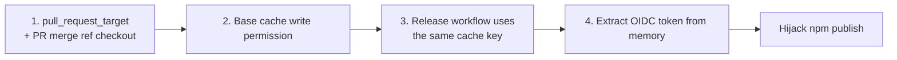

## Table of Contents

## Introduction

If [the React2Shell incident in React/Next.js last December](https://yceffort.kr/en/2025/12/nextjs-react-security-vulnerability)[^3] was about "an RCE in a framework's bundled internal dependency", this one is a step further. There was nothing wrong with the code itself. The problem was in **the workflow that built and published that code to npm.**

On May 11, 2026, 42 packages under the `@tanstack/*` namespace were taken over and published to the npm registry with malicious code embedded. Core packages such as `@tanstack/history`, `@tanstack/react-router`, and `@tanstack/react-start` were all included. Thankfully, an external security researcher caught it within about 26 minutes of publishing and opened an issue. The TanStack team quickly deprecated the bad versions, which kept the impact limited.

What is interesting is how the attack was carried out. **The attacker did not merge a single line of code into the main branch.** They simply opened a PR and force-pushed a few times. That alone poisoned the GitHub Actions cache, and days later that cache was automatically restored during a normal release workflow run. And that release workflow held the npm OIDC trusted publisher permission.

This post walks through the TanStack incident to answer the following questions.

- Why does `pull_request_target` exist, and why is it so dangerous?
- What is the "Pwn Request" attack pattern?
- How does the GitHub Actions cache break trust boundaries?
- Is the OIDC trusted publisher safe?
- What should you do as a library maintainer, and as a consumer?

## Timeline

First, the sequence of events. This is based on [the TanStack postmortem](https://tanstack.com/blog/npm-supply-chain-compromise-postmortem)[^1] and [GitHub issue #7383](https://github.com/TanStack/router/issues/7383)[^2].

### Phase 1: Reconnaissance and payload prep (May 10)

| Time (UTC) | Event                                                                                                                                                                                                                                                                                                      |
| ---------- | ---------------------------------------------------------------------------------------------------------------------------------------------------------------------------------------------------------------------------------------------------------------------------------------------------------- |
| 5/10 17:16 | Attacker created the [`zblgg/configuration`](https://github.com/jonchurch/configuration/tree/testing) fork (original is `TanStack/router`; the actual fork has been deleted and `jonchurch` preserved a copy)                                                                                              |
| 5/10 23:29 | [Malicious commit](https://gist.github.com/jonchurch/35e88271d58ebc631096bfc90bef53a9#file-vite_setup-65bf499-mjs-L29199) (author identity spoofed as `claude <claude@users.noreply.github.com>`. The payload is hidden at the tail of a ~29,000-line file, disguised as a legitimate npm package bundle.) |

The attacker forged the commit identity to look like `Claude`. The likely intent was to make it look like an AI tool generated the commit and reduce suspicion. The fork was also renamed to `configuration`, a bland name that makes it look like a routine config PR.

### Phase 2: Cache poisoning (morning of May 11)

| Time (UTC)         | Event                                                                                                                                                                               |
| ------------------ | ----------------------------------------------------------------------------------------------------------------------------------------------------------------------------------- |
| 5/11 10:49         | Opened [PR #7378 "WIP: simplify history build"](https://github.com/TanStack/router/pull/7378)                                                                                       |
| 5/11 11:01 - 11:11 | Multiple force-pushes triggered [`bundle-size.yml`](https://github.com/TanStack/router/blob/main/.github/workflows/bundle-size.yml) (the `pull_request_target` workflow) repeatedly |
| 5/11 11:29         | A 1.1GB poisoned pnpm store was saved to the GitHub Actions cache                                                                                                                   |

This phase is the core of the incident. The attacker **never tried to merge the PR.** They just opened it and force-pushed repeatedly. We will get to how that turns into an attack later in the post.

### Phase 3: Detonation (evening of May 11)

| Time (UTC)    | Event                                                                                                                                                |
| ------------- | ---------------------------------------------------------------------------------------------------------------------------------------------------- |
| 5/11 19:15:44 | 4th attempt of the release workflow ran — the poisoned cache was restored                                                                            |
| 5/11 19:20:39 | First publish batch: [`@tanstack/history@1.161.9`](https://www.npmjs.com/package/@tanstack/history/v/1.161.9) and 13 other packages (14 of 42 total) |
| 5/11 19:26:14 | Second batch: [`@tanstack/history@1.161.12`](https://www.npmjs.com/package/@tanstack/history/v/1.161.12) and others                                  |

A TanStack maintainer merged to main as usual and the release workflow ran. It restored the cache keyed `Linux-pnpm-store-${hashFiles('**/pnpm-lock.yaml')}` — and **that cache had already been poisoned eight hours earlier.** Malicious dependencies were installed from the poisoned pnpm store, and every build artifact was published to npm with a backdoor inside.

### Phase 4: Detection and response

| Time (UTC)         | Event                                                                                                                                                                             |
| ------------------ | --------------------------------------------------------------------------------------------------------------------------------------------------------------------------------- |
| 5/11 19:46         | StepSecurity security researcher [`ashishkurmi`](https://github.com/ashishkurmi) opened [issue #7383](https://github.com/TanStack/router/issues/7383) (~26 minutes after publish) |
| ~5/11 19:50        | External researcher [`carlini`](https://github.com/TanStack/router/issues/7383#issuecomment-4425225340) posted a detailed payload analysis comment                                |
| 5/11 20:19         | First two versions deprecated                                                                                                                                                     |
| 5/11 21:03         | All 84 versions (42 packages × 2 versions) deprecated                                                                                                                             |
| 5/11 22:13 - 23:55 | npm removed the tarballs from the server                                                                                                                                          |
| Post-incident      | [Socket's tracker for the worm](https://socket.dev/supply-chain-attacks/mini-shai-hulud) — spread to 200+ packages                                                                |

Detection was fast, but **the TanStack team did not catch it themselves — an external researcher did.** The postmortem acknowledges this explicitly.

## The starting point: `pull_request_target`

To understand this incident, you have to understand the `pull_request_target` GitHub Actions trigger. What it is, how it differs from `pull_request`, and why it exists.

### `pull_request` vs `pull_request_target`

GitHub Actions has two PR-related triggers.

**`pull_request`**

```yaml
on:
  pull_request:
    branches: [main]
```

Runs when a PR is opened or updated. Key characteristics:

- Runs in the **fork repo's context**
- `GITHUB_TOKEN` has **read-only** permissions
- Cannot access secrets
- Can only **read** the base repo's cache

In other words, no matter how malicious a fork PR's code is, it runs with almost no permissions. It cannot read secrets and cannot modify the base repo.

**`pull_request_target`**

```yaml
on:
  pull_request_target:
    branches: [main]
```

Same PR event, but it behaves very differently.

- Runs in the **base repo's context** (i.e., it runs the target branch's code)
- `GITHUB_TOKEN` has **write** permissions
- Can access secrets
- Can **write** to the cache

### Why `pull_request_target` exists

The reason it was created is reasonable. Consider these scenarios.

- An external contributor opens a PR, and you want to auto-label it
- You want to measure PR size and leave a comment
- You want to send a welcome message to first-time contributors
- You want to run a benchmark on an external PR and post the results as a comment

All of these need **write permission against the base repo**. Commenting or labeling requires write access to the GitHub API. The plain `pull_request` trigger cannot do this.

GitHub introduced `pull_request_target` to solve this[^7]. The core design idea is:

> **"Do not run the PR's code. Run only the target branch's (i.e., the trusted base branch's) code."**

If that design is followed, it is safe. The external PR's code never runs. Only the PR's metadata (number, author, list of changed files, etc.) is passed to the base repo's trusted scripts.

### So why is it dangerous?

The problem is that many workflows violate this design principle. Look at the TanStack workflow ([`bundle-size.yml`](https://github.com/TanStack/router/blob/main/.github/workflows/bundle-size.yml)).

```yaml:.github/workflows/bundle-size.yml
on:
  pull_request_target:
    paths: ['packages/**', 'benchmarks/**']

jobs:
  benchmark-pr:
    runs-on: ubuntu-latest
    steps:
      - uses: actions/checkout@v6.0.2
        with:
          ref: refs/pull/${{ github.event.pull_request.number }}/merge
      - uses: pnpm/action-setup@v4
      - uses: actions/setup-node@v6
        with:
          cache: 'pnpm'
      - run: pnpm install
      - run: pnpm nx run @benchmarks/bundle-size:build
```

Despite being a `pull_request_target` trigger, the `actions/checkout` step **checks out the PR's merge ref (`refs/pull/${{ github.event.pull_request.number }}/merge`)**. That is intentionally pulling in the PR's code.

Then it runs `pnpm install`. What if the PR modified `package.json`? Added a `postinstall` script? `pnpm install` will run it just the same.

This is the **"Pwn Request" pattern**: running the PR's code (i.e., attacker code) with the permissions of `pull_request_target` — secrets, write access, cache writes.

## The "Pwn Request" attack pattern

"Pwn Request" is the security community's nickname for this pattern. It has been known since 2021, and five years later it is still being found in major open source projects[^6].

### Attack scenario

Here is how an attacker exploits this pattern step by step.

**Step 1: Find a vulnerable workflow**

The attacker searches GitHub or uses static analysis to find repos with:

- `on: pull_request_target` trigger
- Checks out the PR's merge ref inside the workflow
- Runs build commands like `pnpm install`, `npm install`, `yarn install`

If all three are present, a "Pwn Request" is possible.

**Step 2: Build the payload**

The attacker creates a fork and plants a payload. The most common trick is to modify `scripts.postinstall` or `scripts.prepare` in `package.json`.

```json:package.json
{
  "scripts": {
    "postinstall": "node ./malicious_script.js"
  }
}
```

When `pnpm install` runs, this script runs automatically. At that point the attacker has the base repo's secrets, GITHUB_TOKEN, and cache write permissions all in hand.

**Step 3: Bypass first-time contributor approval**

GitHub has a setting called "Require approval for first-time contributors". A first-time contributor's workflows do not run until a maintainer approves them. Doesn't that stop this attack?

**No.** `pull_request_target` is an **exception** to that gate. Because the base repo's workflow file is being run (not the PR's workflow), GitHub considers this a "trusted" execution.

So even if the attacker is a first-time contributor, the `pull_request_target` workflow runs immediately. No maintainer approval needed.

### What actually happened in the TanStack incident

Apply the pattern to the TanStack workflow:

```yaml
on:
  pull_request_target:
    paths: ['packages/**', 'benchmarks/**']

jobs:
  benchmark-pr:
    steps:
      - uses: actions/checkout@v6.0.2
        with:
          ref: refs/pull/${{ github.event.pull_request.number }}/merge
      - uses: actions/setup-node@v6
        with:
          cache: 'pnpm' # <-- enables cache writes
      - run: pnpm install # <-- this is where the PR's postinstall can run
      - run: pnpm nx run @benchmarks/bundle-size:build
```

The PR likely included:

1. A modified `pnpm-lock.yaml` (to influence the cache key, or to add a malicious dependency)
2. A payload in `postinstall` or a build script
3. A payload that plants a malicious package in the pnpm store directory

And the force-pushes? The `cache: 'pnpm'` option on `actions/setup-node@v6` **only saves the cache when the workflow succeeds.** So the payload has to run _and_ the build has to succeed. The attacker tried four times to make the build succeed, and on the last try a 1.1GB poisoned pnpm store landed in the cache.

## GitHub Actions cache: where the trust boundary breaks

Now the central question. **Why does a cache saved by a PR workflow get used by the main branch's release workflow?**

Look at how the GitHub Actions cache is designed.

### Cache scope rules

The cache works under these rules.

- The cache is stored **per repository**
- Cache keys are user-defined (most often `actions/setup-node` auto-generates something like `Linux-pnpm-store-${hashFiles('pnpm-lock.yaml')}`)
- The security boundary is the **branch (ref)**. A workflow can only restore caches written by its own branch or the default branch.

The key point is that **the `pull_request_target` trigger runs in the base branch's context.** A regular `pull_request` trigger runs in the PR's `refs/pull/N/merge` context, so any cache it writes is trapped inside that PR. main cannot restore it.

`pull_request_target` is different. Its workflow runs in **the main (default branch) context.** Any cache it writes therefore goes **directly into main's cache scope.** The next main branch workflow (say, `release.yml`) finds the same key and restores it.

So `pull_request_target` has cache write permission _and_ that write lands in the default branch's scope. If the workflow runs the PR's code, **the attacker can poison the main branch's cache at will.**

### Why `permissions: contents: read` does not stop it

The TanStack workflow had this restriction:

```yaml
permissions:
  contents: read
```

You might think: "no write permissions, so it's safe, right?" But this setting only controls **permissions on GitHub API calls.** That is, it blocks pushing to the repo or commenting on issues with the GITHUB_TOKEN.

**Cache writes do not use GITHUB_TOKEN.** They use a separate token internal to the GitHub Actions runner. `permissions: contents: read` does not block cache writes at all.

This is one of the less-known traps. Many maintainers assume that restricting permissions makes things safe, but the cache is outside that protection.

### Cache → release workflow flow

The TanStack release workflow probably looked something like this:

```yaml:.github/workflows/release.yml
on:
  push:
    branches: [main]

jobs:
  release:
    permissions:
      contents: write
      id-token: write   # <-- for npm OIDC trusted publisher
    steps:
      - uses: actions/checkout@v6.0.2
      - uses: actions/setup-node@v6
        with:
          cache: 'pnpm'   # <-- this restores the cache the PR poisoned
      - run: pnpm install
      - run: pnpm publish -r
```

When a merge lands on main, this workflow runs. `actions/setup-node`'s `cache: 'pnpm'` automatically restores any cache matching the key. And that key — `Linux-pnpm-store-${hashFiles('pnpm-lock.yaml')}` — can match exactly the key the PR produced.

If the attacker keeps `pnpm-lock.yaml` identical to main's, the keys match. `pnpm install` pulls dependencies from the poisoned store. **The release build itself is now compromised.**

## OIDC trusted publisher: removing the token does not make you safe

npm recently introduced "trusted publishers". Before, publishing to npm required storing an NPM_TOKEN as a secret. If the token leaked, anyone could publish, which was dangerous.

Trusted publisher uses OIDC. The flow is:

1. A GitHub Actions workflow runs with `id-token: write` permission
2. The workflow requests a token from GitHub's OIDC provider
3. The token carries signed workflow info (repo, workflow file, branch)
4. npm compares the OIDC token's claims with the pre-registered trusted publisher config
5. If they match, npm issues a short-lived publish token at that moment

In theory it is much safer. There is no permanent token, so nothing to leak. The token is handled only between the npm CLI and GitHub OIDC.

So how did this attacker still succeed?

### Extracting the OIDC token from memory

The attacker's payload did not stop at poisoning dependencies. When the release workflow ran, it **extracted the OIDC token directly from the runner process memory.**

```
/proc/*/cmdline      → identify the Runner.Worker process
/proc/<pid>/maps     → read the memory map
/proc/<pid>/mem      → dump memory
```

On Linux, the `/proc` virtual filesystem lets a process read another process's memory if they share the same user. The runner process keeps the OIDC token in memory; a regex over the dump is enough to lift it.

After lifting the token, the attacker bypassed the workflow's publish step and **sent a POST request directly to `registry.npmjs.org`.** That lets them publish any payload under any version they want.

This technique is not new. The TanStack postmortem points out[^1] that it reused **almost the exact same Python script** from the March 2025 `tj-actions/changed-files` incident[^5].

### What trusted publisher means now

Is trusted publisher useless then? Not at all. But it rests on the precondition that **the build workflow itself is trustworthy.** If the build workflow gets compromised, the OIDC token can be used for anything.

This attack did not bypass trusted publisher itself. It bypassed it **by destroying the workflow's trustworthiness.** If arbitrary code execution is possible during the build, that code inherits the publish permission as-is.

## Payload analysis: what was stolen

How did the payload baked into the compromised packages actually work? From the public analyses combined:

### Entry point: the optionalDependencies trick

The compromised package's `package.json` had this added:

```json:package.json {3-5}
{
  "name": "@tanstack/history",
  "optionalDependencies": {
    "@tanstack/setup": "github:tanstack/router#79ac49eedf774dd4b0cfa308722bc463cfe5885c"
  }
}
```

Here is what happens during `npm install`:

1. npm treats `@tanstack/setup` as a git dependency and checks out the given commit on the `tanstack/router` repo
2. `79ac49ee` is an **orphan commit** (a floating commit not attached to any branch), so it is not visible in normal browsing
3. That commit's `package.json` has a `prepare` script

```json {3}
{
  "scripts": {
    "prepare": "bun run tanstack_runner.js && exit 1"
  }
}
```

The trick is clean.

- `bun run tanstack_runner.js` runs the payload
- `&& exit 1` makes it fail intentionally
- Because it is an `optionalDependencies` entry, `npm install` still succeeds when it fails
- npm reports "optional dep install failed" and moves on silently

From the user's perspective, this is a plain `npm install`. No errors. But in the background, `tanstack_runner.js` has already run.

### Credential harvest

`router_init.js` (a ~2.3MB obfuscated payload) goes after a wide set of credentials:

- AWS IMDS (EC2 instance metadata)
- AWS Secrets Manager
- GCP metadata service
- Kubernetes service account tokens
- HashiCorp Vault tokens
- npm tokens stored in `~/.npmrc`
- GitHub CLI (`gh`) tokens
- `~/.git-credentials`
- SSH keys (`~/.ssh/`)

What matters is that it targeted not only CI but also **developer laptops.** The moment a developer runs `pnpm install` or `npm install`, their credentials are at risk.

### Exfiltration: Session messenger network

Traditional supply chain attacks usually exfiltrate to an attacker-run C2 (Command & Control) server. That can be traced; you can just block the domain.

This attack used the **Session/Oxen messenger network.** Session is an end-to-end encrypted anonymous messenger backed by a distributed node network. The payload used these endpoints:

- `filev2.getsession.org`
- `seed1.getsession.org`, `seed2.getsession.org`, `seed3.getsession.org`

Blocking these is hard because they belong to a legitimate messenger service. Blocking the domain also blocks regular messenger users. And the attacker does not need to run any server of their own, so there is no infrastructure cost.

### Self-propagation (worm behavior)

The most interesting part of this payload is the self-propagation mechanism. The payload spreads like a worm:

1. Use a stolen npm token to call `registry.npmjs.org/-/v1/search?text=maintainer:<username>`
2. Get the full list of packages the victim maintains
3. Publish a new version of each package with the same payload injected

So if one maintainer is compromised, **every package they maintain** is poisoned in one move. The Socket security team tracked the worm spreading to more than 200 other packages[^4].

### Persistence

The payload is not one-shot reconnaissance. It tries to live on the system permanently.

**Linux**

- Drops `~/.local/bin/gh-token-monitor.sh`
- Registers it as a systemd user service

**macOS**

- Registers `com.user.gh-token-monitor` as a LaunchAgent

The monitor script is interesting. Every 60 seconds it calls `api.github.com/user` with the stolen GitHub token. If the response is 40x (i.e., the token was revoked), it runs a preconfigured handler. The decoded script published in the issue shows the handler is a destructive command like `rm -rf ~/`.

It is essentially a "dead man's switch". **The moment the victim revokes the token, retaliation triggers.** This makes incident response harder. You cannot just invalidate the token. You first have to remove every trace of the payload, isolate the system, and only then deal with the token.

The script also has a 24-hour TTL, so it removes itself after running too long. The intent is to leave fewer traces.

### Commands to check for traces of the payload

Here are the check commands collected in the comments on GitHub issue #7383[^2]. If you installed any of the affected packages around May 11, run these:

```bash
find ~ -path '*/.claude/setup.mjs' -o -path '*/.vscode/setup.mjs'
find ~/.config -name '*gh-token-monitor*'
find ~/.local/bin -name 'gh-token-monitor.sh'
find /tmp -name 'tmp.ts018051808.lock'
ps aux | grep -E 'tanstack_runner|router_runtime|gh-token-monitor|bun'
```

If any of these returns a match, treat the host as compromised. Isolate it, rotate every credential, and consider rebuilding the system.

## Three weaknesses chained into one line

This was not a single vulnerability. It was **a chain of three weaknesses** coming together. The postmortem makes the same point. Each weakness on its own is not enough to be dangerous, but the combination is fatal.



How each step becomes the precondition for the next:

| Step | Weakness                                        | On its own                      |
| ---- | ----------------------------------------------- | ------------------------------- |
| 1    | `pull_request_target` runs PR code              | Reaches cache poison            |
| 2    | PR workflow can write to base cache             | Can poison release              |
| 3    | Release workflow trusts the cache uncritically  | Arbitrary code in build runtime |
| 4    | OIDC token extracted from runner process memory | Hijacks npm publish             |

If any one of these had been broken, the attack would have failed.

- To break (1): Even with `pull_request_target`, do not run the PR's code
- To break (2): Do not let `pull_request_target` write to main's cache scope (or do not let release use the cache)
- To break (3): Make the release workflow do a clean install with no cache
- To break (4): Do not run untrusted code in a step that has `id-token: write` permission

You can mitigate at any step in this chain. Let's go through them.

## Defense 1: Use `pull_request_target` safely

The safest move is to not use `pull_request_target` at all. But if you need to comment on or label external PRs, you have to. Here are the rules.

### Rule 1: Do not run the PR's code

This is the most important one. The original design of `pull_request_target` is "use only the PR's metadata".

❌ **Bad: checking out the PR merge ref**

```yaml
on: pull_request_target

jobs:
  bad:
    steps:
      - uses: actions/checkout@v6
        with:
          ref: refs/pull/${{ github.event.pull_request.number }}/merge
      - run: pnpm install
```

✅ **Good: labeling/commenting only**

```yaml
on: pull_request_target

jobs:
  good:
    permissions:
      pull-requests: write
    steps:
      - uses: actions/labeler@v5
```

### Rule 2: If you really must build PR code, separate the permissions

If you need to benchmark external PRs, split the permissions clearly.

```yaml
on:
  pull_request_target:
    paths: ['packages/**']

jobs:
  build:
    permissions:
      contents: read # minimum privilege
    runs-on: ubuntu-latest
    steps:
      - uses: actions/checkout@v6
        with:
          ref: refs/pull/${{ github.event.pull_request.number }}/merge
          persist-credentials: false # do not write GITHUB_TOKEN into git config
      - run: pnpm install --ignore-scripts # block postinstall
      - run: pnpm build
      - uses: actions/upload-artifact@v4
        with:
          name: pr-build
          path: dist/

  comment:
    needs: build
    permissions:
      pull-requests: write # commenting only here
    runs-on: ubuntu-latest
    steps:
      - uses: actions/download-artifact@v4
        with:
          name: pr-build
      - run: |
          # Do not run the PR's code here (just read the artifact)
          node ./scripts/analyze-bundle.js
```

Split the job that runs the PR's code from the job that comments on the PR. The latter never runs PR code.

### Rule 3: Add a `repository_owner` guard

`pull_request_target` runs even from forks. If you do not want workflows running on forks of your repo, add this guard:

```yaml
jobs:
  build:
    if: github.event.pull_request.head.repo.owner.login == github.repository_owner
```

Or restrict to org members only:

```yaml
if: contains(fromJson('["MAINTAINER1", "MAINTAINER2"]'), github.event.pull_request.user.login)
```

This will not work for open source projects accepting external contributions. In that case, separate the permissions so external PRs can be built but never run privileged steps.

### Rule 4: Disable install scripts

The most common pattern is for the PR to run arbitrary code via `postinstall`. Good news: starting from pnpm v10, [dependency lifecycle scripts do not run by default](https://pnpm.io/settings#onlybuiltdependencies). Only packages on the explicit `onlyBuiltDependencies` allowlist can run scripts.

For npm/yarn, or pnpm before v10, you have to add `--ignore-scripts` yourself.

```yaml
- run: npm ci --ignore-scripts
```

This is not a silver bullet. Even after install, build scripts run and can execute arbitrary code there too. For instance, the PR can modify `vite.config.ts` so the payload runs during the build. **Remember that the build itself is arbitrary code execution.**

## Defense 2: Separate the cache trust boundary

Cache poisoning was the core of this attack. But there is a subtlety. The GitHub Actions cache **security boundary is the branch (ref), not the key prefix.** Once a cache is in a branch's scope, it does not matter how different the key prefix is — it is not isolated. If `pull_request_target` runs in the main context, the cache it produces is part of main's scope regardless of the key name.

So splitting "the PR cache key" and "the release cache key" by prefix does nothing. **The only reliable approach is to not use a cache in the release workflow.**

### No cache in release

The most reliable approach is to not use a cache in the release workflow at all.

```yaml:.github/workflows/release.yml
- uses: actions/setup-node@v6
  with:
    node-version: '24'
    # no cache option
- run: pnpm install --frozen-lockfile
```

Builds become a bit slower, but releases do not happen often, so the cost is small. On the security-vs-speed tradeoff, the release is exactly where you want to pick security.

### Lockfile validation

`pnpm install --frozen-lockfile` fails if any dependency differs from what is in the lockfile. Unless a PR can modify the lockfile, only valid dependencies are installed. Always use `--frozen-lockfile` for releases.

## Defense 3: SHA-pin actions

Another weakness in the TanStack workflow was referencing third-party actions by floating refs.

```yaml
- uses: actions/checkout@v6.0.2
- uses: pnpm/action-setup@v4
- uses: actions/setup-node@v6
```

Tags like `@v6.0.2` or `@v4` are not commit SHAs. The action's maintainer can move the same tag to a different SHA. In other words, **if the action's maintainer is compromised, so are you.**

The March 2025 `tj-actions/changed-files` incident was exactly this scenario[^5]. The action maintainer's token was stolen, the tag was moved to a malicious SHA, and every repo using it was compromised at the same time.

The recommended pattern is SHA pinning:

```yaml
# Floating tag (risky)
- uses: actions/checkout@v6.0.2

# SHA-pinned (safe)
- uses: actions/checkout@b4ffde65f46336ab88eb53be808477a3936bae11 # v6.0.2
```

A comment keeps readability. Dependabot updates the SHA automatically, so the operational overhead is small.

This applies even to GitHub-verified actions. Official actions like `actions/checkout` are just as risky if the maintainer account is compromised.

## Defense 4: Guard the OIDC trusted publisher

The OIDC token being extracted from memory is striking, but trusted publisher itself can carry additional guards.

### Review the npm trusted publisher config

npm trusted publisher verifies the following:

- GitHub repo name
- Workflow file path (e.g., `.github/workflows/release.yml`)
- Environment (optional)

The most important guard is the **GitHub Environment**. Create an environment for releases and attach protection rules — then publishing can require manual approval.

```yaml
jobs:
  publish:
    environment: production-release # <-- environment with protection rules
    permissions:
      id-token: write
    steps:
      - run: pnpm publish -r
```

Then in the GitHub UI, configure `production-release` to require:

- Required reviewers: N maintainers
- Wait timer: delay X minutes before publishing

With this, automated publish is blocked. Someone has to approve manually before an OIDC token can be issued. You give up some automation convenience, but you get another defense layer against supply chain attacks.

### Review per publish

npm offers options like "Require 2FA for publishing", but the trap is that these do not apply when using OIDC trusted publisher. The TanStack postmortem points this out:

> "No per-publish review mechanism existed for OIDC trusted publisher."

Current npm policy gives no additional verification once trusted publisher is trusted. You have to build that yourself with environment protections.

## Defense 5: Static analysis tools

There are tools that automatically flag security issues in GitHub Actions workflows. Several were recommended in the issue comments.

### zizmor

[zizmor](https://zizmor.sh/) is a Rust-based static analysis tool for GitHub Actions. It catches `pull_request_target` misuse, unsafe action usage, secret exposure patterns, and more.

```bash
zizmor .github/workflows/
```

You can integrate it into CI and run it on every workflow change.

### StepSecurity

[StepSecurity](https://app.stepsecurity.io/) analyzes workflows and opens PRs with recommended changes automatically. It applies action SHA pinning, permission minimization, cache separation, and more in one shot.

It is interesting that the person who first detected this incident was a StepSecurity employee. They probably found the cache poisoning pattern while monitoring with their own tool.

### GitHub's built-in features

GitHub has been strengthening workflow security features.

- **Dependency review**: automatic check on PRs that add/change dependencies
- **Secret scanning**: blocks secrets from entering the code
- **Code scanning**: CodeQL also analyzes workflows

Many repos still have these off. They are free, so just turn them on.

## Defense 6: Consumer-side defenses

Everything above was from the maintainer's perspective. What about the perspective of someone **using** the library? For the many projects that depend on TanStack.

### 1. Dependency cooldown

The most effective defense is to **not install newly published versions immediately.** Wait a few days, and external researchers will catch and deprecate malicious packages. This TanStack incident was detected in about 30 minutes and removed from npm in 4.5 hours.

pnpm can automate this via [`minimumReleaseAge`](https://pnpm.io/settings#minimumreleaseage):

```yaml:.npmrc
minimumReleaseAge=4320   # in minutes, i.e., 3 days
```

With this, any version less than 3 days old is ignored. It is an automatic quarantine against 0-day supply chain attacks like this one.

npm itself does not have this feature, but you can apply a similar policy through tools like [`socket.dev`](https://socket.dev).

### 2. Block lifecycle scripts

postinstall scripts are a primary entry point for supply chain attacks. The good news is that [from pnpm v10, dependency lifecycle scripts do not run by default](https://pnpm.io/settings#onlybuiltdependencies). Only explicitly allowed packages can run scripts.

```json:package.json
{
  "pnpm": {
    "onlyBuiltDependencies": ["esbuild", "@swc/core"]
  }
}
```

Only the listed packages can run install scripts. Everything else is ignored. For pre-v10 pnpm, or npm/yarn, you have to add `--ignore-scripts` in CI explicitly.

```yaml:.github/workflows/ci.yml
- run: npm ci --ignore-scripts
```

The TanStack incident shows there are workarounds (the `optionalDependencies` + git URL + `prepare` trick), so keep the `onlyBuiltDependencies` list as small as possible.

### 3. Validate the lockfile

`pnpm install --frozen-lockfile` or `npm ci` fail if anything differs from the lockfile. Enforce this in CI and dependencies cannot change without a lockfile update. Any lockfile change in a PR has to be reviewed by a human.

### 4. Minimize credentials

Do not expose secrets during the npm install step in CI. Split build/test and deploy into separate steps, and inject required secrets only in the deploy step.

```yaml
jobs:
  test:
    permissions:
      contents: read
    steps:
      - run: pnpm install
      - run: pnpm test
      # no secrets here

  deploy:
    needs: test
    permissions:
      contents: read
      id-token: write # only in the deploy step
    steps:
      - run: ./deploy.sh
```

This way, even if a dependency has a payload, it cannot steal secrets.

### 5. SBOM and license/vulnerability scanning

Tools like `socket.dev`, Snyk, and GitHub Dependabot analyze the dependency tree and block known malicious packages. They are limited for 0-day attacks, but useful for post-incident detection.

socket.dev in particular uses static analysis to flag "suspicious packages" themselves. If a newly published version suddenly imports `child_process` or starts making network calls, it tells you.

## Honest opinion

As you can probably tell by now, this incident is **not the TanStack team's fault**. At least not alone. The pattern they used is the same pattern many open source projects use. Commenting benchmarks on external PRs via `pull_request_target` is a common design — you have to build external PRs for a good contributor experience.

The real problem is **the GitHub Actions design itself.** It makes these anti-patterns far too easy.

- The name `pull_request_target` gives no hint that this is dangerous
- `actions/checkout` checks out a fork PR by default (no warning)
- Where is it documented that `permissions: contents: read` does not block cache writes?
- The cache scope rules are a trap that you have to know about beforehand

In a system with this many traps, simply saying "maintainers should be more careful" is just shifting the blame. The default GitHub Actions design has to move in a safer direction. For instance: when a `pull_request_target` workflow checks out the PR ref, the GitHub UI should show a big red warning. Cache keys should be automatically scoped per trigger type.

That said, "wait for GitHub to fix it" is not an option for maintainers. You have to audit your workflows now and apply SHA pinning, cache separation, and environment protections. For consumers: apply dependency cooldown and block lifecycle scripts (use pnpm v10+ or `--ignore-scripts`).

If [the previous React/Next.js incident](https://yceffort.kr/en/2025/12/nextjs-react-security-vulnerability)[^3] was "I don't know what code is in my app", this one is the deeper problem of "I don't know how the code in my app was built". Both are blind spots created by the complexity of the modern frontend ecosystem.

We got lucky: the attacker broke tests and a researcher caught it fast. If the attacker had been quieter, if the package had been more popular, if the maintainer had been on vacation, the damage would have been much worse. We should not count on that kind of luck next time.

## Wrapping up

We are in the era where the CI/CD pipeline itself is an attack surface. Safe code is not enough. Every step that compiles, packages, and publishes the code has to be trustworthy. And if any single link in that trust chain breaks, the result is untrustworthy.

### As a maintainer

Open your repo's workflows right now. Search for `pull_request_target` and check if it runs PR code. Check whether actions are referenced by floating tags. Check whether the release workflow uses the cache. Check whether environment protection rules are in place. Applying the lessons of this incident to your repo takes less than an hour. That hour is well spent if it avoids the next attack.

### As a consumer

You still have things to do even if you are not a maintainer and just consume npm packages. Honestly, this is the more realistic perspective. You cannot control every dependency's workflows, so you have to defend on the assumption that maintainers will get compromised.

Checklist:

- **Add `minimumReleaseAge=4320` (3 days) to `.npmrc`** — auto-quarantine newly published versions. For an incident that gets detected in 30 minutes, this is decisive.
- **Use pnpm v10+** — dependency lifecycle scripts are off by default. Still, keep `onlyBuiltDependencies` minimal.
- **Enforce `--frozen-lockfile` in CI** — lockfile changes must be reviewed by humans.
- **Do not expose secrets in install/build steps** — keep secrets restricted to the deploy step.
- **Stay tuned to CVE / supply chain attack news** — the earlier you hear, the earlier you patch. Recommended channels:
  - [GitHub Advisory Database](https://github.com/advisories?ecosystem=npm) — npm ecosystem advisories (RSS available)
  - [Socket Threat Research](https://socket.dev/blog) — real-time tracking of new malicious packages
  - [Snyk Vulnerability DB](https://security.snyk.io/) — searchable, subscribable dependency vulnerability database
  - [npm Security Newsletter](https://github.blog/category/security/) (GitHub Security Blog)
  - [The Register Security](https://www.theregister.com/security/) — fast on incident follow-up coverage
  - [Hacker News](https://news.ycombinator.com/) — major incidents usually hit the front page within 30 minutes

Just the first one (`minimumReleaseAge`) would have fully defended against the TanStack attack. It takes less than a minute to add one line.

These things will keep happening. It is annoying, but **think of it as the cost of using open source for free.** Pulling in someone else's code means inheriting that someone's security posture (and their CI pipeline, their laptop, their npm account). So spend a few hours a year on dependency management.

## References

[^1]: [TanStack: NPM Supply Chain Compromise Postmortem](https://tanstack.com/blog/npm-supply-chain-compromise-postmortem) — Incident timeline, cache poisoning and OIDC memory extraction analysis, and the response in full.

[^2]: [GitHub Issue: TanStack/router#7383](https://github.com/TanStack/router/issues/7383) — The discovery issue. Carlini's detailed payload analysis, infection check commands, and the decoded dead man's switch are in the comments.

[^3]: [Why do I have to upgrade Next.js for a React vulnerability?](https://yceffort.kr/en/2025/12/nextjs-react-security-vulnerability) — Analysis of December 2025 React2Shell (CVE-2025-55182). Covers the blind spot created by framework bundling.

[^4]: [Socket: Mini Shai-Hulud Supply Chain Attack Tracker](https://socket.dev/supply-chain-attacks/mini-shai-hulud) — Tracking the TanStack worm spread. PURL list of 200+ packages.

[^5]: [Wiz: GitHub Action tj-actions/changed-files supply chain attack (CVE-2025-30066)](https://www.wiz.io/blog/github-action-tj-actions-changed-files-supply-chain-attack-cve-2025-30066) — March 2025 incident. Used the same Python script for OIDC memory extraction.

[^6]: [GitHub Actions is the Weakest Link (Nesbitt)](https://nesbitt.io/2026/04/28/github-actions-is-the-weakest-link.html) — Summary of the Pwn Request pattern and GitHub Actions design traps. Good background reading for this incident.

[^7]: [GitHub Docs: pull_request_target](https://docs.github.com/en/actions/writing-workflows/choosing-when-your-workflow-runs/events-that-trigger-workflows#pull_request_target) — Official documentation of the `pull_request_target` trigger. Specifies base branch context execution and the permission model.

### Tools

- [zizmor — GitHub Actions static analysis tool](https://zizmor.sh/)
- [StepSecurity](https://app.stepsecurity.io/securerepo)
- [pnpm minimumReleaseAge setting](https://pnpm.io/settings#minimumreleaseage)
