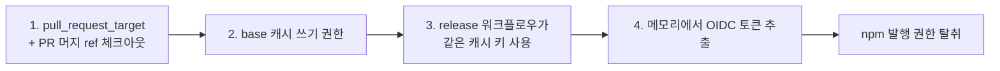

## Table of Contents

## 서론

지난 12월 React/Next.js의 React2Shell 사태[^3]가 "프레임워크가 번들링한 내부 의존성에서 발생한 RCE"였다면, 이번 사건은 한 단계 더 나아간 이야기다. 코드 자체에는 아무런 문제가 없었다. 문제는 **그 코드를 빌드하고 npm에 발행하는 워크플로우**에 있었다.

2026년 5월 11일, `@tanstack/*` 네임스페이스의 42개 패키지가 한꺼번에 탈취되어 악성 코드가 박힌 채로 npm 레지스트리에 발행됐다. `@tanstack/history`, `@tanstack/react-router`, `@tanstack/react-start` 같은 핵심 패키지들이 전부 포함됐다. 다행히 외부 보안 연구자가 발행 후 약 26분 만에 탐지해서 issue를 열었고, TanStack 팀이 빠르게 deprecated 처리하면서 피해 규모는 제한적이었다.

하지만 공격 자체가 어떻게 이루어졌는지를 들여다보면 흥미롭다. **공격자는 단 한 줄의 코드도 메인 브랜치에 머지하지 않았다.** 단지 PR을 열고 강제 푸시를 몇 번 했을 뿐이다. 그것만으로 GitHub Actions의 캐시를 오염시켰고, 그 캐시는 며칠 후 release 워크플로우가 정상적으로 실행될 때 자동으로 복원됐다. 그리고 그 release 워크플로우는 npm의 OIDC trusted publisher 권한을 가지고 있었다.

이 글에서는 TanStack 사태를 통해 다음 질문에 답해보자.

- `pull_request_target`은 왜 만들어졌고 왜 그렇게 위험한가
- "Pwn Request" 공격 패턴이란 무엇인가
- GitHub Actions의 캐시가 어떻게 신뢰 경계를 무너뜨리는가
- OIDC trusted publisher는 안전한가
- 라이브러리를 운영하는 입장에서, 그리고 사용하는 입장에서 무엇을 해야 하는가

## 사건 타임라인

먼저 사건이 어떻게 흘러갔는지 시간 순으로 정리해보자. TanStack 팀의 postmortem[^1]과 GitHub issue #7383[^2]에 정리된 내용을 기반으로 한다.

### 1단계: 사전 정찰과 페이로드 준비 (5월 10일)

| 시각 (UTC) | 사건                                                                                                                                                                                                                                                                             |
| ---------- | -------------------------------------------------------------------------------------------------------------------------------------------------------------------------------------------------------------------------------------------------------------------------------- |
| 5/10 17:16 | 공격자가 [`zblgg/configuration`](https://github.com/jonchurch/configuration/tree/testing) 포크 생성 (원본은 `TanStack/router`, 원본 포크는 이미 삭제됐고 `jonchurch`가 보존한 사본)                                                                                              |
| 5/10 23:29 | [악성 커밋 작성](https://gist.github.com/jonchurch/35e88271d58ebc631096bfc90bef53a9#file-vite_setup-65bf499-mjs-L29199) (작성자 identity를 `claude <claude@users.noreply.github.com>`로 위장. 약 29,000줄짜리 파일의 끝부분에 정상 npm 패키지 번들로 위장한 페이로드가 숨어있다) |

공격자는 `Claude`인 척 커밋 identity를 위조했다. AI 도구가 만든 커밋처럼 보이게 해서 의심을 줄이려는 의도였을 가능성이 높다. 또 fork된 레포의 이름도 `configuration`이라는 무난한 이름으로 바꿔서 일반적인 설정 파일 PR처럼 보이게 했다.

### 2단계: 캐시 포이즈닝 (5월 11일 오전)

| 시각 (UTC)         | 사건                                                                                                                                                                    |
| ------------------ | ----------------------------------------------------------------------------------------------------------------------------------------------------------------------- |
| 5/11 10:49         | [PR #7378 "WIP: simplify history build"](https://github.com/TanStack/router/pull/7378) 오픈                                                                             |
| 5/11 11:01 - 11:11 | 여러 차례 force-push로 [`bundle-size.yml`](https://github.com/TanStack/router/blob/main/.github/workflows/bundle-size.yml) (`pull_request_target` 워크플로우) 반복 실행 |
| 5/11 11:29         | GitHub Actions 캐시에 1.1GB의 오염된 pnpm store 저장                                                                                                                    |

이 단계가 이 사건의 가장 중요한 핵심이다. 공격자는 **PR 머지를 시도조차 하지 않았다.** 그저 PR을 열고 강제 푸시를 반복했을 뿐이다. 이게 어떻게 공격으로 이어지는지는 뒤에서 자세히 살펴본다.

### 3단계: 공격 실행 (5월 11일 저녁)

| 시각 (UTC)    | 사건                                                                                                                                        |
| ------------- | ------------------------------------------------------------------------------------------------------------------------------------------- |
| 5/11 19:15:44 | release 워크플로우 4번째 시도 실행 — 오염된 캐시 복원                                                                                       |
| 5/11 19:20:39 | npm에 1차 발행: [`@tanstack/history@1.161.9`](https://www.npmjs.com/package/@tanstack/history/v/1.161.9) 등 14개 패키지 (총 42개 패키지 중) |
| 5/11 19:26:14 | npm에 2차 발행: [`@tanstack/history@1.161.12`](https://www.npmjs.com/package/@tanstack/history/v/1.161.12) 등                               |

TanStack 메인테이너가 평상시처럼 main 브랜치에 머지하고 release 워크플로우가 돌았다. 이 워크플로우는 캐시 키 `Linux-pnpm-store-${hashFiles('**/pnpm-lock.yaml')}`로 캐시를 복원했는데, **그 캐시가 이미 8시간 전에 오염되어 있었다.** 오염된 pnpm store에서 악성 의존성이 설치되었고, 그 결과 모든 빌드 산출물에 백도어가 박힌 채로 npm에 발행됐다.

### 4단계: 탐지와 대응

| 시각 (UTC)         | 사건                                                                                                                                                            |
| ------------------ | --------------------------------------------------------------------------------------------------------------------------------------------------------------- |
| 5/11 19:46         | StepSecurity의 보안 연구자 [`ashishkurmi`](https://github.com/ashishkurmi)가 [issue #7383](https://github.com/TanStack/router/issues/7383) 오픈 (발행 후 ~26분) |
| 5/11 19:50 경      | 외부 보안 연구자 [`carlini`](https://github.com/TanStack/router/issues/7383#issuecomment-4425225340)가 페이로드 정밀 분석 코멘트 게시                           |
| 5/11 20:19         | 첫 2개 버전 deprecated 처리                                                                                                                                     |
| 5/11 21:03         | 전체 84개 버전 (42개 패키지 × 2개 버전) deprecated 완료                                                                                                         |
| 5/11 22:13 - 23:55 | npm이 서버 차원에서 tarball 제거                                                                                                                                |
| 사후               | [Socket이 추적한 worm 전파 목록](https://socket.dev/supply-chain-attacks/mini-shai-hulud) — 200개 이상 패키지로 확산                                            |

빠른 탐지였지만, **TanStack 팀이 자체적으로 탐지한 게 아니라 외부 연구자가 발견한 것**이다. postmortem에서 명시적으로 인정한 부분이다.

## 공격의 시작점: `pull_request_target`

이 사건을 이해하려면 먼저 `pull_request_target`이라는 GitHub Actions 트리거가 무엇인지 알아야 한다. 정상적인 `pull_request` 트리거와 무엇이 다른지, 왜 만들어졌는지부터 살펴보자.

### `pull_request` vs `pull_request_target`

GitHub Actions에는 PR과 관련된 두 가지 트리거가 있다.

**`pull_request`**

```yaml
on:
  pull_request:
    branches: [main]
```

PR이 열리거나 업데이트될 때 실행된다. 핵심 특징은 다음과 같다.

- PR을 만든 **fork 레포의 컨텍스트**에서 실행
- `GITHUB_TOKEN`은 **읽기 권한만** 가짐
- 시크릿(secrets)에 접근할 수 없음
- 캐시는 base 레포의 캐시를 **읽기만** 가능

즉, fork에서 온 PR이 아무리 악의적인 코드를 담고 있어도, 그 코드는 권한이 거의 없는 상태로 실행된다. 시크릿도 못 읽고 base 레포를 수정할 권한도 없다.

**`pull_request_target`**

```yaml
on:
  pull_request_target:
    branches: [main]
```

같은 PR 이벤트지만, 완전히 다르게 동작한다.

- **base 레포의 컨텍스트**에서 실행 (즉, target 브랜치의 코드를 실행)
- `GITHUB_TOKEN`은 **쓰기 권한** 가짐
- 시크릿에 접근 가능
- 캐시 **쓰기** 가능

### 왜 `pull_request_target`이 만들어졌나

`pull_request_target`이 만들어진 이유는 합리적이다. 다음과 같은 시나리오를 생각해보자.

- 외부 기여자가 PR을 열었는데, 자동으로 라벨을 붙이고 싶다
- PR의 사이즈를 측정해서 코멘트를 달고 싶다
- 첫 기여자에게 환영 메시지를 보내고 싶다
- 외부 PR에 대해 벤치마크를 돌리고 결과를 코멘트로 남기고 싶다

이런 작업들은 모두 **base 레포에 대한 쓰기 권한**이 필요하다. 코멘트를 달거나 라벨을 붙이려면 GitHub API에 쓰기 권한이 있어야 하니까. 일반 `pull_request` 트리거로는 이게 불가능하다.

GitHub은 이 문제를 해결하기 위해 `pull_request_target`을 도입했다[^7]. 이 트리거의 핵심 디자인은 이렇다.

> **"PR의 코드는 실행하지 말고, target 브랜치(즉, 신뢰할 수 있는 base 브랜치)의 코드만 실행하라."**

이 디자인이 지켜진다면 안전하다. 왜냐하면 외부 PR의 코드는 절대 실행되지 않으니까. 단지 그 PR의 메타데이터(번호, 작성자, 변경된 파일 목록 등)만 가지고 base 레포의 신뢰할 수 있는 스크립트가 실행되는 것이다.

### 그런데 왜 위험한가

문제는 많은 워크플로우가 이 디자인 원칙을 어긴다는 점이다. TanStack의 워크플로우([`bundle-size.yml`](https://github.com/TanStack/router/blob/main/.github/workflows/bundle-size.yml))를 보자.

```yaml:.github/workflows/bundle-size.yml
on:
  pull_request_target:
    paths: ['packages/**', 'benchmarks/**']

jobs:
  benchmark-pr:
    runs-on: ubuntu-latest
    steps:
      - uses: actions/checkout@v6.0.2
        with:
          ref: refs/pull/${{ github.event.pull_request.number }}/merge
      - uses: pnpm/action-setup@v4
      - uses: actions/setup-node@v6
        with:
          cache: 'pnpm'
      - run: pnpm install
      - run: pnpm nx run @benchmarks/bundle-size:build
```

`pull_request_target` 트리거임에도 불구하고, `actions/checkout`에서 **PR의 머지 ref(`refs/pull/${{ github.event.pull_request.number }}/merge`)를 체크아웃**한다. 이건 PR의 코드를 의도적으로 가져오는 것이다.

그 다음 `pnpm install`을 실행한다. 그런데 PR이 `package.json`을 수정했다면? `postinstall` 스크립트를 추가했다면? `pnpm install`은 그걸 그대로 실행한다.

이게 바로 **"Pwn Request" 패턴**이다. `pull_request_target`의 권한(시크릿, 쓰기 권한, 캐시 쓰기)을 가지고, PR의 코드(즉, 공격자의 코드)를 실행하는 것이다.

## "Pwn Request" 공격 패턴

"Pwn Request"는 보안 업계에서 이 패턴을 부르는 별명이다. 2021년부터 알려진 공격 패턴인데, 5년이 지난 지금도 메이저 오픈소스 프로젝트들에서 계속 발견되고 있다[^6].

### 공격 시나리오

공격자 입장에서 이 패턴을 어떻게 악용하는지 단계별로 살펴보자.

**1단계: 취약한 워크플로우 발견**

공격자는 GitHub 검색이나 정적 분석 도구로 다음 패턴을 가진 레포를 찾는다.

- `on: pull_request_target` 트리거 사용
- 워크플로우 내에서 PR의 머지 ref를 체크아웃
- `pnpm install`, `npm install`, `yarn install` 등 빌드 명령 실행

이 세 조건이 모두 만족되면 "Pwn Request"가 가능하다.

**2단계: 페이로드 작성**

공격자는 fork를 만들고 악성 페이로드를 심는다. 가장 흔한 방법은 `package.json`의 `scripts.postinstall` 또는 `scripts.prepare`를 수정하는 것이다.

```json:package.json
{
  "scripts": {
    "postinstall": "node ./malicious_script.js"
  }
}
```

`pnpm install`이 실행되면 이 스크립트가 자동으로 실행된다. 이 시점에서 공격자는 base 레포의 시크릿, GITHUB_TOKEN, 그리고 캐시 쓰기 권한을 모두 손에 쥔다.

**3단계: 첫 기여자 승인 우회**

GitHub에는 "Require approval for first-time contributors" 설정이 있다. 첫 기여자의 워크플로우는 메인테이너가 승인해야 실행된다는 것이다. 이걸로 막을 수 있을까?

**아니다.** `pull_request_target`은 이 게이트의 **예외**다. base 레포의 워크플로우 파일을 실행하는 것이지 PR의 워크플로우를 실행하는 것이 아니라서, GitHub는 이걸 "신뢰할 수 있는" 실행으로 간주한다.

그래서 공격자가 first-time contributor라도, `pull_request_target` 워크플로우는 즉시 실행된다. 메인테이너의 승인 없이.

### TanStack 사건에서 실제로 일어난 일

위 패턴을 TanStack 워크플로우에 적용해보면 다음과 같다.

```yaml
on:
  pull_request_target:
    paths: ['packages/**', 'benchmarks/**']

jobs:
  benchmark-pr:
    steps:
      - uses: actions/checkout@v6.0.2
        with:
          ref: refs/pull/${{ github.event.pull_request.number }}/merge
      - uses: actions/setup-node@v6
        with:
          cache: 'pnpm' # <-- 이게 캐시 쓰기를 활성화
      - run: pnpm install # <-- 이 시점에 PR의 postinstall 실행 가능
      - run: pnpm nx run @benchmarks/bundle-size:build
```

공격자는 PR에 다음을 포함시켰을 것이다.

1. `pnpm-lock.yaml` 수정 (캐시 키에 영향을 주기 위해, 또는 악성 의존성을 추가)
2. `postinstall` 또는 빌드 스크립트에 페이로드 삽입
3. 페이로드는 pnpm store 디렉토리에 악성 패키지를 심음

그리고 force-push를 여러 번 했다. 왜? `actions/setup-node@v6`의 `cache: 'pnpm'` 옵션은 **워크플로우가 성공할 때만** 캐시를 저장한다. 그래서 페이로드를 실행하면서도 빌드가 성공해야 한다. 공격자는 빌드를 성공시키기까지 4번의 시도를 했고, 마지막에 1.1GB의 오염된 pnpm store가 캐시에 저장됐다.

## GitHub Actions 캐시: 신뢰 경계가 무너지는 지점

여기서 가장 핵심적인 질문이 나온다. **PR 워크플로우에서 저장된 캐시가 왜 main 브랜치의 release 워크플로우에서 사용되는가?**

GitHub Actions의 캐시 디자인을 살펴보자.

### 캐시 스코프 규칙

GitHub Actions 캐시는 다음 규칙으로 동작한다.

- 캐시는 **레포지토리 단위로** 저장됨
- 캐시 키는 사용자가 정의 (대부분 `actions/setup-node`가 `Linux-pnpm-store-${hashFiles('pnpm-lock.yaml')}` 같은 키를 자동 생성)
- 캐시의 보안 경계는 **브랜치(ref)**. 워크플로우는 자기 브랜치 또는 default branch가 만든 캐시만 복원할 수 있다

여기서 핵심은 **`pull_request_target` 트리거가 base 브랜치 컨텍스트에서 실행된다**는 점이다. 일반 `pull_request` 트리거는 PR의 `refs/pull/N/merge` 컨텍스트에서 돌기 때문에, 거기서 만든 캐시는 그 PR에만 갇혀있다. main에서 그 캐시를 복원할 수 없다.

하지만 `pull_request_target`은 다르다. 이 트리거의 워크플로우는 **main(default branch) 컨텍스트에서 실행**된다. 따라서 여기서 저장한 캐시는 **main 브랜치의 캐시 스코프에 직접 들어간다.** 다음번 main 브랜치 워크플로우(예: release.yml)가 같은 키로 캐시를 찾으면 그대로 복원된다.

즉, `pull_request_target`은 캐시 쓰기 권한도 가지고 있고, 그 쓰기가 default branch 스코프에 들어간다는 점이 결정적이다. 워크플로우가 PR의 코드를 실행한다면, **공격자가 main 브랜치의 캐시를 마음대로 오염시킬 수 있다.**

### `permissions: contents: read`는 왜 안 막아주나

TanStack의 워크플로우에는 다음과 같이 권한 제한이 있었다.

```yaml
permissions:
  contents: read
```

이걸 보면 "쓰기 권한 없으니 안전하지 않나?"라고 생각할 수 있다. 하지만 이 권한 설정은 **GitHub API 호출에 대한 권한**을 제어할 뿐이다. 즉, GITHUB_TOKEN으로 레포에 푸시하거나 이슈에 코멘트를 다는 행위를 막는다.

**캐시 쓰기는 GITHUB_TOKEN으로 하는 게 아니다.** GitHub Actions runner 내부의 별도 토큰을 사용한다. 따라서 `permissions: contents: read`는 캐시 쓰기를 전혀 막지 못한다.

이게 알려지지 않은 함정 중 하나다. 많은 메인테이너가 권한 제한을 걸어두면 안전하다고 생각하지만, 캐시는 그 보호 범위 밖이다.

### 캐시 → release 워크플로우의 흐름

TanStack의 release 워크플로우는 다음과 같은 형태였을 것이다.

```yaml:.github/workflows/release.yml
on:
  push:
    branches: [main]

jobs:
  release:
    permissions:
      contents: write
      id-token: write   # <-- npm OIDC trusted publisher용
    steps:
      - uses: actions/checkout@v6.0.2
      - uses: actions/setup-node@v6
        with:
          cache: 'pnpm'   # <-- 이게 PR이 오염시킨 캐시를 복원
      - run: pnpm install
      - run: pnpm publish -r
```

main에 머지가 일어나면 이 워크플로우가 돈다. `actions/setup-node`의 `cache: 'pnpm'`은 캐시 키가 일치하는 캐시를 자동으로 복원한다. 그런데 그 캐시 키 — `Linux-pnpm-store-${hashFiles('pnpm-lock.yaml')}` — 는 PR이 만든 캐시 키와 정확히 일치할 수 있다.

공격자가 PR에서 `pnpm-lock.yaml`을 main과 동일한 상태로 만들어두기만 하면, 캐시 키는 일치한다. 그리고 `pnpm install`은 그 오염된 store에서 의존성을 가져온다. **결국 release 빌드 자체가 오염된다.**

## OIDC trusted publisher: 토큰을 없애도 안전하지 않다

npm은 최근에 "trusted publisher"라는 기능을 도입했다. 기존에는 npm에 패키지를 발행하려면 NPM_TOKEN을 시크릿으로 저장해야 했다. 토큰이 유출되면 누구나 발행할 수 있어서 위험했다.

trusted publisher는 OIDC를 사용한다. 흐름은 다음과 같다.

1. GitHub Actions 워크플로우가 `id-token: write` 권한을 가지고 실행됨
2. 워크플로우가 GitHub의 OIDC provider에 토큰을 요청
3. 그 토큰에는 워크플로우 정보(레포, 워크플로우 파일, 브랜치)가 서명되어 들어있음
4. npm은 미리 등록된 trusted publisher 설정과 OIDC 토큰의 클레임을 비교
5. 일치하면 그 시점에 일회용 npm 토큰을 발급해서 발행 허용

이론적으로는 훨씬 안전하다. 영구 토큰이 없으니 유출될 게 없다. 토큰을 직접 다루는 건 npm CLI와 GitHub OIDC 사이에서만 일어난다.

그런데 이번 공격자는 어떻게 발행에 성공했나?

### OIDC 토큰 메모리 추출

공격자의 페이로드는 단순히 의존성을 오염시키는 데서 그치지 않았다. release 워크플로우가 실행될 때 **runner 프로세스의 메모리에서 OIDC 토큰을 직접 추출**했다.

```
/proc/*/cmdline      → Runner.Worker 프로세스 식별
/proc/<pid>/maps     → 메모리 맵 조회
/proc/<pid>/mem      → 메모리 덤프
```

리눅스 환경에서는 `/proc` 가상 파일시스템을 통해 같은 사용자 권한의 다른 프로세스 메모리에 접근할 수 있다. runner 프로세스는 OIDC 토큰을 메모리에 보관하고 있고, 그걸 정규식으로 긁어내면 된다.

토큰을 추출한 다음, 공격자는 **워크플로우의 publish step을 거치지 않고** 직접 `registry.npmjs.org`에 POST 요청을 보냈다. 이렇게 하면 자기가 원하는 임의의 페이로드를 자기가 원하는 버전 번호로 발행할 수 있다.

이 기법은 새로운 게 아니다. 2025년 3월 `tj-actions/changed-files` 공격[^5]에서 사용된 것과 **거의 동일한 Python 스크립트**가 재사용됐다. TanStack postmortem에서 이 점을 명시했다[^1].

### trusted publisher의 의의

그렇다면 trusted publisher는 무용지물인가? 그렇지는 않다. 다만 **빌드 워크플로우 자체가 신뢰할 수 있어야** 한다는 전제가 있다. 빌드 워크플로우가 오염되면 OIDC 토큰을 가지고 무엇이든 할 수 있다.

이번 공격은 trusted publisher 자체를 우회한 게 아니다. **워크플로우의 신뢰성을 파괴하는 방식으로** 우회한 것이다. 빌드 단계에서 임의 코드 실행이 가능하다면, 그 코드는 발행 권한을 그대로 사용할 수 있다.

## 페이로드 분석: 무엇을 훔쳤나

탈취된 패키지에 박힌 페이로드는 어떻게 동작했을까. 공개된 분석 자료를 종합하면 다음과 같다.

### 진입점: optionalDependencies 트릭

오염된 패키지의 `package.json`에는 다음과 같은 항목이 추가되어 있었다.

```json:package.json {3-5}
{
  "name": "@tanstack/history",
  "optionalDependencies": {
    "@tanstack/setup": "github:tanstack/router#79ac49eedf774dd4b0cfa308722bc463cfe5885c"
  }
}
```

이게 npm install 시 무엇을 하는지 살펴보자.

1. npm은 `@tanstack/setup`을 git 의존성으로 처리해서 `tanstack/router` 레포의 해당 commit을 체크아웃
2. `79ac49ee`는 **orphan commit** (어떤 브랜치에도 연결되지 않은 떠다니는 커밋)이라 평소에는 보이지 않음
3. 그 커밋의 `package.json`에는 `prepare` 스크립트가 있음

```json {3}
{
  "scripts": {
    "prepare": "bun run tanstack_runner.js && exit 1"
  }
}
```

이 trick이 깔끔하다.

- `bun run tanstack_runner.js`로 페이로드 실행
- `&& exit 1`로 의도적으로 실패시킴
- `optionalDependencies`라서 실패해도 npm install은 성공
- npm은 "optional dep 설치 실패"로 처리하고 조용히 넘어감

사용자 입장에서는 그냥 평범한 npm install이다. 에러도 안 뜬다. 그러나 백그라운드에서 `tanstack_runner.js`가 이미 실행됐다.

### 자격증명 수집

`router_init.js`(약 2.3MB의 난독화된 페이로드)가 노리는 자격증명은 광범위했다.

- AWS IMDS (EC2 인스턴스 메타데이터 서비스)
- AWS Secrets Manager
- GCP metadata 서비스
- Kubernetes service account 토큰
- HashiCorp Vault 토큰
- `~/.npmrc`에 저장된 npm 토큰
- GitHub CLI (`gh`) 토큰
- `~/.git-credentials`
- SSH 키 (`~/.ssh/`)

CI 환경뿐만 아니라 **개발자 로컬 환경**도 노리고 있었다는 점이 중요하다. 개발자가 `pnpm install` 또는 `npm install`을 실행하는 순간 자격증명이 털리는 구조다.

### 데이터 유출: Session 메신저 네트워크 활용

기존의 공급망 공격들은 보통 공격자가 운영하는 C2(Command & Control) 서버로 데이터를 빼돌렸다. 이건 추적이 가능하다는 단점이 있다. URL을 도메인 차단하면 끝이니까.

이번 공격은 **Session/Oxen 메신저 네트워크**를 활용했다. Session은 E2E 암호화된 익명 메신저로, 분산된 노드 네트워크를 사용한다. 페이로드는 다음 엔드포인트를 사용했다.

- `filev2.getsession.org`
- `seed1.getsession.org`, `seed2.getsession.org`, `seed3.getsession.org`

이건 합법적인 메신저 서비스라서 단순 차단이 어렵다. 도메인을 차단하면 일반 사용자의 메신저 사용도 같이 막히는 거다. 또 공격자 입장에서는 자기 서버를 운영할 필요가 없으니 인프라 비용도 들지 않는다.

### 자가 증식 (Worm 동작)

이 페이로드의 가장 흥미로운 부분은 자가 증식 메커니즘이다. 페이로드는 다음 단계로 worm처럼 퍼져나간다.

1. 훔친 npm 토큰으로 `registry.npmjs.org/-/v1/search?text=maintainer:<유저명>` API 호출
2. 피해자가 관리하는 모든 npm 패키지 목록을 얻음
3. 각 패키지에 동일한 페이로드를 주입한 새 버전을 발행

즉, 한 명의 메인테이너가 감염되면 그 사람이 관리하는 **모든 패키지**가 동시에 오염된다. Socket 보안 팀은 이 worm이 200개 이상의 다른 패키지로 전파된 것을 추적했다[^4].

### 지속성 (Persistence)

페이로드는 단발성 정찰에 그치지 않는다. 시스템에 영구적으로 자리 잡으려는 메커니즘도 있다.

**Linux**

- `~/.local/bin/gh-token-monitor.sh` 생성
- systemd user service로 등록

**macOS**

- LaunchAgent `com.user.gh-token-monitor`로 등록

이 모니터 스크립트가 하는 일이 흥미롭다. 60초마다 훔친 GitHub 토큰으로 `api.github.com/user`를 호출한다. 그러다가 응답이 40x (즉, 토큰이 revoke됨)가 되면 미리 설정된 핸들러를 실행한다. issue에 공개된 디코딩된 스크립트를 보면 핸들러는 `rm -rf ~/` 같은 파괴적인 명령이다.

이게 일종의 "데드맨 스위치"다. **희생자가 토큰을 revoke하는 순간 보복이 발동된다.** 이런 점이 보안 사고 대응을 어렵게 만든다. 단순히 토큰을 무효화하면 안 되고, 먼저 페이로드의 흔적을 모두 제거하고 시스템을 격리한 다음에 토큰을 처리해야 한다.

스크립트에는 24시간 TTL도 있어서, 너무 오래 실행되지 않게 자기 자신을 제거하기도 한다. 흔적을 줄이려는 의도다.

### 페이로드 흔적 확인 명령

GitHub issue #7383 댓글에 정리된 체크 명령들을 옮긴다[^2]. 5월 11일경에 영향받은 패키지를 설치한 적이 있다면 다음을 확인해보자.

```bash
find ~ -path '*/.claude/setup.mjs' -o -path '*/.vscode/setup.mjs'
find ~/.config -name '*gh-token-monitor*'
find ~/.local/bin -name 'gh-token-monitor.sh'
find /tmp -name 'tmp.ts018051808.lock'
ps aux | grep -E 'tanstack_runner|router_runtime|gh-token-monitor|bun'
```

뭐가 하나라도 나오면 감염 의심이다. 시스템을 격리하고, 모든 자격증명을 회전시키고, 시스템 재설치를 고려해야 한다.

## 세 개의 취약점이 한 줄로 연결되다

이번 공격은 단일 취약점이 아니라 **세 개의 약점이 체인을 이룬** 결과다. postmortem이 강조한 부분이기도 한데, 각각의 약점은 단독으로는 충분히 위험하지 않지만 조합되면 치명적이다.



각 단계가 어떻게 다음 단계의 전제 조건이 되는지 다시 정리해보자.

| 단계 | 약점                                      | 단독으로는             |
| ---- | ----------------------------------------- | ---------------------- |
| 1    | `pull_request_target`이 PR 코드 실행      | 캐시 오염에 도달       |
| 2    | PR 워크플로우가 base 캐시에 쓰기 가능     | release 빌드 오염 가능 |
| 3    | release 워크플로우가 캐시 무비판적 사용   | runtime 임의 코드 실행 |
| 4    | runner 프로세스 메모리에서 OIDC 토큰 추출 | npm 발행 권한 탈취     |

만약 이 중 하나라도 끊겨 있었다면 공격은 실패했을 것이다.

- (1)을 끊으려면: `pull_request_target` 트리거를 사용하더라도 PR 코드를 실행하지 말 것
- (2)를 끊으려면: `pull_request_target`이 main 스코프에 캐시를 쓰지 못하게 할 것 (또는 release가 캐시를 안 쓰게 할 것)
- (3)을 끊으려면: release 워크플로우는 캐시 없이 clean install할 것
- (4)를 끊으려면: id-token: write 권한을 가진 step에서 신뢰할 수 없는 코드를 실행하지 않을 것

방어책은 이 체인의 모든 단계에서 만들 수 있다. 하나하나 살펴보자.

## 방어책 1: `pull_request_target` 안전하게 쓰기

`pull_request_target`을 아예 안 쓰는 게 가장 확실하다. 하지만 외부 PR에 코멘트나 라벨이 필요한 경우엔 어쩔 수 없이 써야 한다. 이때 지켜야 할 원칙을 정리해보자.

### 원칙 1: PR 코드를 실행하지 말 것

이게 가장 중요하다. `pull_request_target`의 본래 디자인은 "PR의 메타데이터만 사용하라"는 것이다.

❌ **잘못된 예: PR 머지 ref를 체크아웃**

```yaml
on: pull_request_target

jobs:
  bad:
    steps:
      - uses: actions/checkout@v6
        with:
          ref: refs/pull/${{ github.event.pull_request.number }}/merge
      - run: pnpm install
```

✅ **올바른 예: 라벨링/코멘트만**

```yaml
on: pull_request_target

jobs:
  good:
    permissions:
      pull-requests: write
    steps:
      - uses: actions/labeler@v5
```

### 원칙 2: 꼭 PR 코드를 빌드해야 한다면 권한 분리

외부 PR을 빌드해서 벤치마크해야 하는 경우, 권한을 명확히 분리한다.

```yaml
on:
  pull_request_target:
    paths: ['packages/**']

jobs:
  build:
    permissions:
      contents: read # 최소 권한
    runs-on: ubuntu-latest
    steps:
      - uses: actions/checkout@v6
        with:
          ref: refs/pull/${{ github.event.pull_request.number }}/merge
          persist-credentials: false # GITHUB_TOKEN을 git config에 안 저장
      - run: pnpm install --ignore-scripts # postinstall 차단
      - run: pnpm build
      - uses: actions/upload-artifact@v4
        with:
          name: pr-build
          path: dist/

  comment:
    needs: build
    permissions:
      pull-requests: write # 코멘트는 이쪽에서만
    runs-on: ubuntu-latest
    steps:
      - uses: actions/download-artifact@v4
        with:
          name: pr-build
      - run: |
          # PR 코드는 여기서 실행하지 않음 (artifact만 읽음)
          node ./scripts/analyze-bundle.js
```

PR 코드를 실행하는 job과 PR에 코멘트를 다는 job을 분리하고, 후자에서는 PR 코드를 아예 실행하지 않는다.

### 원칙 3: `repository_owner` 가드 추가

`pull_request_target`은 fork에서도 실행된다. 본인 레포의 fork에서 워크플로우가 실행되는 게 의도된 동작이 아니라면 다음 가드를 추가한다.

```yaml
jobs:
  build:
    if: github.event.pull_request.head.repo.owner.login == github.repository_owner
```

또는 organization 멤버만 허용하는 패턴도 있다.

```yaml
if: contains(fromJson('["MAINTAINER1", "MAINTAINER2"]'), github.event.pull_request.user.login)
```

이건 외부 기여를 받는 오픈소스 프로젝트에는 안 맞는다. 외부 PR을 빌드는 하되 권한이 있는 작업은 안 하는 식으로 분리해야 한다.

### 원칙 4: install scripts 비활성화

PR이 `postinstall`을 통해 임의 코드를 실행하는 게 가장 흔한 패턴이다. pnpm v10부터는 의존성의 lifecycle script가 [기본적으로 실행되지 않으니](https://pnpm.io/ko/settings#onlybuiltdependencies) 이미 어느 정도 보호된다. 명시적으로 허용한 패키지(`onlyBuiltDependencies`)만 script를 실행할 수 있다.

npm/yarn을 쓰거나, pnpm v10 미만이라면 `--ignore-scripts`로 직접 차단해야 한다.

```yaml
- run: npm ci --ignore-scripts
```

다만 이게 만능은 아니다. install이 끝난 다음 빌드 스크립트가 실행되면 거기서 또 임의 코드 실행이 가능하다. 예를 들어 PR이 `vite.config.ts`를 수정해서 빌드 시점에 페이로드를 실행하게 만들 수 있다. **빌드 자체가 임의 코드 실행이라는 점**을 잊지 말자.

## 방어책 2: 캐시 신뢰 경계 분리

캐시 포이즈닝이 이 공격의 핵심이었다. 그런데 여기서 한 가지 주의할 점이 있다. GitHub Actions 캐시의 **보안 경계는 키 prefix가 아니라 브랜치(ref)다.** 같은 브랜치 스코프에 들어간 캐시는 키 prefix를 아무리 다르게 줘도 격리되지 않는다. `pull_request_target`이 main 컨텍스트에서 실행되면, 거기서 만든 캐시는 키 이름과 상관없이 main 스코프의 일부가 된다.

따라서 "PR용 캐시 키"와 "release용 캐시 키"를 prefix로 나누는 건 의미가 없다. **유일하게 확실한 방법은 release 워크플로우에서 캐시를 사용하지 않는 것**이다.

### release는 캐시 사용 안 함

가장 확실한 방법은 release 워크플로우에서 아예 캐시를 사용하지 않는 것이다.

```yaml:.github/workflows/release.yml
- uses: actions/setup-node@v6
  with:
    node-version: '24'
    # cache 옵션 안 줌
- run: pnpm install --frozen-lockfile
```

빌드가 좀 느려지지만, release는 자주 일어나는 게 아니라 큰 손해는 아니다. 보안 vs 속도 트레이드오프에서 release만큼은 보안을 우선하는 게 맞다.

### lockfile 검증

`pnpm install --frozen-lockfile`은 lockfile에 명시된 것과 다른 의존성이 설치되면 실패한다. PR이 lockfile을 조작하지 않은 한, 정상적인 의존성만 설치된다. release에서는 항상 `--frozen-lockfile`을 쓰자.

## 방어책 3: 액션 SHA pinning

TanStack 워크플로우의 또 다른 약점은 third-party 액션을 floating ref로 참조했다는 점이다.

```yaml
- uses: actions/checkout@v6.0.2
- uses: pnpm/action-setup@v4
- uses: actions/setup-node@v6
```

`@v6.0.2`나 `@v4` 같은 태그는 commit SHA가 아니다. 그 액션의 메인테이너가 같은 태그를 다른 SHA로 옮길 수 있다. 즉, **액션 메인테이너가 해킹되면 우리도 해킹된다.**

2025년 3월의 `tj-actions/changed-files` 사건이 정확히 이 시나리오였다[^5]. 해당 액션의 메인테이너 토큰이 탈취되어 태그가 악성 SHA로 옮겨졌고, 그걸 사용하던 수많은 레포가 한꺼번에 감염됐다.

권장 패턴은 SHA pinning이다.

```yaml
# floating tag (위험)
- uses: actions/checkout@v6.0.2

# SHA pinning (안전)
- uses: actions/checkout@b4ffde65f46336ab88eb53be808477a3936bae11 # v6.0.2
```

코멘트로 버전을 남겨두면 readability도 유지된다. Dependabot이 SHA를 자동으로 업데이트해주니 운영 부담도 크지 않다.

GitHub의 verified 액션이라도 마찬가지다. `actions/checkout` 같은 GitHub 공식 액션도 메인테이너 계정이 털리면 똑같이 위험하다.

## 방어책 4: OIDC trusted publisher 가드

OIDC가 메모리에서 추출됐다는 게 흥미로운데, 사실 trusted publisher 자체에도 추가 가드를 걸 수 있다.

### npm trusted publisher 설정 검토

npm trusted publisher 설정은 다음을 검증한다.

- GitHub 레포 이름
- 워크플로우 파일 경로 (예: `.github/workflows/release.yml`)
- 환경 (Environment) — 옵션

가장 중요한 가드는 **GitHub Environment**다. release용 environment를 만들고 거기에 protection rule을 걸어두면, 발행 전에 수동 승인을 요구할 수 있다.

```yaml
jobs:
  publish:
    environment: production-release # <-- protection rule이 걸린 environment
    permissions:
      id-token: write
    steps:
      - run: pnpm publish -r
```

그리고 GitHub UI에서 `production-release` environment에 다음을 설정한다.

- Required reviewers: 메인테이너 N명
- Wait timer: 발행까지 X분 지연

이렇게 하면 자동 발행이 안 된다. 누군가 수동으로 승인해야만 OIDC 토큰이 발급된다. 자동화의 편의성은 좀 줄지만, 공급망 공격에 대한 추가 방어선이 된다.

### npm 발행 별 검토

npm 자체에도 "Require 2FA for publishing" 같은 옵션이 있지만, OIDC trusted publisher 사용 시에는 적용되지 않는 게 함정이다. TanStack postmortem도 이 점을 지적한다.

> "OIDC trusted publisher 사용 시 발행별 추가 검토 메커니즘이 없었다."

현재 npm 정책에서는 trusted publisher가 신뢰되면 추가 인증이 없다. environment protection으로 직접 만들어 넣는 수밖에 없다.

## 방어책 5: 정적 분석 도구

GitHub Actions 워크플로우의 보안 이슈를 자동으로 찾아주는 도구들이 있다. issue 댓글에서도 여러 번 추천된 것들이다.

### zizmor

[zizmor](https://zizmor.sh/)는 Rust로 작성된 GitHub Actions 정적 분석 도구다. `pull_request_target` 오용, 안전하지 않은 액션 사용, 시크릿 노출 패턴 등을 찾아낸다.

```bash
zizmor .github/workflows/
```

CI에 통합해서 워크플로우 변경 시마다 자동으로 검사하게 할 수 있다.

### StepSecurity

[StepSecurity](https://app.stepsecurity.io/)는 워크플로우를 분석해서 권장 변경사항을 자동으로 PR로 만들어준다. 액션 SHA pinning, 권한 최소화, 캐시 분리 같은 변경을 한 번에 적용해준다.

흥미롭게도 이번 사건을 처음 탐지한 사람이 StepSecurity 직원이다. 그들이 자기 도구로 모니터링하다가 캐시 포이즈닝 패턴을 발견한 것으로 추정된다.

### GitHub 자체 기능

GitHub은 최근에 워크플로우 보안 관련 기능을 강화했다.

- **Dependency review**: PR이 의존성을 추가/변경할 때 자동 검사
- **Secret scanning**: 시크릿이 코드에 들어가는 걸 차단
- **Code scanning**: CodeQL로 워크플로우 자체도 분석

이걸 활성화하지 않은 레포가 아직 많다. 무료로 쓸 수 있으니 일단 켜놓고 보자.

## 방어책 6: 사용자(소비자) 측 방어

지금까지는 라이브러리를 운영하는 입장에서의 방어책이었다. 그렇다면 라이브러리를 **사용하는** 입장에서는 무엇을 할 수 있을까. TanStack을 의존성으로 가진 수많은 프로젝트들 입장에서.

### 1. 의존성 cooldown

가장 효과적인 방어는 새로 발행된 버전을 **즉시 설치하지 않는 것**이다. 며칠만 기다리면 외부 연구자들이 악성 패키지를 발견하고 deprecated 처리한다. TanStack 사건도 약 30분만에 탐지됐고 4.5시간만에 npm에서 제거됐다.

pnpm은 [`minimumReleaseAge`](https://pnpm.io/ko/settings#minimumreleaseage) 설정으로 이걸 자동화할 수 있다.

```yaml:.npmrc
minimumReleaseAge=4320   # 분 단위, 즉 3일
```

이렇게 해두면 발행된 지 3일이 안 된 버전은 무시한다. 이번 같은 0-day 공급망 공격에 대해 자동 격리 효과가 있다.

npm 자체에는 이 기능이 없지만, [`socket.dev`](https://socket.dev) 같은 외부 도구를 통해 비슷한 정책을 적용할 수 있다.

### 2. lifecycle scripts 차단

postinstall scripts는 공급망 공격의 주요 진입점이다. 좋은 소식은 [pnpm v10부터는 기본적으로 의존성 lifecycle script가 실행되지 않는다는 것](https://pnpm.io/ko/settings#onlybuiltdependencies)이다. 명시적으로 허용한 패키지만 script를 실행할 수 있다.

```json:package.json
{
  "pnpm": {
    "onlyBuiltDependencies": ["esbuild", "@swc/core"]
  }
}
```

명시한 패키지만 install scripts 실행 허용. 나머지는 다 무시한다. pnpm v10 미만이거나 npm/yarn을 쓴다면 CI에서 명시적으로 `--ignore-scripts`를 붙여야 한다.

```yaml:.github/workflows/ci.yml
- run: npm ci --ignore-scripts
```

이번 TanStack 사건처럼 `optionalDependencies` + git URL + `prepare` 트릭으로 우회하는 경우도 있으니, `onlyBuiltDependencies` 리스트를 최대한 작게 유지하자.

### 3. lockfile 검증

`pnpm install --frozen-lockfile` 또는 `npm ci`는 lockfile과 다른 게 설치되면 실패한다. 이걸 CI에서 강제하면, lockfile 업데이트 없이 의존성이 바뀌는 일은 없다. PR로 들어온 lockfile 변경은 사람이 리뷰해야만 한다.

### 4. 자격증명 최소화

CI에서 npm 설치 단계에 시크릿을 노출하지 말자. 빌드/테스트와 배포는 별도 step으로 분리하고, 배포 step에서만 필요한 시크릿을 주입한다.

```yaml
jobs:
  test:
    permissions:
      contents: read
    steps:
      - run: pnpm install
      - run: pnpm test
      # 여기엔 시크릿 없음

  deploy:
    needs: test
    permissions:
      contents: read
      id-token: write # 배포 step에만
    steps:
      - run: ./deploy.sh
```

이렇게 하면 의존성에 페이로드가 박혀 있어도 시크릿을 못 훔친다.

### 5. SBOM과 라이선스/취약점 스캐닝

`socket.dev`, Snyk, GitHub Dependabot 같은 도구들은 의존성 트리를 분석해서 알려진 악성 패키지를 차단한다. 이번처럼 0-day 공격 직후에는 효과가 제한적이지만, 사후 탐지에는 유용하다.

특히 socket.dev는 정적 분석 기반으로 "수상한 패키지" 자체를 차단할 수 있다. 새로 발행된 버전이 갑자기 `child_process`를 import한다거나, network 호출을 시작한다거나 하면 알려준다.

## 솔직한 의견

여기까지 보면 알 수 있겠지만, 이번 사건은 **TanStack 팀의 잘못이 아니다**. 적어도 단독으로는. 이들이 사용한 패턴은 수많은 오픈소스 프로젝트가 똑같이 사용하는 패턴이다. `pull_request_target`으로 외부 PR에 벤치마크 코멘트를 다는 것은 흔한 디자인이다. 외부 PR도 빌드해줘야 contributor experience가 좋으니까.

문제는 **GitHub Actions의 디자인 자체**가 이런 안티패턴을 너무 쉽게 만들 수 있게 되어 있다는 점이다.

- `pull_request_target`이라는 이름이 이게 위험하다는 걸 전혀 시사하지 않는다
- `actions/checkout`은 fork PR도 기본 옵션으로 그냥 체크아웃해준다 (경고도 없이)
- `permissions: contents: read`가 캐시 쓰기를 막지 않는다는 게 문서 어디에 명시되어 있는가
- 캐시 스코프 규칙은 알아야만 알 수 있는 함정이다

이 정도 함정이 깔려있는 시스템이라면, 단순히 "메인테이너가 더 조심해야 한다"고 말하는 건 책임 전가다. GitHub Actions의 기본 디자인이 더 안전한 방향으로 가야 한다. 예를 들어 `pull_request_target` 워크플로우에서 PR ref를 체크아웃하면 GitHub UI에 빨간 경고가 떠야 한다. 캐시 키도 트리거 타입별로 자동 분리되어야 한다.

그래도 라이브러리 메인테이너 입장에서 "GitHub이 고쳐줄 때까지 기다린다"는 선택지는 없다. 지금 당장 자기 워크플로우를 점검하고 SHA pinning, 캐시 분리, environment protection을 적용하는 수밖에 없다. 사용자 입장에서는 의존성 cooldown과 lifecycle script 차단(pnpm v10+ 사용 또는 `--ignore-scripts`)을 적용하자.

지난 React/Next.js 사건[^3]이 "내 앱에 어떤 코드가 들어있는지 모른다"는 문제였다면, 이번 사건은 "내 앱에 들어가는 코드가 어떻게 빌드되었는지 모른다"는 더 깊은 문제다. 둘 다 현대 프론트엔드 생태계의 복잡성이 만들어낸 사각지대다.

운이 좋게도 이번 공격자는 테스트를 망가뜨리는 실수를 했고, 외부 연구자가 빨리 찾아냈다. 만약 더 조용한 공격자였다면, 만약 더 인기 있는 패키지였다면, 만약 메인테이너가 휴가 중이었다면, 피해는 훨씬 컸을 것이다. 다음번엔 그런 운이 따라줄 거라고 기대해서는 안 된다.

## 마치며

CI/CD 파이프라인 자체가 공격 표면이 된 시대다. 코드만 안전하다고 끝이 아니다. 그 코드를 컴파일하고 패키징하고 발행하는 모든 단계가 신뢰할 수 있어야 한다. 그리고 그 신뢰 체인의 어느 한 곳이라도 끊어지면, 결과물은 신뢰할 수 없다.

### 라이브러리 운영자 입장에서

당장 자기 레포의 워크플로우를 열어보자. `pull_request_target`을 검색해보고, 그게 PR 코드를 실행하는지 확인하자. 액션이 floating tag로 참조되어 있는지 보자. release 워크플로우가 캐시를 사용하는지 보자. environment protection rule이 걸려있는지도. 이번 사건의 교훈을 우리 레포에 적용하는 데 한 시간도 안 걸린다. 그 한 시간으로 다음번 공격을 피할 수 있다면 충분히 가치 있는 투자다.

### 라이브러리를 쓰는 입장에서

운영자가 아니라 그냥 npm 패키지를 가져다 쓰는 입장에서도 할 일이 있다. 사실 더 현실적인 입장이다. 어차피 모든 의존성의 워크플로우를 우리가 통제할 수는 없으니, "메인테이너가 털릴 가능성"을 전제로 깔고 방어해야 한다.

체크리스트는 이렇다.

- **`.npmrc`에 `minimumReleaseAge=4320` (3일 기준) 추가** — 갓 발행된 버전을 자동 격리. 30분 만에 탐지되는 이번 같은 사건에서는 절대적이다
- **pnpm v10+ 사용** — 의존성 lifecycle script가 기본 차단. 그래도 `onlyBuiltDependencies` 리스트는 최소로 유지
- **CI에서 `--frozen-lockfile` 강제** — lockfile 변경은 사람이 리뷰해야만 들어오게
- **시크릿을 install/build step에 노출시키지 말 것** — 배포 step에만 시크릿이 닿게 분리
- **CVE / 공급망 공격 소식에 귀 기울이기** — 한 발 빨리 알면 한 발 빨리 패치한다. 추천 채널:
  - [GitHub Advisory Database](https://github.com/advisories?ecosystem=npm) — npm 생태계 권고 (RSS 지원)
  - [Socket Threat Research](https://socket.dev/blog) — 신규 악성 패키지 실시간 추적
  - [Snyk Vulnerability DB](https://security.snyk.io/) — 의존성 취약점 검색/구독
  - [npm Security Newsletter](https://github.blog/category/security/) (GitHub Security Blog)
  - [The Register Security](https://www.theregister.com/security/) — 사건 후속 보도가 빠르다
  - [Hacker News](https://news.ycombinator.com/) — 메이저 사건은 보통 30분 안에 1면

이 중 첫 번째(`minimumReleaseAge`)만 해도 이번 TanStack 공격에 대해서는 완전한 방어가 됐다. 한 줄 추가하는 데 1분도 안 걸린다.

이런 일은 앞으로도 반복될 것이다. 솔직히 짜증나는 일이지만, **오픈소스를 공짜로 쓰는 대가 정도로 생각하는 게 마음 편하다.** 누군가의 코드를 가져다 쓴다는 건 그 사람(과 그 사람의 CI 파이프라인, 그 사람의 노트북, 그 사람의 npm 계정)의 보안 수준을 같이 받아들이는 것이다. 그러니 1년에 몇 시간은 의존성 관리에 쓰자.

## 참고

[^1]: [TanStack: NPM Supply Chain Compromise Postmortem](https://tanstack.com/blog/npm-supply-chain-compromise-postmortem) — 사건 타임라인, 캐시 포이즈닝과 OIDC 메모리 추출 분석, 대응 조치 전반.

[^2]: [GitHub Issue: TanStack/router#7383](https://github.com/TanStack/router/issues/7383) — 사건 발견 이슈. carlini의 페이로드 정밀 분석, 감염 확인 명령, 데드맨 스위치 디코딩이 댓글에 정리됨.

[^3]: [React 취약점인데 왜 Next.js를 업그레이드해야 하지?](https://yceffort.kr/2025/12/nextjs-react-security-vulnerability) — 2025년 12월 React2Shell (CVE-2025-55182) 분석. 프레임워크 번들링이 만든 사각지대를 다룬다.

[^4]: [Socket: Mini Shai-Hulud Supply Chain Attack Tracker](https://socket.dev/supply-chain-attacks/mini-shai-hulud) — TanStack worm 전파 추적. 200개 이상 패키지 PURL 목록.

[^5]: [Wiz: GitHub Action tj-actions/changed-files supply chain attack (CVE-2025-30066)](https://www.wiz.io/blog/github-action-tj-actions-changed-files-supply-chain-attack-cve-2025-30066) — 2025년 3월 사건. 동일한 OIDC 메모리 추출 Python 스크립트를 사용했다.

[^6]: [GitHub Actions is the Weakest Link (Nesbitt)](https://nesbitt.io/2026/04/28/github-actions-is-the-weakest-link.html) — Pwn Request 패턴과 GitHub Actions 디자인 함정 정리. 이번 사건의 배경 독서로 적합.

[^7]: [GitHub Docs: pull_request_target](https://docs.github.com/en/actions/writing-workflows/choosing-when-your-workflow-runs/events-that-trigger-workflows#pull_request_target) — pull_request_target 트리거 공식 문서. base 브랜치 컨텍스트 실행과 권한 모델 명시.

### 도구

- [zizmor — GitHub Actions 정적 분석 도구](https://zizmor.sh/)
- [StepSecurity](https://app.stepsecurity.io/securerepo)
- [pnpm minimumReleaseAge 설정](https://pnpm.io/ko/settings#minimumreleaseage)
