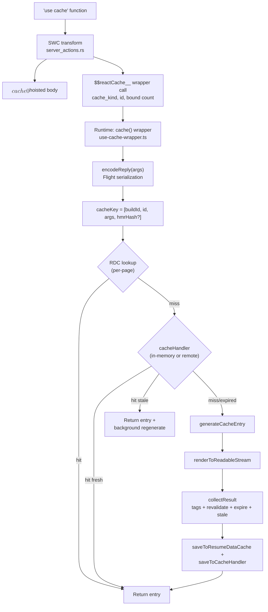

## Table of Contents

## Introduction

```tsx
async function getProducts() {
  'use cache'
  const products = await db.products.findMany()
  return products
}
```

A single line: `'use cache'`. The moment you write this as the first line of a function body, this function is no longer an ordinary function. It's not a function that executes immediately at the call site to produce results, but rather **a function that gets delegated to a cache handler along with a key**. It's not memoization within the same component like `useMemo`, nor deduplication within a single request like `React.cache`. It's **a cache entry whose results can be reused even after the request ends**. However, since the buildId is included in the cache key, it's not a model that reliably reuses the same entries across new deploys — caches can span "between requests" but shouldn't be assumed to reliably span "between builds".

[In the previous article, we saw how `'use server'`](/2026/03/react-server-functions-deep-dive) transformed functions into RPC endpoints callable by clients, and [in the next article, how `'use client'`](/2026/05/use-client-deep-dive) transformed modules into entry points for client bundle graphs. This article is the final part of the directive trilogy. We'll trace every step of how `'use cache'` transforms functions into **entry points for cache entries**. How SWC rewrites functions at build time, what keys are generated at runtime, what cache handlers store, and how `cacheLife`/`cacheTag`/`updateTag` operate on top of it all.

Let's start with terminology.

- **`use cache` directive**: A string directive that marks functions, components, or entire files as cacheable. There are three variants — `'use cache'`, `'use cache: private'` (experimental as of v16), `'use cache: remote'`.
- **Cache Entry**: The result mapped to a single cache key. Contains serialized RSC payload (or plain values), along with `revalidate`/`expire`/`stale` timing and tag metadata.
- **Cache Handler**: The backend that actually stores/retrieves entries. Next.js default `'use cache'` uses in-memory storage, configurable via `cacheHandlers` setting to external handlers.
- **Resume Data Cache (RDC)**: An in-process cache layer that appears in Next.js internal implementation at the render unit level. Not a public API, it ensures that when the same cache function is called twice within the same render, the second call doesn't go through the cacheHandler. We mention RDC frequently in this article to explain internal flows.
- **Cache Components**: The `cacheComponents: true` setting. Both an activation condition for `'use cache'` and the foundation for PPR (Partial Prerendering).

> The source code analysis in this article is based on **Next.js 16.2.4**. `use cache` was introduced as experimental in v15, became stable in v16, and its internal implementation changed several times in between. `'use cache: private'` is still experimental as of v16, and this article's explanations are based on the official documentation as of v16.2.4.

## The Conclusion First

Before diving into internal implementation, let's start with a practical summary. Even if you don't read the full article, it's good to keep this much in mind.

- `'use cache'` is not a syntactic replacement for `unstable_cache` but **a transition to the Cache Components model**. Simply changing to a directive isn't the end — it operates on a model where pages are split into static / cached / dynamic sections.
- **Extract request-scoped data like `cookies()`/`headers()`/`searchParams` as arguments instead of reading them directly** — this is the fundamental pattern.
- **Always specify `cacheLife` for safety**. Without it, shorter lifetimes from nested caches can propagate outward, potentially leading to build-time errors.
- `'use cache: private'` is **browser memory cache, not server cache**. Functions execute on every render on the server and don't persist across reloads.
- Use `'use cache: remote'` **only when shared caching is clearly needed**. It's not automatically the right answer for data that changes frequently in seconds.
- In core business screens of enterprise apps, `'use cache'` is difficult to use broadly. Cache key and invalidation design becomes rapidly complex due to permissions, personalization, mutations, and stale data tolerance. In such cases, API/BFF/DB/CDN layer caches are more controllable than framework caches.

The main content provides the rationale and internal workings for each point.

## When to Add 'use cache'

| Situation                                                                                         | Recommendation                                          |
| ------------------------------------------------------------------------------------------------- | ------------------------------------------------------- |
| Public content, documentation, FAQ, terms, announcements                                          | `'use cache'`                                           |
| Products/pricing/catalogs shared by multiple users with acceptable staleness                      | `'use cache'`                                           |
| Reference data like country/currency/bank codes/policy tables                                     | `'use cache'` + long `cacheLife`                        |
| Deterministic expensive computations like MDX conversion, syntax highlighting, report aggregation | `'use cache'`                                           |
| Tenant-level common settings with low key cardinality and repeated queries                        | `'use cache'`, with tag-based invalidation if needed    |
| Rate-limited APIs, slow backends, expensive external operations                                   | `'use cache: remote'`                                   |
| Compliance prohibition of server storage                                                          | `'use cache: private'` (browser memory cache)           |
| User-specific approvals, notifications, orders, settlements, permission menus                     | Generally don't cache                                   |
| Screens where read-your-own-writes is critical after mutations                                    | Limited use only when `updateTag` design is clear       |
| Values that need to be different per request (`crypto.randomUUID`, `Date.now`)                    | Separate from cache (force dynamic with `connection()`) |

This table is expanded in the main content, but this is sufficient as a starting point for practical decisions.

## Why Is It Rarely Used in Enterprise Apps?

Looking at this, `'use cache'` seems quite powerful. But in actual enterprise web applications, framework-level caching like this isn't used aggressively as often as you might think. This isn't because performance isn't important. The core problem in enterprise apps is usually closer to "showing data with always correct permissions, state, and consistency" rather than "showing data quickly".

`'use cache'` is a model that reuses the same result for the same cache key. However, many screens in enterprise apps show what appears to be the same URL, same component, same props, but the actual results vary based on these factors:

- User permissions
- Organization, department, role
- Session state
- Feature flags
- Contract conditions
- Locale, currency
- Personal information masking policies
- Audit / compliance rules
- Results of just-performed mutations

Including all these dimensions in the cache key rapidly increases key cardinality. Conversely, omitting some can lead to permission leaks or incorrect data exposure. Ultimately, the scariest cache bug in enterprise apps isn't stale data but **showing wrong results to users with different permissions**.

For example, if an order list screen varies by these dimensions:

```txt
organizationId: 500 values
role: 8 values
region: 10 values
status filter: 12 values
page: 100 values
sort: 6 values
```

The theoretical combinations are:

```txt
500 × 8 × 10 × 12 × 100 × 6 = 28,800,000
```

Such caches typically have low hit rates. Caches with low hit rates don't optimize performance — they just add complexity.

Another problem is mutations. Enterprise apps have many operations like approvals, cancellations, settlements, permission changes, user invitations, contract status changes. In these screens, users must immediately see changes they just made. Approaches like `revalidateTag(tag, 'max')` that serve stale responses first and update in the background are suitable for blogs, documentation, and product catalogs, but can cause operational incidents in approval/settlement/permission screens.

So in practice, it's not that caches aren't used, but they're typically used at more controllable layers.

| Layer                 | Primary Use                              | Reason                                |
| --------------------- | ---------------------------------------- | ------------------------------------- |
| CDN                   | Static assets, public pages, images      | Safest and most effective             |
| API Gateway           | Common API responses, rate limiting      | Centrally controllable                |
| BFF / Backend         | Domain data                              | Close to permission/consistency logic |
| Redis / Memcached     | Sessions, permissions, expensive queries | Explicit key management possible      |
| DB materialized views | Reports, statistics                      | Easy data consistency management      |
| Search index          | Search/filter/lists                      | Query performance optimization        |
| React Query / SWR     | Client request dedup                     | Relatively safe as user-level cache   |

In other words, framework-level caching in enterprise apps is closer to a tool for selectively applying to public-ish / low-volatility / low-risk areas rather than a tool for broadly applying across entire screens. Not because framework caches are useless, but because they often don't match the risk model of enterprise domains.

## But There Are Definitely Areas Where It Fits Well

Looking only at enterprise CRUD/backoffice/permission-centric apps, it would seem normal that `'use cache'` has little use. Forcing it usually just adds complexity. However, it's not that "there's no use for it," but rather **the applicable areas are narrower and clearer than expected**. Understanding the scope reveals where caching can have precise effects even within the same app.

`'use cache'` is useful roughly when these conditions are met:

```txt
1. Same input produces same output
2. Cache key cardinality is low
3. Multiple users frequently see the same results
4. Showing stale data briefly isn't an incident
5. You can explain invalidation paths after mutations
6. Original operations are expensive, slow, or rate-limited
7. Largely unrelated to permissions/privacy/masking policies
```

If even 3-4 of these are broken, it's better not to use it. Next.js official documentation explains that `'use cache'` can be used for both data-level function caching and UI-level component/page caching, but separates cases where fresh data is needed every request to use Suspense streaming instead of `'use cache'`. It's not a model of "put caches on all server data."

### 1. Public Content / Documentation / Help / Terms

The most canonical case. Announcements, FAQ, help, terms, developer docs, blogs, release notes, marketing pages — minimal permission differences, low change frequency, multiple users see same content, staleness acceptable, clear invalidation paths.

```tsx
import {cacheLife, cacheTag} from 'next/cache'

export async function getHelpArticles() {
  'use cache'
  cacheLife('hours')
  cacheTag('help-articles')
  return cms.getArticles()
}
```

Reduces CMS calls and is easy to include in static shells.

### 2. Product Catalogs / Pricing / Public Reference Data

Even enterprise apps have this kind of data — pricing plans, product categories, fee rate tables, supported countries/currencies, bank codes, card BIN info, terms versions, public policy tables. They look like "business data" but are actually closer to **reference data**.

```tsx
export async function getSupportedBanks() {
  'use cache'
  cacheLife('days')
  cacheTag('supported-banks')

  return db.banks.findMany({
    where: {enabled: true},
    orderBy: {name: 'asc'},
  })
}
```

Minimal permission impact, low change frequency, repeated use across multiple screens. Good fit.

### 3. Expensive Deterministic Computations

Sometimes server computations are more expensive than DB operations. MDX/Markdown conversion, syntax highlighting, document TOC generation, facet calculations, permission-agnostic statistics cards, report summaries.

```tsx
export async function renderMarkdown(slug: string) {
  'use cache'
  cacheLife('weeks')
  cacheTag(`doc-${slug}`)

  const source = await cms.getMarkdown(slug)
  return compileMDX(source)
}
```

Small input (`slug`), deterministic results, expensive computation. Best fit for cache's original purpose.

### 4. Same Data Shared by Multiple Components

Useful when the same data is repeatedly called by multiple components or when you want to cache independently of UI.

```tsx
export async function getServiceConfig(serviceId: string) {
  'use cache'
  cacheLife('hours')
  cacheTag(`service-config-${serviceId}`)

  return db.serviceConfig.findUnique({where: {serviceId}})
}
```

The important thing here is that `serviceId` must be able to represent the permission dimension. The moment `userId` needs to be included, cache efficiency drops dramatically.

### 5. Cached Islands Within Static Shells

This is the closest to the intended use in the Cache Components model. **Not caching entire pages, but only safe islands.**

```tsx
export default function Page() {
  return (
    <>
      <CachedProductSummary productId="abc" />

      <Suspense fallback={<Skeleton />}>
        <UserSpecificPurchaseHistory />
      </Suspense>
    </>
  )
}

async function CachedProductSummary({productId}: {productId: string}) {
  'use cache'
  cacheLife('hours')

  const product = await getProduct(productId)
  return <ProductSummary product={product} />
}
```

This is applicable even in enterprise apps.

| Cacheable                                          | Cache Prohibited           |
| -------------------------------------------------- | -------------------------- |
| Common notice areas                                | My pending approvals count |
| Product descriptions, policy explanations          | My permission menu         |
| Document links                                     | My settlement amount       |
| Non-permission statistics / service status summary | My customer list           |

Even within the same page, half gets cached and half becomes dynamic — that's the picture of PPR.

### 6. External Calls Requiring Upstream Protection

This is the main area for `'use cache: remote'`. When external CMS rate limits are strict, external API call costs are high, DB aggregation queries are expensive, or serverless instances are numerous making in-memory hit rates low.

```tsx
export async function getExchangeRate(base: string, quote: string) {
  'use cache: remote'
  cacheLife({revalidate: 60 * 10, expire: 60 * 60})
  cacheTag(`exchange-rate-${base}-${quote}`)

  return externalRateApi.getRate(base, quote)
}
```

> However, pay attention to domain context. If this is "actual trading exchange rates" in a financial domain, caching is dangerous — even a single beat off in prices can lead directly to operational incidents. If the same endpoint is used for "reference official exchange rates," caching becomes viable. What screen and what meaning the same data is used for determines cache viability.

### 7. Data Repeatedly Queried by Tenant

Fully personalized data is hard to cache, but **tenant-level data may be possible**. Because tenant counts are limited (low key cardinality) and many users within a tenant see the same results.

```tsx
export async function getTenantTheme(tenantId: string) {
  'use cache'
  cacheLife('hours')
  cacheTag(`tenant-theme-${tenantId}`)

  return db.tenantTheme.findUnique({where: {tenantId}})
}
```

Tenant-level theme settings, tenant-level public product lists, tenant-level terms, tenant-level feature availability, tenant-level onboarding messages — much better than `userId`-level split caches.

### Quick Decision Table

Even without reading each section, these questions usually decide it:

| Question                                                   | If YES                    |
| ---------------------------------------------------------- | ------------------------- |
| Do multiple users share and view this result?              | `'use cache'` candidate   |
| Can this be publicly shared without permissions?           | Strong candidate          |
| Is it okay if stale shows for 1-10 minutes?                | Strong candidate          |
| Are key combinations small and repetitive?                 | Strong candidate          |
| Is the original operation expensive?                       | Strong candidate          |
| Can you clearly state which tags to clear after mutations? | Usable                    |
| Must `userId`/session/permission be in the key?            | Generally not recommended |
| Would stale data cause operational incidents?              | Don't use                 |

### In One Sentence

`'use cache'` is not so much **a business data cache tool** as **a tool for incorporating shareable, low-volatility server results into static shells or runtime caches**. So it makes sense that typical enterprise CRUD apps have little use for it. But within the same app, it fits well in areas like documents/announcements/terms/help, configuration reference data, product/pricing catalogs, expensive deterministic computations, tenant-level common settings, stale-acceptable statistics, and rate-limited external API results.

The key is this: **Don't ask "Can I cache this data?" but first ask "Can I share this result?"**

## 'use cache' Is Not a Memoization Marker

There's an important misconception to address first. The idea that "`'use cache'` is the server version of `useMemo` or `React.cache`." Looking only at results, they seem similar — same input gives same output, second call is faster. But the operating models are completely different.

Let's compare the scope and key generation methods of the three tools:

| Tool                | Scope                       | Key Generation                                      | Storage Location       | Lifespan                                                   |
| ------------------- | --------------------------- | --------------------------------------------------- | ---------------------- | ---------------------------------------------------------- |
| `useMemo(fn, deps)` | One component instance      | Reference equality of dependency array              | React fiber            | While component is alive                                   |
| `React.cache(fn)`   | One request (server)        | Reference equality of arguments (Map-based)         | request-scoped storage | Discarded when request ends                                |
| `'use cache'`       | Build output + runtime both | **Argument serialization + function ID + build ID** | RDC + cacheHandler     | `revalidate`/`expire` + buildId. Invalidated on new deploy |

The core difference is twofold.

**First, the key domains are different.** `useMemo`/`React.cache` compare by JavaScript object references. Even with the same arguments, if objects are newly created, it's a cache miss. `'use cache'` **serializes arguments first** then compares by hash. Passing `{id: 1}` twice creates the same key.

**Second, lifespans are different.** `useMemo` disappears with component unmount, `React.cache` disappears when response ends. `'use cache'` lives as long as the cacheHandler decides — default in-memory storage can persist between requests in self-hosted environments, but is affected by instance replacement, memory constraints, and eviction in serverless environments. Using external cache handlers (`use cache: remote` or `cacheHandlers` config) provides cross-instance sharing and persistence at the cost of network round-trips and expenses. However, **new deploys change the buildId, so previous cache entries won't be hit** — even calling the same function with same arguments results in different keys, effectively invalidating them.

These two differences are the root of all other differences. Only accepting serializable arguments, not being able to directly call `cookies()`/`headers()`, closure variables being automatically included in keys — all stem from the model of "functions safely storable in key-value stores that span processes."

In other words, `'use cache'` is **a marker that replaces function calls with cache entry lookups**. When called again with the same cache key, as long as the entry is usable as fresh or stale, it responds from the cache layer without re-executing the function body. SWC's job is to embed this replacement into code at build time.

## Build-Time Transformation: SWC Rewrites Functions

When Next.js encounters `'use cache'`, it doesn't leave the function untouched. SWC[^1] rewrites the function into a cache wrapper call. This transformation shares the same pipeline (`server_actions.rs`) that `'use server'` uses to convert functions into server references.

Original:

```tsx
// app/products/data.ts
async function getProducts(filter: string) {
  'use cache'
  return db.products.findMany({where: {filter}})
}
```

What SWC transforms it to (conceptually):

```tsx
// $$cache0$$ is the hoisted original body
async function $$cache0$$([], filter) {
  return db.products.findMany({where: {filter}})
}

// Original location is replaced with wrapper call
const getProducts = $$reactCache__(
  'default', // cache_kind
  '<sha1-of-file-export>', // function ID
  0, // bound arg count
  $$cache0$$,
)
```

There are four key points.

**1. Function body gets hoisted.** The original function body is lifted to the module top-level and becomes a separate anonymous function. This follows the same pattern as `'use server'` processing.

**2. First argument is always a bound args array.** If there were external variables referenced through closures, SWC extracts them and passes them as the first array argument. This is the reality behind what the [official docs call](https://nextjs.org/docs/app/api-reference/directives/use-cache#cache-keys) "closure variables become part of the cache key". Closures aren't magic—SWC explicitly extracts them as arguments at compile time.

```tsx
// Original
async function Component({userId}: {userId: string}) {
  const getData = async (filter: string) => {
    'use cache'
    return fetch(`/api/users/${userId}/data?filter=${filter}`)
  }
  return getData('active')
}

// After transformation (conceptual)
async function $$cache0$$([userId], filter) {
  return fetch(`/api/users/${userId}/data?filter=${filter}`)
}

async function Component({userId}) {
  const getData = $$reactCache__('default', '<id>', 1, $$cache0$$, userId)
  //                                              └─ bound count: one userId
  return getData('active')
}
```

`userId` was a closure-captured variable, but after transformation it goes into the first argument (bound array) of `$$cache0$$`. From the cache key perspective, it gets serialized and included in the hash just like any other argument.

**3. Function ID is a secure hash bound to the function's location and signature.** Based on Next.js v16.2.4 source, SWC's `generate_server_reference_id`[^2] combines hash salt + filename + export/reference name with SHA1, and includes bytes in the ID containing whether it's a cache function and argument usage info (argument mask). The same function will have different IDs if the file changes or export name changes. However, **deploy-wide invalidation is handled by buildId included in the cache key, not function ID**—the normal flow is: code change → new build → new buildId → all entries miss.

**4. cache_kind gets embedded.** `'use cache'` becomes `'default'`, `'use cache: private'` becomes `'private'`, and `'use cache: remote'` becomes `'remote'`. This string serves as the branching key for runtime wrappers.

### File Level vs Function Level

`'use cache'` can be placed either at the top of a file or on the first line of a function body. Both locations are processed by the same SWC pass, but with different results.

```tsx
// File level
'use cache'

export async function getA() {
  return ...
}
export async function getB() {
  return ...
}
```

At file level, **all exported functions are individually wrapped**. However, there's one constraint—all exports must be async functions. If sync functions are mixed in, SWC throws an error. The reason is simple: cache lookup is inherently async (IO), and on cache miss, generateCacheEntry needs await to get results.

```tsx
// Function level
export async function getA() {
  'use cache'
  return ...
}

export async function getB() {
  // This function is not cached
  return ...
}
```

At function level, only that function gets wrapped. You can mix cached and non-cached functions within the same file.

### `'use cache: private'` and `'use cache: remote'`

The three variants only differ in the `cache_kind` string—the SWC transformation itself is identical. The difference lies in the branching argument the runtime wrapper receives and the storage model that branching creates.

```tsx
async function getRecommendations(productId: string) {
  'use cache: private'
  cacheLife({stale: 60})
  const sessionId = (await cookies()).get('session-id')?.value || 'guest'
  return getPersonalizedRecommendations(productId, sessionId)
}
```

`private` is the only variant that allows `cookies()`/`headers()`/`searchParams`. However, **results are never stored on the server**. The official docs clearly define this behavior—"results are never stored on the server, they're cached only in the browser's memory and do not persist across page reloads". This means there's no server-side deduplication effect. **This function executes on every server render** and is excluded from static shell generation. The result is kept by the client in browser memory to be reused when the same component on the same page is revisited without reload.

Moreover, `'use cache: private'` **cannot set custom cache handlers**. It's also unavailable in Route Handlers. As of v16 it's experimental, and the runtime prefetching it depends on isn't stable either. It's a tool limited to compliance requirements or legacy code where extracting request data as arguments is genuinely difficult.

> It's more accurate to read the name `private` as "non-shareable cache" rather than "private cache". It's not that other users can't see it—it's not stored on the server at all.

Therefore, `private` is closer to runtime prefetching and client router revisit optimization rather than a cache that reduces server load. **Don't view it as a tool for reducing server function execution**—the function body executes as-is on every server render.

```tsx
async function getProductPrice(productId: string, currency: string) {
  'use cache: remote'
  cacheTag(`product-price-${productId}`)
  cacheLife({expire: 3600})
  return db.products.getPrice(productId, currency)
}
```

`remote` does the opposite—**it stores in external cache handlers on the server side**—a durable cache shared by all instances. The official docs clearly narrow down the motivation for using remote.

- Rate-limited APIs (when upstream has call limits)
- Slow backends (when DB becomes a traffic bottleneck)
- Expensive operations (queries/computations that are expensive to repeat)
- Flaky services (external services that occasionally fail)

The same docs also specify **cases to avoid**.

- When there's already a KV store in front of the data layer, making `'use cache'` sufficient
- Operations faster than 50ms
- When cache keys are unique almost every request (search filters, price ranges, user-specific parameters)
- **When data changes frequently in seconds~minutes intervals**—cache hits quickly become stale, providing little benefit

This last point is important. Don't oversimplify to "short TTL in serverless means remote is the answer". The value of remote lies in **sharing**—it's effective when there's meaningful work (rate limit avoidance, upstream protection) when shared.

The default `'use cache'` uses both in-memory storage and RDC. It's the default for static shell generation and general data caching, covering the most common cases. Summarizing the storage model differences across the three variants:

| Variant                | Server Storage             | Client Storage        | Direct Request API Access | Sharing Scope       |
| ---------------------- | -------------------------- | --------------------- | ------------------------- | ------------------- |
| `'use cache'`          | in-memory or cache handler | router prefetch cache | No (extract as args)      | Shared by all users |
| `'use cache: remote'`  | remote cache handler       | router prefetch cache | No (extract as args)      | Shared by all users |
| `'use cache: private'` | **Not stored**             | browser memory        | Yes                       | Client only         |

The three variants also have different nesting rules.

- `remote` inside `remote` is **allowed**.
- Default `'use cache'` inside `remote` is also **allowed** (inner remote works when deferred at request time).
- `remote` inside `private` is **not allowed**.
- `private` inside `remote` is also **not allowed**.

These rules prevent consistency issues when storage locations get mixed. Particularly, `private` is browser memory cache while `remote` is server-side shared cache, so mixing these two boundaries in one call tree creates ambiguous semantics. Nesting violations cause build-time errors.

## Runtime: What the Cache Wrapper Does

The `$$reactCache__` embedded at build time eventually points to the `cache()` function in `packages/next/src/server/use-cache/use-cache-wrapper.ts`[^3]. This function is **the single entry point that all `'use cache'` calls pass through**.

The flow works like this:

```
1. Argument serialization → encodeReply (Flight)
2. Cache key composition → [buildId, id, args, hmrRefreshHash?]
3. ResumeDataCache(RDC) lookup
4. (if miss) cacheHandler lookup
5. (if miss) generateCacheEntry to execute body
6. stale-while-revalidate: background regeneration if expired
7. Return result + store in RDC/cacheHandler
```

Let's break down each step.

### Cache Key Composition

The core line of code[^3] is:

```tsx
const cacheKeyParts: CacheKeyParts = hmrRefreshHash
  ? [buildId, id, args, hmrRefreshHash]
  : [buildId, id, args]
```

Let's look at the four elements:

- **buildId**: ID generated fresh for each Next.js build. This is why all cache automatically invalidates on the next deploy.
- **id**: SHA1 function ID embedded by SWC. Same code with same function gets same ID; different ID if function moves or name changes.
- **args**: Argument array at call time. First element is bound args extracted by SWC, rest are call-time arguments.
- **hmrRefreshHash**: Only exists in dev mode. Hash updated every time HMR occurs. When code changes, cache automatically invalidates so old results don't remain stale.

The final cache key is the serialized and hashed combination of these four elements.

### Argument Serialization: encodeReply

You can't use `args` directly as a key. Object references won't work for comparison, so serialization is needed. Next.js uses React's `encodeReply`[^4] directly—the same function `'use server'` uses when sending arguments from client to server.

```tsx
import {encodeReply} from 'react-server-dom-webpack/client.edge'

const encodedArgs = await encodeReply(args)
```

`encodeReply` is React's Flight serializer. It's more powerful than JSON and supports:

- Primitives: `string`, `number`, `boolean`, `null`, `undefined`
- Plain objects and arrays
- `Date`, `Map`, `Set`, `BigInt`, `TypedArray`, `ArrayBuffer`, `FormData`
- React elements (pass-through only)

What's not supported:

- Class instances (can't serialize methods + prototype)
- Regular functions (server function references OK, pass-through only)
- `Symbol`, `WeakMap`, `WeakSet`
- `URL` instances (surprisingly—must convert to string before passing)

The serialization result is usually `FormData`. To create a string for use as a key, one more normalization step happens—`encodeFormData` wraps each field with length prefixes and serializes to a single string. Hash this result together with buildId/id to get the final cache key.

> **Argument and return value serializers are different.** Arguments use Server Component serialization (strict), return values use Client Component serialization (JSX allowed). Due to this asymmetry, **JSX cannot be received as arguments but is possible as return values**. The `children` prop received via pass-through is a workaround—as long as you don't introspect it in the body, it can be inserted as-is into the output.

### Two-Stage Lookup: RDC → cacheHandler

Once the key is created, lookup begins. The flow for default `'use cache'` is (noting again that RDC is an internal implementation detail, not public API):

```tsx
// Stage 1: Resume Data Cache (in-process for page render duration)
const cached = lookupResumeDataCache(prerenderResumeDataCache, serializedKey)
if (cached) return cached

// Stage 2: cacheHandler (in-memory or external handler)
if (cacheHandler) {
  const entry = await cacheHandler.get(serializedKey)
  if (entry && !shouldDiscardCacheEntry(entry)) {
    return entry
  }
}

// Stage 3: Both miss → execute body
return generateCacheEntry(...)
```

**RDC** is an in-process Map that lives only during one page render. When the same cache function is called multiple times within one page, RDC immediately returns the first call's result from the second call onwards. cacheHandler isn't even called.

**cacheHandler** is cache used across requests. The default implementation is in-memory storage, and you can swap in external handlers via the `cacheHandlers` option in `next.config.ts`.

```ts
// next.config.ts
const config = {
  cacheComponents: true,
  cacheHandlers: {
    default: require.resolve('./cache-handler.js'),
  },
}
```

How the three variants differ from this flow:

- Default `'use cache'` uses both RDC and cacheHandler.
- `'use cache: remote'` uses the remote handler provided by the platform (custom handlers also configurable via `cacheHandlers`).
- `'use cache: private'` barely goes through this flow. It's not stored in server cacheHandler, and the body executes on every server render. Results flow to the client's browser memory cache via server response and are reused only within one session.

### Entry Generation: generateCacheEntryImpl

On a miss, the body needs to be executed. You'd hope it's just `await fn(...args)` and done—but it's not.

```tsx
async function generateCacheEntryImpl(...) {
  const isPrerender = workStore.isPrerender

  const stream = isPrerender
    ? await prerender(/* 50 second timeout */)
    : await renderToReadableStream(/* dynamic */)

  const {revalidate, expire, stale, tags} = await collectResult(stream)

  return {stream, revalidate, expire, stale, tags, timestamp: Date.now()}
}
```

Two key points:

**1. Body execution creates an RSC stream.** Cache function return values need to support React elements (since they're used as components), so whether plain values or JSX, they go through `renderToReadableStream` to become Flight payload streams. What gets stored in cache is this stream—subsequent calls replay the stream to produce the same React nodes.

**2. Metadata gets collected together.** During body execution, there might be `cacheLife()`/`cacheTag()` calls. These calls accumulate values in ALS (AsyncLocalStorage) based `workUnitStore`. After body execution finishes, `collectResult` gathers those values and bundles them with the entry.

In prerender mode, there's a 50-second timeout. If it doesn't finish within this time, it means the build has hung. The usual cause is—cache functions awaiting runtime data like `cookies()` that never resolves at build time. We'll cover this again in the [Pitfalls section](#pitfalls) later.

### Stale-while-revalidate

Entries store both `revalidate` and `expire` together. How these two values work on subsequent calls is the core of SWR.

```tsx
const age = Date.now() - entry.timestamp

if (age < entry.revalidate * 1000) {
  // fresh: return as-is
  return entry
}

if (age < entry.expire * 1000) {
  // stale: return cache immediately while triggering background regeneration
  void generateCacheEntry({skipPropagation: true, ...})
  return entry
}

// expired: synchronously regenerate then return
return await generateCacheEntry(...)
```

There are three ranges:

- **fresh** (`age < revalidate`): Cache responds as-is.
- **stale** (`revalidate ≤ age < expire`): Cache responds but triggers background regeneration. Subsequent calls during this period receive the new entry.
- **expired** (`age ≥ expire`): Cache is unusable. Synchronously regenerate then respond.

`skipPropagation: true` is a flag that prevents metadata (tags/revalidate) from being propagated again to external cache during background regeneration—it already propagated during the first generation, so no need to duplicate.

## cacheLife: 7 Built-in Profiles

Where do the three numbers `revalidate`/`expire`/`stale` come from? The default is the `default` profile, and calling `cacheLife()` switches to a different profile.

| Profile   | Use Case                 | `stale` (client) | `revalidate` (server) | `expire` |
| --------- | ------------------------ | ---------------- | --------------------- | -------- |
| `default` | General content          | 5 minutes        | 15 minutes            | Infinite |
| `seconds` | Real-time data           | 30 seconds       | 1 second              | 1 minute |
| `minutes` | Minute-level updates     | 5 minutes        | 1 minute              | 1 hour   |
| `hours`   | Multiple updates per day | 5 minutes        | 1 hour                | 1 day    |
| `days`    | Daily updates            | 5 minutes        | 1 day                 | 1 week   |
| `weeks`   | Weekly updates           | 5 minutes        | 1 week                | 30 days  |
| `max`     | Rarely changes           | 5 minutes        | 30 days               | 1 year   |

Each of the three numbers has a different meaning:

- **`stale`**: How long the client router will show content without asking the server. Passed to the client via the `x-nextjs-stale-time` response header. **Values under 30 seconds are forced up to 30 seconds** — this is a safety mechanism to prevent prefetched links from expiring before user clicks.
- **`revalidate`**: How long the server cache appears fresh. After this time, SWR kicks in.
- **`expire`**: When it's no longer even stale. After this time, it's regenerated synchronously.

> It might seem surprising that `stale` is consistently 5 minutes, but there's a reason. `stale` is the client router's prefetch cache retention time. It's separate from the server data refresh cycle (`revalidate`). Since it's tuned to user navigation patterns, 5 minutes is reasonable regardless of content update frequency.

### Inline Profiles

If the presets don't fit, pass an object directly:

```tsx
async function getOffer() {
  'use cache'
  cacheLife({
    stale: 60, // 1 minute
    revalidate: 300, // 5 minutes
    expire: 3600, // 1 hour
  })
  return db.offers.findFirst()
}
```

`expire` must be greater than `revalidate`, or you'll get a build-time error. An empty object `cacheLife({})` uses `default` values.

### Custom Profiles

You can create named profiles in `next.config.ts`:

```ts
const config = {
  cacheComponents: true,
  cacheLife: {
    biweekly: {
      stale: 60 * 60 * 24 * 14,
      revalidate: 60 * 60 * 24,
      expire: 60 * 60 * 24 * 14,
    },
  },
}
```

This enables calling `cacheLife('biweekly')`. Using the same name as a built-in overwrites it — if you want to redefine `days`, just add `cacheLife: {days: {...}}`.

### Nested cacheLife: Who Wins?

When a cache function calls another cache function, external and internal cacheLife settings can conflict. The rules are subtle.

**When there's an explicit `cacheLife` on the outside — the outer wins.** Whether the inner lifetime is shorter or longer, the outer takes precedence.

```tsx
async function Dashboard() {
  'use cache'
  cacheLife('hours') // Explicit outer → 1 hour

  return <Widget /> // Even if Widget is 'minutes' (5 min), Dashboard cache lasts 1 hour
}
```

The reason is simple. When the outer cache entry hits, the **entire output including inner results** is returned as-is. The inner cache function isn't even called, so the inner lifetime isn't observed during the outer hit. If the outer stays fresh for 1 hour, the inner's 5-minute lifetime is meaningless for that hour.

**When there's no explicit `cacheLife` on the outside — the inner can reduce the outer's default.**

```tsx
async function Dashboard() {
  'use cache'
  // No cacheLife → default (15 minutes)

  return <Widget /> // If Widget is 'minutes' 5 min, Dashboard is also reduced to 5 min
}
```

Without an explicit call, the outer uses the default profile (15 minutes). However, if the inner cache's lifetime is shorter, the outer default lifetime gets reduced to that value. The reverse direction (inner being longer extending the outer) doesn't happen — the default 15 minutes is maintained.

Looking at how this works in the internal implementation, minimum propagation is applied to the `workUnitStore` variable in ALS. However, this minimum rule only matters **when there's no explicit `cacheLife` on the outside**. If there's an explicit call on the outside, it's handled so that the outer lifetime takes precedence even if propagation triggers.

```tsx
// Simplified propagation intent
if (outerStore.hasExplicitCacheLife) {
  // Explicit outer — ignore propagation
} else if (innerStore.explicitRevalidate < outerStore.implicitRevalidate) {
  outerStore.implicitRevalidate = innerStore.explicitRevalidate
}
```

Therefore, the practical recommendation is — **explicitly specify `cacheLife` for all cache functions**. With explicit specification, the outer maintains its value and short inner lifetimes won't unintentionally flow down.

### Prerender Errors with Short Nested Cache

If `revalidate` is less than 5 minutes or 0, Next.js excludes that cache from prerendering. Instead, it becomes a **dynamic hole** — filled at request time, not build time. This is why the `seconds` profile automatically becomes dynamic.

The problem occurs when short caches are nested inside other caches:

```tsx
async function ShortLivedWidget() {
  'use cache'
  cacheLife('seconds') // Revalidates every second
  return <div>{await fetchRealtimeData()}</div>
}

async function Page() {
  'use cache'
  // No cacheLife → becomes 'seconds' due to propagation rule above
  return (
    <div>
      <h1>Dashboard</h1>
      <ShortLivedWidget />
    </div>
  )
}
```

This code throws a build-time error. The reason is — the outer Page also flows down to become a dynamic hole, but it's unclear whether this is intentional or a mistake. Next.js forces explicit specification for safety.

There are two solutions:

**(a) Make the outer explicitly long (outer maintains prerender):**

```tsx
async function Page() {
  'use cache'
  cacheLife('default') // Explicit → blocks propagation
  return (
    <div>
      <h1>Dashboard</h1>
      <ShortLivedWidget /> {/* dynamic hole */}
    </div>
  )
}
```

**(b) Make the outer explicitly short too + Suspense:**

```tsx
async function Content() {
  'use cache' // Or 'use cache: remote' depending on environment
  cacheLife('seconds')
  return <ShortLivedWidget />
}

export default function Page() {
  return (
    <Suspense fallback={<p>Loading...</p>}>
      <Content />
    </Suspense>
  )
}
```

Here, the choice between `'use cache'` and `'use cache: remote'` depends on the environment. In self-hosted setups, in-memory storage persists between requests, so `'use cache'` also provides deduplication. In serverless environments, instances might be different each time, leading to low hit rates for in-memory storage. If cross-instance sharing makes sense for your scenario, `'use cache: remote'` is a candidate. However, [as we saw earlier](#use-cache-private과-use-cache-remote), if data changes frequently every second, even remote cache hits quickly become stale, reducing benefits. Use remote only when there's **clear motivation from sharing** (rate limit avoidance, upstream protection, expensive computation reuse).

## cacheTag and Tag-based Invalidation

`cacheTag(...)` attaches tags to cache entries. These tags serve as metadata that allows later invalidation by key.

```tsx
async function getProducts() {
  'use cache'
  cacheTag('products')
  return db.products.findMany()
}

async function getProduct(id: string) {
  'use cache'
  cacheTag('products', `product-${id}`)
  return db.products.findUnique({where: {id}})
}
```

A few rules:

- Multiple tags can be attached to one cache entry: `cacheTag('a', 'b')` or `cacheTag('a'); cacheTag('b')`.
- Attaching the same tag twice is the same as attaching it once (idempotent).
- Maximum 256 characters per tag, maximum 128 tags per entry.

There are two ways to invalidate tags: `revalidateTag` and `updateTag`. However, **`revalidateTag`'s meaning varies based on its second argument** — the form without arguments is deprecated and is not SWR.

| Call Form                         | Callable From                | Meaning                                               | Next Request Response                            |
| --------------------------------- | ---------------------------- | ----------------------------------------------------- | ------------------------------------------------ |
| `revalidateTag(tag, 'max')`       | Server Action, Route Handler | Mark stale + SWR (recommended)                        | Stale response + background regeneration         |
| `revalidateTag(tag, {expire: 0})` | Server Action, Route Handler | Immediate expiration (for webhooks/external triggers) | Blocking wait for fresh generation               |
| `revalidateTag(tag)`              | (deprecated)                 | Immediate expiration + blocking revalidate            | Wait for fresh generation                        |
| `updateTag(tag)`                  | **Server Action only**       | Immediate expiration                                  | Wait for fresh generation (read-your-own-writes) |

`revalidateTag(tag, 'max')` is the currently recommended SWR call. It marks the cache as stale, and when pages with that tag are next visited, it immediately serves the stale response while generating fresh content in the background. Users see the update one beat later.

Other cacheLife profile names can go in place of `'max'` — custom profiles are also possible. If webhooks or external systems require immediate expiration, put an `{expire: 0}` object as the second argument. For other general cases requiring immediate expiration, using `updateTag` in Server Actions is recommended.

**Single-argument `revalidateTag(tag)` is deprecated.** The legacy behavior is close to immediate expiration + blocking revalidate, and despite the name, it's not SWR. It still works if you ignore TypeScript errors, but may be removed in the future. If you're already calling it with a single argument — migrate to `revalidateTag(tag, 'max')` or `{expire: 0}` for webhooks or Route Handlers, or `updateTag` for Server Actions.

`updateTag` immediately discards the cache. The next request can't receive a stale response and must wait for fresh generation. However, it provides **read-your-own-writes guarantee**.

```tsx
'use server'

export async function createPost(formData: FormData) {
  const post = await db.posts.create({data: formData})

  updateTag('posts') // Immediate discard
  updateTag(`post-${post.id}`)

  redirect(`/posts/${post.id}`) // User sees the post they created
}
```

This is why `updateTag` is Server Action-only. Server Actions are mutations, and redirect/refresh after mutation should show the user the changes they made. If SWR intervenes, they'd see old data at least once, which isn't acceptable.

Calling `updateTag` from a Route Handler throws an error. Route Handlers are typically for external triggers like webhooks, where the mutation context isn't clear and read-your-own-writes guarantee is meaningless — so the assumption is that SWR-meaning `revalidateTag(tag, 'max')` or `{expire: 0}` for immediate expiration when needed is more appropriate.

> In practice, once you decide the call location (Server Action vs Route Handler) and meaning (SWR vs read-your-own-writes vs immediate expire), which function to use is automatically determined. Single-argument `revalidateTag(tag)` is ambiguous in intent expression in any case, so it's no longer used.

## Serialization Rules: Arguments and Return Values

Both arguments and return values of `'use cache'` functions must be serializable. However, the two sides use **different serialization systems**, which is a gotcha.

### Arguments: Server Component serialization (strict)

Serialized with `encodeReply`. Acceptable types:

- Primitives
- Plain objects, arrays
- `Date`, `Map`, `Set`, `BigInt`
- `TypedArray`, `ArrayBuffer`
- `FormData`
- React elements (**pass-through only** — only when not introspecting in the body)

Unacceptable types:

- Class instances
- Regular functions (Server Actions can be passed through)
- `Symbol`, `WeakMap`, `WeakSet`
- `URL`

### Return Values: Client Component serialization (loose)

All of the above + JSX elements.

This asymmetry is a common source of confusion. Component children are arguments (props), but JSX is difficult to receive as arguments — unless it's pass-through. This code works:

```tsx
async function Cached({children}: {children: ReactNode}) {
  'use cache'
  // children is passed through to output without introspection → pass-through
  return <div className="wrapper">{children}</div>
}
```

This code doesn't work:

```tsx
async function Cached({children}: {children: ReactNode}) {
  'use cache'
  // Attempts to analyze children → introspection
  if (Children.count(children) > 0) {
    // ...
  }
}
```

**Pass-through means "received but not examined in the body"**. If you use children in branching conditions or read child props in the body, it's no longer pass-through — that means children affects the cache key, and JSX can't be serialized for keys, causing an error.

Server Actions follow the same pattern:

```tsx
async function Page() {
  const action = async () => {
    'use server'
    await db.update(...)
  }

  return <Cached action={action} />
}

async function Cached({action}: {action: () => Promise<void>}) {
  'use cache'
  // action is passed to client without calling → pass-through
  return <ClientButton action={action} />
}
```

Server Actions aren't regular functions but server references (metadata objects). Pass-through is possible, but they shouldn't be called within the cache function body.

## Runtime API Constraints

`'use cache'` cannot directly call `cookies()`, `headers()`, `searchParams`, and other request-scoped APIs. Calling them results in an error.

```tsx
async function CachedProfile() {
  'use cache'
  const session = (await cookies()).get('session')?.value // Error
  return <div>{session}</div>
}
```

The reason is clear — caches are shared between requests, and caching request-scoped data without keys would let different users see others' data. This is blocked as a basic security measure.

There are three workarounds:

### (1) Extract as Arguments and Pass Down (Recommended)

```tsx
async function ProfilePage() {
  const session = (await cookies()).get('session')?.value
  return <CachedProfile sessionId={session} />
}

async function CachedProfile({sessionId}: {sessionId: string}) {
  'use cache'
  // sessionId automatically becomes part of the cache key
  return <div>{await fetchProfile(sessionId)}</div>
}
```

Call `cookies()` once outside and pass the value as props. Props automatically become part of the cache key, creating separate entries per user.

### (2) `'use cache: private'`

```tsx
async function getProfile() {
  'use cache: private'
  cacheLife({stale: 60})
  const session = (await cookies()).get('session')?.value
  return fetchProfile(session)
}
```

`private` allows access to `cookies()`/`headers()`/`searchParams`. However — **results are not stored on the server**. The function executes on every server render, and results are cached only in the client's browser memory. It doesn't persist beyond page reloads. Use for compliance requirements or legacy code where extracting request data as arguments is really difficult. Experimental as of v16 and unavailable in Route Handlers. `stale` must be 30 seconds or more for runtime prefetching to work.

### (3) `'use cache: remote'`

```tsx
async function getProductPrice(productId: string, currency: string) {
  'use cache: remote'
  cacheLife({expire: 3600})
  return db.products.getPrice(productId, currency)
}
```

Stores in remote handler for sharing across all instances. However, `cookies()`/`headers()` still can't be called directly — extracting as arguments from outside is the same as (1). The value of remote isn't short TTL itself but **sharing**. Use when there's clear motivation like rate-limited API protection, slow backend protection, or expensive computation reuse.

## React.cache Isolation

`React.cache` stores created inside `'use cache'` are isolated from external stores.

```tsx
import {cache} from 'react'

const store = cache(() => ({current: null as string | null}))

function Parent() {
  const shared = store()
  shared.current = 'value from parent'
  return <Child />
}

async function Child() {
  'use cache'
  const shared = store()
  // shared.current is null — can't see Parent's value
  return <div>{shared.current}</div>
}
```

The reason is — `'use cache'` creates a separate React.cache scope inside itself. The store from external `cache()` and the store from internal `cache()` are different instances even though they were created from the same function. This enforces the principle that cache functions should be determinable by their arguments alone.

This is a gotcha that's hard to debug if you don't know about it. "I definitely put a value in the store but can't see it" — first check if you crossed a cache boundary.

## Cache Components and PPR

So far, this covers the individual directive behavior of `'use cache'`. When we fit this into the bigger picture, we get **Cache Components**. The new model enabled by a single line of configuration (`cacheComponents: true`) allows three types of content to coexist within one page.

```tsx
export default function Page() {
  return (
    <>
      {/* (1) Static — sync code, prerendered at build time */}
      <header>
        <h1>Dashboard</h1>
      </header>

      {/* (2) Cached — 'use cache', build-time prerender + runtime SWR */}
      <Stats />

      {/* (3) Dynamic — wrapped with Suspense, streamed at request time */}
      <Suspense fallback={<NotificationsSkeleton />}>
        <Notifications />
      </Suspense>
    </>
  )
}

async function Stats() {
  'use cache'
  cacheLife('hours')
  return <StatsView data={await db.stats.aggregate()} />
}

async function Notifications() {
  const userId = (await cookies()).get('userId')?.value
  return (
    <NotificationList
      items={await db.notifications.findMany({where: {userId}})}
    />
  )
}
```

The flow for each region is as follows:

- **Static**: Part of the build artifact. First byte responds immediately from CDN.
- **Cached**: Prerendered at build time, and the cacheHandler responds at runtime. SWR when expired.
- **Dynamic**: Suspense boundary immediately sends a placeholder, then streams as soon as the server fetch completes.

This is PPR (Partial Prerendering). `'use cache'` is the marker that creates the second region of PPR — marking "this is prerenderable, but not forever."

> In Next.js 16, the `experimental.ppr` flag has been removed. `cacheComponents: true` has taken its place.

## unstable_cache → use cache Migration

`unstable_cache` was the predecessor to `'use cache'` in Next.js 13~15. It's been deprecated since v16. Simple data fetch cases can be migrated relatively mechanically, but **`'use cache'` is tied to the Cache Components model and SWC transforms, so it's not a complete drop-in replacement for `unstable_cache`**. In particular, request-scoped data handling, dynamic key design, and runtime caching locations need to be reconsidered.

```tsx
// Before
import {unstable_cache} from 'next/cache'

const getCachedUser = unstable_cache(
  async (id) => getUser(id),
  ['my-app-user'], // keyParts
  {tags: ['users'], revalidate: 60},
)

// After
import {cacheLife, cacheTag} from 'next/cache'

async function getCachedUser(id: string) {
  'use cache'
  cacheTag('users')
  cacheLife({revalidate: 60})
  return getUser(id)
}
```

Differences:

- **Manual keyParts are gone.** SWC automatically puts the function ID and arguments into the key. No need to manage strings like `['my-app-user']`.
- **tags become cacheTag.** `options.tags` has become `cacheTag()` calls inside the function body. Dynamic tags (different tags depending on data) are now possible.
- **revalidate becomes cacheLife.** `options.revalidate: 60` becomes `cacheLife({revalidate: 60})` or `cacheLife('minutes')`.

Similarities:

- Both can't directly use `cookies()`/`headers()`.
- Both require arguments to be serializable.

The two APIs can coexist during migration. `unstable_cache` in v16 only shows deprecation warnings while maintaining functionality.

`force-dynamic` / `force-static` are also cleaned up:

| Next.js 14~15                                   | Next.js 16 (Cache Components)                |
| ----------------------------------------------- | -------------------------------------------- |
| `export const dynamic = 'force-dynamic'`        | Just leave it as is (dynamic is the default) |
| `export const dynamic = 'force-static'`         | `'use cache'` + `cacheLife('max')`           |
| `export const revalidate = 60`                  | `cacheLife({revalidate: 60})`                |
| `unstable_cache(fn, [...], {tags, revalidate})` | `'use cache' + cacheTag + cacheLife`         |

## Pitfalls

Common pitfalls when getting familiar with the `'use cache'` model:

### 1. Build hang (50-second timeout)

If a cache function awaits a Promise that never resolves during prerender, it will timeout with an error after 50 seconds.

```tsx
// Build hang
async function Dynamic() {
  const cookieStore = cookies()
  return <Cached promise={cookieStore} />
}

async function Cached({promise}: {promise: Promise<unknown>}) {
  'use cache'
  const data = await promise // Never comes at build time
  return <p>{data}</p>
}
```

The cause is simple. `cookies()` is request-scoped so it has no meaning at build time. When you pass the Promise itself as props, the cache function gets stuck awaiting it forever.

Solution: Complete the `await` outside and pass the value.

```tsx
async function Dynamic() {
  const session = (await cookies()).get('session')?.value
  return <Cached session={session} />
}

async function Cached({session}: {session: string | undefined}) {
  'use cache'
  return <p>{session}</p>
}
```

Similarly, patterns where you put dynamic Promises in an externally created Map and the cache function retrieves them also create hangs.

```tsx
const sharedCache = new Map<string, Promise<string>>()

async function Dynamic({id}: {id: string}) {
  sharedCache.set(
    id,
    fetch(`/api/${id}`).then((r) => r.text()),
  )
  return null
}

async function Cached({id}: {id: string}) {
  'use cache'
  return <p>{await sharedCache.get(id)}</p> // hang
}
```

Solution: Don't let cache functions and dynamic functions share the same storage. If you need fetch deduplication, use Next.js built-in `fetch()` memoization or keep a separate Map.

### 2. Math.random / Date.now only execute once at build time

```tsx
async function getId() {
  'use cache'
  cacheLife('max')
  return crypto.randomUUID() // Once at build time — all requests get the same UUID
}
```

The body of a cache function only executes on cache misses, and the result is reused for subsequent requests. It's a trap to think that `Math.random()`/`Date.now()` will be recalculated for every request.

If you need different values per request, move them outside the cache or use `connection()` from `next/server` to force dynamic behavior.

```tsx
import {connection} from 'next/server'

async function DynamicContent() {
  await connection() // Defer to request time
  const id = crypto.randomUUID() // Different per request
  return <div>{id}</div>
}
```

### 3. Edge runtime not supported

`'use cache'` only works in Node.js runtime. Using it in routes set to `runtime = 'edge'` will cause build errors.

This is because the default in-memory implementation of cacheHandler and RDC depend on Node.js-specific modules. Edge runtime runs in a limited V8 isolate environment where the same implementation can't be included.

### 4. Static export not supported

The mode that only creates static sites with `output: 'export'` can't use `'use cache'`. SWR/tag invalidation that requires a runtime cacheHandler has nowhere to operate in static exports.

### 5. Serialization mistakes: class instances

```tsx
class User {
  constructor(public name: string) {}
  greet() {
    return `hi ${this.name}`
  }
}

async function welcome(user: User) {
  'use cache'
  return user.greet() // Error at call site
}
```

Class instances have methods and prototypes so they can't be serialized. Convert to plain objects or pass only the result of class method calls as arguments if you need class behavior.

### 6. URL instances also don't work

```tsx
async function fetchAt(url: URL) {
  'use cache'
  return fetch(url) // Serialization error
}

// Solution: use string
async function fetchAt(url: string) {
  'use cache'
  return fetch(url)
}
```

### 7. Two entries when both layout and page use 'use cache' on the same page

```tsx
// app/layout.tsx
'use cache'
export default async function Layout({children}) {
  return <div>{children}</div>
}

// app/page.tsx
;('use cache')
export default async function Page() {
  return <main>...</main>
}
```

Each segment is an independent cache entry. If you want to make the entire route static, you need to add `'use cache'` to both. If you only add it to one side, the other becomes dynamic and the entire route falls back to dynamic.

## Debugging: What gets cached and what doesn't

How to verify if your `'use cache'` is actually hitting:

### Environment variable

```bash
NEXT_PRIVATE_DEBUG_CACHE=1 next dev
```

This will output cache hit/miss and keys to the console. If the key changes with every request — there's probably a different value getting into argument serialization each time. Check if variables caught in closures change with each call.

### Console log prefix

In dev mode, `console.log` from cache functions are re-output with a `Cache` prefix — indicating they're replayed results. Logs without the prefix mean the body actually executed, logs with the prefix mean they were replayed from cache.

### `x-nextjs-stale-time` header

If this is in the response headers, it's the client router's stale time. Check if it matches the stale value from cacheLife. If it doesn't match — likely the 30-second minimum enforcement was applied.

## 'use client' / 'use server' / 'use cache': Same model, different directions

When we put the three directives in the same picture, a common structure emerges:

| Directive      | Transform target | Embedded ID            | What gets serialized   | Boundary meaning            |
| -------------- | ---------------- | ---------------------- | ---------------------- | --------------------------- |
| `'use client'` | Module           | Module ID + chunk info | Component props        | RSC → Client (by reference) |
| `'use server'` | Function         | SHA1 function ID       | Function args + result | Client → Server (RPC)       |
| `'use cache'`  | Function         | SHA1 function ID       | Function args + result | Caller → Cache (lookup)     |

All three directives — SWC rewrites functions/modules as metadata objects with IDs. They cross system boundaries with IDs, send args/props via Flight serialization, and receive results back. The difference is the type of boundary:

- `'use client'` is a **rendering layer** boundary. Results are seen within the same request.
- `'use server'` is a **process** boundary. Results come as RPC responses.
- `'use cache'` is a **time** boundary. Results are seen by future requests.

It's not a coincidence that all three tools share the same Flight serializer. They're all solving the problem of "safely moving functions and data across system boundaries," and Flight is React's single solution to that problem.

## Overall Architecture

Basic `'use cache'` / `'use cache: remote'` flow:



`'use cache: private'` differs from the above flow — on the server, the function body executes with every render, and results are only stored in the client's browser memory cache through the response. It doesn't go through the server cacheHandler branch.

## Conclusion

To summarize what's hidden behind a single line of `'use cache'`:

1. **`'use cache'` is a marker that replaces function calls with cache lookups.** Unlike `useMemo`/`React.cache`, it's included in the static shell at build time or stored in in-memory/cache handler layers at runtime, creating keys from serialized arguments.

2. **Build-time transformation**: SWC hoists the `'use cache'` function body to the module top level and replaces the original location with a `$$reactCache__` wrapper call. Closure variables are extracted as an explicit bound args array. The function ID is a secure hash tied to the function's location, export/reference name, argument usage info (argument mask), etc. Deploy-wide invalidation is handled by the buildId included in cache keys.

3. **Runtime cache key**: `[buildId, id, args, hmrRefreshHash?]`. buildId changes per deploy for automatic invalidation, id is tied to function location to react to code changes, args are serialized with Flight `encodeReply`. Closures are part of args so they automatically enter the key.

4. **Two-stage lookup (default `'use cache'`)**: RDC (page-scoped in-process) → cacheHandler. `'use cache: remote'` uses external handlers. **`'use cache: private'` doesn't store on server and executes with every render**, with results cached only in browser memory.

5. **cacheLife 7 built-in profiles**: `default`/`seconds`/`minutes`/`hours`/`days`/`weeks`/`max`. All have 5-minute stale (maintains client prefetch), with different revalidate/expire. In nested caches, **explicit outer takes precedence** (inner lifetime isn't observed during outer hits). Only unspecified outer gets cut by inner shorter values — so it's safer to always specify.

6. **cacheTag/revalidateTag/updateTag**: Tag-based invalidation. `revalidateTag(tag, 'max')` is SWR (Server Action + Route Handler), `revalidateTag(tag, {expire: 0})` is immediate expiry for webhooks, `updateTag` is Server Action-only immediate disposal (read-your-own-writes). Single-argument `revalidateTag(tag)` is deprecated and not SWR — migrate to `'max'`.

7. **Serialization asymmetry**: Arguments use Server Component serialization (strict), return values use Client Component serialization + JSX. children/Server Actions can be passed through but shouldn't be introspected in the body.

8. **Runtime API constraints and workarounds**: Direct `cookies()`/`headers()` calls prohibited. (a) Extracting as arguments from outside is recommended. (b) `'use cache: private'` allows cookies/headers but **stores only in browser memory, not on server** — it's not a server dedup tool. (c) `'use cache: remote'` shares across instances with external handlers — use when sharing intent is clear, not just for short TTL.

9. **Cache Components and PPR**: The new model enabled by `cacheComponents: true` splits one page into three regions: static + cached + dynamic. `'use cache'` is the marker that creates the second region.

10. **Pitfalls**: Build hang (50-second timeout, don't await request-scoped Promises), class instances/URL serialization impossible, Edge runtime unsupported, static export unsupported, React.cache isolation.

`'use cache'` may look like a simple directive string, but behind it is a symphony of systems: SWC AST transformation, Flight serialization, ALS-based metadata propagation, two-stage cache lookup, SWR flow, and PPR integration. Understanding this symphony makes decisions much more solid about which functions to attach `'use cache'` to, what cacheLife to give, and what tags to use for designing invalidation paths.

However, understanding all this structure doesn't mean you should attach `'use cache'` to every screen. In enterprise apps entangled with permissions, personalization, mutations, and compliance, it's safer to apply it limitedly only to small areas where you can explain cache keys and invalidation paths.

If the [`'use server'` article](/2026/03/react-server-functions-deep-dive) covered client → server process boundaries and the [`'use client'` article](/2026/05/use-client-deep-dive) covered server → client rendering boundaries, this article covers caller → cache time boundaries. Seeing all three directives together gives you the complete React/Next.js composition model — all boundaries are solved with the same pattern of ID + serialization + metadata.

For a full layer perspective, see the [Next.js caching guide](/2025/12/nextjs-caching-deep-dive); for single directive cross-sections, this article — the two complement each other horizontally and vertically.

## References

[^1]: Next.js v16.2.4 source code, [`crates/next-custom-transforms/src/transforms/server_actions.rs`](https://github.com/vercel/next.js/blob/v16.2.4/crates/next-custom-transforms/src/transforms/server_actions.rs). `'use cache'`/`'use cache: private'`/`'use cache: remote'` are all recognized as `Directive::UseCache { cache_kind }`, and `create_and_hoist_cache_function` hoists the body and replaces it with a `$$reactCache__` call.

[^2]: `generate_server_reference_id` in the same file. Creates function IDs using SHA1 hash of (salt, filename, export name). Shares the same function as `'use server'`.

[^3]: Next.js v16.2.4 source code, [`packages/next/src/server/use-cache/use-cache-wrapper.ts`](https://github.com/vercel/next.js/blob/v16.2.4/packages/next/src/server/use-cache/use-cache-wrapper.ts). The `cache()` export is the runtime entry point for all `'use cache'` functions, containing `cacheKeyParts`, `generateCacheEntryImpl`, and the stale-while-revalidate flow.

[^4]: React v19.2.0 source code, [`packages/react-server-dom-webpack/src/client/ReactFlightReplyClient.js`](https://github.com/facebook/react/blob/v19.2.0/packages/react-server-dom-webpack/src/client/ReactFlightReplyClient.js). The `encodeReply` function is the core of cache argument serialization.

[^5]: Next.js v16.2.4 source code, [`packages/next/src/server/use-cache/cache-life.ts`](https://github.com/vercel/next.js/blob/v16.2.4/packages/next/src/server/use-cache/cache-life.ts). Profile merging, validation, and ALS-based propagation logic.

[^6]: Next.js official documentation: [`use cache` Directive](https://nextjs.org/docs/app/api-reference/directives/use-cache), [`cacheLife`](https://nextjs.org/docs/app/api-reference/functions/cacheLife), [`cacheTag`](https://nextjs.org/docs/app/api-reference/functions/cacheTag), [`updateTag`](https://nextjs.org/docs/app/api-reference/functions/updateTag).
