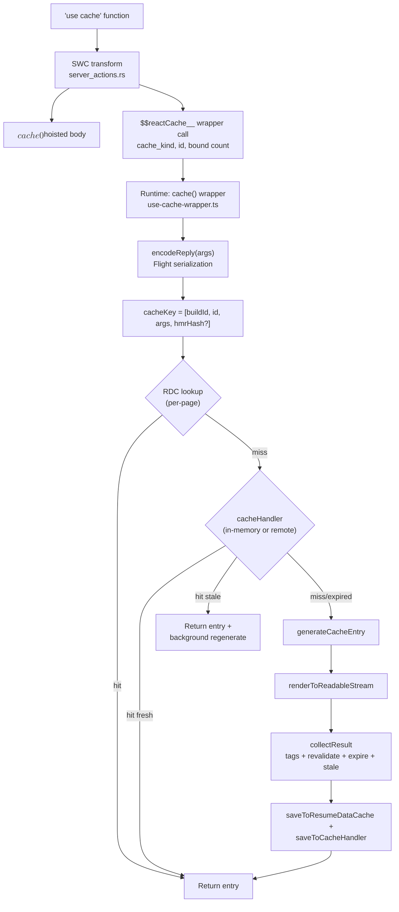

## Table of Contents

## 서론

```tsx
async function getProducts() {
  'use cache'
  const products = await db.products.findMany()
  return products
}
```

`'use cache'` 한 줄. 이걸 함수 본문 첫 줄에 적는 순간, 이 함수는 더 이상 일반 함수가 아니다. 호출 지점에서 즉시 실행되어 결과를 만드는 함수가 아니라, **캐시 핸들러에 키와 함께 위임되는 함수**가 된다. `useMemo`처럼 같은 컴포넌트 안의 메모이제이션도 아니고, `React.cache`처럼 한 요청 안의 dedup도 아니다. **요청이 끝나도 결과가 재사용될 수 있는 캐시 엔트리**다. 다만 캐시 키에는 buildId가 포함되므로, 새 deploy를 넘어서 같은 엔트리를 재사용하는 모델은 아니다 — 캐시는 "요청과 요청 사이"를 넘을 수 있지만, "빌드와 빌드 사이"를 안정적으로 넘는다고 가정해선 안 된다.

[지난 글에서 `'use server'`가](/2026/03/react-server-functions-deep-dive) 함수를 클라이언트가 호출 가능한 RPC 엔드포인트로 변환했고, [그 다음 글에서 `'use client'`가](/2026/05/use-client-deep-dive) 모듈을 클라이언트 번들 그래프의 진입점으로 변환했다. 이번 글은 디렉티브 3부작의 마지막이다. `'use cache'`가 함수를 **캐시 엔트리의 진입점**으로 변환하는 모든 단계를 따라간다. 빌드 타임에 SWC가 함수를 어떻게 다시 쓰는가, 런타임에 어떤 키가 만들어지는가, 캐시 핸들러는 무엇을 저장하는가, 그리고 `cacheLife`/`cacheTag`/`updateTag`가 그 위에서 어떻게 동작하는가까지.

용어 정리부터 한다.

- **`use cache` 디렉티브**: 함수, 컴포넌트, 또는 파일 전체를 캐시 가능하다고 표시하는 문자열 디렉티브. 세 가지 변형이 있다 — `'use cache'`, `'use cache: private'` (v16 기준 experimental), `'use cache: remote'`.
- **캐시 엔트리(Cache Entry)**: 캐시 키 하나에 매핑되는 결과물. 직렬화된 RSC payload(또는 일반 값), 그리고 `revalidate`/`expire`/`stale` 타이밍과 태그 메타데이터를 함께 담는다.
- **캐시 핸들러(Cache Handler)**: 엔트리를 실제로 저장/조회하는 백엔드. Next.js 기본 `'use cache'`는 in-memory 저장이며, `cacheHandlers` 설정으로 외부 핸들러로 바꿀 수 있다.
- **Resume Data Cache(RDC)**: Next.js 내부 구현에서 등장하는 렌더 단위의 in-process 캐시 계층. public API는 아니며, 같은 렌더 안에서 같은 캐시 함수를 두 번 호출했을 때 두 번째 호출이 cacheHandler를 거치지 않게 하는 역할이다. 이 글에서 RDC를 자주 언급하는 이유는 내부 흐름을 설명하기 위함이다.
- **Cache Components**: `cacheComponents: true` 설정. `'use cache'`의 활성 조건이자, PPR(Partial Prerendering)의 기반.

> 이 글의 소스 코드 분석은 **Next.js 16.2.4** 기준이다. `use cache`는 v15에서 experimental로 도입되어 v16에서 stable이 됐고, 그 사이 내부 구현이 여러 번 바뀌었다. `'use cache: private'`은 v16 시점에도 여전히 experimental이며, 이 글의 설명은 v16.2.4 시점 공식 문서를 기준으로 한다.

## 먼저 결론

내부 구현으로 들어가기 전에 실무 관점의 요약을 먼저 둔다. 길게 보지 않더라도 이 정도는 머리에 남기면 좋다.

- `'use cache'`는 `unstable_cache`의 문법 치환이 아니라 **Cache Components 모델로의 전환**이다. 단순히 디렉티브 한 줄로 바꾼다고 끝이 아니라, 페이지가 static / cached / dynamic 세 영역으로 쪼개지는 모델 위에서 동작한다.
- `cookies()`/`headers()`/`searchParams` 같은 **request-scoped 데이터는 직접 읽지 말고 인자로 빼서 전달**하는 것이 기본 패턴이다.
- `cacheLife`는 **항상 명시하는 편이 안전하다**. 명시하지 않으면 nested cache의 짧은 lifetime이 외부로 propagation될 수 있고, 빌드 시점 에러로 이어질 수 있다.
- `'use cache: private'`은 **서버 캐시가 아니라 브라우저 메모리 캐시**다. 서버에서는 매 렌더마다 함수가 실행되며, reload를 넘어서 유지되지 않는다.
- `'use cache: remote'`는 **공유 캐시가 명확히 필요할 때만** 쓴다. seconds 단위로 자주 바뀌는 데이터에 자동으로 정답이 되지는 않는다.
- 엔터프라이즈 앱의 핵심 업무 화면에서는 `'use cache'`를 넓게 쓰기 어렵다. 권한, 개인화, mutation, stale data 허용 범위 때문에 캐시 키와 무효화 설계가 급격히 복잡해진다. 이런 경우에는 프레임워크 캐시보다 API/BFF/DB/CDN 계층의 캐시가 더 통제 가능하다.

각 항목의 근거와 내부 동작이 본문이다.

## 언제 'use cache'를 붙일 것인가

| 상황                                                                       | 권장                                             |
| -------------------------------------------------------------------------- | ------------------------------------------------ |
| 공개 콘텐츠, 문서, FAQ, 약관, 공지                                         | `'use cache'`                                    |
| 상품/요금제/카탈로그처럼 여러 사용자가 공유하고 stale 허용 가능한 데이터   | `'use cache'`                                    |
| 국가/통화/은행 코드/정책 테이블 같은 reference data                        | `'use cache'` + 긴 `cacheLife`                   |
| MDX 변환, syntax highlighting, 리포트 집계처럼 deterministic하고 비싼 계산 | `'use cache'`                                    |
| tenant 단위 공통 설정처럼 key cardinality가 낮고 반복 조회되는 데이터      | `'use cache'`, 필요 시 tag 기반 무효화           |
| rate-limited API, 느린 backend, 비싼 외부 연산                             | `'use cache: remote'`                            |
| 컴플라이언스상 서버 저장 금지                                              | `'use cache: private'` (브라우저 메모리 캐시)    |
| 사용자별 승인함, 알림, 주문, 정산, 권한 메뉴                               | 기본적으로 캐시하지 않음                         |
| mutation 직후 read-your-own-writes가 중요한 화면                           | `updateTag` 설계가 명확할 때만 제한적으로 사용   |
| 매 요청 다른 값이 필요 (`crypto.randomUUID`, `Date.now`)                   | 캐시 밖으로 분리 (`connection()`로 dynamic 강제) |

이 표는 본문에서 다시 펼쳐 설명하지만, 실무 판단의 출발점은 이 정도면 충분하다.

## 그런데 엔터프라이즈 앱에서는 왜 잘 안 쓰는가

여기까지 보면 `'use cache'`는 꽤 강력해 보인다. 그런데 실제 엔터프라이즈 웹 애플리케이션에서는 이런 프레임워크 레벨 캐시를 적극적으로 쓰는 경우가 생각보다 많지 않다. 이유는 성능이 중요하지 않아서가 아니다. 엔터프라이즈 앱의 핵심 문제는 보통 "빠르게 보여주기"보다 "항상 권한, 상태, 정합성이 맞는 데이터를 보여주기"에 더 가깝기 때문이다.

`'use cache'`는 같은 cache key에 대해 같은 결과를 재사용하는 모델이다. 그런데 엔터프라이즈 앱의 많은 화면은 같은 URL, 같은 컴포넌트, 같은 props처럼 보여도 실제 결과가 다음 요소에 따라 달라진다.

- 사용자 권한
- 조직, 부서, 역할
- 세션 상태
- feature flag
- 계약 조건
- locale, currency
- 개인정보 마스킹 정책
- audit / compliance rule
- 방금 수행한 mutation 결과

이 차원들을 모두 캐시 키에 넣으면 key cardinality가 급격히 커진다. 반대로 일부를 빼면 권한 누수나 잘못된 데이터 노출이 발생할 수 있다. 결국 엔터프라이즈 앱에서 가장 무서운 캐시 버그는 stale data가 아니라 **권한이 다른 사용자에게 잘못된 결과가 보이는 것**이다.

예를 들어 주문 목록 화면이 다음 차원으로 달라진다고 해보자.

```txt
organizationId: 500개
role: 8개
region: 10개
status filter: 12개
page: 100개
sort: 6개
```

이론상 조합은 다음과 같다.

```txt
500 × 8 × 10 × 12 × 100 × 6 = 28,800,000
```

이런 캐시는 대부분 hit rate가 낮다. hit rate가 낮은 캐시는 성능 최적화가 아니라 복잡성만 늘리는 코드다.

또 하나의 문제는 mutation이다. 엔터프라이즈 앱에는 승인, 취소, 정산, 권한 변경, 사용자 초대, 계약 상태 변경 같은 작업이 많다. 이런 화면에서는 사용자가 방금 한 변경을 즉시 봐야 한다. `revalidateTag(tag, 'max')`처럼 stale 응답을 먼저 주고 백그라운드에서 갱신하는 방식은 블로그, 문서, 상품 카탈로그에는 적합하지만, 승인/정산/권한 화면에서는 운영 사고가 될 수 있다.

그래서 실무에서는 캐시를 안 쓰는 것이 아니라, 보통 더 통제 가능한 계층에서 쓴다.

| 계층                 | 주 사용처                       | 이유                           |
| -------------------- | ------------------------------- | ------------------------------ |
| CDN                  | 정적 asset, 공개 페이지, 이미지 | 가장 안전하고 효과가 큼        |
| API Gateway          | 공통 API 응답, rate limit       | 중앙 통제 가능                 |
| BFF / Backend        | 도메인 데이터                   | 권한·정합성 로직과 가까움      |
| Redis / Memcached    | 세션, 권한, expensive query     | 명시적 key 관리 가능           |
| DB materialized view | 리포트, 통계                    | 데이터 정합성 관리 쉬움        |
| Search index         | 검색/필터/목록                  | 질의 성능 최적화               |
| React Query / SWR    | 클라이언트 재요청 dedup         | 사용자 단위 캐시라 비교적 안전 |

즉 엔터프라이즈 앱에서 프레임워크 레벨 캐시는 전체 화면에 넓게 거는 도구라기보다, public-ish / low-volatility / low-risk 영역에 제한적으로 붙이는 도구에 가깝다. 프레임워크 캐시가 쓸모없어서가 아니라, 엔터프라이즈 도메인의 리스크 모델과 맞지 않는 경우가 많기 때문이다.

## 그래도 잘 맞는 영역은 분명히 있다

엔터프라이즈 CRUD/백오피스/권한 중심 앱만 보면 `'use cache'`는 쓸 일이 거의 없어 보이는 게 정상이다. 억지로 쓰면 대개 복잡성만 늘어난다. 다만 "쓸 일이 없다"가 아니라, **쓸 수 있는 영역이 생각보다 좁고 명확하다**. 적용 범위를 알면 같은 앱 안에서도 캐시가 정확히 효과를 내는 자리가 보인다.

대략 다음 조건을 만족하면 `'use cache'`가 유용하다.

```txt
1. 같은 입력이면 같은 출력이라고 말할 수 있다.
2. 캐시 키 cardinality가 낮다.
3. 여러 사용자가 같은 결과를 자주 본다.
4. stale data가 잠깐 보여도 사고가 아니다.
5. mutation 후 무효화 경로를 설명할 수 있다.
6. 원본 연산이 비싸거나 느리거나 rate limit이 있다.
7. 권한·개인정보·마스킹 정책과 거의 무관하다.
```

이 중 3~4개만 깨져도 안 쓰는 게 맞다. Next.js 공식 문서도 `'use cache'`를 데이터 레벨 함수 캐싱과 UI 레벨 컴포넌트/페이지 캐싱에 모두 쓸 수 있다고 설명하지만, fresh data가 매 요청 필요하면 `'use cache'`가 아니라 Suspense로 streaming하라고 분리한다. "모든 서버 데이터에 캐시를 걸라"는 모델이 아니다.

### 1. 공개 콘텐츠 / 문서 / 도움말 / 약관

가장 정석적인 케이스다. 공지사항, FAQ, 도움말, 약관, 개발자 문서, 블로그, 릴리즈 노트, 마케팅 페이지 — 권한 차이 거의 없음, 변경 빈도 낮음, 여러 사용자가 같은 내용을 봄, stale 허용 가능, 무효화 경로 명확함.

```tsx
import {cacheLife, cacheTag} from 'next/cache'

export async function getHelpArticles() {
  'use cache'
  cacheLife('hours')
  cacheTag('help-articles')
  return cms.getArticles()
}
```

CMS 호출을 줄이고, static shell에 포함시키기도 쉽다.

### 2. 상품 카탈로그 / 요금제 / 공개 reference data

엔터프라이즈 앱 안에도 이런 데이터는 있다 — 요금제 목록, 상품 카테고리, 수수료율 표, 지원 국가/통화 목록, 은행 코드, 카드 BIN 정보, 약관 버전, 공개 정책 테이블. "업무 데이터"처럼 보이지만 실제로는 **reference data**에 가깝다.

```tsx
export async function getSupportedBanks() {
  'use cache'
  cacheLife('days')
  cacheTag('supported-banks')

  return db.banks.findMany({
    where: {enabled: true},
    orderBy: {name: 'asc'},
  })
}
```

권한 영향이 작고, 변경 빈도가 낮고, 여러 화면에서 반복 사용된다. 잘 맞는다.

### 3. 비싼 deterministic 계산

DB보다 서버 계산이 비싼 경우가 있다. MDX/Markdown 변환, syntax highlighting, 문서 목차 생성, facet 계산, 권한 무관 통계 카드, 리포트 요약.

```tsx
export async function renderMarkdown(slug: string) {
  'use cache'
  cacheLife('weeks')
  cacheTag(`doc-${slug}`)

  const source = await cms.getMarkdown(slug)
  return compileMDX(source)
}
```

입력이 `slug`로 작고, 결과가 deterministic하며, 연산이 비싸다. 캐시의 본래 목적에 가장 잘 맞는 케이스다.

### 4. 여러 컴포넌트가 공유하는 같은 데이터

같은 데이터가 여러 컴포넌트에서 반복 호출되거나, UI와 독립적으로 캐시하고 싶을 때 유용하다.

```tsx
export async function getServiceConfig(serviceId: string) {
  'use cache'
  cacheLife('hours')
  cacheTag(`service-config-${serviceId}`)

  return db.serviceConfig.findUnique({where: {serviceId}})
}
```

여기서 중요한 건 `serviceId`가 권한 차원을 대표할 수 있어야 한다는 점이다. `userId`까지 들어가야 하는 순간 캐시 효율은 급격히 떨어진다.

### 5. static shell 안의 cached island

이게 Cache Components 모델에서 가장 의도에 가까운 사용처다. **전체 페이지를 캐시하는 게 아니라, 안전한 island만 캐시한다.**

```tsx
export default function Page() {
  return (
    <>
      <CachedProductSummary productId="abc" />

      <Suspense fallback={<Skeleton />}>
        <UserSpecificPurchaseHistory />
      </Suspense>
    </>
  )
}

async function CachedProductSummary({productId}: {productId: string}) {
  'use cache'
  cacheLife('hours')

  const product = await getProduct(productId)
  return <ProductSummary product={product} />
}
```

엔터프라이즈 앱에서도 적용 가능하다.

| 캐시 가능                        | 캐시 금지         |
| -------------------------------- | ----------------- |
| 공통 안내 영역                   | 내 승인 대기 건수 |
| 상품 설명, 정책 설명             | 내 권한 메뉴      |
| 문서 링크                        | 내 정산 금액      |
| 비권한성 통계 / 서비스 상태 요약 | 내 고객 목록      |

같은 페이지 안에서도 절반은 캐시되고 절반은 dynamic이 되는 — 그게 PPR의 그림이다.

### 6. upstream 보호가 필요한 외부 호출

`'use cache: remote'`의 본 영역이다. 외부 CMS rate limit이 빡세거나, 외부 API 호출 비용이 크거나, DB 집계 쿼리가 비싸거나, 서버리스 인스턴스가 많아 in-memory hit rate가 낮을 때.

```tsx
export async function getExchangeRate(base: string, quote: string) {
  'use cache: remote'
  cacheLife({revalidate: 60 * 10, expire: 60 * 60})
  cacheTag(`exchange-rate-${base}-${quote}`)

  return externalRateApi.getRate(base, quote)
}
```

> 단, 도메인 맥락에 주의해야 한다. 금융 도메인의 "실거래 환율"이라면 캐시는 위험하다 — 가격이 한 박자라도 어긋나면 운영 사고로 직결된다. 같은 엔드포인트라도 "참고용 고시 환율" 용도라면 캐시가 가능성 있다. 같은 데이터가 어떤 화면에 어떤 의미로 쓰이는지가 캐시 가능 여부를 결정한다.

### 7. tenant 단위로 반복 조회되는 데이터

완전 개인화 데이터는 캐시하기 어렵지만, **tenant 단위 데이터는 가능할 수 있다**. tenant 수가 제한적이고 (key cardinality 낮음), tenant 안의 많은 사용자가 같은 결과를 보기 때문이다.

```tsx
export async function getTenantTheme(tenantId: string) {
  'use cache'
  cacheLife('hours')
  cacheTag(`tenant-theme-${tenantId}`)

  return db.tenantTheme.findUnique({where: {tenantId}})
}
```

tenantId별 테마 설정, tenantId별 공개 상품 목록, tenantId별 약관, tenantId별 feature availability, tenantId별 온보딩 문구 — `userId` 단위로 쪼갠 캐시보다 훨씬 낫다.

### 빠른 의사결정 표

각 절을 다 안 읽어도 다음 질문 한 번이면 거의 결정된다.

| 질문                                                 | 답이 YES면         |
| ---------------------------------------------------- | ------------------ |
| 이 결과를 여러 사용자가 공유해서 보는가?             | `'use cache'` 후보 |
| 권한 없이 공개해도 되는가?                           | 강한 후보          |
| stale이 1~10분 보여도 괜찮은가?                      | 강한 후보          |
| key 조합이 작고 반복되는가?                          | 강한 후보          |
| 원본 연산이 비싼가?                                  | 강한 후보          |
| mutation 후 날릴 tag를 명확히 말할 수 있는가?        | 사용 가능          |
| `userId`/session/permission이 key에 들어가야 하는가? | 대체로 비추천      |
| stale이 운영 사고가 되는가?                          | 쓰지 말 것         |

### 한 문장으로

`'use cache'`는 **업무 데이터 캐시 도구**라기보다, **공유 가능하고 변동성이 낮은 서버 결과를 static shell 또는 runtime cache에 편입시키는 도구**다. 그래서 일반적인 엔터프라이즈 CRUD 앱에서는 쓸 일이 적어 보이는 게 맞다. 하지만 같은 앱 안의 문서·공지·약관·도움말, 설정성 reference data, 상품/요금제 카탈로그, 비싼 deterministic 계산, tenant 단위 공통 설정, stale 허용 가능한 통계, rate limit 있는 외부 API 결과 — 이런 영역에서는 충분히 잘 맞는다.

핵심은 이거다. **"이 데이터를 캐시할 수 있나?"가 아니라 "이 결과를 공유해도 되는가?"부터 묻는다.**

## 'use cache'는 메모이제이션 마커가 아니다

가장 먼저 짚어야 할 오해가 있다. "`'use cache'`는 `useMemo`나 `React.cache`의 서버 버전 아닌가?"라는 생각이다. 결과만 놓고 보면 비슷해 보인다 — 같은 입력에는 같은 출력을 주고, 두 번째 호출은 빠르다. 하지만 동작 모델이 완전히 다르다.

세 도구의 스코프와 키 생성 방식을 비교해보자.

| 도구                | 스코프                    | 키 생성                             | 저장 위치              | 수명                                                |
| ------------------- | ------------------------- | ----------------------------------- | ---------------------- | --------------------------------------------------- |
| `useMemo(fn, deps)` | 한 컴포넌트 인스턴스      | 의존성 배열의 참조 동등성           | React fiber            | 컴포넌트가 살아있는 동안                            |
| `React.cache(fn)`   | 한 요청(server)           | 인자의 참조 동등성 (Map 기반)       | request-scoped storage | 요청이 끝나면 폐기                                  |
| `'use cache'`       | 빌드 산출물 + 런타임 모두 | **인자 직렬화 + 함수 ID + 빌드 ID** | RDC + cacheHandler     | `revalidate`/`expire` + buildId. 새 deploy면 무효화 |

차이의 핵심은 두 가지다.

**첫째, 키 도메인이 다르다.** `useMemo`/`React.cache`는 자바스크립트 객체 참조로 비교한다. 같은 인자라도 객체가 새로 생성되면 캐시 미스다. `'use cache'`는 인자를 **직렬화한 후** 해시로 비교한다. `{id: 1}`을 두 번 만들어 넘겨도 같은 키다.

**둘째, 수명이 다르다.** `useMemo`는 컴포넌트 unmount와 함께 사라지고, `React.cache`는 응답이 끝나면 사라진다. `'use cache'`는 cacheHandler가 정한 만큼 산다 — 기본 in-memory 저장은 self-hosted 환경이라면 요청 사이에 유지될 수 있지만, serverless 환경에서는 인스턴스 교체·메모리 제약·eviction의 영향을 받는다. 외부 cache handler(`use cache: remote` 또는 `cacheHandlers` 설정)를 쓰면 인스턴스 간 공유와 지속성을 얻는 대신 네트워크 왕복과 비용이 추가된다. 단, **새 deploy에서는 buildId가 바뀌어 이전 캐시 엔트리를 hit하지 않는다** — 같은 함수로 같은 인자를 호출해도 키가 달라지므로 사실상 무효화된다.

이 두 차이가 다른 모든 차이의 뿌리다. 직렬화 가능한 인자만 받을 수 있는 것도, `cookies()`/`headers()`를 직접 호출할 수 없는 것도, 클로저 변수가 자동으로 키에 포함되는 것도, 모두 "프로세스를 넘나드는 키-값 저장소에 안전하게 저장 가능한 함수"라는 모델에서 따라 나온다.

다시 말해 `'use cache'`는 **함수 호출을 캐시 엔트리 lookup으로 치환**하는 마커다. 같은 cache key로 다시 호출되면, 엔트리가 fresh 또는 stale로 사용 가능한 한 본문을 다시 실행하지 않고 캐시 계층에서 응답한다. 이 치환을 빌드 타임에 코드로 박아넣는 것이 SWC의 일이다.

## 빌드 타임 변환: SWC가 함수를 다시 쓴다

`'use cache'`를 만나면 Next.js는 함수를 그대로 두지 않는다. SWC[^1]가 함수를 캐시 래퍼 호출로 다시 쓴다. 이 변환은 `'use server'`가 함수를 server reference로 바꾸는 것과 동일한 파이프라인(`server_actions.rs`)을 공유한다.

원본:

```tsx
// app/products/data.ts
async function getProducts(filter: string) {
  'use cache'
  return db.products.findMany({where: {filter}})
}
```

SWC가 변환한 모양 (개념적으로):

```tsx
// $$cache0$$는 hoisted된 원본 본문
async function $$cache0$$([], filter) {
  return db.products.findMany({where: {filter}})
}

// 원본 위치는 래퍼 호출로 치환
const getProducts = $$reactCache__(
  'default', // cache_kind
  '<sha1-of-file-export>', // function ID
  0, // bound arg count
  $$cache0$$,
)
```

핵심은 네 가지다.

**1. 함수 본문이 hoist된다.** 원본 함수 본문은 모듈 최상위로 끌어올려져 별도의 익명 함수가 된다. 이건 `'use server'`의 처리와 같은 패턴이다.

**2. 첫 번째 인자는 항상 bound args 배열이다.** 클로저로 참조하던 외부 변수가 있으면, SWC는 그것을 추출해서 첫 번째 배열 인자로 넘긴다. 이게 [공식 문서가 말하는](https://nextjs.org/docs/app/api-reference/directives/use-cache#cache-keys) "closure variables become part of the cache key"의 실체다. 클로저는 마법이 아니라 SWC가 컴파일 타임에 명시적인 인자로 끌어내는 변환이다.

```tsx
// 원본
async function Component({userId}: {userId: string}) {
  const getData = async (filter: string) => {
    'use cache'
    return fetch(`/api/users/${userId}/data?filter=${filter}`)
  }
  return getData('active')
}

// 변환 후 (개념적)
async function $$cache0$$([userId], filter) {
  return fetch(`/api/users/${userId}/data?filter=${filter}`)
}

async function Component({userId}) {
  const getData = $$reactCache__('default', '<id>', 1, $$cache0$$, userId)
  //                                              └─ bound count: userId 하나
  return getData('active')
}
```

`userId`는 클로저로 잡혀있던 변수지만, 변환 후에는 `$$cache0$$`의 첫 번째 인자(bound array)에 들어간다. 캐시 키 입장에서는 다른 인자와 똑같이 직렬화되어 해시에 포함된다.

**3. 함수 ID는 함수의 위치·시그니처에 묶인 secure hash다.** Next.js v16.2.4 소스 기준, SWC의 `generate_server_reference_id`[^2]는 hash salt + 파일명 + export/reference name을 SHA1로 묶고, 캐시 함수 여부와 인자 사용 정보(argument mask)를 담은 바이트를 ID에 포함한다. 같은 함수라도 파일이 바뀌거나 export 이름이 바뀌면 다른 ID가 된다. 다만 **deploy 단위의 전체 무효화는 함수 ID가 아니라 캐시 키에 포함된 buildId가 담당**한다 — 코드 변경 → 새 빌드 → 새 buildId → 모든 엔트리 미스, 가 정상 흐름이다.

**4. cache_kind가 같이 박힌다.** `'use cache'`는 `'default'`로, `'use cache: private'`은 `'private'`으로, `'use cache: remote'`는 `'remote'`로 변환된다. 이 문자열이 런타임 래퍼의 분기 키다.

### 파일 레벨 vs 함수 레벨

`'use cache'`는 파일 맨 위에도, 함수 본문 첫 줄에도 둘 수 있다. 두 위치는 동일한 SWC 패스가 처리하지만 결과는 다르다.

```tsx
// 파일 레벨
'use cache'

export async function getA() {
  return ...
}
export async function getB() {
  return ...
}
```

파일 레벨이면 **모든 export 함수가 개별적으로 래핑된다**. 단, 제약이 하나 있다 — 모든 export는 async function이어야 한다. 동기 함수가 섞여있으면 SWC가 에러를 던진다. 이유는 단순하다. 캐시 lookup은 본질적으로 비동기(IO)이고, 캐시 미스 시 generateCacheEntry는 결과를 얻기 위해 await가 필요하다.

```tsx
// 함수 레벨
export async function getA() {
  'use cache'
  return ...
}

export async function getB() {
  // 이 함수는 캐시되지 않음
  return ...
}
```

함수 레벨이면 그 함수만 래핑된다. 같은 파일 안에서 캐시되는 함수와 안 되는 함수를 섞을 수 있다.

### `'use cache: private'`과 `'use cache: remote'`

세 가지 변형은 `cache_kind` 문자열만 다르고 SWC 변환 자체는 같다. 차이는 런타임 래퍼가 받는 분기 인자와, 그 분기가 만드는 저장 모델이다.

```tsx
async function getRecommendations(productId: string) {
  'use cache: private'
  cacheLife({stale: 60})
  const sessionId = (await cookies()).get('session-id')?.value || 'guest'
  return getPersonalizedRecommendations(productId, sessionId)
}
```

`private`은 `cookies()`/`headers()`/`searchParams`를 허용하는 유일한 변형이다. 그러나 **결과는 서버에 저장되지 않는다**. 공식 문서는 이 동작을 명확히 정의한다 — "results are never stored on the server, they're cached only in the browser's memory and do not persist across page reloads". 즉 서버 측 dedup 효과는 없다. **이 함수는 매 서버 렌더마다 실행**되고, static shell 생성에서도 제외된다. 그 결과를 클라이언트가 browser memory에 보관해서 같은 페이지의 같은 컴포넌트가 reload 없이 재방문될 때 재사용할 뿐이다.

게다가 `'use cache: private'`은 **custom cache handler를 설정할 수 없다**. Route Handler에서도 사용 불가다. v16 시점 experimental 상태이며, 의존하는 runtime prefetching 자체가 stable이 아니다. 컴플라이언스 요구사항이나, request 데이터를 인자로 빼기가 정말 어려운 레거시 코드에 한정해 쓰는 도구다.

> `private`이라는 이름이 "사적인 캐시"가 아니라 "공유 불가능한 캐시"를 뜻한다고 읽는 편이 정확하다. 다른 사용자가 못 보는 게 아니라 — 애초에 서버에 저장되지 않는다.

따라서 `private`은 서버 부하를 줄이는 캐시라기보다, runtime prefetching과 클라이언트 라우터 재방문 최적화에 가깝다. **서버 함수 실행을 줄이는 도구로 보면 안 된다** — 매 서버 렌더마다 본문이 그대로 실행된다.

```tsx
async function getProductPrice(productId: string, currency: string) {
  'use cache: remote'
  cacheTag(`product-price-${productId}`)
  cacheLife({expire: 3600})
  return db.products.getPrice(productId, currency)
}
```

`remote`는 반대로 **서버 측 외부 캐시 핸들러에 저장**된다 — 모든 인스턴스가 공유하는 durable cache다. 공식 문서는 remote의 사용 동기를 명확히 좁힌다.

- Rate-limited APIs (upstream에 호출 한도가 있는 경우)
- Slow backends (DB가 트래픽에 병목이 되는 경우)
- Expensive operations (반복하기 비싼 쿼리/연산)
- Flaky services (가끔 실패하는 외부 서비스)

같은 문서가 **피해야 하는 경우**도 명시한다.

- 이미 데이터 계층 앞에 KV store가 있어 `'use cache'`로 충분한 경우
- 50ms 미만 빠른 연산
- 캐시 키가 거의 매 요청마다 unique한 경우 (검색 필터, 가격 범위, 사용자별 파라미터)
- **데이터가 seconds~minutes 단위로 자주 바뀌는 경우** — 캐시 hit이 곧 stale이 되어 이득이 작다

이 마지막 항목이 중요하다. "서버리스에서 짧은 TTL은 remote가 정답"으로 단순화하면 안 된다. remote의 가치는 짧은 TTL 자체가 아니라 **공유**에 있다 — 공유했을 때 의미 있는 작업(rate limit 회피, upstream 보호)이 있을 때 효과가 난다.

기본 `'use cache'`는 in-memory 저장과 RDC를 함께 쓴다. static shell 생성과 일반 데이터 캐싱의 기본값이며, 가장 흔한 케이스다. 세 변형의 저장 모델 차이를 표로 정리하면:

| 변형                   | 서버 저장                    | 클라이언트 저장       | request API 직접 접근 | 공유 범위          |
| ---------------------- | ---------------------------- | --------------------- | --------------------- | ------------------ |
| `'use cache'`          | in-memory 또는 cache handler | router prefetch cache | 불가 (인자로 추출)    | 모든 사용자가 공유 |
| `'use cache: remote'`  | remote cache handler         | router prefetch cache | 불가 (인자로 추출)    | 모든 사용자가 공유 |
| `'use cache: private'` | **저장 안 함**               | 브라우저 메모리       | 가능                  | 클라이언트 본인    |

세 변형은 중첩(nesting) 규칙도 다르다.

- `remote` 안에 `remote`는 **가능**하다.
- 기본 `'use cache'` 안에 `remote`도 **가능**하다 (request 타임에 deferred되면 inner remote가 동작한다).
- `private` 안에 `remote`는 **불가능**하다.
- `remote` 안에 `private`도 **불가능**하다.

이 규칙은 저장 위치가 섞일 때 생기는 일관성 문제를 피하기 위한 제약이다. 특히 `private`은 브라우저 메모리 캐시이고 `remote`는 서버 측 공유 캐시이므로, 두 경계를 한 호출 트리 안에 섞으면 의미가 모호해진다. nesting 위반은 빌드 시점에 에러가 난다.

## 런타임: 캐시 래퍼가 무엇을 하는가

빌드 타임에 박힌 `$$reactCache__`는 결국 `packages/next/src/server/use-cache/use-cache-wrapper.ts`[^3]의 `cache()` 함수를 가리킨다. 이 함수가 **모든 `'use cache'` 호출이 통과하는 단일 진입점**이다.

흐름은 이렇다.

```
1. 인자 직렬화 → encodeReply (Flight)
2. 캐시 키 구성 → [buildId, id, args, hmrRefreshHash?]
3. ResumeDataCache(RDC) 조회
4. (없으면) cacheHandler 조회
5. (없으면) generateCacheEntry로 본문 실행
6. stale-while-revalidate: 만료됐으면 백그라운드 재생성
7. 결과 반환 + RDC/cacheHandler에 저장
```

각 단계를 풀어본다.

### 캐시 키 구성

코드의 핵심 한 줄[^3]은 다음과 같다.

```tsx
const cacheKeyParts: CacheKeyParts = hmrRefreshHash
  ? [buildId, id, args, hmrRefreshHash]
  : [buildId, id, args]
```

네 가지 요소를 보자.

- **buildId**: Next.js 빌드마다 새로 생성되는 ID. 다음 deploy에서 모든 캐시가 자동으로 무효화되는 이유다.
- **id**: SWC가 박아넣은 SHA1 함수 ID. 같은 코드의 같은 함수면 같은 ID, 함수가 옮겨지거나 이름이 바뀌면 다른 ID.
- **args**: 호출 시점의 인자 배열. 첫 번째 원소는 SWC가 추출한 bound args, 나머지는 호출 시 인자.
- **hmrRefreshHash**: dev 모드에서만 존재. HMR이 일어날 때마다 갱신되는 해시. 코드를 고치면 캐시가 자동으로 무효화되어 옛 결과가 stale하게 남지 않는다.

이 네 요소를 합쳐 직렬화하고 해시한 것이 최종 캐시 키다.

### 인자 직렬화: encodeReply

`args`를 그대로 키로 쓸 수는 없다. 객체 참조로는 비교가 안 되니까 직렬화가 필요하다. Next.js는 React의 `encodeReply`[^4]를 그대로 사용한다 — `'use server'`가 클라이언트에서 서버로 인자를 보낼 때 쓰는 그 함수다.

```tsx
import {encodeReply} from 'react-server-dom-webpack/client.edge'

const encodedArgs = await encodeReply(args)
```

`encodeReply`는 React의 Flight 직렬화기다. JSON보다 강력해서 다음을 지원한다.

- 원시값: `string`, `number`, `boolean`, `null`, `undefined`
- 일반 객체와 배열
- `Date`, `Map`, `Set`, `BigInt`, `TypedArray`, `ArrayBuffer`, `FormData`
- React element (pass-through 한정)

지원 안 되는 것:

- 클래스 인스턴스 (메서드 + 프로토타입을 직렬화 못 함)
- 일반 함수 (서버 함수 reference는 OK, pass-through 한정)
- `Symbol`, `WeakMap`, `WeakSet`
- `URL` 인스턴스 (의외다 — 문자열로 바꿔서 넘겨야 한다)

직렬화 결과는 보통 `FormData`가 된다. 키로 쓸 문자열로 만들기 위해 한 단계 더 정규화한다 — `encodeFormData`가 각 필드를 길이 prefix로 묶어 단일 문자열로 직렬화한다. 이렇게 만든 결과를 buildId/id와 함께 해시하면 최종 캐시 키가 된다.

> **인자와 리턴값의 직렬화기는 다르다.** 인자는 Server Component serialization (엄격), 리턴값은 Client Component serialization (JSX 허용). 이 비대칭 때문에 **JSX는 인자로는 받을 수 없지만 리턴값으로는 가능**하다. pass-through로 받는 `children` prop은 직렬화하지 않는 우회로다 — 본문에서 introspect하지 않는 한 그대로 출력에 끼워넣을 수 있다.

### 두 단계 lookup: RDC → cacheHandler

키가 만들어지면 lookup이 시작된다. 기본 `'use cache'`의 흐름은 다음과 같다 (RDC는 내부 구현 명칭이며 public API가 아님을 다시 짚어둔다).

```tsx
// 1단계: Resume Data Cache (페이지 렌더 단위 in-process)
const cached = lookupResumeDataCache(prerenderResumeDataCache, serializedKey)
if (cached) return cached

// 2단계: cacheHandler (in-memory 또는 외부 핸들러)
if (cacheHandler) {
  const entry = await cacheHandler.get(serializedKey)
  if (entry && !shouldDiscardCacheEntry(entry)) {
    return entry
  }
}

// 3단계: 둘 다 미스 → 본문 실행
return generateCacheEntry(...)
```

**RDC**는 한 페이지 렌더 동안만 살아있는 in-process Map이다. 같은 캐시 함수가 한 페이지 안에서 여러 번 호출되면, RDC가 첫 호출 결과를 두 번째부터 즉시 돌려준다. cacheHandler 호출조차 일어나지 않는다.

**cacheHandler**는 요청을 넘어 사용되는 캐시다. 기본 구현은 in-memory 저장이며, `next.config.ts`의 `cacheHandlers` 옵션으로 외부 핸들러로 갈아끼울 수 있다.

```ts
// next.config.ts
const config = {
  cacheComponents: true,
  cacheHandlers: {
    default: require.resolve('./cache-handler.js'),
  },
}
```

세 변형이 이 흐름과 어떻게 다른지 정리하면.

- 기본 `'use cache'`는 RDC와 cacheHandler를 모두 사용한다.
- `'use cache: remote'`는 platform이 제공하는 remote 핸들러를 사용한다 (custom handler도 `cacheHandlers`로 설정 가능).
- `'use cache: private'`은 위 흐름을 거의 타지 않는다. 서버 cacheHandler에 저장되지 않고, 매 서버 렌더마다 본문이 실행된다. 결과는 서버 응답을 통해 클라이언트의 브라우저 메모리 캐시로 흘러가 한 세션 안에서만 재사용된다.

### 엔트리 생성: generateCacheEntryImpl

미스가 나면 본문을 실행해야 한다. 그냥 `await fn(...args)`로 끝나면 좋겠지만 — 안 그렇다.

```tsx
async function generateCacheEntryImpl(...) {
  const isPrerender = workStore.isPrerender

  const stream = isPrerender
    ? await prerender(/* 50초 timeout */)
    : await renderToReadableStream(/* dynamic */)

  const {revalidate, expire, stale, tags} = await collectResult(stream)

  return {stream, revalidate, expire, stale, tags, timestamp: Date.now()}
}
```

핵심은 두 가지다.

**1. 본문 실행은 RSC 스트림을 만든다.** 캐시 함수의 리턴값은 React element일 수 있어야 하므로(컴포넌트로도 쓰니까), 일반 값이든 JSX든 `renderToReadableStream`을 통과해 Flight payload 스트림이 된다. 캐시에 저장되는 건 이 스트림이다 — 다음 호출은 스트림을 재생(replay)해 같은 React 노드를 만들어낸다.

**2. 메타데이터를 같이 수집한다.** 본문이 실행되는 동안 `cacheLife()`/`cacheTag()` 호출이 있을 수 있다. 이 호출들은 ALS(AsyncLocalStorage) 기반의 `workUnitStore`에 값을 누적한다. 본문 실행이 끝난 뒤 `collectResult`가 그 값을 모아 엔트리에 같이 묶는다.

prerender 모드에서는 50초 타임아웃이 걸린다. 이 안에 끝나지 않으면 빌드가 hang했다는 뜻이다. 보통 원인은 — `cookies()` 같은 런타임 데이터를 캐시 함수가 await하고 있어서 빌드 타임에는 영원히 resolve되지 않는 경우다. 후반부 [함정 절](#함정들)에서 다시 다룬다.

### Stale-while-revalidate

엔트리에는 `revalidate`와 `expire`가 함께 저장된다. 다음 호출에서 두 값이 어떻게 작동하는지가 SWR의 핵심이다.

```tsx
const age = Date.now() - entry.timestamp

if (age < entry.revalidate * 1000) {
  // fresh: 그대로 반환
  return entry
}

if (age < entry.expire * 1000) {
  // stale: 캐시를 즉시 반환하면서 백그라운드 재생성
  void generateCacheEntry({skipPropagation: true, ...})
  return entry
}

// expired: 동기적으로 다시 생성 후 반환
return await generateCacheEntry(...)
```

세 구간이 있다.

- **fresh** (`age < revalidate`): 캐시가 그대로 응답.
- **stale** (`revalidate ≤ age < expire`): 캐시를 응답하되, 백그라운드에서 재생성을 트리거. 이 사이 다음 호출들은 새 엔트리를 받는다.
- **expired** (`age ≥ expire`): 캐시를 못 쓴다. 동기적으로 재생성 후 응답.

`skipPropagation: true`는 백그라운드 재생성에서 외부 cache로 메타데이터(태그/revalidate)가 다시 propagate되지 않게 막는 플래그다 — 첫 번째 생성 때 이미 propagate됐으니까 중복하지 않는다.

## cacheLife: 7개 빌트인 프로필

`revalidate`/`expire`/`stale` 세 숫자는 어디서 오는가? 디폴트는 `default` 프로필이고, `cacheLife()`를 부르면 다른 프로필로 바뀐다.

| 프로필    | 용도              | `stale` (client) | `revalidate` (server) | `expire` |
| --------- | ----------------- | ---------------- | --------------------- | -------- |
| `default` | 일반 콘텐츠       | 5분              | 15분                  | 무한     |
| `seconds` | 실시간 데이터     | 30초             | 1초                   | 1분      |
| `minutes` | 분 단위 갱신      | 5분              | 1분                   | 1시간    |
| `hours`   | 하루 여러 번 갱신 | 5분              | 1시간                 | 1일      |
| `days`    | 일 단위 갱신      | 5분              | 1일                   | 1주      |
| `weeks`   | 주 단위 갱신      | 5분              | 1주                   | 30일     |
| `max`     | 거의 안 바뀜      | 5분              | 30일                  | 1년      |

세 숫자의 의미는 각각 다르다.

- **`stale`**: 클라이언트 라우터가 서버에 안 물어보고 그대로 보여줄 시간. 응답의 `x-nextjs-stale-time` 헤더로 클라이언트에 전달된다. **30초 미만은 강제로 30초로 올라간다** — prefetch된 링크가 사용자 클릭 전에 만료되지 않게 막는 안전장치다.
- **`revalidate`**: 서버 캐시가 fresh로 보일 시간. 이 시간이 지나면 SWR이 발동한다.
- **`expire`**: 더 이상 stale도 아닌 시간. 이 시간이 지나면 동기적으로 재생성된다.

> `stale`이 5분으로 동일한 게 의외인데, 이유가 있다. `stale`은 클라이언트 라우터의 prefetch 캐시 유지 시간이다. 서버 데이터 갱신 주기(`revalidate`)와 별개다. 사용자 네비게이션 패턴에 맞춘 값이라 콘텐츠 갱신 빈도와 무관하게 5분이 합리적이다.

### 인라인 프로필

프리셋이 안 맞으면 객체로 직접 넘긴다.

```tsx
async function getOffer() {
  'use cache'
  cacheLife({
    stale: 60, // 1분
    revalidate: 300, // 5분
    expire: 3600, // 1시간
  })
  return db.offers.findFirst()
}
```

`expire`는 반드시 `revalidate`보다 커야 한다. 아니면 빌드 시점에 에러가 난다. 빈 객체 `cacheLife({})`는 `default` 값을 쓴다.

### 커스텀 프로필

`next.config.ts`에서 이름을 만들어 둘 수 있다.

```ts
const config = {
  cacheComponents: true,
  cacheLife: {
    biweekly: {
      stale: 60 * 60 * 24 * 14,
      revalidate: 60 * 60 * 24,
      expire: 60 * 60 * 24 * 14,
    },
  },
}
```

이걸로 `cacheLife('biweekly')` 호출이 가능해진다. 빌트인 이름과 같은 이름을 쓰면 빌트인을 덮어쓴다 — `days`를 재정의하고 싶으면 `cacheLife: {days: {...}}`를 두면 된다.

### Nested cacheLife: 누가 이기는가

캐시 함수 안에서 다른 캐시 함수를 부르면, 외부 cacheLife와 내부 cacheLife가 충돌할 수 있다. 룰이 미묘하다.

**외부에 명시적 `cacheLife`가 있는 경우 — 외부가 이긴다.** 내부 lifetime이 더 짧든 길든 외부가 우선한다.

```tsx
async function Dashboard() {
  'use cache'
  cacheLife('hours') // 외부 명시 → 1시간

  return <Widget /> // Widget이 'minutes'(5분)이라도 Dashboard 캐시는 1시간
}
```

이유는 단순하다. 외부 캐시 엔트리가 hit되면 **내부 결과까지 포함한 통째 output**이 그대로 반환된다. 내부 캐시 함수는 호출되지도 않으므로 내부 lifetime은 외부 hit 동안 관측되지 않는다. 외부가 1시간 동안 fresh로 살면, 그 1시간 동안 내부의 5분 lifetime은 의미가 없다.

**외부에 명시적 `cacheLife`가 없는 경우 — 내부가 외부의 default를 깎을 수 있다.**

```tsx
async function Dashboard() {
  'use cache'
  // cacheLife 없음 → default (15분)

  return <Widget /> // Widget이 'minutes' 5분이면, Dashboard도 5분으로 깎임
}
```

명시적 호출이 없으면 외부는 default 프로필(15분)을 사용한다. 그러나 내부 cache의 lifetime이 그보다 짧으면 외부 default lifetime이 그 값으로 줄어든다. 반대 방향(내부가 길다고 외부를 늘리기)은 일어나지 않는다 — default 15분이 유지된다.

이 동작이 내부 구현에서 어떻게 일어나는지 보면, ALS의 `workUnitStore` 변수에 minimum propagation이 적용되어 있다. 단 이 minimum 룰은 **외부에 명시적 `cacheLife`가 없을 때만** 의미가 있다. 외부에 명시 호출이 있으면 propagation이 발동해도 외부 lifetime이 우선하도록 처리된다.

```tsx
// 단순화한 propagation 의도
if (outerStore.hasExplicitCacheLife) {
  // 외부 명시 — propagation 무시
} else if (innerStore.explicitRevalidate < outerStore.implicitRevalidate) {
  outerStore.implicitRevalidate = innerStore.explicitRevalidate
}
```

따라서 실무 권장은 — **모든 캐시 함수에 `cacheLife`를 명시하라**. 명시하면 외부가 자기 값을 지키고, nested의 짧은 lifetime이 의도치 않게 흘러내리는 일이 없다.

### 짧은 nested cache의 prerender 에러

`revalidate`이 5분 미만이거나 0이면, Next.js는 그 캐시를 prerender에서 제외한다. 대신 **dynamic hole**이 된다 — 빌드 타임이 아니라 요청 타임에 채워진다. `seconds` 프로필이 자동으로 dynamic이 되는 이유다.

문제는 짧은 캐시가 다른 캐시 안에 nested됐을 때다.

```tsx
async function ShortLivedWidget() {
  'use cache'
  cacheLife('seconds') // 1초마다 갱신
  return <div>{await fetchRealtimeData()}</div>
}

async function Page() {
  'use cache'
  // cacheLife 없음 → 위의 propagation 룰로 outer도 'seconds'가 됨
  return (
    <div>
      <h1>Dashboard</h1>
      <ShortLivedWidget />
    </div>
  )
}
```

이 코드는 빌드 시 에러를 던진다. 이유는 — outer Page도 dynamic hole로 흘러내리는데, 이게 의도인지 실수인지 모르기 때문이다. Next.js가 안전을 위해 명시를 강제한다.

해결 방법은 두 가지다.

**(a) outer를 명시적으로 길게 만든다 (outer는 prerender 유지):**

```tsx
async function Page() {
  'use cache'
  cacheLife('default') // 명시 → propagation 차단
  return (
    <div>
      <h1>Dashboard</h1>
      <ShortLivedWidget /> {/* dynamic hole */}
    </div>
  )
}
```

**(b) outer도 명시적으로 짧게 만든다 + Suspense:**

```tsx
async function Content() {
  'use cache' // 또는 환경에 따라 'use cache: remote'
  cacheLife('seconds')
  return <ShortLivedWidget />
}

export default function Page() {
  return (
    <Suspense fallback={<p>Loading...</p>}>
      <Content />
    </Suspense>
  )
}
```

여기서 `'use cache'`와 `'use cache: remote'`의 선택은 환경에 따라 갈린다. self-hosted라면 in-memory 저장이 요청 사이에 유지되므로 `'use cache'`로도 dedup이 일어난다. serverless에서는 인스턴스가 매번 다를 수 있어 in-memory 저장의 hit rate가 낮고, 인스턴스 간 공유가 의미를 주는 시나리오라면 `'use cache: remote'`가 후보가 된다. 단 [앞서 봤듯이](#use-cache-private과-use-cache-remote) 데이터가 1초 단위로 자주 바뀌면 remote도 hit이 곧 stale이 되어 이득이 작을 수 있으므로, **공유에서 오는 명확한 동기**(rate limit 회피, upstream 보호, 비싼 연산의 재사용)가 있을 때만 remote를 쓴다.

## cacheTag와 태그 기반 무효화

`cacheTag(...)`는 캐시 엔트리에 태그를 붙인다. 이 태그를 키로 나중에 무효화할 수 있게 만드는 메타데이터다.

```tsx
async function getProducts() {
  'use cache'
  cacheTag('products')
  return db.products.findMany()
}

async function getProduct(id: string) {
  'use cache'
  cacheTag('products', `product-${id}`)
  return db.products.findUnique({where: {id}})
}
```

룰 몇 가지.

- 한 캐시 엔트리에 여러 태그를 달 수 있다. `cacheTag('a', 'b')` 또는 `cacheTag('a'); cacheTag('b')`.
- 같은 태그를 두 번 달아도 한 번 단 것과 같다 (idempotent).
- 태그 1개 최대 256자, 1개 엔트리에 최대 128개.

태그를 무효화하는 방법은 `revalidateTag`와 `updateTag` 두 가지다. 그런데 **`revalidateTag`는 두 번째 인자에 따라 의미가 갈린다는 점**을 먼저 짚어야 한다 — 인자 없이 부르는 형태는 deprecated이며, SWR이 아니다.

| 호출 형태                         | 호출 가능 위치               | 의미                              | 다음 요청의 응답                           |
| --------------------------------- | ---------------------------- | --------------------------------- | ------------------------------------------ |
| `revalidateTag(tag, 'max')`       | Server Action, Route Handler | stale 마크 + SWR (권장)           | stale 응답 + 백그라운드 재생성             |
| `revalidateTag(tag, {expire: 0})` | Server Action, Route Handler | 즉시 만료 (webhook/외부 트리거용) | fresh 생성을 blocking으로 기다림           |
| `revalidateTag(tag)`              | (deprecated)                 | 즉시 만료 + blocking revalidate   | fresh 생성을 기다림                        |
| `updateTag(tag)`                  | **Server Action 전용**       | 즉시 만료                         | fresh 생성을 기다림 (read-your-own-writes) |

`revalidateTag(tag, 'max')`가 현재 권장되는 SWR 호출이다. 캐시를 stale로 마크하고, 그 태그가 달린 페이지가 다음에 방문될 때 stale 응답을 즉시 주면서 백그라운드에서 fresh를 생성한다. 사용자는 한 박자 늦게 갱신을 본다.

`'max'` 자리에는 다른 cacheLife 프로필 이름도 들어갈 수 있다 — 커스텀 프로필도 가능하다. webhook이나 외부 시스템이 즉시 만료를 요구하면 `{expire: 0}` 객체를 두 번째 인자로 넣는다. 그 외 즉시 만료가 필요한 일반 케이스는 Server Action에서 `updateTag`를 쓰는 편이 권장된다.

**단일 인자 `revalidateTag(tag)`는 deprecated다.** legacy 동작은 즉시 만료 + blocking revalidate에 가깝고, 이름과 달리 SWR이 아니다. TypeScript 에러를 무시하면 아직 동작하지만 향후 제거될 수 있다. 이미 단일 인자로 부르고 있다면 — webhook이나 Route Handler라면 `revalidateTag(tag, 'max')` 또는 `{expire: 0}`로, Server Action이라면 `updateTag`로 마이그레이션이 필요하다.

`updateTag`는 캐시를 즉시 폐기한다. 다음 요청은 stale 응답을 받지 못하고 fresh 생성을 기다려야 한다. 대신 **read-your-own-writes 보장**이 된다.

```tsx
'use server'

export async function createPost(formData: FormData) {
  const post = await db.posts.create({data: formData})

  updateTag('posts') // 즉시 폐기
  updateTag(`post-${post.id}`)

  redirect(`/posts/${post.id}`) // 사용자는 자기가 만든 post를 본다
}
```

이게 `updateTag`가 Server Action 전용인 이유다. Server Action은 mutation이고, mutation 직후의 redirect/refresh는 사용자 자신이 만든 변화를 봐야 한다. 그 사이에 SWR이 끼면 한 번은 옛 데이터를 보여주게 되니까, 그건 안 된다는 것.

Route Handler에서 `updateTag`를 부르면 에러가 난다. Route Handler는 일반적으로 webhook 같은 외부 트리거 용도이며, mutation 컨텍스트가 명확하지 않아 read-your-own-writes 보장이 의미가 없다 — 그래서 SWR 의미인 `revalidateTag(tag, 'max')`나 즉시 만료가 필요하면 `{expire: 0}`을 쓰는 것이 적합하다는 가정이다.

> 실무적으로는, 호출 위치(Server Action vs Route Handler)와 의미(SWR vs read-your-own-writes vs immediate expire)를 한 번 결정해두면 어떤 함수를 쓸지 자동으로 정해진다. `revalidateTag(tag)` 단일 인자는 어느 경우에도 의도 표현이 모호하므로 더 이상 쓰지 않는다.

## 직렬화 규칙: 인자와 리턴값

`'use cache'` 함수의 인자와 리턴값은 직렬화 가능해야 한다. 그런데 두 쪽이 **다른 직렬화 시스템**을 쓴다는 게 함정이다.

### 인자: Server Component serialization (엄격)

`encodeReply`로 직렬화된다. 받을 수 있는 타입.

- 원시값
- 일반 객체, 배열
- `Date`, `Map`, `Set`, `BigInt`
- `TypedArray`, `ArrayBuffer`
- `FormData`
- React element (단, **pass-through 한정** — 본문에서 introspect하지 않을 때만)

받을 수 없는 타입.

- 클래스 인스턴스
- 일반 함수 (Server Action은 pass-through 가능)
- `Symbol`, `WeakMap`, `WeakSet`
- `URL`

### 리턴값: Client Component serialization (느슨)

위의 모든 것 + JSX element.

이 비대칭이 흔한 혼동의 원인이다. 컴포넌트의 children은 인자(prop)인데, JSX는 인자로 받기 어렵다 — pass-through가 아니면. 다음 코드는 동작한다.

```tsx
async function Cached({children}: {children: ReactNode}) {
  'use cache'
  // children을 introspect하지 않고 그대로 출력에 넣는다 → pass-through
  return <div className="wrapper">{children}</div>
}
```

이 코드는 동작하지 않는다.

```tsx
async function Cached({children}: {children: ReactNode}) {
  'use cache'
  // children을 분석하려 함 → introspect
  if (Children.count(children) > 0) {
    // ...
  }
}
```

**pass-through의 의미는 "받았지만 본문에서 안 봤다"**. 본문에서 children을 분기 조건으로 쓰거나 자식의 props를 읽으면 더 이상 pass-through가 아니다 — 그러면 children이 캐시 키에 영향을 주는 셈이고, JSX는 키 직렬화가 불가능하니 에러가 난다.

Server Action도 같은 패턴이다.

```tsx
async function Page() {
  const action = async () => {
    'use server'
    await db.update(...)
  }

  return <Cached action={action} />
}

async function Cached({action}: {action: () => Promise<void>}) {
  'use cache'
  // action을 호출하지 않고 그대로 client에 넘긴다 → pass-through
  return <ClientButton action={action} />
}
```

Server Action 자체는 일반 함수가 아니라 server reference (메타데이터 객체)다. pass-through는 가능하지만 캐시 함수 본문에서 호출하면 안 된다.

## 런타임 API 제약

`'use cache'`는 `cookies()`, `headers()`, `searchParams`, 그리고 그 밖의 request-scoped API를 직접 호출할 수 없다. 부르면 에러가 난다.

```tsx
async function CachedProfile() {
  'use cache'
  const session = (await cookies()).get('session')?.value // Error
  return <div>{session}</div>
}
```

이유는 명확하다 — 캐시는 요청 간 공유되는데, request-scoped 데이터를 키 없이 캐시에 박으면 다른 사용자가 남의 데이터를 보게 된다. 보안 기본기 차원에서 막혀있다.

세 가지 우회로가 있다.

### (1) 인자로 빼서 전달 (권장)

```tsx
async function ProfilePage() {
  const session = (await cookies()).get('session')?.value
  return <CachedProfile sessionId={session} />
}

async function CachedProfile({sessionId}: {sessionId: string}) {
  'use cache'
  // sessionId가 자동으로 캐시 키에 들어감
  return <div>{await fetchProfile(sessionId)}</div>
}
```

`cookies()`를 외부에서 한 번 부르고, 그 값을 props로 넘긴다. props는 자동으로 캐시 키의 일부가 되니까, 사용자별로 분리된 엔트리가 만들어진다.

### (2) `'use cache: private'`

```tsx
async function getProfile() {
  'use cache: private'
  cacheLife({stale: 60})
  const session = (await cookies()).get('session')?.value
  return fetchProfile(session)
}
```

`private`은 `cookies()`/`headers()`/`searchParams` 접근을 허용한다. 단 — 결과는 **서버에 저장되지 않는다**. 매 서버 렌더마다 함수가 실행되고, 결과는 클라이언트의 브라우저 메모리에만 캐시된다. 페이지 reload를 넘어서 유지되지 않는다. compliance 요구사항이나, request 데이터를 인자로 빼기가 정말 어려운 레거시 코드에 쓴다. v16 시점 experimental이며 Route Handler에서는 사용 불가다. `stale`은 30초 이상이어야 runtime prefetching이 동작한다.

### (3) `'use cache: remote'`

```tsx
async function getProductPrice(productId: string, currency: string) {
  'use cache: remote'
  cacheLife({expire: 3600})
  return db.products.getPrice(productId, currency)
}
```

remote 핸들러에 저장해 모든 인스턴스가 공유한다. 단 `cookies()`/`headers()`는 여전히 직접 호출 불가 — 외부에서 인자로 빼는 것은 (1)과 같다. remote의 가치는 짧은 TTL 자체가 아니라 **공유**다. rate-limited API 보호, 느린 backend 보호, 비싼 연산의 재사용 같은 명확한 동기가 있을 때 쓴다.

## React.cache 격리

`'use cache'` 안에서 `React.cache`로 만든 store는 외부 store와 격리된다.

```tsx
import {cache} from 'react'

const store = cache(() => ({current: null as string | null}))

function Parent() {
  const shared = store()
  shared.current = 'value from parent'
  return <Child />
}

async function Child() {
  'use cache'
  const shared = store()
  // shared.current는 null — 외부 Parent의 값이 안 보임
  return <div>{shared.current}</div>
}
```

이유는 — `'use cache'`는 자기 안에서 별도의 React.cache 스코프를 만들기 때문이다. 외부의 `cache()`로 받은 store와 내부의 `cache()`로 받은 store는 같은 함수에서 만들어졌어도 다른 인스턴스다. 캐시 함수는 자기 인자만으로 결정 가능해야 한다는 원칙의 강제다.

이건 잘 모르고 쓰면 디버깅이 어려운 함정이다. "분명히 store에 값을 넣었는데 안 보임" — 캐시 경계를 넘었는지부터 확인.

## Cache Components와 PPR

여기까지가 `'use cache'`의 단일 디렉티브 동작이고, 이걸 큰 그림에 끼워 넣으면 **Cache Components**다. `cacheComponents: true` 설정 한 줄이 켜는 새 모델은, 한 페이지 안에 세 종류의 콘텐츠가 공존할 수 있게 한다.

```tsx
export default function Page() {
  return (
    <>
      {/* (1) Static — 동기 코드, 빌드 타임에 prerender */}
      <header>
        <h1>Dashboard</h1>
      </header>

      {/* (2) Cached — 'use cache', 빌드 타임 prerender + 런타임 SWR */}
      <Stats />

      {/* (3) Dynamic — Suspense로 감싸 요청 타임에 stream */}
      <Suspense fallback={<NotificationsSkeleton />}>
        <Notifications />
      </Suspense>
    </>
  )
}

async function Stats() {
  'use cache'
  cacheLife('hours')
  return <StatsView data={await db.stats.aggregate()} />
}

async function Notifications() {
  const userId = (await cookies()).get('userId')?.value
  return (
    <NotificationList
      items={await db.notifications.findMany({where: {userId}})}
    />
  )
}
```

각 영역의 흐름은 다음과 같다.

- **Static**: 빌드 산출물의 일부. 첫 바이트가 CDN에서 즉시 응답.
- **Cached**: 빌드 시점에 prerender되어 있고, 런타임에는 cacheHandler가 응답. 만료되면 SWR.
- **Dynamic**: Suspense boundary가 placeholder를 즉시 보낸 뒤, 서버에서 fetch가 끝나는 대로 stream.

이게 PPR (Partial Prerendering)이다. `'use cache'`는 PPR의 두 번째 영역을 만드는 마커다 — "이건 prerender 가능하지만, 영원히는 아니다"라고 표시하는 것.

> Next.js 16에서 `experimental.ppr` 플래그는 사라졌다. `cacheComponents: true`가 그 자리를 차지했다.

## unstable_cache → use cache 마이그레이션

`unstable_cache`는 Next.js 13~15의 `'use cache'` 전신이었다. v16부터는 deprecate됐다. 단순 데이터 fetch 케이스는 비교적 기계적으로 옮길 수 있지만, **`'use cache'`는 Cache Components 모델과 SWC transform에 묶이므로 `unstable_cache`의 완전한 drop-in replacement는 아니다**. 특히 request-scoped 데이터 처리, 동적 키 설계, runtime caching 위치는 다시 검토해야 한다.

```tsx
// 이전
import {unstable_cache} from 'next/cache'

const getCachedUser = unstable_cache(
  async (id) => getUser(id),
  ['my-app-user'], // keyParts
  {tags: ['users'], revalidate: 60},
)

// 이후
import {cacheLife, cacheTag} from 'next/cache'

async function getCachedUser(id: string) {
  'use cache'
  cacheTag('users')
  cacheLife({revalidate: 60})
  return getUser(id)
}
```

차이점.

- **수동 keyParts가 사라진다.** SWC가 함수 ID와 인자를 자동으로 키에 넣는다. 사람이 `['my-app-user']` 같은 문자열을 관리할 필요가 없다.
- **tags는 cacheTag로.** `options.tags`는 함수 본문 안의 `cacheTag()` 호출이 됐다. 동적 태그(데이터에 따라 다른 태그)도 가능해졌다.
- **revalidate는 cacheLife로.** `options.revalidate: 60`은 `cacheLife({revalidate: 60})` 또는 `cacheLife('minutes')`.

같은 점.

- 둘 다 `cookies()`/`headers()` 직접 사용 불가.
- 둘 다 인자가 직렬화 가능해야 함.

마이그레이션 도중 두 API가 공존해도 된다. v16의 `unstable_cache`는 deprecation 경고만 띄우고 동작은 유지한다.

`force-dynamic` / `force-static`도 정리된다.

| Next.js 14~15                                   | Next.js 16 (Cache Components)        |
| ----------------------------------------------- | ------------------------------------ |
| `export const dynamic = 'force-dynamic'`        | 그냥 그대로 두기 (dynamic이 디폴트)  |
| `export const dynamic = 'force-static'`         | `'use cache'` + `cacheLife('max')`   |
| `export const revalidate = 60`                  | `cacheLife({revalidate: 60})`        |
| `unstable_cache(fn, [...], {tags, revalidate})` | `'use cache' + cacheTag + cacheLife` |

## 함정들

`'use cache'`의 모델이 익숙해질 때까지 쉽게 빠지는 함정들이다.

### 1. 빌드 hang (50초 timeout)

prerender 중 캐시 함수가 영원히 resolve되지 않는 Promise를 await하면, 50초 후에 timeout 에러가 난다.

```tsx
// 빌드 hang
async function Dynamic() {
  const cookieStore = cookies()
  return <Cached promise={cookieStore} />
}

async function Cached({promise}: {promise: Promise<unknown>}) {
  'use cache'
  const data = await promise // 빌드 타임에 영원히 안 옴
  return <p>{data}</p>
}
```

원인은 단순하다. `cookies()`는 request-scoped라 빌드 타임에 의미가 없다. Promise 자체를 props로 넘기면 캐시 함수가 그걸 await하다 영원히 멈춘다.

해결: `await`를 외부에서 끝내고 값을 넘긴다.

```tsx
async function Dynamic() {
  const session = (await cookies()).get('session')?.value
  return <Cached session={session} />
}

async function Cached({session}: {session: string | undefined}) {
  'use cache'
  return <p>{session}</p>
}
```

비슷하게, 외부에서 만든 Map에 dynamic Promise를 넣어두고 캐시 함수가 그걸 가져다 쓰는 패턴도 hang을 만든다.

```tsx
const sharedCache = new Map<string, Promise<string>>()

async function Dynamic({id}: {id: string}) {
  sharedCache.set(
    id,
    fetch(`/api/${id}`).then((r) => r.text()),
  )
  return null
}

async function Cached({id}: {id: string}) {
  'use cache'
  return <p>{await sharedCache.get(id)}</p> // hang
}
```

해결: 캐시 함수와 dynamic 함수가 같은 storage를 공유하지 않게 한다. fetch dedup이 필요하면 Next.js 내장 `fetch()` 메모이제이션을 쓰거나, Map을 별도로 둔다.

### 2. Math.random / Date.now가 빌드 타임에 한 번만 실행

```tsx
async function getId() {
  'use cache'
  cacheLife('max')
  return crypto.randomUUID() // 빌드 타임에 한 번 — 모든 요청이 같은 UUID
}
```

캐시 함수의 본문은 캐시 미스 때만 실행되고, 결과는 다음 요청부터 재사용된다. `Math.random()`/`Date.now()`가 매 요청마다 새로 계산된다고 생각하면 함정이다.

요청별로 다른 값이 필요하면 캐시 밖으로 빼거나, `next/server`의 `connection()`을 써서 dynamic으로 강제한다.

```tsx
import {connection} from 'next/server'

async function DynamicContent() {
  await connection() // 요청 타임으로 미룬다
  const id = crypto.randomUUID() // 요청마다 다름
  return <div>{id}</div>
}
```

### 3. Edge runtime 미지원

`'use cache'`는 Node.js runtime에서만 동작한다. `runtime = 'edge'`로 설정한 라우트에서 쓰면 빌드 에러.

이유는 cacheHandler의 기본 in-memory 구현과 RDC가 Node.js 전용 모듈에 의존하기 때문이다. Edge runtime은 V8 isolate에서 도는 제한된 환경이라 같은 구현이 안 들어간다.

### 4. Static export 미지원

`output: 'export'`로 정적 사이트만 만드는 모드는 `'use cache'`를 못 쓴다. 런타임 cacheHandler가 필요한 SWR/태그 무효화가 정적 export에서는 작동할 곳이 없으니까.

### 5. 직렬화 실수: 클래스 인스턴스

```tsx
class User {
  constructor(public name: string) {}
  greet() {
    return `hi ${this.name}`
  }
}

async function welcome(user: User) {
  'use cache'
  return user.greet() // Error at call site
}
```

클래스 인스턴스는 메서드와 프로토타입을 가져 직렬화가 안 된다. plain object로 바꿔서 넘기거나, 클래스 동작이 필요하면 함수 호출 결과만 인자로 넘긴다.

### 6. URL 인스턴스도 안 된다

```tsx
async function fetchAt(url: URL) {
  'use cache'
  return fetch(url) // 직렬화 에러
}

// 해결: 문자열로
async function fetchAt(url: string) {
  'use cache'
  return fetch(url)
}
```

### 7. 같은 페이지에 layout과 page 모두 'use cache'를 쓰면 두 개의 엔트리

```tsx
// app/layout.tsx
'use cache'
export default async function Layout({children}) {
  return <div>{children}</div>
}

// app/page.tsx
;('use cache')
export default async function Page() {
  return <main>...</main>
}
```

각 segment가 독립적인 캐시 엔트리다. 라우트 전체를 정적으로 만들고 싶으면 둘 다 `'use cache'`를 달아야 한다. 한쪽만 달면 다른 쪽이 dynamic이 되어 라우트 전체가 dynamic으로 빠진다.

## 디버깅: 무엇이 캐시되고 안 캐시되는가

내가 쓴 `'use cache'`가 실제로 hit하고 있는지 확인하는 방법.

### 환경 변수

```bash
NEXT_PRIVATE_DEBUG_CACHE=1 next dev
```

이걸 켜면 콘솔에 캐시 hit/miss와 키가 출력된다. 키가 매 요청마다 달라지면 — 아마 인자 직렬화에서 매번 다른 값이 끼어드는 것. 클로저로 잡힌 변수가 매 호출마다 바뀌는지 확인.

### 콘솔 로그 prefix

dev 모드에서 캐시 함수의 `console.log`는 `Cache`라는 prefix와 함께 다시 출력된다 — replay된 결과라는 표시다. prefix가 없는 로그는 본문이 실제로 실행됐다는 뜻이고, prefix가 있으면 캐시에서 replay된 것이다.

### `x-nextjs-stale-time` 헤더

응답 헤더에 이게 있으면 클라이언트 라우터의 stale time이다. cacheLife의 stale 값과 일치하는지 확인. 안 맞으면 — 30초 minimum 강제가 적용됐을 가능성이 크다.

## 'use client' / 'use server' / 'use cache': 같은 모델, 다른 방향

세 디렉티브를 같은 그림에 놓으면 공통 구조가 보인다.

| 디렉티브       | 변환 대상 | 박히는 ID            | 직렬화되는 것    | 경계의 의미             |
| -------------- | --------- | -------------------- | ---------------- | ----------------------- |
| `'use client'` | 모듈      | 모듈 ID + chunk 정보 | 컴포넌트 props   | RSC → Client (참조로)   |
| `'use server'` | 함수      | SHA1 함수 ID         | 함수 인자 + 결과 | Client → Server (RPC)   |
| `'use cache'`  | 함수      | SHA1 함수 ID         | 함수 인자 + 결과 | Caller → Cache (lookup) |

세 디렉티브 모두 — SWC가 함수/모듈을 ID와 함께 메타데이터 객체로 다시 쓴다. ID로 시스템 경계를 넘기고, 인자/props를 Flight 직렬화로 보내고, 결과를 다시 받아온다. 차이는 경계의 종류다.

- `'use client'`은 **rendering layer**의 경계. 결과는 같은 요청 안에서 본다.
- `'use server'`는 **process**의 경계. 결과는 RPC 응답으로 온다.
- `'use cache'`는 **시간**의 경계. 결과는 미래의 요청이 본다.

세 도구가 같은 Flight 직렬화기를 공유하는 게 우연이 아닌 이유다. 모두 "함수와 데이터를 시스템 경계 너머로 안전하게 옮기는" 문제고, Flight는 React가 그 문제에 답한 단일 솔루션이다.

## 전체 아키텍처

기본 `'use cache'` / `'use cache: remote'` 흐름:



`'use cache: private'`은 위 흐름과 다르다 — 서버에서는 매 렌더마다 본문이 실행되고, 결과는 응답을 통해 클라이언트의 브라우저 메모리 캐시로만 저장된다. 서버 cacheHandler 분기를 타지 않는다.

## 마치며

`'use cache'` 한 줄 뒤에 숨어있는 것들을 정리하면.

1. **`'use cache'`는 함수 호출을 캐시 lookup으로 치환하는 마커다.** `useMemo`/`React.cache`와 다르게 빌드 시 static shell에 포함되거나 런타임에서는 in-memory/cache handler 계층에 저장되며, 직렬화된 인자로 키를 만든다.

2. **빌드 타임 변환**: SWC가 `'use cache'` 함수 본문을 모듈 최상위로 hoist하고, 원본 자리에는 `$$reactCache__` 래퍼 호출을 박는다. 클로저 변수는 명시적인 bound args 배열로 추출된다. 함수 ID는 함수의 위치·export/reference name·인자 사용 정보(argument mask) 등에 묶인 secure hash이며, deploy 단위의 전체 무효화는 캐시 키에 포함된 buildId가 담당한다.

3. **런타임 캐시 키**: `[buildId, id, args, hmrRefreshHash?]`. buildId가 deploy마다 바뀌어 자동 무효화, id는 함수 위치에 묶여 코드 변경에 반응, args는 Flight `encodeReply`로 직렬화. 클로저는 args의 일부니까 자동으로 키에 들어간다.

4. **두 단계 lookup (기본 `'use cache'`)**: RDC(페이지 스코프 in-process) → cacheHandler. `'use cache: remote'`는 외부 핸들러를 사용. **`'use cache: private'`은 서버에 저장하지 않고 매 렌더마다 실행**되며, 결과는 브라우저 메모리에만 캐시된다.

5. **cacheLife 7개 빌트인 프로필**: `default`/`seconds`/`minutes`/`hours`/`days`/`weeks`/`max`. stale은 모두 5분(클라이언트 prefetch 유지), revalidate/expire가 다르다. nested cache에서 **명시적 outer는 자기 값이 우선**(내부 lifetime은 외부 hit 동안 관측되지 않음). 명시 없는 outer만 내부의 짧은 값에 깎인다 — 그래서 항상 명시하는 편이 안전하다.

6. **cacheTag/revalidateTag/updateTag**: 태그 기반 무효화. `revalidateTag(tag, 'max')`가 SWR (Server Action + Route Handler), `revalidateTag(tag, {expire: 0})`은 webhook용 즉시 만료, `updateTag`는 Server Action 전용 즉시 폐기 (read-your-own-writes). 단일 인자 `revalidateTag(tag)`는 deprecated이며 SWR이 아니다 — `'max'`로 마이그레이션 필요.

7. **직렬화 비대칭**: 인자는 Server Component serialization (엄격), 리턴값은 Client Component serialization + JSX. children/Server Action은 pass-through로 받을 수 있지만 본문에서 introspect하면 안 된다.

8. **런타임 API 제약과 우회**: `cookies()`/`headers()` 직접 호출 금지. (a) 외부에서 인자로 빼서 전달이 권장. (b) `'use cache: private'`은 cookies/headers를 허용하지만 **서버에 저장하지 않고 브라우저 메모리에만 저장**된다 — 서버 dedup 도구가 아니다. (c) `'use cache: remote'`는 외부 핸들러로 인스턴스 간 공유 — 짧은 TTL 자체가 아니라 공유 동기가 명확할 때 쓴다.

9. **Cache Components와 PPR**: `cacheComponents: true`가 켜는 새 모델에서 한 페이지가 static + cached + dynamic 세 영역으로 쪼개진다. `'use cache'`는 두 번째 영역을 만드는 마커.

10. **함정**: 빌드 hang (50초 timeout, request-scoped Promise를 await하지 말 것), 클래스 인스턴스/URL 직렬화 불가, Edge runtime 미지원, static export 미지원, React.cache 격리.

`'use cache'`는 단순한 디렉티브 문자열처럼 보이지만, 그 뒤에는 SWC AST 변환, Flight 직렬화, ALS 기반 메타데이터 propagation, 두 단계 캐시 lookup, SWR 흐름, 그리고 PPR 통합까지 — 여러 시스템의 합주가 있다. 이 합주를 이해하고 나면 어떤 함수에 `'use cache'`를 붙일지, 어떤 cacheLife를 줄지, 어떤 태그로 무효화 경로를 설계할지에 대한 판단이 훨씬 단단해진다.

다만 이 모든 구조를 이해했다는 것이 곧 모든 화면에 `'use cache'`를 붙여야 한다는 뜻은 아니다. 권한, 개인화, mutation, compliance가 얽힌 엔터프라이즈 앱에서는 캐시 키와 무효화 경로를 설명할 수 있는 작은 영역에만 제한적으로 적용하는 것이 안전하다.

[`'use server'` 글](/2026/03/react-server-functions-deep-dive)이 클라이언트 → 서버 방향의 process 경계, [`'use client'` 글](/2026/05/use-client-deep-dive)이 서버 → 클라이언트 방향의 rendering 경계였다면, 이 글은 caller → cache 방향의 시간 경계다. 세 디렉티브를 함께 보고 나면 React/Next.js의 컴포지션 모델 전체를 잡을 수 있다 — 모든 경계가 같은 ID + 직렬화 + 메타데이터의 패턴으로 풀린다는 것까지.

레이어 전체 시각이 필요하면 [Next.js 캐싱 가이드](/2025/12/nextjs-caching-deep-dive)를, 단일 디렉티브 단면이 궁금하면 이 글을 — 두 글이 가로/세로로 보완한다.

## 참고

[^1]: Next.js v16.2.4 기준 소스, [`crates/next-custom-transforms/src/transforms/server_actions.rs`](https://github.com/vercel/next.js/blob/v16.2.4/crates/next-custom-transforms/src/transforms/server_actions.rs). `'use cache'`/`'use cache: private'`/`'use cache: remote'`는 모두 `Directive::UseCache { cache_kind }`로 인식되며, `create_and_hoist_cache_function`이 본문을 hoist하고 `$$reactCache__` 호출로 치환한다.

[^2]: 같은 파일의 `generate_server_reference_id`. SHA1 hash of (salt, filename, export name)으로 함수 ID를 만든다. `'use server'`와 같은 함수를 공유한다.

[^3]: Next.js v16.2.4 기준 소스, [`packages/next/src/server/use-cache/use-cache-wrapper.ts`](https://github.com/vercel/next.js/blob/v16.2.4/packages/next/src/server/use-cache/use-cache-wrapper.ts). `cache()` export가 모든 `'use cache'` 함수의 런타임 진입점이며, `cacheKeyParts`, `generateCacheEntryImpl`, stale-while-revalidate 흐름이 여기 있다.

[^4]: React v19.2.0 기준 소스, [`packages/react-server-dom-webpack/src/client/ReactFlightReplyClient.js`](https://github.com/facebook/react/blob/v19.2.0/packages/react-server-dom-webpack/src/client/ReactFlightReplyClient.js). `encodeReply` 함수가 캐시 인자 직렬화의 본체다.

[^5]: Next.js v16.2.4 기준 소스, [`packages/next/src/server/use-cache/cache-life.ts`](https://github.com/vercel/next.js/blob/v16.2.4/packages/next/src/server/use-cache/cache-life.ts). 프로필 머지, validation, ALS 기반 propagation 로직.

[^6]: Next.js 공식 문서, [`use cache` Directive](https://nextjs.org/docs/app/api-reference/directives/use-cache), [`cacheLife`](https://nextjs.org/docs/app/api-reference/functions/cacheLife), [`cacheTag`](https://nextjs.org/docs/app/api-reference/functions/cacheTag), [`updateTag`](https://nextjs.org/docs/app/api-reference/functions/updateTag).
