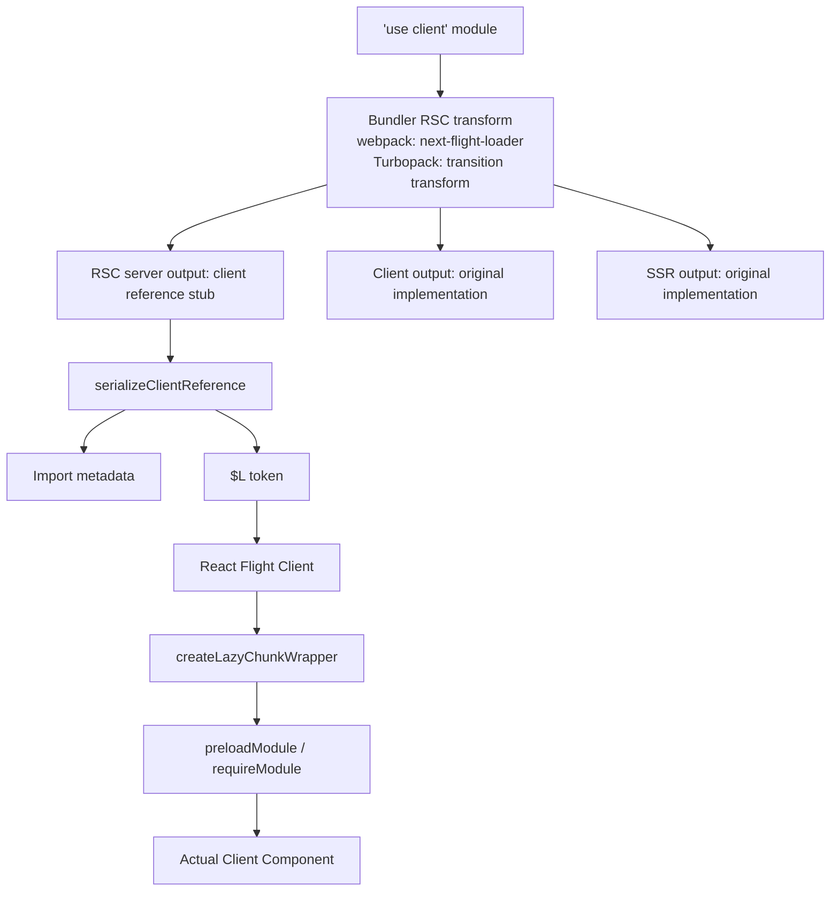

## Table of Contents

## Introduction

```tsx
'use client'

import {useState} from 'react'

export function Counter() {
  const [count, setCount] = useState(0)
  return <button onClick={() => setCount(count + 1)}>{count}</button>
}
```

A single line: `'use client'`. The moment you write this at the top of a file, the meaning of this module changes. It's not simply a marker saying "code that runs on the client." More precisely, it's a marker that **this module is an entry point of the client bundle graph**. **The RSC renderer does not evaluate the body of this module.** Instead, it stops at the module boundary and serializes only a **reference** indicating "there's a client component here." However, the same component runs in a separate SSR layer on Next.js's initial response path, participating in initial HTML generation. **This means there isn't just one server-side rendering path — the RSC renderer creates a Flight Payload from the server component tree, and the SSR renderer consumes that result to generate initial HTML. In this process, client components are also rendered using their SSR build implementation.** We'll cover this distinction separately later.

In [a previous article](/2026/03/react-server-functions-deep-dive), we followed how `'use server'` transforms functions into RPC endpoints all the way to the end. This article goes in the opposite direction. When a client component appears in the middle of a server component tree, how are modules separated at build time, what tokens flow through the Flight stream at runtime, and how does the client load chunks and bring them to life as actual components?

Let's start by clarifying terminology.

- **Client Component**: A component exported from a `'use client'` module and used as a React element type. It runs on the client (or during SSR) and can use hooks, event handlers, and state.
- **Client Reference**: A metadata object that the RSC server uses instead of directly holding the value of a `'use client'` module export. It has `$$typeof`, `$$id`, and `$$async` properties. It could be a component function or any other export that can be passed as props to a Client Component.
- **Client Module Proxy**: A Proxy created at the module level. No matter which export you access, it generates a client reference for that export.

> The source code analysis in this article is based on **React 19.2** and **Next.js 16.2**. Internal implementations may vary depending on the version.
>
> Also, the code examples in this article follow the webpack path. While `next dev` defaults to Turbopack starting from Next.js 16, the `'use client'` handling in both bundlers is nearly identical — the core behavioral differences are covered separately in the [What's Different in Turbopack](#whats-different-in-turbopack) section later in the article.

## 'use client' is an Entry Point Marker

There's a common misconception we need to address first: the idea that "only components with `'use client'` become client components, and components they import need separate marking." It's exactly the opposite.

The `'use client'` directive **defines module graph boundaries**. More precisely, it's the starting point of a **unidirectional boundary** from server → client. When a module has `'use client'`, all modules it imports — even without their own `'use client'` — are automatically included in the client bundle graph.

```
app/page.tsx           ← Server Component (default)
  └─ import Layout     ← Server Component
       └─ import Counter      ← 'use client' (boundary!)
            └─ import { format } from './utils'   ← automatically client
                 └─ import lodash               ← automatically client
```

Conversely, a `'use client'` module cannot directly import server modules again. The import direction is one-way. However, **receiving server components through the `children` prop** is possible. This isn't importing — it's receiving serialized React elements passed as props. This is the most important mental model for `'use client'`.

```tsx
// app/page.tsx (Server Component)
import {ClientShell} from './ClientShell'
import {ServerContent} from './ServerContent'

export default function Page() {
  return (
    <ClientShell>
      <ServerContent /> {/* OK — passed as children prop */}
    </ClientShell>
  )
}
```

```tsx
// ClientShell.tsx
'use client'

export function ClientShell({children}: {children: React.ReactNode}) {
  return <div className="shell">{children}</div>
}
```

`ClientShell` does not **import** `ServerContent`. The Server Component `Page` imports both components and composes them with children. This distinction underpins the entire composition model of React Server Components.

## Build-Time Transformation: Same Module, Different Builds per Layer

The `'use client'` directive has no runtime effect. The real work happens at **build time**. Moreover, a single module gets compiled into different forms across webpack's multiple layers — RSC server, SSR, browser client. It's the same file, but different transformation rules apply per layer.

### RSC Server Bundle: Stub with Body Removed

Next.js's `next-flight-loader` operates in webpack's RSC server layer and, when it encounters a `'use client'` module, **discards the entire original code** and replaces it with client references. For ESM modules, the transformation looks like this[^1]:

```ts
// Original: components/Counter.tsx
'use client'

import {useState} from 'react'

export function Counter({initial}: {initial: number}) {
  const [count, setCount] = useState(initial)
  return <button onClick={() => setCount(count + 1)}>{count}</button>
}
```

The above code is transformed into something like this in the RSC server bundle:

```js
// Form that goes into RSC server bundle (conceptual)
import {registerClientReference} from 'react-server-dom-webpack/server'

export const Counter = registerClientReference(
  function () {
    throw new Error(
      'Attempted to call Counter() from the server but Counter is on the client. ' +
        "It's not possible to invoke a client function from the server, " +
        'it can only be rendered as a Component or passed to props of a Client Component.',
    )
  },
  'components/Counter.tsx',
  'Counter',
)
```

Three key points:

1. **The original function body is gone.** `useState`, JSX, event handlers — code that only makes sense on the client isn't included in the RSC server bundle by even a single character.
2. **Metadata is injected into the stub function.** `registerClientReference` injects `$$typeof`, `$$id`, and `$$async`. When RSC serialization encounters this stub, it converts it to metadata instead of the body.
3. **Calling the stub throws an error.** When you mistakenly try to call it "like a function" on the server, it throws a clear error. Client components are targets for React to render, not functions to call directly.

For CommonJS modules, it takes a simpler path — replacing the entire module with a Proxy from `createClientModuleProxy` (covered later).

### Client Bundle: Original As-Is

The same module keeps its body intact in the client bundle. Webpack's client layer essentially ignores the `'use client'` directive (except for linting) and compiles the module as regular JavaScript. As a result, the real implementation of the `Counter` component **exists only in the client chunk**.

```
Original module → ┬─ RSC server build: metadata stub only
                  └─ Client build: body as-is + separate chunk
```

This separation is possible thanks to webpack's **layer** mechanism. Next.js defines multiple layers within the same webpack compilation — `WEBPACK_LAYERS.reactServerComponents` (RSC), `WEBPACK_LAYERS.serverSideRendering` (SSR), `WEBPACK_LAYERS.actionBrowser` (action browser), etc.[^2] — and applies different transformations to the same module depending on which layer imports it.

### Inside registerClientReference

Let's look directly at the React implementation. The answer is in `react-server-dom-webpack/src/ReactFlightWebpackReferences.js`[^3].

```js
const CLIENT_REFERENCE_TAG = Symbol.for('react.client.reference')

export function registerClientReference(proxyImplementation, id, exportName) {
  return registerClientReferenceImpl(
    proxyImplementation,
    id + '#' + exportName,
    false, // async = false
  )
}

function registerClientReferenceImpl(proxyImplementation, id, async) {
  return Object.defineProperties(proxyImplementation, {
    $$typeof: {value: CLIENT_REFERENCE_TAG},
    $$id: {value: id},
    $$async: {value: async},
  })
}
```

This is a mirror image of the `registerServerReference` we saw with server references (`'use server'`). The differences:

| Property   | Client Reference                       | Server Reference                       |
| ---------- | -------------------------------------- | -------------------------------------- |
| `$$typeof` | `Symbol.for('react.client.reference')` | `Symbol.for('react.server.reference')` |
| `$$id`     | `"moduleId#exportName"`                | `"moduleId#exportName"`                |
| `$$async`  | Whether module uses top-level await    | (none)                                 |
| `$$bound`  | (none)                                 | Arguments accumulated by `.bind()`     |

`$$async` is new. It indicates whether the module is asynchronous (top-level await, etc.). When loading chunks on the client side, it determines whether to finish with a synchronous require or await a Promise.

### createClientModuleProxy: Wrapping Entire Modules at Once

For CJS paths or cases where automatic manifest generation is difficult, the entire module is wrapped as a client reference at once. This is where `createClientModuleProxy` is used.

```js
export function createClientModuleProxy(moduleId) {
  const clientReference = registerClientReferenceImpl({}, moduleId, false)
  return new Proxy(clientReference, proxyHandlers)
}

const proxyHandlers = {
  get: function (target, name, receiver) {
    return getReference(target, name)
  },
  getOwnPropertyDescriptor: function (target, name) {
    let descriptor = Object.getOwnPropertyDescriptor(target, name)
    if (!descriptor) {
      descriptor = {
        value: getReference(target, name),
        writable: false,
        configurable: false,
        enumerable: false,
      }
      Object.defineProperty(target, name, descriptor)
    }
    return descriptor
  },
  getPrototypeOf(target) {
    return PROMISE_PROTOTYPE
  },
  set: function () {
    throw new Error('Cannot assign to a client module from a server module.')
  },
}
```

It creates a ClientReference with a module ID embedded in an empty object `{}`, then wraps it with a Proxy. The `get` trap of this Proxy is key — no matter which export name you access, `getReference(target, name)` gets called.

```js
function getReference(target, name) {
  switch (name) {
    case '$$typeof':
      return target.$$typeof
    case '$$id':
      return target.$$id
    case '$$async':
      return target.$$async
    case 'name':
      return target.name
    case 'defaultProps':
      return undefined
    case '_debugInfo':
      return undefined
    case 'toJSON':
      return undefined
    case Symbol.toPrimitive:
      return Object.prototype[Symbol.toPrimitive]
    case Symbol.toStringTag:
      return Object.prototype[Symbol.toStringTag]
    case '__esModule':
      // ESM interop. Makes even default export lazy.
      target.default = registerClientReferenceImpl(
        function () {
          throw new Error('...')
        },
        target.$$id + '#',
        target.$$async,
      )
      return true
    case 'then':
      if (target.then) return target.then // cache hit
      if (!target.$$async) {
        // Sync module: masquerade as thenable.
        // Create a then that holds itself as fulfilled value.
        const clientReference = registerClientReferenceImpl(
          {},
          target.$$id,
          true /* async */,
        )
        const proxy = new Proxy(clientReference, proxyHandlers)
        target.status = 'fulfilled'
        target.value = proxy
        const then = (target.then = registerClientReferenceImpl(
          function then(resolve, reject) {
            return Promise.resolve(resolve(proxy))
          },
          target.$$id + '#then',
          false,
        ))
        return then
      }
      // async module: undefined. webpack handles its own thenable processing.
      return undefined
  }
  if (typeof name === 'symbol') {
    throw new Error(
      'Cannot read Symbol exports. Only named exports are supported.',
    )
  }
  // Other named exports — dynamically create and cache ClientReference
  let cachedReference = target[name]
  if (!cachedReference) {
    const reference = registerClientReferenceImpl(
      function () {
        throw new Error('...')
      },
      target.$$id + '#' + name,
      target.$$async,
    )
    Object.defineProperty(reference, 'name', {value: name})
    cachedReference = target[name] = new Proxy(reference, deepProxyHandlers)
  }
  return cachedReference
}
```

When you first access an export called `Counter`, it creates a ClientReference with the ID `"components/Counter.tsx#Counter"` and caches it. From the second access onwards, it returns the same object. Thanks to this lazy creation pattern, there's no need to statically analyze what exports a module has at build time — they're created when accessed.

The `then` branch is most interesting. It works slightly counterintuitively.

- **Sync module** (`!$$async`) when accessing `then`: Dynamically creates and returns a `then` function. This then is a function that immediately resolves with itself (proxy). In other words, even though it's a sync module, it **makes it look like a thenable** externally, allowing it to pass through dynamic import's await path. This is a mechanism to ensure that when RSC server does `await import('./ClientCounter')`, it receives the module object without infinite loops or errors.
- **Async module** (`$$async`) when accessing `then`: Returns `undefined`. Since webpack handles async modules with a separate mechanism for thenable processing, we shouldn't create a then.

The `getPrototypeOf` returning `PROMISE_PROTOTYPE` follows the same logic. Since dynamic import results are Promises, making the client module Proxy's prototype look like `Promise.prototype` means external code can treat this object like a Promise without major issues. (Since the exact intent isn't directly documented in the React source, take the above reasoning as "the behavior is natural when treated this way" level interpretation.)

The `set` trap is firm — any attempt to overwrite a client module's export from server code always throws.

### Next.js's next-flight-loader: Two-Pronged Transformation

The entity that applies the above transformations on the Next.js side is `next-flight-loader`[^1]. It automatically detects module type (ESM/CJS) and handles them differently.

- **ESM**: Wraps each export with `registerClientReference(stub, resourceKey, exportName)` and replaces it with a stub. Only allows explicit named exports. Rejects `export *` — if you can't know what names are exported at build time, you can't create stubs.
- **CJS**: Replaces the entire module with a single line: `createProxy(resourceKey)`. Since it doesn't know what exports exist, it relies on the Proxy's lazy creation.

`resourceKey` is in the form of file path + additional query string. This is to distinguish cases where multiple exports are created from the same file, or when barrel optimizer splits different parts of the same file into different modules.

> **Summary so far.** Once the build is complete, the RSC server bundle contains not a single line of actual client component code. Only stubs with `moduleId#exportName` format IDs and `$$typeof`/`$$id`/`$$async` metadata remain. The real component body is stored separately in SSR bundles and client bundles. These stubs get converted to import chunk metadata during RSC serialization, and that transformation is the subject of the next section.

## Client Entry Point: flight-client-entry-plugin

Webpack fundamentally starts from an entry point and creates chunks by following the import graph. However, in RSC, server code doesn't import `'use client'` modules — the imports themselves have been transformed into `registerClientReference` calls. So how does webpack know about the existence of client modules?

Answer: **Create additional separate entry points**. This is the role of `flight-client-entry-plugin`[^2].

```
Server entry (RSC)
  └─ Server Component
       └─ "ClientShell exists here" (registerClientReference)

Client entry (auto-generated)
  ├─ ClientShell.tsx (actual code)
  └─ Counter.tsx (actual code)
```

The plugin workflow goes like this:

1. `createClientEntries()` iterates through the entries of the server compilation.
2. `collectComponentInfoFromServerEntryDependency()` follows the dependency graph of each entry, examining build metadata (RSC meta information prepended by the loader) to identify client components and server actions.
3. `injectClientEntryAndSSRModules()` bundles the identified client modules as entries and injects them into webpack via `next-flight-client-entry-loader`. At this point, **two entries** are created simultaneously — **for client (browser) build** and **for SSR build**.

The reason the same client component gets built twice is SSR. Client components must also be rendered as HTML in the first page response (for progressive enhancement and content visibility before JS execution). Therefore:

- **Client entry**: Chunk to send to the browser. Becomes interactive component after hydration.
- **SSR entry**: For HTML rendering. Runs on a different layer from the RSC server, and results are streamed to the HTML of the first response.

In production, the same code gets built twice. This is an intentional cost.

## Client Manifest: ID → chunk URL

After the build completes, Next.js emits a manifest file called `client-reference-manifest.js`[^4]. This is the dictionary that RSC server references when serializing client references.

```ts
// Form of one manifest entry (conceptual)
{
  id: "5234",                          // webpack module ID
  name: "Counter",                     // export name. '*' means entire module
  chunks: [
    "12",  "static/chunks/12-abc.js",  // [chunkId, fileName] pair
    "5234", "static/chunks/5234-def.js"
  ],
  async: false,
}
```

This entry goes into several mappings within the manifest.

```ts
interface ClientReferenceManifest {
  moduleLoading: {prefix: string; crossOrigin: string | null}
  clientModules: Record<string, ManifestNode> // key = "moduleId#exportName"
  ssrModuleMapping: Record<string, Record<string, ManifestNode>>
  edgeSSRModuleMapping: Record<string, Record<string, ManifestNode>>
  rscModuleMapping: Record<string, Record<string, ManifestNode>>
  edgeRscModuleMapping: Record<string, Record<string, ManifestNode>>
  entryCSSFiles: Record<string, string[]>
}
```

`clientModules` is used by the RSC server for lookup when serializing client references. `ssrModuleMapping` and `edgeSSRModuleMapping` are used to find the SSR build module ID of the same component during SSR. Since the same component has different module IDs in the RSC layer, SSR layer, and client layer, mapping between them is necessary.

The form of the `chunks` field is somewhat unusual. It's an **alternating pair** — laid out flat like `[chunkId1, fileName1, chunkId2, fileName2, ...]`. It's a flat array rather than nested arrays, so serialization cost is lower. The client reads these pairs two at a time while fetching chunks.

File paths are encoded with `encodeURIPath()`. This is because chunk filenames created by webpack can contain reserved characters like `[`, `]` that can't be used directly as URLs.

## Serialization: serializeClientReference and $L Token

When the RSC server serializes the component tree with Flight Protocol, how does it encode ClientReference when encountered at some position? The answer: **it depends on the position**.

### Function Value Branching

`react-server/src/ReactFlightServer.js`[^5] branches whether a function value is ClientReference or ServerReference while serializing the tree.

```js
if (typeof value === 'function') {
  if (isClientReference(value)) {
    return serializeClientReference(request, parent, parentPropertyName, value)
  }
  if (isServerReference(value)) {
    return serializeServerReference(request, value)
  }
  // Regular function that's neither → cannot serialize, error
}

export function isClientReference(reference) {
  return reference.$$typeof === Symbol.for('react.client.reference')
}
```

The check is simple. It looks at whether `$$typeof` is the client reference tag.

### Two Branches of serializeClientReference

```js
function serializeClientReference(
  request,
  parent,
  parentPropertyName,
  clientReference,
) {
  const clientReferenceKey = getClientReferenceKey(clientReference)
  const writtenClientReferences = request.writtenClientReferences
  const existingId = writtenClientReferences.get(clientReferenceKey)

  if (existingId !== undefined) {
    // Already serialized reference — reuse chunk
    if (parent[0] === REACT_ELEMENT_TYPE && parentPropertyName === '1') {
      return serializeLazyID(existingId) // "$L" + hex
    }
    return serializeByValueID(existingId) // "$" + hex
  }

  try {
    const clientReferenceMetadata = resolveClientReferenceMetadata(
      request.bundlerConfig,
      clientReference,
    )
    request.pendingChunks++
    const importId = request.nextChunkId++
    emitImportChunk(request, importId, clientReferenceMetadata)
    writtenClientReferences.set(clientReferenceKey, importId)

    if (parent[0] === REACT_ELEMENT_TYPE && parentPropertyName === '1') {
      return serializeLazyID(importId)
    }
    return serializeByValueID(importId)
  } catch (x) {
    request.pendingChunks++
    const errorId = request.nextChunkId++
    emitErrorChunk(request, errorId, ...)
    return serializeByValueID(errorId)
  }
}

function serializeLazyID(id) {
  return '$L' + id.toString(16)
}

function serializeByValueID(id) {
  return '$' + id.toString(16)
}
```

The key branch is `parent[0] === REACT_ELEMENT_TYPE && parentPropertyName === '1'`. **If the parent is a React element and the current position is the type slot (index 1)**, it becomes a `$L` (lazy) token. In other positions — for example, if a client reference is inside props — it becomes a `$<id>` (by-value reference) token.

Let's recall the serialized form of React elements:

```
["$", "type", null, props]
 ↑    ↑
 element marker
      └─ This position is index 1, i.e., the type slot
```

A client reference in the type slot means "this component's code will be loaded lazily." A client reference in props — e.g., when passing a client component as a prop to children — is simply a reference pointing to import metadata.

### Import Chunk: Metadata as Separate Row

`emitImportChunk` emits metadata (`[id, chunks, name, async]`) looked up from the manifest as a separate chunk. Within Flight Protocol's row-based streaming structure, this chunk is serialized as an `I` row.

```
I:5:["5234",["12","static/chunks/12-abc.js"],"Counter",0]
0:["$","$L5",null,{"initial":42}]
```

- `I:5:...` — Chunk 5 is import metadata. `[moduleId, chunks array, exportName, async]` pair.
- `0:["$","$L5",null,{"initial":42}]` — Root element. `$L5` is embedded in the type position.

When the client receives this stream, it looks at the metadata of chunk 5 and begins fetching the chunk URL. Simultaneously, a React lazy component is created in the type slot of the root element — it resolves to the actual `Counter` component when the chunk arrives.

### Client Reference Tokens by Position in Flight Protocol

| Position                          | Token     | Meaning                                                   |
| --------------------------------- | --------- | --------------------------------------------------------- |
| React element's type slot         | `$L<hex>` | Wrapped as lazy node, enabling component-level suspension |
| Other positions (including props) | `$<hex>`  | By-value reference — ID pointing to import metadata       |

What this rule means is this: Client references in element type positions can be interpreted by React as lazy components, so they suspend on a per-component basis. References inside props are passed as regular value references, so they don't automatically take the same lazy processing path as type positions — the result depends on where the consuming side places that reference.

## Client Side: From $L to Actual Components

Now we turn our attention to the client side. When a Flight stream arrives, `react-client/src/ReactFlightClient.js`[^6] parses it line by line. The key function is `parseModelString` — when it encounters a token starting with `$`, it branches based on the second character.

```js
function parseModelString(response, parentObject, key, value) {
  if (value[0] === '$') {
    switch (value[1]) {
      case '$':
        return value.slice(1) // escaped $
      case 'L': {
        const id = parseInt(value.slice(2), 16)
        const chunk = getChunk(response, id)
        return createLazyChunkWrapper(chunk, 0)
      }
      case '@': {
        const id = parseInt(value.slice(2), 16)
        return getChunk(response, id) // Promise
      }
      case 'S':
        return Symbol.for(value.slice(2))
      case 'h': {
        const ref = value.slice(2)
        return getOutlinedModel(
          response,
          ref,
          parentObject,
          key,
          loadServerReference,
        )
      }
      case 'Q': {
        const ref = value.slice(2)
        return getOutlinedModel(response, ref, parentObject, key, createMap)
      }
      case 'W': {
        const ref = value.slice(2)
        return getOutlinedModel(response, ref, parentObject, key, createSet)
      }
      case 'B': {
        const ref = value.slice(2)
        return getOutlinedModel(response, ref, parentObject, key, createBlob)
      }
      case 'K': {
        const ref = value.slice(2)
        return getOutlinedModel(
          response,
          ref,
          parentObject,
          key,
          createFormData,
        )
      }
      case 'D':
        return new Date(Date.parse(value.slice(2)))
      case 'n':
        return BigInt(value.slice(2))
      case 'I':
        return Infinity
      case '-':
        if (value === '$-0') return -0
        return -Infinity
      case 'N':
        return NaN
      case 'u':
        return undefined
      // ...
    }
  }
  return value
}
```

Here's the token table we saw in the `'use server'` post, all gathered in one function. `$L` is a new addition.

### $L → React.lazy

```js
case 'L': {
  const id = parseInt(value.slice(2), 16)
  const chunk = getChunk(response, id)
  return createLazyChunkWrapper(chunk, 0)
}

function createLazyChunkWrapper(chunk, validated) {
  return {
    $$typeof: REACT_LAZY_TYPE,
    _payload: chunk,
    _init: readChunk,
  }
}
```

When it encounters `$L5`, it gets chunk 5 and creates a React lazy component. This has the exact same shape as a lazy component created with `React.lazy()`. When the React reconciler encounters this node, it calls `_init(_payload)` to attempt to resolve the chunk, and if it's still loading, throws a Promise so the nearest Suspense boundary shows its fallback.

### When a chunk is import metadata

Chunk 5 is the import metadata emitted as an `I:5:[...]` line above. When the client encounters this chunk, it follows this flow:

```js
function resolveModuleChunk(response, chunk, value) {
  // ClientReference metadata goes into chunk.value
  const resolvedChunk = chunk
  resolvedChunk.status = RESOLVED_MODULE
  resolvedChunk.value = value
  // ...
}

function readChunk(chunk) {
  switch (chunk.status) {
    case RESOLVED_MODULE:
      initializeModuleChunk(chunk)
      break
  }
  // ...
  switch (chunk.status) {
    case INITIALIZED:
      return chunk.value
    case PENDING:
    case BLOCKED:
      throw chunk // Suspense
    default:
      throw chunk.reason
  }
}

function initializeModuleChunk(chunk) {
  try {
    const value = requireModule(chunk.value)
    chunk.status = INITIALIZED
    chunk.value = value
  } catch (error) {
    chunk.status = ERRORED
    chunk.reason = error
  }
}
```

The key is `requireModule(chunk.value)`. `requireModule` is a bundler-specific implementation, and in webpack it works like this[^7]:

```js
// react-server-dom-webpack/src/client/ReactFlightClientConfigBundlerWebpack.js

export function preloadModule(metadata) {
  const chunks = metadata[1]
  const promises = []
  for (let i = 0; i < chunks.length; i += 2) {
    const chunkId = chunks[i]
    const chunkFilename = chunks[i + 1]
    const entry = chunkCache.get(chunkId)
    if (entry === undefined) {
      const thenable = loadChunk(chunkId, chunkFilename)
      promises.push(thenable)
      chunkCache.set(chunkId, thenable)
    } else if (entry !== null) {
      promises.push(entry)
    }
  }
  if (metadata[3] /* async */) {
    if (promises.length === 0) {
      return requireAsyncModule(metadata[0])
    }
    return Promise.all(promises).then(() => requireAsyncModule(metadata[0]))
  }
  return promises.length === 0 ? null : Promise.all(promises)
}

export function requireModule(metadata) {
  let moduleExports = __webpack_require__(metadata[0])
  // For async modules, access via .value
  if (metadata[3] /* async */) {
    if (moduleExports.status === 'fulfilled') {
      moduleExports = moduleExports.value
    } else {
      throw moduleExports.reason
    }
  }
  if (metadata[2] /* exportName */ === '*') {
    return moduleExports
  }
  if (metadata[2] === '') {
    return moduleExports.__esModule ? moduleExports.default : moduleExports
  }
  return moduleExports[metadata[2]]
}
```

`metadata` is a `[id, chunks, name, async]` tuple.

1. `preloadModule`: Takes `chunks` pairs and feeds them to `loadChunk` to fetch chunk files. Skips already cached chunks. For sync modules, just receiving chunks is enough; for async modules, it additionally needs to await `requireAsyncModule`.
2. `requireModule`: Resolves the module with `__webpack_require__` and extracts exports based on `name`.

`*` means the entire module, `''` (empty string) means default export (with ESM interop), anything else is a named export. The `name` field in the build-time manifest is determined here.

### chunkCache: Load once and you're done

`chunkCache` is a chunk-level cache, not module-level. If 100 client components share the same chunk — which is common, since webpack creates vendor chunks — that chunk is loaded only once. From the second time onward, it's a cache hit.

What this means: **Even if the same module is imported in multiple places, chunk downloads happen only once on the client side**. RSC payloads include ClientReference metadata every time, but metadata is lightweight (dozens of bytes) and chunk URLs are deduped.

> **Summary so far.** When the RSC server traverses the tree and encounters a client reference, it pulls `[id, chunks, name, async]` from the manifest and emits it as an import chunk. If it's in an element type position, it gets a `$L<hex>` token; otherwise, a `$<hex>` token. When the client encounters `$L`, it creates a React lazy node, fetches chunks with `preloadModule`, and resolves the actual component with `requireModule` (`__webpack_require__`). Same chunks are deduped via `chunkCache`. This completes the serialization roundtrip — next up is another server-side renderer besides the RSC server: the SSR layer.

## SSR and RSC, and Two Component Trees

This is where mental models start to wobble. The simple picture looks like this:

```
[Browser's first request]
1. HTML rendering on server → Streaming
2. Browser hydration

[Subsequently]
3. Client makes RSC request to server → Receives Flight stream
```

But when RSC enters the picture, the server side becomes more complex:

```
[Browser's first request]
1. RSC server: Renders server component tree as Flight stream
   - Client components are serialized as $L<id> + import metadata
2. SSR server (same process, different layer): Receives Flight stream and
   - When it encounters $L<id>, requires client modules from SSR build for actual rendering
   - Streams result as HTML
3. Browser: Receives and displays HTML + Flight stream + client chunks at the end
4. Hydration: When client chunks arrive, combines HTML and Flight stream to create React tree, attaches event listeners
```

The same Counter component — on the same page — is handled in three different environments:

| Environment      | Build layer             | Role                                 |
| ---------------- | ----------------------- | ------------------------------------ |
| RSC server       | `reactServerComponents` | Only serializes as client reference  |
| SSR server       | `serverSideRendering`   | Actually renders first response HTML |
| Browser (client) | (default)               | Hydration + subsequent interaction   |

This is why the manifest has separate `ssrModuleMapping` and `clientModules`. For the same `"Counter.tsx#Counter"` key, the SSR layer's module ID and the client layer's module ID are different, and the RSC server needs to hold both mappings. The SSR layer uses `ssrModuleMapping` when consuming RSC payload to get modules via server-side webpack require, while the client uses `clientModules` to fetch chunk URLs.

### 'use client' doesn't prevent SSR either

A frequently asked question: "It's `'use client'`, so why does it render on the server too?" Answer: **SSR doesn't block client components.** Only the RSC server does. The SSR server normally executes client component bodies to create HTML. However, it's static HTML that only reflects initial values like `useState`'s initial state, and event handlers are attached after hydration.

Once you grasp this distinction, you can understand that "code that should never run on the server" — like code accessing `window.localStorage` — will break in SSR too. `'use client'` isn't enough; you need to wrap it in `useEffect` or check `typeof window !== 'undefined'`.

```tsx
'use client'

import {useState, useEffect} from 'react'

export function Theme() {
  // ❌ Also runs in SSR. No window → error
  // const [theme, setTheme] = useState(localStorage.getItem('theme'))

  const [theme, setTheme] = useState<string | null>(null)

  // ✅ Only runs in browser
  useEffect(() => {
    setTheme(localStorage.getItem('theme'))
  }, [])

  return <div data-theme={theme}>...</div>
}
```

## Props Serialization: What Can You Pass?

When a server component passes props to a client component, those props are **serialized via Flight Protocol** and carried in the RSC payload. The serialization token table covered in the `'use server'` post applies directly.

### Serializable / Non-serializable

| Type                                                         | Possible | Notes                            |
| ------------------------------------------------------------ | -------- | -------------------------------- |
| `string`, `number`, `bigint`, `boolean`, `undefined`, `null` | ✅       | Primitive types                  |
| `Symbol.for('name')`                                         | ✅       | Only globally registered symbols |
| `Array`, `Map`, `Set`, `TypedArray`, `ArrayBuffer`           | ✅       |                                  |
| `Date`, `FormData`, `Promise`                                | ✅       |                                  |
| Plain objects (`{}`, `{ key: value }`)                       | ✅       | Created with object initializer  |
| Server Function (`'use server'` function)                    | ✅       | `$h<id>` token                   |
| **Server Component (JSX) — children/slot**                   | ✅       | `$L<id>` lazy or serialized tree |
| Regular functions, arrow functions, class methods            | ❌       | Code can't cross the network     |
| Class instances                                              | ❌       | Can't restore prototype chain    |
| DOM nodes, event objects                                     | ❌       | Native, circular references      |
| `Symbol()` not in global registry                            | ❌       |                                  |

This table hints at the two most common traps in props serialization.

**You can't pass regular functions.** This is a common mistake:

```tsx
// ❌ Server Component creates handler and passes it to Client Component
export default function Page() {
  return <ClientButton onClick={() => console.log('hi')} />
}
```

This won't work. `() => console.log('hi')` is a regular function and can't be serialized. There are two solutions:

1. **Make it a Server Function**: Add `'use server'` to make it an RPC endpoint.
2. **Define inside Client Component**: Put the handler in client code.

Most cases use (2). UI event handlers are generally part of client code.

**You can't pass event objects either:**

```tsx
// ❌ Passing event object directly to Server Function
<button onClick={(e) => updatePost(e)}>

// ✅ Extract only needed values
<button onClick={() => updatePost(postId)}>
```

Event objects are bundles of DOM nodes and circular references. We don't even attempt to serialize them.

### The Secret of the children Prop

Let's revisit why the pattern of receiving Server Components as children is possible:

```tsx
'use client'
export function Card({children}: {children: React.ReactNode}) {
  return <div className="card">{children}</div>
}
```

```tsx
// app/page.tsx (Server Component)
import {Card} from './Card'
import {db} from '@/lib/db'

export default async function Page() {
  const post = await db.posts.findFirst()
  return (
    <Card>
      <article>
        <h1>{post.title}</h1>
        <p>{post.content}</p>
      </article>
    </Card>
  )
}
```

The children going into `Card` (client) is **a React element tree that has already finished rendering on the RSC server**. It's passed to the client in serialized form via props. The client's `Card` simply places that tree in the children slot.

It's fine if client components are mixed into the children — they get serialized as `$L<id>` tokens again and resolved when the client loads the chunks.

This pattern — "client shell + server children" — is the core weapon of RSC composition. Interactive wrappers (tabs, modals, sidebars) go to the client, while the content that goes inside stays on the server. Bundle size stays small, and data fetching is done on the server.

## Precautions for Use

### 1. Push 'use client' as far down to the leaves as possible

The fact that `'use client'` is an entry point in the import graph has a direct consequence — **if you place it higher up, everything below it gets included in the client bundle.**

The worst pattern is carelessly adding `'use client'` to a layout or page.

```tsx
// ❌ app/dashboard/layout.tsx
'use client'

import {ThemeProvider} from '@/lib/theme'

export default function Layout({children}) {
  return <ThemeProvider>{children}</ThemeProvider>
}
```

While `children` can be a Server Component since it's passed as a children prop, **all dependencies imported by `ThemeProvider` will be included in the client bundle.** If `@/lib/theme` imports other heavy libraries, the bundle size will explode.

Solution: Separate out only the ThemeProvider.

```tsx
// app/dashboard/layout.tsx (Server Component)
import {ThemeProvider} from './ThemeProvider'

export default function Layout({children}) {
  return <ThemeProvider>{children}</ThemeProvider>
}

// app/dashboard/ThemeProvider.tsx
'use client'

import {createContext, useState} from 'react'

export function ThemeProvider({children}) {
  // ...
  return <Context.Provider value={...}>{children}</Context.Provider>
}
```

Principle: **`'use client'` should only go on leaf components that directly contain interactive code**. Providers, contexts, interactions that need to happen on leaves — extract these into separate files and put the directive only on those files.

### 2. Barrel files + 'use client' is dangerous

If you add `'use client'` to a barrel file that re-exports multiple components, that entire file becomes one chunk of client module. Even if a user imports just one component from it, webpack will put the entire barrel module into the client graph.

```tsx
// ❌ components/index.ts
'use client'
export {Button} from './Button'
export {Modal} from './Modal' // heavy library dependencies
export {RichEditor} from './RichEditor' // 1MB+ dependencies
```

```tsx
// Usage side
import {Button} from '@/components' // RichEditor gets pulled in too
```

Two solutions:

1. **Don't put `'use client'` on barrel files** — keep the barrel itself server-friendly and add `'use client'` to each leaf file separately.
2. **Import directly from individual files** — `import {Button} from '@/components/Button'`.

Next.js's `optimizePackageImports` automatically splits barrels, but it doesn't work for all cases. Intentionally going with leaf imports is safer.

### 3. No importing server code inside Client Components

If you import a module marked with `import 'server-only'` from a `'use client'` module, the build will break. This is an intentional block.

```tsx
// lib/db.ts
import 'server-only'
export const db = ...
```

```tsx
// ❌ Counter.tsx
'use client'
import {db} from '@/lib/db' // Build error
```

Breaking this boundary could leak code that should only exist on the server (API keys, DB connections) into the client bundle. The `server-only` package is a simple guard that immediately throws an error when imported in a client build. It's a core security tool.

### 4. Props are included in every RSC payload

While the Client Component's code itself is received only once as a chunk, **props are serialized and transmitted with every RSC payload.** If you pass large objects as props, that directly becomes the RSC payload size.

```tsx
// ❌ Passing huge data as props
const allUsers = await db.users.findMany() // 1MB+
return <UserList users={allUsers} />
```

In such cases, there are two alternatives:

1. **Render directly in Server Component**: Make `UserList` a Server Component that displays data on its own. Extract only the parts that need client interaction as inner leaves.
2. **Data slicing**: Extract and pass only the fields that the Client Component actually needs.

### 5. Context only works when the Provider is a client

React Context only exists in the client tree. Server Components cannot read (or write) context. So if you want to use context to avoid prop drilling, **both the Provider and consumer must be client**.

```tsx
// ✅ ThemeContext.tsx
'use client'
import {createContext, useContext, useState} from 'react'

const ThemeContext = createContext('light')

export function ThemeProvider({children}) {
  const [theme, setTheme] = useState('light')
  return <ThemeContext.Provider value={theme}>{children}</ThemeContext.Provider>
}

export function useTheme() {
  return useContext(ThemeContext)
}
```

To share data in Server Components without prop drilling — the standard pattern is calling memoized functions with `React.cache` from multiple components.

### 6. Date/Map/Set created on server are passed through as-is

Flight Protocol goes beyond JSON limitations — it passes `Date`, `Map`, `Set`, and even `BigInt` through as-is.

```tsx
// Server Component
const now = new Date()
const tags = new Map<string, string>([['hot', '🔥']])
return <Card createdAt={now} tags={tags} />
```

```tsx
// 'use client' Card
export function Card({
  createdAt,
  tags,
}: {
  createdAt: Date
  tags: Map<string, string>
}) {
  return (
    <div>
      {createdAt.toLocaleString()} — {tags.get('hot')}
    </div>
  )
}
```

Type information that would be lost in JSON.parse → JSON.stringify serialization stays intact. No need to convert to strings and re-parse on the client.

## Performance Advice

### 1. 'use client' placement determines bundle size

This is the biggest lever. As covered above, `'use client'` is an entry point marker, and the entire import graph below it gets included in the client bundle. **Pushing it down to leaves is the first optimization**.

How do you measure? Turn on Next.js's `@next/bundle-analyzer` and look at the client chunks. If you see unexpectedly large chunks, check what modules are in that chunk — determine whether they're truly needed on the client or if server-only code has leaked into the client.

### 2. Separate from initial payload with dynamic imports

Heavy Client Components that don't need to be visible on initial page load should be separated using `next/dynamic` or `React.lazy`.

```tsx
'use client'

import dynamic from 'next/dynamic'

const RichEditor = dynamic(() => import('./RichEditor'), {
  loading: () => <p>Loading editor...</p>,
})

export function PostForm() {
  const [editing, setEditing] = useState(false)
  return editing ? (
    <RichEditor />
  ) : (
    <button onClick={() => setEditing(true)}>Edit</button>
  )
}
```

`RichEditor` is separated into its own chunk and only loads when the user clicks the edit button. Both initial payload size and hydration cost are reduced.

### 3. Let webpack handle sharing the same chunks

When multiple Client Components import the same `node_modules` library, webpack automatically bundles it into a vendors chunk. Whether 100 components or 1 component uses lodash, the lodash chunk is downloaded only once.

The pattern that breaks this is — **making dynamic import module paths dynamic**. Webpack can't do static analysis properly and fails to separate chunks correctly.

```tsx
// ❌ webpack can't separate chunks
const Component = dynamic(() => import(`./components/${name}`))

// ✅
const Component = dynamic(() => import('./components/Foo'))
```

### 4. Improve streaming visibility with Suspense boundaries

`$L<id>` tokens are Suspense-compatible. If there's a Suspense in the parent tree, a fallback shows before the client chunk arrives, and it naturally replaces when the chunk arrives.

```tsx
import {Suspense} from 'react'
import dynamic from 'next/dynamic'

const Comments = dynamic(() => import('./Comments'))

export default function Post() {
  return (
    <article>
      <Header />
      <Body />
      <Suspense fallback={<CommentsSkeleton />}>
        <Comments />
      </Suspense>
    </article>
  )
}
```

The same pattern applies to async data fetching in Server Components — Suspense works as an async boundary for both RSC and Client Components. However, these two cases operate at **different levels**. Suspense created by `next/dynamic` waits for client chunk (JS) downloads, while Suspense created by RSC async data fetching waits for RSC stream chunks to arrive from the server. The timing of client interpretation is also different — the latter's fallback might already be in the initial HTML, while the former's fallback stays in place until the chunk arrives after hydration.

### 5. Keep props payload lightweight

RSC payload size is the data users receive on the first screen after SSR HTML. Heavy props directly become cost.

- Select and pass only necessary fields (at DB level)
- Use client-side pagination for large collections
- Utilize Map/Set when data structure representation is more compact
- For objects referenced in multiple places — Flight Protocol automatically dedups (inline reference tokens `$<id>`).

### 6. Directly measure 'use client'

To find out which `'use client'` boundary creates the biggest cost on a single page, looking at the build manifest directly is most accurate. `.next/build-manifest.json` and `.next/app-build-manifest.json` have chunk lists per page. Summing chunk sizes by page shows which pages are truly heavy.

```bash
# .next/app-build-manifest.json
{
  "pages": {
    "/dashboard": [
      "static/chunks/webpack-abc.js",
      "static/chunks/main-app-def.js",
      "static/chunks/app/dashboard/page-ghi.js",
      ...
    ]
  }
}
```

Adding up each chunk's size gives the total client JS for that page. Next.js's `next build` output also shows First Load JS per page, but to find out which components create that cost, you need to look at both build-manifest and bundle-analyzer.

## 'use client' vs 'use server': Same directive, different directions

These two directives are like a decalcomania. A table makes the differences clearer:

| Item                  | `'use client'`                           | `'use server'`                                 |
| --------------------- | ---------------------------------------- | ---------------------------------------------- |
| Location              | Top of module                            | Top of module or first line of function body   |
| Meaning               | This module is client bundle entry point | This function is server RPC endpoint           |
| Metadata tag          | `Symbol.for('react.client.reference')`   | `Symbol.for('react.server.reference')`         |
| Metadata properties   | `$$typeof`, `$$id`, `$$async`            | `$$typeof`, `$$id`, `$$bound`, `bind` override |
| Flight token          | `$L<id>` (lazy) or `$<id>`               | `$h<id>`                                       |
| What gets serialized  | Module/export metadata + chunk info      | Function ID + bound arguments                  |
| Client-side result    | React lazy component + chunk fetch       | `callServer(id, args)` proxy function          |
| Direct code transform | webpack loader (`next-flight-loader`)    | webpack loader + `registerServerReference`     |

You can see overlapping patterns. Both get entirely transformed at build time and replaced with metadata objects identified by `Symbol.for(...)` tags. Flight Protocol serializes that metadata into its own tokens and revives it with reverse transformation on the other side.

The difference is direction. `'use client'` is the **boundary for sending component code from server → client**, while `'use server'` is the **boundary for sending function calls from client → server**. Together, they complete RSC's bidirectional communication.

## What's Different in Turbopack

The code quoted so far has been the **webpack path**. `react-server-dom-webpack`, `next-flight-loader`, `flight-client-entry-plugin`, `__webpack_require__`. However, starting with Next.js 16, both `next dev` and `next build` use Turbopack as the default bundler. webpack is now opt-in with the `--webpack` flag.

Fortunately, the core model of `'use client'` is nearly identical between webpack and Turbopack. Both avoid directly executing client modules at the RSC server boundary, instead replacing them with Client Reference metadata and having the client load the actual implementation via the Flight Protocol. The webpack code quotes in this article are just tools for examining that model—**the model itself is the same on both sides**.

This section briefly summarizes only the differences between the two bundlers. We won't cover the internal Turbopack implementation (Rust-based SWC transforms) itself—it's not at an abstraction level users need to handle.

### Starting with Similarities — To Prevent Misunderstanding

First, let's identify what's **the same**. The following three areas share identical abstractions between both bundlers.

| Area                                      | Notes                                                                                                                                              |
| ----------------------------------------- | -------------------------------------------------------------------------------------------------------------------------------------------------- |
| `registerClientReference` body            | `react-server-dom-turbopack/src/ReactFlightTurbopackReferences.js`[^8] injects `$$typeof`/`$$id`/`$$async` in the same form as the webpack version |
| `createClientModuleProxy` + Proxy handler | Same get/getOwnPropertyDescriptor/getPrototypeOf/set trap structure, and same `then` branch intent (disguising sync modules as thenable)           |
| Flight Protocol and `$L<id>` tokens       | Serialization/deserialization is handled by React-side code (`ReactFlightServer.js`, `ReactFlightClient.js`). No bundler influence                 |

In other words, **the shape of stub objects embedded in build outputs and the wire format of RSC streams are identical on both sides**. Import chunk lines like `I:5:["...",[...],"...",0]` in RSC streams and React lazy nodes created by the client also look the same.

However, "same" means **the wire format and React-level abstractions are the same**, not that manifest internal chunk metadata representations or runtime loader implementations are byte-level identical. webpack uses `__webpack_require__` and `[chunkId, fileName]` pairs, while Turbopack uses `__turbopack_require__` and Turbopack runtime's chunk loading rules. We'll see this difference in the next section.

### Differences

The real differences emerge in **build-time transformation ownership** and **runtime chunk loading**.

| Area                          | webpack                                       | Turbopack                                                                                                |
| ----------------------------- | --------------------------------------------- | -------------------------------------------------------------------------------------------------------- |
| Package                       | `react-server-dom-webpack`                    | `react-server-dom-turbopack`                                                                             |
| Build transform               | webpack loader (`next-flight-loader`, JS)     | Turbopack ECMAScript transform (Rust/SWC, internal to Next.js)                                           |
| Client entry creation         | `flight-client-entry-plugin` (webpack plugin) | Turbopack transition rules + automatic extraction. No separate plugin, integrated                        |
| Layer separation              | `experiments.layers` + `WEBPACK_LAYERS.*`     | Turbopack transition rules (defining RSC ↔ SSR ↔ Client contexts)                                        |
| Runtime require               | `__webpack_require__(id)`                     | `__turbopack_require__(id)`                                                                              |
| Chunk metadata representation | `[chunkId, fileName]` alternating pair        | Separate representation tailored for Turbopack runtime. You can't directly port webpack's pair structure |
| Manifest emission             | Batch emit at compilation end                 | **On-demand** emit in dev mode (emit only the relevant entry when request arrives)                       |

Among these, two items affect the main content.

**1. Runtime require function name.** The `requireModule` discussed above calls `__turbopack_require__(metadata[0])` in Turbopack. The overall flow is otherwise the same—`preloadModule` fetches chunks and `requireModule` extracts exports via synchronous require.

**2. Chunk loading cache.** The Turbopack path also caches chunk loading state in React client config (`ReactFlightClientConfigBundlerTurbopack.js`). Like webpack, it maintains a `chunkCache` to avoid loading the same chunk twice. However, chunk identifiers and loading functions are tailored for Turbopack runtime, and module resolution happens through `__turbopack_require__`. You can't directly port webpack's alternating pair traversal code to Turbopack.

Neither of these differences is something users directly encounter in code. From the perspective of writing `'use client'` and importing components, there's rarely any need to distinguish between webpack and Turbopack.

### Build Transform Location Differs but Output is the Same

In webpack, `next-flight-loader` (a webpack loader written in TypeScript) receives module text, detects the `'use client'` directive, and generates `registerClientReference(...)` call code for each export.

In Turbopack, the same work is done by an internal Next.js Rust transform. It's an SWC-based AST transformation, and the output is the same form of stub functions + metadata registration code. However, this transformation isn't inserted into a plugin chain like a webpack loader, but automatically applied to modules entering the RSC layer through Turbopack's transition rules.

There's rarely any need to look into the Rust-side implementation. If you grep the built output (JS output), you'll find `registerClientReference` calls in nearly the same form as the webpack version. Since the webpack code quotes in this article explain the structure of those outputs, they apply to Turbopack as well.

### On-Demand Emission of Dev Manifests

webpack dev server only emits manifests after compilation finishes. If the initial compilation takes a long time, the first RSC request has to wait too. Turbopack compiles page by page in dev mode and emits manifests only for that entry. Re-requesting the same page gets an immediate response from the cached manifest.

The **role** of manifests is the same on both sides—they're lookup tables for RSC servers to connect client references to actual client/SSR modules. Major categories like `clientModules` and `ssrModuleMapping` exist in similar forms. However, specific representations of chunk metadata and runtime loading methods differ by bundler—you can't directly port webpack's `[chunkId, fileName]` alternating pairs mentioned earlier to Turbopack.

### Summary: Reading webpack Quotes for Turbopack

Here are three conversion rules to keep in mind when reading this article's content in a Turbopack environment.

1. **Package names**: Read `react-server-dom-webpack` as `react-server-dom-turbopack`. The reference helper shapes are the same, so the quoted code's meaning carries over.
2. **Runtime require**: Read `__webpack_require__` as `__turbopack_require__`.
3. **Build plugins/loaders**: Read `next-flight-loader`/`flight-client-entry-plugin` as "Turbopack transition rules + Rust transforms". The output is the same form of stub + metadata registration code.

To summarize the core direction of this article: **We explain internal structure based on webpack code, but RSC's core model is identical in Turbopack—RSC servers don't directly execute client modules but embed them as metadata only, with clients loading actual implementations via Flight Protocol. However, chunk metadata representation, runtime require, entry generation methods, and dev manifest emission timing differ by bundler.**

## Overall Architecture



## Conclusion

To summarize what's hidden behind that one line of `'use client'`:

1. **'use client' is an entry point marker**. It's the starting point of client bundle graphs, not a per-component label. All imports beneath it automatically enter the client bundle.

2. **Build-time transformation**: `next-flight-loader` builds `'use client'` modules as stubs in the RSC server bundle and as original content in client/SSR bundles. The same module compiles differently per layer.

3. **registerClientReference**: Uses `Object.defineProperties` to embed `$$typeof`, `$$id`, `$$async` into stubs. CJS modules are entirely proxified with `createClientModuleProxy`.

4. **flight-client-entry-plugin**: Automatically adds client entries to webpack to create chunks and emits manifests (client-reference-manifest).

5. **Serialization**: `serializeClientReference` looks up `[id, chunks, name, async]` metadata from manifests and emits import chunks. `$L<hex>` tokens for element type slots, `$<hex>` tokens elsewhere.

6. **Client-side**: `parseModelString` creates React lazy nodes with `createLazyChunkWrapper` when encountering `$L<hex>`. `preloadModule` fetches chunks, `requireModule` resolves actual components with `__webpack_require__`. Chunks are deduped via `chunkCache`.

7. **SSR and RSC**: The same component builds in three places: RSC layer, SSR layer, client layer. The manifest's `ssrModuleMapping` handles module ID mapping when SSR consumes RSC payloads.

8. **Composition**: The pattern of passing Server Components to client wrappers via `children` props is RSC's core weapon. While imports are unidirectional, props are bidirectional.

9. **Performance**: Pushing `'use client'` to leaves, dynamic imports, Suspense boundaries, and prop payload dieting all work directly.

`'use client'` looks like a simple directive string, but behind it lies a symphony of multiple systems—webpack layer separation, dual-path code transformation, automatic entry generation, manifests, Flight Protocol lazy tokens, and chunk dedup. Understanding this symphony makes decisions about where to place `'use client'`, what to pass as props, and where to apply Suspense much more solid.

If the [`'use server'` article](/2026/03/react-server-functions-deep-dive) was about client → server direction, this article is about server → client direction. After seeing both directives together, you can grasp RSC's entire composition model.

## References

[^1]: Next.js v16.2.4 source, [`next-flight-loader/index.ts`](https://github.com/vercel/next.js/blob/v16.2.4/packages/next/src/build/webpack/loaders/next-flight-loader/index.ts), [`module-proxy.ts`](https://github.com/vercel/next.js/blob/v16.2.4/packages/next/src/build/webpack/loaders/next-flight-loader/module-proxy.ts)

[^2]: Next.js v16.2.4 source, [`flight-client-entry-plugin.ts`](https://github.com/vercel/next.js/blob/v16.2.4/packages/next/src/build/webpack/plugins/flight-client-entry-plugin.ts)

[^3]: React v19.2.0 source, [`ReactFlightWebpackReferences.js`](https://github.com/facebook/react/blob/v19.2.0/packages/react-server-dom-webpack/src/ReactFlightWebpackReferences.js)

[^4]: Next.js v16.2.4 source, [`flight-manifest-plugin.ts`](https://github.com/vercel/next.js/blob/v16.2.4/packages/next/src/build/webpack/plugins/flight-manifest-plugin.ts)

[^5]: React v19.2.0 source, [`ReactFlightServer.js`](https://github.com/facebook/react/blob/v19.2.0/packages/react-server/src/ReactFlightServer.js)

[^6]: React v19.2.0 source, [`ReactFlightClient.js`](https://github.com/facebook/react/blob/v19.2.0/packages/react-client/src/ReactFlightClient.js)

[^7]: React v19.2.0 source, [`ReactFlightClientConfigBundlerWebpack.js`](https://github.com/facebook/react/blob/v19.2.0/packages/react-server-dom-webpack/src/client/ReactFlightClientConfigBundlerWebpack.js)

[^8]: React v19.2.0 source, [`ReactFlightTurbopackReferences.js`](https://github.com/facebook/react/blob/v19.2.0/packages/react-server-dom-turbopack/src/ReactFlightTurbopackReferences.js), [`ReactFlightClientConfigBundlerTurbopack.js`](https://github.com/facebook/react/blob/v19.2.0/packages/react-server-dom-turbopack/src/client/ReactFlightClientConfigBundlerTurbopack.js)
