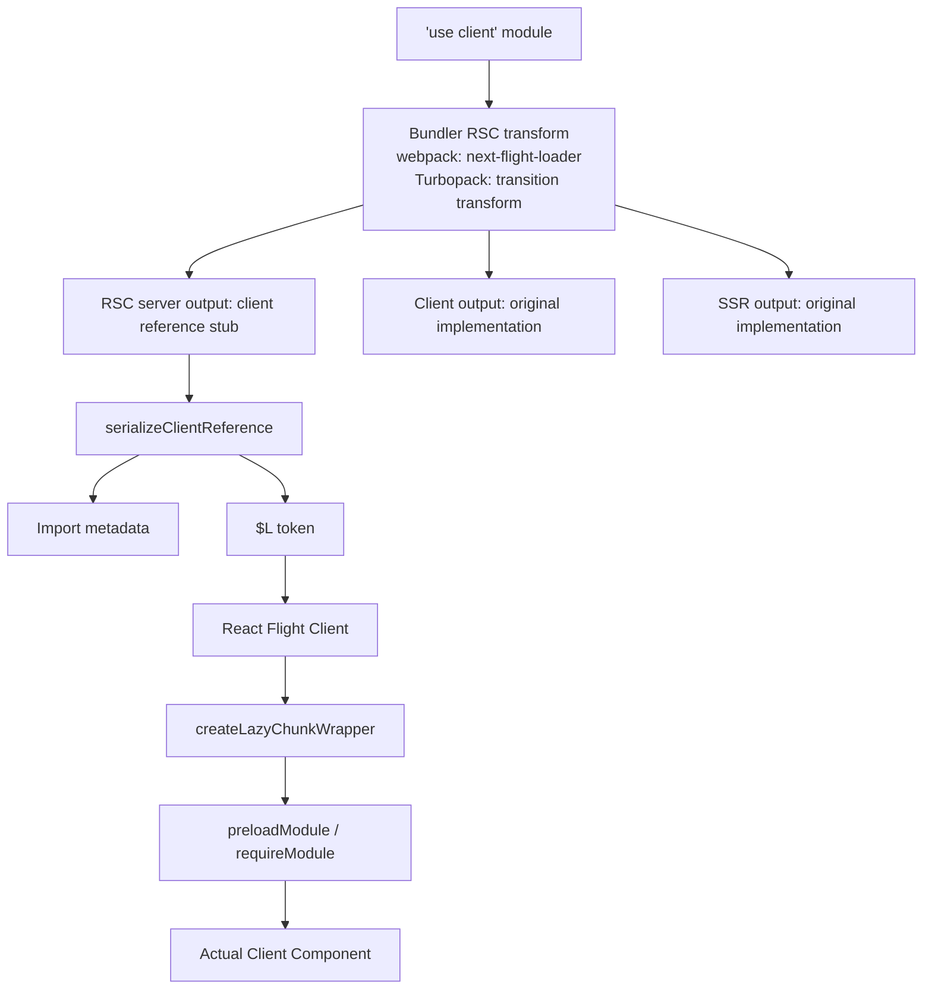

## Table of Contents

## 서론

```tsx
'use client'

import {useState} from 'react'

export function Counter() {
  const [count, setCount] = useState(0)
  return <button onClick={() => setCount(count + 1)}>{count}</button>
}
```

`'use client'` 한 줄. 이걸 파일 맨 위에 적는 순간, 이 모듈의 의미가 바뀐다. 단순히 "클라이언트에서 동작하는 코드"라는 표시가 아니다. 정확히는 **이 모듈이 클라이언트 번들 그래프의 진입점(entry point)** 이라는 마커다. **RSC 렌더러는 이 모듈의 본문을 평가하지 않는다.** 대신 모듈 경계에서 멈추고, "여기에 클라이언트 컴포넌트가 있다"는 **참조(reference)** 만 직렬화한다. 단, 같은 컴포넌트가 Next.js의 첫 응답 경로에서는 별도의 SSR 레이어에서 실행되어 초기 HTML 생성에 참여한다. **서버 측 렌더링 경로가 하나가 아니라는 뜻이다 — RSC 렌더러는 서버 컴포넌트 트리를 Flight Payload로 만들고, SSR 렌더러는 그 결과를 소비해 초기 HTML을 만든다. 이 과정에서 클라이언트 컴포넌트도 SSR 빌드의 구현으로 렌더링된다.** 이 구분은 뒤에서 따로 다룬다.

[이전 글](/2026/03/react-server-functions-deep-dive)에서는 `'use server'`가 어떻게 함수를 RPC 엔드포인트로 변환하는지 끝까지 따라갔다. 이번 글은 그 반대 방향이다. 서버 컴포넌트 트리 한가운데에 클라이언트 컴포넌트가 등장할 때, 빌드 타임에 어떻게 모듈이 분리되고, 런타임에 어떤 토큰이 Flight 스트림을 흐르고, 클라이언트가 어떻게 chunk를 로드해서 실제 컴포넌트로 살려내는가.

용어 정리부터 한다.

- **클라이언트 컴포넌트(Client Component)**: `'use client'` 모듈에서 export되어 React element의 type으로 사용되는 컴포넌트. 클라이언트(또는 SSR)에서 실행되며 hooks, 이벤트 핸들러, state를 사용할 수 있다.
- **클라이언트 참조(Client Reference)**: `'use client'` 모듈의 export를 RSC 서버가 직접 값으로 들고 있는 대신 사용하는 메타데이터 객체. `$$typeof`, `$$id`, `$$async` 속성을 가진다. 컴포넌트 함수일 수도 있고, Client Component에 prop으로 전달 가능한 다른 export일 수도 있다.
- **클라이언트 모듈 프록시(Client Module Proxy)**: 모듈 단위로 만들어지는 Proxy. 어떤 export에 접근하든 해당 export의 클라이언트 참조를 만들어낸다.

> 이 글의 소스 코드 분석은 **React 19.2**, **Next.js 16.2** 기준이다. 버전에 따라 내부 구현이 달라질 수 있다.
>
> 또한 이 글의 코드 인용은 webpack 경로를 따라간다. Next.js 16부터 `next dev` 기본은 Turbopack이지만, 두 번들러의 `'use client'` 처리는 거의 같다 — 핵심 동작 차이는 글 후반부 [Turbopack에서는 무엇이 다른가](#turbopack에서는-무엇이-다른가) 절에서 따로 정리한다.

## 'use client'는 진입점 마커다

가장 먼저 짚어야 할 오해가 있다. "`'use client'`를 적은 컴포넌트만 클라이언트가 되고, 그게 import하는 컴포넌트는 따로 표시해야 한다"는 생각이다. 정확히 반대다.

`'use client'` 디렉티브는 **모듈 그래프의 경계를 정의**한다. 더 정확히는, 서버 → 클라이언트로 넘어가는 **단방향 경계의 시작점**이다. 한 모듈에 `'use client'`가 있으면, 그 모듈이 import하는 모든 모듈은 — 별도로 `'use client'`를 적지 않아도 — 자동으로 클라이언트 번들 그래프에 포함된다.

```
app/page.tsx           ← Server Component (default)
  └─ import Layout     ← Server Component
       └─ import Counter      ← 'use client' (경계!)
            └─ import { format } from './utils'   ← 자동으로 클라이언트
                 └─ import lodash               ← 자동으로 클라이언트
```

반대로, `'use client'` 모듈에서 다시 서버 모듈을 직접 import할 수는 없다. import 방향이 일방통행이다. 단, **`children` prop으로 서버 컴포넌트를 받는 것**은 가능하다. 이건 import가 아니라 prop으로 직렬화된 React element를 전달받는 것이기 때문이다. 이 점이 `'use client'`의 가장 중요한 멘탈 모델이다.

```tsx
// app/page.tsx (Server Component)
import {ClientShell} from './ClientShell'
import {ServerContent} from './ServerContent'

export default function Page() {
  return (
    <ClientShell>
      <ServerContent /> {/* OK — children prop으로 전달 */}
    </ClientShell>
  )
}
```

```tsx
// ClientShell.tsx
'use client'

export function ClientShell({children}: {children: React.ReactNode}) {
  return <div className="shell">{children}</div>
}
```

`ClientShell`은 `ServerContent`를 **import하지 않는다.** Server Component인 `Page`가 두 컴포넌트를 import해서 children으로 조립할 뿐이다. 이 차이가 React Server Components의 컴포지션 모델 전체를 떠받친다.

## 빌드 타임 변환: 같은 모듈, 레이어별로 다르게 빌드된다

`'use client'` 디렉티브는 런타임에 아무 효과가 없다. 진짜 일은 **빌드 타임**에 벌어진다. 그것도 한 모듈이 webpack의 여러 layer — RSC 서버, SSR, 브라우저 클라이언트 — 에서 서로 다른 형태로 컴파일된다. 같은 파일이지만 layer마다 다른 변환 규칙이 적용된다.

### RSC 서버 번들: 본문이 사라진 stub

Next.js의 `next-flight-loader`는 webpack의 RSC 서버 레이어에서 동작하면서, `'use client'` 모듈을 만나면 **원본 코드를 통째로 버리고** 클라이언트 참조로 대체한다. ESM 모듈에 대한 변환은 다음과 같다[^1].

```ts
// 원본: components/Counter.tsx
'use client'

import {useState} from 'react'

export function Counter({initial}: {initial: number}) {
  const [count, setCount] = useState(initial)
  return <button onClick={() => setCount(count + 1)}>{count}</button>
}
```

위 코드는 RSC 서버 번들에서 다음과 비슷한 형태로 변환된다.

```js
// RSC 서버 번들에 들어가는 형태 (개념적)
import {registerClientReference} from 'react-server-dom-webpack/server'

export const Counter = registerClientReference(
  function () {
    throw new Error(
      'Attempted to call Counter() from the server but Counter is on the client. ' +
        "It's not possible to invoke a client function from the server, " +
        'it can only be rendered as a Component or passed to props of a Client Component.',
    )
  },
  'components/Counter.tsx',
  'Counter',
)
```

핵심은 세 가지다.

1. **원본 함수 본문이 사라졌다.** `useState`, JSX, 이벤트 핸들러 — 클라이언트에서만 의미 있는 코드는 RSC 서버 번들에 단 한 글자도 포함되지 않는다.
2. **stub 함수에 메타데이터가 박힌다.** `registerClientReference`가 `$$typeof`, `$$id`, `$$async`를 주입한다. RSC 직렬화 시 이 stub을 만나면 본문 대신 메타데이터로 변환한다.
3. **stub을 호출하면 throw한다.** 서버에서 "함수처럼" 호출하는 실수를 했을 때 명확한 에러를 던진다. 클라이언트 컴포넌트는 React가 렌더링하는 대상이지, 직접 호출하는 함수가 아니다.

CommonJS 모듈에 대해서는 더 단순한 경로를 탄다 — 모듈 전체를 `createClientModuleProxy`의 Proxy로 대체한다(뒤에서 다룬다).

### 클라이언트 번들: 원본 그대로

같은 모듈은 클라이언트 번들에서는 본문이 그대로 남는다. webpack의 클라이언트 레이어는 `'use client'` 디렉티브를 (린트 외에는) 사실상 무시하고, 모듈을 평범한 자바스크립트로 컴파일한다. 그 결과 `Counter` 컴포넌트의 진짜 구현은 **클라이언트 chunk에만 존재**한다.

```
원본 모듈 → ┬─ RSC 서버 빌드: 메타데이터 stub만
            └─ 클라이언트 빌드: 본문 그대로 + 별도 chunk
```

이 분리가 가능한 이유는 webpack의 **layer** 메커니즘 덕분이다. Next.js는 같은 webpack compilation 안에 `WEBPACK_LAYERS.reactServerComponents`(RSC), `WEBPACK_LAYERS.serverSideRendering`(SSR), `WEBPACK_LAYERS.actionBrowser`(액션 브라우저) 등 여러 레이어를 정의하고[^2], 같은 모듈도 어느 레이어에서 import되는지에 따라 다른 변환을 적용한다.

### registerClientReference의 본체

React 측 구현을 직접 보자. `react-server-dom-webpack/src/ReactFlightWebpackReferences.js`[^3]가 정답이다.

```js
const CLIENT_REFERENCE_TAG = Symbol.for('react.client.reference')

export function registerClientReference(proxyImplementation, id, exportName) {
  return registerClientReferenceImpl(
    proxyImplementation,
    id + '#' + exportName,
    false, // async = false
  )
}

function registerClientReferenceImpl(proxyImplementation, id, async) {
  return Object.defineProperties(proxyImplementation, {
    $$typeof: {value: CLIENT_REFERENCE_TAG},
    $$id: {value: id},
    $$async: {value: async},
  })
}
```

서버 참조(`'use server'`) 때 봤던 `registerServerReference`와 데칼코마니다. 다른 점:

| 속성       | 클라이언트 참조                        | 서버 참조                              |
| ---------- | -------------------------------------- | -------------------------------------- |
| `$$typeof` | `Symbol.for('react.client.reference')` | `Symbol.for('react.server.reference')` |
| `$$id`     | `"moduleId#exportName"`                | `"moduleId#exportName"`                |
| `$$async`  | 모듈이 top-level await를 쓰는지        | (없음)                                 |
| `$$bound`  | (없음)                                 | `.bind()`로 누적된 인자들              |

`$$async`가 새로 등장했다. 모듈이 비동기(top-level await 등)인지를 표시한다. 클라이언트 측에서 chunk를 로드할 때 동기 require로 끝나는지, Promise를 await해야 하는지 결정한다.

### createClientModuleProxy: 한 번에 모듈 전체 감싸기

CJS 경로나 매니페스트 자동 생성이 어려운 경우에는 모듈 전체를 한 번에 클라이언트 참조로 만든다. 이때 `createClientModuleProxy`가 쓰인다.

```js
export function createClientModuleProxy(moduleId) {
  const clientReference = registerClientReferenceImpl({}, moduleId, false)
  return new Proxy(clientReference, proxyHandlers)
}

const proxyHandlers = {
  get: function (target, name, receiver) {
    return getReference(target, name)
  },
  getOwnPropertyDescriptor: function (target, name) {
    let descriptor = Object.getOwnPropertyDescriptor(target, name)
    if (!descriptor) {
      descriptor = {
        value: getReference(target, name),
        writable: false,
        configurable: false,
        enumerable: false,
      }
      Object.defineProperty(target, name, descriptor)
    }
    return descriptor
  },
  getPrototypeOf(target) {
    return PROMISE_PROTOTYPE
  },
  set: function () {
    throw new Error('Cannot assign to a client module from a server module.')
  },
}
```

빈 객체 `{}`에 모듈 ID를 박은 ClientReference를 만들고, 그걸 Proxy로 감싼다. 이 Proxy의 `get` 트랩이 핵심이다 — 어떤 export 이름으로 접근하든 `getReference(target, name)`이 호출된다.

```js
function getReference(target, name) {
  switch (name) {
    case '$$typeof':
      return target.$$typeof
    case '$$id':
      return target.$$id
    case '$$async':
      return target.$$async
    case 'name':
      return target.name
    case 'defaultProps':
      return undefined
    case '_debugInfo':
      return undefined
    case 'toJSON':
      return undefined
    case Symbol.toPrimitive:
      return Object.prototype[Symbol.toPrimitive]
    case Symbol.toStringTag:
      return Object.prototype[Symbol.toStringTag]
    case '__esModule':
      // ESM interop. default export까지 lazy로 만든다.
      target.default = registerClientReferenceImpl(
        function () {
          throw new Error('...')
        },
        target.$$id + '#',
        target.$$async,
      )
      return true
    case 'then':
      if (target.then) return target.then // 캐시 hit
      if (!target.$$async) {
        // 동기 모듈: thenable로 위장한다.
        // 자기 자신을 fulfilled value로 들고 있는 then을 만든다.
        const clientReference = registerClientReferenceImpl(
          {},
          target.$$id,
          true /* async */,
        )
        const proxy = new Proxy(clientReference, proxyHandlers)
        target.status = 'fulfilled'
        target.value = proxy
        const then = (target.then = registerClientReferenceImpl(
          function then(resolve, reject) {
            return Promise.resolve(resolve(proxy))
          },
          target.$$id + '#then',
          false,
        ))
        return then
      }
      // async 모듈: undefined. webpack이 자체 thenable 처리를 한다.
      return undefined
  }
  if (typeof name === 'symbol') {
    throw new Error(
      'Cannot read Symbol exports. Only named exports are supported.',
    )
  }
  // 그 외 named export — 동적으로 ClientReference를 만들어 캐싱
  let cachedReference = target[name]
  if (!cachedReference) {
    const reference = registerClientReferenceImpl(
      function () {
        throw new Error('...')
      },
      target.$$id + '#' + name,
      target.$$async,
    )
    Object.defineProperty(reference, 'name', {value: name})
    cachedReference = target[name] = new Proxy(reference, deepProxyHandlers)
  }
  return cachedReference
}
```

`Counter`라는 export에 처음 접근하면 `"components/Counter.tsx#Counter"`라는 ID로 ClientReference를 만들고 캐싱한다. 두 번째 접근부터는 같은 객체를 반환한다. 이 lazy 생성 패턴 덕분에 모듈에 어떤 export가 있는지 빌드 시점에 정적으로 분석할 필요가 없다 — 접근 시점에 만들어지면 된다.

`then` 분기가 가장 흥미롭다. 직관과 살짝 어긋나게 동작한다.

- **동기 모듈**(`!$$async`)에서 `then` 접근 시: `then` 함수를 동적으로 만들어 반환한다. 이 then은 자기 자신(proxy)을 즉시 resolve하는 함수다. 즉, 동기 모듈인데도 **외부에 thenable처럼 보이게** 만들어서, dynamic import의 await 경로를 통과할 수 있게 한다. RSC 서버에서 `await import('./ClientCounter')`를 했을 때 무한 루프나 에러 없이 모듈 객체를 받게 하기 위한 장치다.
- **async 모듈**(`$$async`)에서 `then` 접근 시: `undefined` 반환. webpack이 async 모듈을 별도 메커니즘으로 thenable 처리하므로, 우리가 then을 만들면 안 된다.

`getPrototypeOf`가 `PROMISE_PROTOTYPE`을 반환하는 것도 같은 맥락에서 읽힌다. dynamic import 결과는 Promise이므로, 클라이언트 모듈 Proxy의 프로토타입을 `Promise.prototype`처럼 보이게 만들어 두면 외부 코드가 이 객체를 Promise처럼 다뤄도 큰 문제가 생기지 않는다. (정확한 의도는 React 소스에 직접 주석으로 적혀있지 않으니, 위 추론은 "그렇게 다뤄지면 동작이 자연스럽다" 수준의 해석으로 받아들이면 된다.)

`set` 트랩은 단호하다 — 서버 코드에서 클라이언트 모듈의 export를 덮어쓰려는 시도는 무조건 throw다.

### Next.js의 next-flight-loader: 두 갈래 변환

Next.js 측에서 위 변환을 적용하는 주체는 `next-flight-loader`다[^1]. 모듈 타입(ESM/CJS)을 자동 판별하고 다르게 처리한다.

- **ESM**: 각 export를 `registerClientReference(stub, resourceKey, exportName)`로 감싸 stub으로 대체. 명시적 named export만 허용한다. `export *`는 거부한다 — 어떤 이름이 export되는지 빌드 시점에 알 수 없으면 stub을 만들 수 없기 때문이다.
- **CJS**: 모듈 전체를 `createProxy(resourceKey)` 한 줄로 대체. 어떤 export가 있는지 모르므로 Proxy의 lazy 생성에 의존한다.

`resourceKey`는 파일 경로 + 추가 query string 형태다. 같은 파일에서 여러 export를 만들거나, barrel optimizer가 같은 파일의 여러 부분을 다른 모듈로 쪼갠 경우를 구분하기 위해서다.

> **여기까지 정리.** 빌드가 끝나면 RSC 서버 번들에는 클라이언트 컴포넌트의 실제 코드가 단 한 줄도 들어있지 않다. `moduleId#exportName` 형태의 ID와 `$$typeof`/`$$id`/`$$async` 메타데이터만 박힌 stub들만 남아 있다. 진짜 컴포넌트 본문은 SSR 번들과 클라이언트 번들에 따로따로 들어가 있다. 이 stub이 RSC 직렬화 시점에 import chunk metadata로 변환되는데, 그 변환은 다음 섹션의 일이다.

## 클라이언트 진입점: flight-client-entry-plugin

webpack은 기본적으로 entry point에서 시작해 import graph를 따라가며 chunk를 만든다. 그런데 RSC에서는 server 코드가 `'use client'` 모듈을 import하지 않는다 — import 자체가 `registerClientReference` 호출로 변환됐으니까. 그러면 webpack은 클라이언트 모듈의 존재를 어떻게 알까?

답: **별도의 entry point를 추가로 만든다**. 이게 `flight-client-entry-plugin`의 역할이다[^2].

```
서버 entry (RSC)
  └─ Server Component
       └─ "이 자리에 ClientShell이 있다" (registerClientReference)

클라이언트 entry (자동 생성)
  ├─ ClientShell.tsx (실제 코드)
  └─ Counter.tsx (실제 코드)
```

플러그인의 흐름은 이렇다.

1. `createClientEntries()`가 서버 컴파일의 entry들을 순회한다.
2. `collectComponentInfoFromServerEntryDependency()`가 각 entry의 의존성 그래프를 따라가며, 빌드 메타데이터(loader가 prepend한 RSC 메타 정보)를 보고 클라이언트 컴포넌트와 server action을 식별한다.
3. `injectClientEntryAndSSRModules()`가 식별된 클라이언트 모듈들을 entry로 묶어 `next-flight-client-entry-loader`로 webpack에 inject한다. 이때 **두 개의 entry**가 동시에 만들어진다 — **클라이언트(브라우저) 빌드용**과 **SSR 빌드용**.

같은 클라이언트 컴포넌트가 두 번 빌드되는 이유는 SSR 때문이다. 클라이언트 컴포넌트는 첫 페이지 응답에서 HTML로도 렌더링되어야 한다(progressive enhancement, JS 실행 전 컨텐츠 가시성). 그래서:

- **클라이언트 entry**: 브라우저로 보낼 chunk. hydration 후 인터랙티브 컴포넌트가 됨.
- **SSR entry**: HTML 렌더링용. RSC 서버와는 다른 layer에서 실행되며, 결과는 첫 응답의 HTML에 stream된다.

production에서 같은 코드가 두 번 빌드되는 셈이다. 의도된 비용이다.

## 클라이언트 매니페스트: ID → chunk URL

빌드가 끝나면 Next.js는 `client-reference-manifest.js`라는 매니페스트 파일을 emit한다[^4]. 이게 RSC 서버가 클라이언트 참조를 직렬화할 때 참조하는 사전이다.

```ts
// 매니페스트의 한 entry 형태 (개념적)
{
  id: "5234",                          // webpack 모듈 ID
  name: "Counter",                     // export 이름. '*'이면 전체 모듈
  chunks: [
    "12",  "static/chunks/12-abc.js",  // [chunkId, fileName] 페어
    "5234", "static/chunks/5234-def.js"
  ],
  async: false,
}
```

이 entry가 매니페스트의 여러 매핑 안에 들어간다.

```ts
interface ClientReferenceManifest {
  moduleLoading: {prefix: string; crossOrigin: string | null}
  clientModules: Record<string, ManifestNode> // key = "moduleId#exportName"
  ssrModuleMapping: Record<string, Record<string, ManifestNode>>
  edgeSSRModuleMapping: Record<string, Record<string, ManifestNode>>
  rscModuleMapping: Record<string, Record<string, ManifestNode>>
  edgeRscModuleMapping: Record<string, Record<string, ManifestNode>>
  entryCSSFiles: Record<string, string[]>
}
```

`clientModules`는 RSC 서버가 클라이언트 참조를 직렬화할 때 lookup용으로 쓴다. `ssrModuleMapping`과 `edgeSSRModuleMapping`은 SSR 시 같은 컴포넌트의 SSR 빌드 모듈 ID를 찾는 용도다. 같은 컴포넌트가 RSC layer, SSR layer, 클라이언트 layer에서 각각 다른 모듈 ID를 가지므로, 이들 간 매핑이 필요하다.

`chunks` 필드의 형태가 조금 특이하다. **alternating pair** — `[chunkId1, fileName1, chunkId2, fileName2, ...]` 식으로 쭉 늘어놓는다. 중첩 배열이 아니라 평탄한 배열이라 직렬화 비용이 작다. 클라이언트는 이 페어를 두 개씩 끊어 읽으면서 chunk를 fetch한다.

파일 경로는 `encodeURIPath()`로 인코딩된다. webpack이 만들어낸 chunk 파일명에 `[`, `]` 같은 reserved 문자가 들어갈 수 있어서 그대로 URL로 쓰면 안 되기 때문이다.

## 직렬화: serializeClientReference와 $L 토큰

RSC 서버가 컴포넌트 트리를 Flight Protocol로 직렬화할 때, 어떤 위치에서 ClientReference를 만나면 어떻게 인코딩할까. 답은 **위치에 따라 다르다**.

### 함수 값 분기

`react-server/src/ReactFlightServer.js`[^5]는 트리를 직렬화하면서 함수 값을 만나면 ClientReference인지 ServerReference인지 분기한다.

```js
if (typeof value === 'function') {
  if (isClientReference(value)) {
    return serializeClientReference(request, parent, parentPropertyName, value)
  }
  if (isServerReference(value)) {
    return serializeServerReference(request, value)
  }
  // 둘 다 아닌 일반 함수 → 직렬화 불가, 에러
}

export function isClientReference(reference) {
  return reference.$$typeof === Symbol.for('react.client.reference')
}
```

체크는 단순하다. `$$typeof`가 클라이언트 참조 태그인지 본다.

### serializeClientReference의 두 갈래

```js
function serializeClientReference(
  request,
  parent,
  parentPropertyName,
  clientReference,
) {
  const clientReferenceKey = getClientReferenceKey(clientReference)
  const writtenClientReferences = request.writtenClientReferences
  const existingId = writtenClientReferences.get(clientReferenceKey)

  if (existingId !== undefined) {
    // 이미 직렬화된 참조 — chunk를 재사용
    if (parent[0] === REACT_ELEMENT_TYPE && parentPropertyName === '1') {
      return serializeLazyID(existingId) // "$L" + hex
    }
    return serializeByValueID(existingId) // "$" + hex
  }

  try {
    const clientReferenceMetadata = resolveClientReferenceMetadata(
      request.bundlerConfig,
      clientReference,
    )
    request.pendingChunks++
    const importId = request.nextChunkId++
    emitImportChunk(request, importId, clientReferenceMetadata)
    writtenClientReferences.set(clientReferenceKey, importId)

    if (parent[0] === REACT_ELEMENT_TYPE && parentPropertyName === '1') {
      return serializeLazyID(importId)
    }
    return serializeByValueID(importId)
  } catch (x) {
    request.pendingChunks++
    const errorId = request.nextChunkId++
    emitErrorChunk(request, errorId, ...)
    return serializeByValueID(errorId)
  }
}

function serializeLazyID(id) {
  return '$L' + id.toString(16)
}

function serializeByValueID(id) {
  return '$' + id.toString(16)
}
```

핵심 분기는 `parent[0] === REACT_ELEMENT_TYPE && parentPropertyName === '1'`이다. **부모가 React element이고 현재 위치가 type 슬롯(인덱스 1)** 이면 `$L` (lazy) 토큰이 된다. 그 외 위치 — 예를 들어 props 안에 클라이언트 참조가 들어가 있으면 — `$<id>` (by-value reference) 토큰이 된다.

React element의 직렬화 형태를 떠올려 보자.

```
["$", "type", null, props]
 ↑    ↑
 element marker
      └─ 이 자리가 인덱스 1, 즉 type 슬롯
```

type 슬롯의 클라이언트 참조는 "이 컴포넌트의 코드는 lazy하게 로드된다"는 의미가 된다. props에 들어간 클라이언트 참조는 — 예: 자식으로 클라이언트 컴포넌트를 prop으로 넘긴 경우 — 단순히 import 메타데이터를 가리키는 참조다.

### import chunk: 메타데이터를 별도 행으로

`emitImportChunk`는 매니페스트에서 lookup한 메타데이터(`[id, chunks, name, async]`)를 별도의 chunk로 emit한다. Flight Protocol의 행 기반 스트리밍 구조 안에서 이 chunk는 `I` 행으로 직렬화된다.

```
I:5:["5234",["12","static/chunks/12-abc.js"],"Counter",0]
0:["$","$L5",null,{"initial":42}]
```

- `I:5:...` — 5번 chunk가 import metadata. `[moduleId, chunks배열, exportName, async]` 페어.
- `0:["$","$L5",null,{"initial":42}]` — 루트 element. type 자리에 `$L5`가 박혀있다.

클라이언트는 이 스트림을 받으면서 5번 chunk의 메타데이터를 보고 chunk URL을 fetch하기 시작한다. 동시에 루트 element의 type 슬롯에는 React lazy 컴포넌트가 만들어진다 — chunk가 도착하면 실제 `Counter` 컴포넌트로 resolve된다.

### Flight Protocol에서 클라이언트 참조 위치별 토큰

| 위치                       | 토큰      | 의미                                          |
| -------------------------- | --------- | --------------------------------------------- |
| React element의 type 슬롯  | `$L<hex>` | lazy 노드로 감싸 컴포넌트 단위 suspend 가능   |
| 그 외 위치 (props 안 포함) | `$<hex>`  | by-value 참조 — import metadata를 가리키는 ID |

이 규칙이 의미하는 바는 이렇다. element type 위치의 클라이언트 참조는 React가 lazy 컴포넌트로 해석할 수 있어 그 컴포넌트 단위로 suspend된다. props 안의 참조는 일반 값 참조로 전달되므로 type 자리와 같은 lazy 처리 경로를 자동으로 타지는 않는다 — 사용하는 쪽에서 그 참조를 어떤 위치에 두느냐에 따라 결과가 달라진다.

## 클라이언트 측: $L에서 실제 컴포넌트로

이제 시야를 클라이언트로 옮긴다. Flight 스트림이 도착하면 `react-client/src/ReactFlightClient.js`[^6]가 한 행씩 파싱한다. 핵심은 `parseModelString`이다 — `$`로 시작하는 토큰을 만나면 두 번째 글자로 분기한다.

```js
function parseModelString(response, parentObject, key, value) {
  if (value[0] === '$') {
    switch (value[1]) {
      case '$':
        return value.slice(1) // 이스케이프된 $
      case 'L': {
        const id = parseInt(value.slice(2), 16)
        const chunk = getChunk(response, id)
        return createLazyChunkWrapper(chunk, 0)
      }
      case '@': {
        const id = parseInt(value.slice(2), 16)
        return getChunk(response, id) // Promise
      }
      case 'S':
        return Symbol.for(value.slice(2))
      case 'h': {
        const ref = value.slice(2)
        return getOutlinedModel(
          response,
          ref,
          parentObject,
          key,
          loadServerReference,
        )
      }
      case 'Q': {
        const ref = value.slice(2)
        return getOutlinedModel(response, ref, parentObject, key, createMap)
      }
      case 'W': {
        const ref = value.slice(2)
        return getOutlinedModel(response, ref, parentObject, key, createSet)
      }
      case 'B': {
        const ref = value.slice(2)
        return getOutlinedModel(response, ref, parentObject, key, createBlob)
      }
      case 'K': {
        const ref = value.slice(2)
        return getOutlinedModel(
          response,
          ref,
          parentObject,
          key,
          createFormData,
        )
      }
      case 'D':
        return new Date(Date.parse(value.slice(2)))
      case 'n':
        return BigInt(value.slice(2))
      case 'I':
        return Infinity
      case '-':
        if (value === '$-0') return -0
        return -Infinity
      case 'N':
        return NaN
      case 'u':
        return undefined
      // ...
    }
  }
  return value
}
```

`'use server'` 글에서 봤던 토큰 테이블이 이 한 함수에 모여있다. `$L`이 새로 등장한다.

### $L → React.lazy

```js
case 'L': {
  const id = parseInt(value.slice(2), 16)
  const chunk = getChunk(response, id)
  return createLazyChunkWrapper(chunk, 0)
}

function createLazyChunkWrapper(chunk, validated) {
  return {
    $$typeof: REACT_LAZY_TYPE,
    _payload: chunk,
    _init: readChunk,
  }
}
```

`$L5`를 만나면 5번 chunk를 가져와서 React lazy 컴포넌트를 만든다. 이게 바로 `React.lazy()`로 만드는 lazy 컴포넌트와 같은 형태다. React reconciler는 이 노드를 만나면 `_init(_payload)`을 호출해서 chunk를 resolve하려 시도하고, 아직 로딩 중이면 Promise를 throw해서 가장 가까운 Suspense boundary가 fallback을 보여주게 한다.

### chunk가 import metadata일 때

5번 chunk는 위에서 `I:5:[...]` 행으로 emit된 import metadata다. 클라이언트 측에서 이 chunk를 만나면 다음 흐름을 탄다.

```js
function resolveModuleChunk(response, chunk, value) {
  // chunk.value에 ClientReference 메타데이터가 들어간다
  const resolvedChunk = chunk
  resolvedChunk.status = RESOLVED_MODULE
  resolvedChunk.value = value
  // ...
}

function readChunk(chunk) {
  switch (chunk.status) {
    case RESOLVED_MODULE:
      initializeModuleChunk(chunk)
      break
  }
  // ...
  switch (chunk.status) {
    case INITIALIZED:
      return chunk.value
    case PENDING:
    case BLOCKED:
      throw chunk // Suspense
    default:
      throw chunk.reason
  }
}

function initializeModuleChunk(chunk) {
  try {
    const value = requireModule(chunk.value)
    chunk.status = INITIALIZED
    chunk.value = value
  } catch (error) {
    chunk.status = ERRORED
    chunk.reason = error
  }
}
```

핵심은 `requireModule(chunk.value)`다. `requireModule`은 bundler-specific 구현이고, webpack에서는 다음과 같이 동작한다[^7].

```js
// react-server-dom-webpack/src/client/ReactFlightClientConfigBundlerWebpack.js

export function preloadModule(metadata) {
  const chunks = metadata[1]
  const promises = []
  for (let i = 0; i < chunks.length; i += 2) {
    const chunkId = chunks[i]
    const chunkFilename = chunks[i + 1]
    const entry = chunkCache.get(chunkId)
    if (entry === undefined) {
      const thenable = loadChunk(chunkId, chunkFilename)
      promises.push(thenable)
      chunkCache.set(chunkId, thenable)
    } else if (entry !== null) {
      promises.push(entry)
    }
  }
  if (metadata[3] /* async */) {
    if (promises.length === 0) {
      return requireAsyncModule(metadata[0])
    }
    return Promise.all(promises).then(() => requireAsyncModule(metadata[0]))
  }
  return promises.length === 0 ? null : Promise.all(promises)
}

export function requireModule(metadata) {
  let moduleExports = __webpack_require__(metadata[0])
  // async 모듈이면 .value로 접근
  if (metadata[3] /* async */) {
    if (moduleExports.status === 'fulfilled') {
      moduleExports = moduleExports.value
    } else {
      throw moduleExports.reason
    }
  }
  if (metadata[2] /* exportName */ === '*') {
    return moduleExports
  }
  if (metadata[2] === '') {
    return moduleExports.__esModule ? moduleExports.default : moduleExports
  }
  return moduleExports[metadata[2]]
}
```

`metadata`는 `[id, chunks, name, async]` 튜플이다.

1. `preloadModule`: `chunks` 페어를 두 개씩 끊어 `loadChunk`로 chunk 파일을 fetch한다. 이미 캐싱된 chunk는 건너뛴다. 동기 모듈이면 chunk만 받으면 끝, async 모듈이면 추가로 `requireAsyncModule`을 await해야 한다.
2. `requireModule`: `__webpack_require__`로 모듈을 resolve하고, `name`에 따라 export를 추출한다.

`*`이면 모듈 전체, `''`(빈 문자열)이면 default export(ESM interop), 그 외엔 named export. 빌드 타임에 만들어진 매니페스트의 `name` 필드가 여기서 결정된다.

### chunkCache: 한 번 받으면 끝

`chunkCache`는 모듈 단위가 아니라 chunk 단위 캐시다. 클라이언트 컴포넌트 100개가 같은 chunk를 공유하면 — 흔한 일이다, webpack이 vendors chunk를 만드니까 — 그 chunk는 단 한 번만 받는다. 두 번째부터는 캐시 히트로 끝난다.

이게 의미하는 바: **같은 모듈을 여러 곳에서 import해도 클라이언트 입장에서 chunk 다운로드는 한 번**이다. RSC payload는 매번 ClientReference 메타데이터를 포함하지만, 메타데이터는 가볍고(수십 바이트), chunk URL은 dedup된다.

> **여기까지 정리.** RSC 서버는 트리를 순회하다 클라이언트 참조를 만나면 매니페스트에서 `[id, chunks, name, async]`를 꺼내 import chunk로 emit한다. element type 자리면 `$L<hex>`, 그 외 자리면 `$<hex>` 토큰이 박힌다. 클라이언트는 `$L`을 만나면 React lazy 노드를 만들고, `preloadModule`로 chunk를 fetch하고, `requireModule`(`__webpack_require__`)로 실제 컴포넌트를 resolve한다. 같은 chunk는 `chunkCache`로 dedup된다. 여기까지가 직렬화 라운드트립의 끝이다 — 다음으로 RSC 서버 외에 또 하나의 서버 측 렌더러, SSR 레이어가 등장한다.

## SSR과 RSC, 그리고 두 개의 컴포넌트 트리

여기서부터 멘탈 모델이 흔들리기 쉽다. 단순한 그림은 이렇다.

```
[브라우저 첫 요청]
1. 서버에서 HTML 렌더링 → Streaming
2. 브라우저 hydration

[이후]
3. 클라이언트가 서버에 RSC 요청 → Flight 스트림 받기
```

그런데 RSC가 들어오면 서버 측이 더 복잡해진다.

```
[브라우저 첫 요청]
1. RSC 서버: 서버 컴포넌트 트리를 Flight 스트림으로 렌더링
   - 클라이언트 컴포넌트는 $L<id> + import metadata로 직렬화
2. SSR 서버(같은 프로세스, 다른 layer): Flight 스트림을 받아서
   - $L<id>를 만나면 SSR 빌드의 클라이언트 모듈을 require해서 실제 렌더
   - 결과를 HTML로 stream
3. 브라우저: HTML 받으며 표시 + 끝에 Flight 스트림 + 클라이언트 chunk 받기
4. hydration: 클라이언트 chunk가 도착하면 HTML과 Flight 스트림을 결합해 React 트리 생성, 이벤트 리스너 부착
```

같은 Counter 컴포넌트가 — 같은 한 페이지에서 — 서로 다른 환경 세 곳에서 다뤄진다.

| 환경                 | 빌드 layer              | 역할                            |
| -------------------- | ----------------------- | ------------------------------- |
| RSC 서버             | `reactServerComponents` | 클라이언트 참조로 직렬화만      |
| SSR 서버             | `serverSideRendering`   | 첫 응답 HTML을 만드는 실제 렌더 |
| 브라우저(클라이언트) | (default)               | hydration + 이후 인터랙션       |

매니페스트에 `ssrModuleMapping`과 `clientModules`가 따로 있는 이유가 이것이다. 같은 `"Counter.tsx#Counter"` 키에 대해 SSR layer의 모듈 ID와 클라이언트 layer의 모듈 ID가 다르고, 두 매핑 모두를 RSC 서버가 들고 있어야 한다. SSR layer는 RSC payload를 소비할 때 `ssrModuleMapping`을 사용해서 서버 측 webpack require로 모듈을 가져오고, 클라이언트는 `clientModules`를 사용해서 chunk URL을 fetch한다.

### 'use client'는 SSR도 막지 않는다

자주 받는 질문. "`'use client'`인데 왜 서버에서도 렌더되지?" 정답: **SSR은 클라이언트 컴포넌트를 막지 않는다.** RSC 서버만 막는다. SSR 서버는 클라이언트 컴포넌트의 본문을 정상적으로 실행해서 HTML을 만든다. 단, `useState`의 초기값만 반영된 정적 HTML이고, 이벤트 핸들러는 hydration 후 부착된다.

이 구분을 잡고 나면 "서버에서 절대 실행되면 안 되는 코드" — 예: `window.localStorage`에 접근하는 코드 — 가 SSR에서도 깨진다는 것을 이해할 수 있다. `'use client'`로는 부족하고, `useEffect`로 감싸거나 `typeof window !== 'undefined'` 체크를 해야 한다.

```tsx
'use client'

import {useState, useEffect} from 'react'

export function Theme() {
  // ❌ SSR에서도 실행됨. window 없음 → 에러
  // const [theme, setTheme] = useState(localStorage.getItem('theme'))

  const [theme, setTheme] = useState<string | null>(null)

  // ✅ 브라우저에서만 실행
  useEffect(() => {
    setTheme(localStorage.getItem('theme'))
  }, [])

  return <div data-theme={theme}>...</div>
}
```

## props 직렬화: 무엇을 넘길 수 있는가

서버 컴포넌트가 클라이언트 컴포넌트에 props를 전달하면, 그 props는 **Flight Protocol로 직렬화**되어 RSC payload에 실린다. `'use server'` 글에서 다룬 직렬화 토큰 테이블이 그대로 적용된다.

### 직렬화 가능 / 불가능

| 타입                                                         | 가능 여부 | 비고                             |
| ------------------------------------------------------------ | --------- | -------------------------------- |
| `string`, `number`, `bigint`, `boolean`, `undefined`, `null` | ✅        | 원시 타입                        |
| `Symbol.for('name')`                                         | ✅        | 전역 레지스트리에 등록된 심볼만  |
| `Array`, `Map`, `Set`, `TypedArray`, `ArrayBuffer`           | ✅        |                                  |
| `Date`, `FormData`, `Promise`                                | ✅        |                                  |
| 일반 객체 (`{}`, `{ key: value }`)                           | ✅        | object initializer로 만든 것     |
| Server Function (`'use server'` 함수)                        | ✅        | `$h<id>` 토큰                    |
| **Server Component(JSX) — children/slot**                    | ✅        | `$L<id>` lazy 또는 직렬화된 트리 |
| 일반 함수, 화살표 함수, 클래스 메서드                        | ❌        | 코드는 네트워크를 못 넘는다      |
| 클래스 인스턴스                                              | ❌        | 프로토타입 체인 복원 불가        |
| DOM 노드, 이벤트 객체                                        | ❌        | 네이티브, 순환 참조              |
| 전역 레지스트리에 없는 `Symbol()`                            | ❌        |                                  |

이 표는 props 직렬화에서 가장 자주 만나는 함정 두 개를 시사한다.

**일반 함수는 못 넘긴다.** 흔한 실수다.

```tsx
// ❌ Server Component에서 핸들러를 만들어 Client Component에 전달
export default function Page() {
  return <ClientButton onClick={() => console.log('hi')} />
}
```

작동하지 않는다. `() => console.log('hi')`는 일반 함수라 직렬화가 안 된다. 두 가지 해법이 있다.

1. **Server Function으로 만들기**: `'use server'`를 붙여 RPC 엔드포인트로.
2. **Client Component 안에서 정의**: 핸들러를 클라이언트 코드에 넣는다.

대부분은 (2)다. UI 이벤트 핸들러는 일반적으로 클라이언트 코드의 일부니까.

**이벤트 객체도 못 넘긴다.**

```tsx
// ❌ Server Function에 이벤트 객체 그대로 넘기기
<button onClick={(e) => updatePost(e)}>

// ✅ 필요한 값만 추출
<button onClick={() => updatePost(postId)}>
```

이벤트 객체는 DOM 노드와 순환 참조 덩어리다. 직렬화 시도조차 안 한다.

### children prop의 비밀

Server Component를 children으로 받는 패턴이 가능한 이유를 다시 짚는다.

```tsx
'use client'
export function Card({children}: {children: React.ReactNode}) {
  return <div className="card">{children}</div>
}
```

```tsx
// app/page.tsx (Server Component)
import {Card} from './Card'
import {db} from '@/lib/db'

export default async function Page() {
  const post = await db.posts.findFirst()
  return (
    <Card>
      <article>
        <h1>{post.title}</h1>
        <p>{post.content}</p>
      </article>
    </Card>
  )
}
```

`Card`(클라이언트)에 들어가는 children은 **이미 RSC 서버에서 렌더링이 끝난 React element 트리**다. 직렬화된 형태로 props에 실려서 클라이언트로 전달된다. 클라이언트의 `Card`는 그 트리를 그대로 children 자리에 박는다.

children에 클라이언트 컴포넌트가 섞여 있어도 된다 — 그건 다시 `$L<id>` 토큰으로 직렬화되어 클라이언트가 chunk를 로드하는 식으로 풀려난다.

이 패턴 — "클라이언트 shell + 서버 children" — 이 RSC 컴포지션의 핵심 무기다. 인터랙티브 wrapper(탭, 모달, 사이드바)는 클라이언트로, 그 안에 들어가는 컨텐츠는 서버로. 번들 크기는 작고, 데이터 페칭은 서버에서 끝난다.

## 사용 시 주의사항

### 1. 'use client'를 가능한 leaf로 미루기

`'use client'`가 import graph의 진입점이라는 사실은 직접적인 결과를 낳는다 — **상위에 두면 그 아래 모든 게 클라이언트 번들에 들어간다.**

가장 나쁜 패턴은 layout이나 page에 무심코 `'use client'`를 적는 것이다.

```tsx
// ❌ app/dashboard/layout.tsx
'use client'

import {ThemeProvider} from '@/lib/theme'

export default function Layout({children}) {
  return <ThemeProvider>{children}</ThemeProvider>
}
```

`children`이 children prop으로 전달되니 children은 서버 컴포넌트일 수 있지만, **`ThemeProvider`가 import하는 모든 의존성이 클라이언트 번들에 들어간다.** 만약 `@/lib/theme`이 또 다른 무거운 라이브러리들을 import하면 폭발적으로 커진다.

해결: ThemeProvider만 분리.

```tsx
// app/dashboard/layout.tsx (Server Component)
import {ThemeProvider} from './ThemeProvider'

export default function Layout({children}) {
  return <ThemeProvider>{children}</ThemeProvider>
}

// app/dashboard/ThemeProvider.tsx
'use client'

import {createContext, useState} from 'react'

export function ThemeProvider({children}) {
  // ...
  return <Context.Provider value={...}>{children}</Context.Provider>
}
```

원칙: **`'use client'`는 인터랙티브한 코드를 직접 담은 leaf 컴포넌트에만**. provider, context, 인터랙션이 필요한 leaf — 이런 것들을 별도 파일로 분리해서 그 파일에만 디렉티브를 둔다.

### 2. barrel 파일 + 'use client'는 위험하다

여러 컴포넌트를 한 파일에 모아 re-export하는 barrel 파일에 `'use client'`를 붙이면, 그 파일 전체가 한 덩어리의 클라이언트 모듈이 된다. 사용자가 그중 하나만 import해도 webpack은 barrel 모듈 전체를 클라이언트 그래프에 넣는다.

```tsx
// ❌ components/index.ts
'use client'
export {Button} from './Button'
export {Modal} from './Modal' // 무거운 라이브러리 의존성
export {RichEditor} from './RichEditor' // 1MB+ 의존성
```

```tsx
// 사용 측
import {Button} from '@/components' // RichEditor도 같이 끌려옴
```

해결책 두 가지.

1. **barrel 파일에 `'use client'` 적지 않기** — barrel 자체는 server-friendly로 두고, 각 leaf 파일에서 따로 `'use client'`를 적는다.
2. **개별 파일로 직접 import** — `import {Button} from '@/components/Button'`.

Next.js의 `optimizePackageImports`가 barrel을 자동으로 흩어주지만, 모든 케이스에 통하지 않는다. 의도적으로 leaf import로 가는 게 안전하다.

### 3. 클라이언트 컴포넌트 안에서 서버 코드 import 금지

`'use client'` 모듈에서 `import 'server-only'`로 마킹된 모듈을 import하면 빌드가 깨진다. 의도된 차단이다.

```tsx
// lib/db.ts
import 'server-only'
export const db = ...
```

```tsx
// ❌ Counter.tsx
'use client'
import {db} from '@/lib/db' // 빌드 에러
```

이 경계를 깨면 서버에서만 있어야 하는 코드(API 키, DB 커넥션)가 클라이언트 번들로 새 나갈 수 있다. `server-only` 패키지는 클라이언트 빌드에서 import하면 즉시 에러를 던지는 단순한 가드다. 보안 측면에서 핵심 도구다.

### 4. props는 매 RSC payload에 들어간다

클라이언트 컴포넌트 자체의 코드는 chunk로 한 번만 받지만, **props는 매 RSC payload마다 직렬화되어 전송된다.** 큰 객체를 props로 넘기면 그게 그대로 RSC payload 크기가 된다.

```tsx
// ❌ 거대한 데이터를 prop으로
const allUsers = await db.users.findMany() // 1MB+
return <UserList users={allUsers} />
```

이런 경우 두 가지 대안이 있다.

1. **Server Component에서 직접 렌더링**: `UserList`를 Server Component로 만들어 자체적으로 데이터를 표시한다. 클라이언트 인터랙션이 필요한 부분만 안쪽 leaf로 분리.
2. **데이터 슬라이싱**: 클라이언트 컴포넌트가 정말로 필요로 하는 필드만 추출해서 넘긴다.

### 5. Context는 Provider가 클라이언트일 때만 동작한다

React Context는 클라이언트 트리에만 존재한다. Server Component는 context를 read할 수 없다(쓸 수도 없다). 그래서 context로 데이터를 prop drilling 회피하려 한다면, **Provider도 클라이언트, consumer도 클라이언트**여야 한다.

```tsx
// ✅ ThemeContext.tsx
'use client'
import {createContext, useContext, useState} from 'react'

const ThemeContext = createContext('light')

export function ThemeProvider({children}) {
  const [theme, setTheme] = useState('light')
  return <ThemeContext.Provider value={theme}>{children}</ThemeContext.Provider>
}

export function useTheme() {
  return useContext(ThemeContext)
}
```

Server Component에서 데이터를 prop drilling 없이 공유하려면 — `React.cache`로 메모이즈된 함수를 여러 컴포넌트에서 호출하는 패턴이 정석이다.

### 6. 서버에서 만든 Date/Map/Set은 그대로 넘어간다

Flight Protocol은 JSON 한계를 넘어선다 — `Date`, `Map`, `Set`, `BigInt`까지 그대로 전달된다.

```tsx
// Server Component
const now = new Date()
const tags = new Map<string, string>([['hot', '🔥']])
return <Card createdAt={now} tags={tags} />
```

```tsx
// 'use client' Card
export function Card({
  createdAt,
  tags,
}: {
  createdAt: Date
  tags: Map<string, string>
}) {
  return (
    <div>
      {createdAt.toLocaleString()} — {tags.get('hot')}
    </div>
  )
}
```

JSON.parse → JSON.stringify 직렬화에서 손실되던 타입 정보가 살아있다. 굳이 string으로 변환해서 넘기고 클라이언트에서 다시 파싱할 필요 없다.

## 성능을 위한 조언

### 1. 'use client' 위치가 번들 크기를 결정한다

가장 큰 레버. 위에서 다뤘듯 `'use client'`는 진입점 마커이고, 그 아래 import graph 전체가 클라이언트 번들에 들어간다. **반드시 leaf로 미루는 것**이 첫 번째 최적화다.

측정은 어떻게? Next.js의 `@next/bundle-analyzer`를 켜고 클라이언트 chunk를 본다. 의외로 큰 chunk가 보이면, 그 chunk에 어떤 모듈들이 들어있는지 확인하고 — 진짜로 클라이언트에서 필요한 모듈인지 — 아니면 서버에 두어야 할 게 클라이언트로 새 나간 건지 판단한다.

### 2. dynamic import로 초기 페이로드에서 분리

페이지 초기에 보일 필요 없는 무거운 클라이언트 컴포넌트는 `next/dynamic` 또는 `React.lazy`로 분리한다.

```tsx
'use client'

import dynamic from 'next/dynamic'

const RichEditor = dynamic(() => import('./RichEditor'), {
  loading: () => <p>Loading editor...</p>,
})

export function PostForm() {
  const [editing, setEditing] = useState(false)
  return editing ? (
    <RichEditor />
  ) : (
    <button onClick={() => setEditing(true)}>편집</button>
  )
}
```

`RichEditor`는 별도 chunk로 분리되어 사용자가 편집 버튼을 누를 때만 로드된다. 초기 페이로드 크기와 hydration 비용이 모두 줄어든다.

### 3. 같은 chunk를 공유하도록 webpack에 맡기기

같은 `node_modules` 라이브러리를 여러 클라이언트 컴포넌트가 import하면, webpack은 자동으로 vendors chunk로 묶는다. 100개 컴포넌트가 lodash를 쓰든 1개가 쓰든 lodash chunk는 한 번만 다운로드된다.

이걸 깨는 패턴은 — **dynamic import의 모듈 경로를 동적으로 만드는 것**. webpack이 정적 분석을 못해서 chunk 분리를 제대로 못 한다.

```tsx
// ❌ webpack이 chunk를 분리할 수 없다
const Component = dynamic(() => import(`./components/${name}`))

// ✅
const Component = dynamic(() => import('./components/Foo'))
```

### 4. Suspense boundary로 streaming 가시성 끌어올리기

`$L<id>` 토큰은 Suspense 가능하다. 부모 트리에 Suspense가 있으면, 클라이언트 chunk가 도착하기 전에 fallback이 보이고, chunk가 도착하면 자연스럽게 교체된다.

```tsx
import {Suspense} from 'react'
import dynamic from 'next/dynamic'

const Comments = dynamic(() => import('./Comments'))

export default function Post() {
  return (
    <article>
      <Header />
      <Body />
      <Suspense fallback={<CommentsSkeleton />}>
        <Comments />
      </Suspense>
    </article>
  )
}
```

Server Component 안에서 비동기 데이터 페칭에도 동일한 패턴이 적용된다 — Suspense는 RSC와 클라이언트 컴포넌트 양쪽 모두의 비동기 경계로 작동한다. 단, 두 경우는 **층위가 다르다**. `next/dynamic`이 만드는 Suspense는 클라이언트 chunk(JS) 다운로드를 기다리고, RSC의 비동기 데이터 페칭이 만드는 Suspense는 서버에서 RSC 스트림 chunk가 도착하기를 기다린다. 클라이언트가 해석하는 시점도 다르다 — 후자의 fallback은 첫 HTML에 이미 들어있을 수 있고, 전자의 fallback은 hydration 후 chunk가 도착할 때까지 그 자리에 머문다.

### 5. props 페이로드를 가볍게

RSC payload 크기는 SSR HTML 다음으로 사용자가 첫 화면에서 받는 데이터다. props가 무거우면 그대로 비용이 된다.

- 필요한 필드만 select해서 넘기기 (DB 레벨에서)
- 큰 컬렉션은 클라이언트에서 페이지네이션
- Map/Set으로 자료구조 표현이 더 컴팩트한 경우 활용
- 같은 객체를 여러 곳에서 참조 — Flight Protocol은 자동으로 dedup한다(인라인 참조 토큰 `$<id>`).

### 6. 'use client' 직접 측정

단일 페이지에서 어떤 `'use client'` 경계가 가장 큰 비용을 만드는지 알아내려면, build manifest를 직접 보는 게 가장 정확하다. `.next/build-manifest.json`과 `.next/app-build-manifest.json`이 페이지별 chunk 리스트를 가지고 있다. 페이지 단위로 chunk 크기를 합산하면 — 진짜 무거운 페이지가 어디인지 보인다.

```bash
# .next/app-build-manifest.json
{
  "pages": {
    "/dashboard": [
      "static/chunks/webpack-abc.js",
      "static/chunks/main-app-def.js",
      "static/chunks/app/dashboard/page-ghi.js",
      ...
    ]
  }
}
```

각 chunk의 크기를 더하면 그 페이지의 클라이언트 JS 총량이다. Next.js의 `next build` 결과에서도 페이지별 First Load JS가 표시되지만, 어느 컴포넌트가 그 비용을 만드는지까지는 build-manifest와 bundle-analyzer를 같이 봐야 알 수 있다.

## 'use client' vs 'use server': 같은 디렉티브 다른 방향

이 두 디렉티브는 데칼코마니다. 표로 정리하면 차이가 더 명확해진다.

| 항목                  | `'use client'`                         | `'use server'`                                   |
| --------------------- | -------------------------------------- | ------------------------------------------------ |
| 위치                  | 모듈 최상단                            | 모듈 최상단 또는 함수 본문 첫 줄                 |
| 의미                  | 이 모듈은 클라이언트 번들의 진입점     | 이 함수는 서버 RPC 엔드포인트                    |
| 메타데이터 태그       | `Symbol.for('react.client.reference')` | `Symbol.for('react.server.reference')`           |
| 메타데이터 속성       | `$$typeof`, `$$id`, `$$async`          | `$$typeof`, `$$id`, `$$bound`, `bind` 오버라이드 |
| Flight 토큰           | `$L<id>` (lazy) 또는 `$<id>`           | `$h<id>`                                         |
| 직렬화되는 것         | 모듈/export 메타데이터 + chunk 정보    | 함수 ID + 바운드 인자                            |
| 클라이언트 측 결과    | React lazy 컴포넌트 + chunk fetch      | `callServer(id, args)` 프록시 함수               |
| 직접적 코드 변환 주체 | webpack loader (`next-flight-loader`)  | webpack loader + `registerServerReference`       |

겹치는 패턴이 보인다. 둘 다 빌드 타임에 코드가 통째로 변환되고, `Symbol.for(...)` 태그로 식별되는 메타데이터 객체로 대체된다. Flight Protocol은 그 메타데이터를 자기 토큰으로 직렬화하고, 반대편에서 반대 방향의 변환으로 살려낸다.

차이는 방향이다. `'use client'`는 **서버 → 클라이언트로 컴포넌트 코드를 보내는 경계**고, `'use server'`는 **클라이언트 → 서버로 함수 호출을 보내는 경계**다. 둘이 함께 쓰여 RSC의 양방향 통신을 완성한다.

## Turbopack에서는 무엇이 다른가

지금까지 인용한 코드는 **webpack 경로**다. `react-server-dom-webpack`, `next-flight-loader`, `flight-client-entry-plugin`, `__webpack_require__`. 그런데 Next.js 16부터는 `next dev`와 `next build` 모두 Turbopack을 기본 번들러로 사용한다. webpack은 `--webpack` 플래그로 opt-in이다.

다행히 `'use client'`의 핵심 모델은 webpack과 Turbopack에서 거의 같다. 둘 다 RSC 서버 경계에서는 클라이언트 모듈을 직접 실행하지 않고, Client Reference 메타데이터로 바꾼 뒤 Flight Protocol을 통해 클라이언트가 실제 구현을 로드하게 만든다. 이 글의 webpack 측 코드 인용은 그 모델을 뜯어보는 도구일 뿐, **모델 자체는 양쪽에서 같다**.

이 절에서는 두 번들러의 차이만 짧게 정리한다. Turbopack 내부 구현(Rust로 짜인 SWC 트랜스폼) 자체는 다루지 않는다 — 사용자가 다뤄야 하는 추상 수준이 아니기 때문이다.

### 같은 점부터 — 오해를 막기 위해

먼저 무엇이 **같은지** 짚는다. 다음 세 영역은 두 번들러에서 같은 추상화를 공유한다.

| 영역                                     | 비고                                                                                                                                       |
| ---------------------------------------- | ------------------------------------------------------------------------------------------------------------------------------------------ |
| `registerClientReference` 본체           | `react-server-dom-turbopack/src/ReactFlightTurbopackReferences.js`[^8]가 webpack 버전과 같은 형태로 `$$typeof`/`$$id`/`$$async`를 주입한다 |
| `createClientModuleProxy` + Proxy 핸들러 | get/getOwnPropertyDescriptor/getPrototypeOf/set 트랩 구조가 같고, `then` 분기 의도(동기 모듈을 thenable로 위장)도 같다                     |
| Flight Protocol과 `$L<id>` 토큰          | 직렬화/역직렬화는 React 측 코드(`ReactFlightServer.js`, `ReactFlightClient.js`)가 처리. 번들러 영향 없음                                   |

즉 **빌드 결과물에 박힌 stub 객체의 형태와 RSC 스트림의 와이어 포맷은 양쪽이 같다**. RSC 스트림 안의 `I:5:["...",[...],"...",0]` 같은 import chunk 행도, 클라이언트가 만들어내는 React lazy 노드도 같은 모양이다.

다만 "같다"는 말은 **와이어 포맷과 React 레벨의 추상화가 같다**는 뜻이지, 매니페스트 내부의 chunk metadata 표현이나 런타임 로더 구현까지 byte-level로 같다는 뜻은 아니다. webpack은 `__webpack_require__`와 `[chunkId, fileName]` 페어를 사용하고, Turbopack은 `__turbopack_require__`와 Turbopack 런타임의 chunk 로딩 규칙을 사용한다. 다음 절에서 이 차이를 본다.

### 다른 점

본격적인 차이는 **빌드 타임의 변환 주체**와 **런타임 chunk 로딩**에서 나온다.

| 영역                  | webpack                                       | Turbopack                                                                        |
| --------------------- | --------------------------------------------- | -------------------------------------------------------------------------------- |
| 패키지                | `react-server-dom-webpack`                    | `react-server-dom-turbopack`                                                     |
| 빌드 트랜스폼         | webpack loader (`next-flight-loader`, JS)     | Turbopack ECMAScript 트랜스폼 (Rust/SWC, Next.js 내부)                           |
| 클라이언트 entry 생성 | `flight-client-entry-plugin` (webpack plugin) | Turbopack의 transition rule + 자동 추출. 별도 plugin 없이 통합                   |
| 레이어 분리           | `experiments.layers` + `WEBPACK_LAYERS.*`     | Turbopack의 transition rule (RSC ↔ SSR ↔ Client 컨텍스트 정의)                   |
| 런타임 require        | `__webpack_require__(id)`                     | `__turbopack_require__(id)`                                                      |
| chunk metadata 표현   | `[chunkId, fileName]` alternating pair        | Turbopack 런타임에 맞춘 별도 표현. webpack의 페어 구조를 그대로 대입하면 안 된다 |
| 매니페스트 발행       | 컴파일 종료 시 일괄 emit                      | dev 모드에서는 **on-demand** emit (요청 도달 시 해당 entry만 발행)               |

이 중 글 본문에 영향을 주는 항목은 두 가지다.

**1. 런타임 require 함수 이름.** 위에서 다룬 `requireModule`이 Turbopack에서는 `__turbopack_require__(metadata[0])`을 호출한다. 그 외 큰 흐름은 같다 — `preloadModule`이 chunk를 fetch하고 `requireModule`이 동기 require로 export를 추출한다.

**2. chunk 로딩 캐시.** Turbopack 경로도 React client config(`ReactFlightClientConfigBundlerTurbopack.js`)에서 chunk 로딩 상태를 캐싱한다. webpack과 마찬가지로 `chunkCache`를 두고, 같은 chunk를 두 번 로드하지 않게 한다. 다만 chunk 식별자와 로딩 함수가 Turbopack 런타임에 맞춰져 있고, 모듈 resolve도 `__turbopack_require__`를 통해 이뤄진다. webpack의 alternating pair 순회 코드를 Turbopack에 그대로 옮길 수는 없다.

이 두 차이 모두 사용자가 직접 코드로 만나는 부분은 아니다. `'use client'`를 적고 컴포넌트를 import하는 입장에서는 webpack과 Turbopack을 구분할 일이 거의 없다.

### 빌드 트랜스폼 위치는 다르지만 결과물은 같다

webpack에서는 `next-flight-loader`(TypeScript로 짜인 webpack loader)가 모듈 텍스트를 받아서 `'use client'` 디렉티브를 감지하고 export 별로 `registerClientReference(...)` 호출 코드를 generate한다.

Turbopack에서는 같은 일을 Next.js 내부 Rust 트랜스폼이 한다. SWC 기반 AST 변환이고, 결과물은 동일한 형태의 stub 함수 + 메타데이터 등록 코드다. 다만 이 변환은 webpack loader처럼 plugin chain에 끼워 넣는 방식이 아니라, Turbopack의 transition rule을 통해 RSC layer로 들어오는 모듈에 대해 자동으로 적용된다.

Rust 측 구현을 들여다볼 필요는 거의 없다. 빌드된 결과물(JS 출력물)을 grep해보면 webpack 버전과 거의 같은 형태의 `registerClientReference` 호출이 박혀있다. 이 글의 webpack 측 인용 코드는 그 결과물의 구조를 설명하는 것이므로, Turbopack에서도 그대로 적용된다.

### dev 매니페스트의 on-demand 발행

webpack dev 서버는 컴파일이 끝나야 매니페스트가 emit된다. 즉 첫 컴파일이 길어지면 첫 RSC 요청도 기다려야 한다. Turbopack은 dev 모드에서 페이지 단위로 컴파일하고, 매니페스트도 그 entry에 한해서만 발행한다. 동일 페이지를 다시 요청하면 캐싱된 매니페스트가 즉시 응답된다.

매니페스트가 하는 **역할**은 양쪽이 같다 — RSC 서버가 client reference를 실제 클라이언트/SSR 모듈로 연결하기 위한 lookup table이다. `clientModules`, `ssrModuleMapping` 같은 큰 카테고리도 비슷한 모양으로 존재한다. 다만 chunk metadata의 구체적인 표현과 런타임 로딩 방식은 번들러별로 다르다 — 본문 앞에서 본 webpack의 `[chunkId, fileName]` alternating pair를 Turbopack에 그대로 대입하면 안 된다.

### 정리: webpack 인용을 Turbopack으로 읽기

이 글의 내용을 Turbopack 환경에서 읽을 때 머리에 둘 변환 규칙은 셋이다.

1. **패키지 이름**: `react-server-dom-webpack`을 `react-server-dom-turbopack`으로 바꿔 읽는다. reference helper의 형태는 같아서 본문 인용 코드의 의미는 그대로 통한다.
2. **런타임 require**: `__webpack_require__`를 `__turbopack_require__`로 바꿔 읽는다.
3. **빌드 plugin/loader**: `next-flight-loader`/`flight-client-entry-plugin`을 "Turbopack의 transition rule + Rust 트랜스폼"으로 바꿔 읽는다. 결과물은 같은 형태의 stub + 메타데이터 등록 코드.

핵심 정리하면 이 글의 최종 방향은 이렇다. **webpack 코드를 기준으로 내부 구조를 설명하되, Turbopack에서도 RSC의 핵심 모델은 동일하다 — RSC 서버는 클라이언트 모듈을 직접 실행하지 않고 메타데이터로만 박아두며, Flight Protocol을 통해 클라이언트가 실제 구현을 로드한다. 다만 chunk metadata 표현, 런타임 require, entry 생성 방식, dev 매니페스트 발행 타이밍은 번들러별로 다르다.**

## 전체 아키텍처



## 마치며

`'use client'` 한 줄 뒤에 숨어있는 것들을 정리하면.

1. **'use client'는 진입점 마커다**. 클라이언트 번들 그래프의 시작점이지, 컴포넌트 단위 표시가 아니다. 그 아래 모든 import는 자동으로 클라이언트 번들에 들어간다.

2. **빌드 타임 변환**: `next-flight-loader`가 `'use client'` 모듈을 RSC 서버 번들에서는 stub으로, 클라이언트/SSR 번들에서는 본문 그대로 빌드한다. 같은 모듈이 layer별로 다르게 컴파일된다.

3. **registerClientReference**: `Object.defineProperties`로 `$$typeof`, `$$id`, `$$async`를 stub에 박는다. CJS 모듈은 `createClientModuleProxy`로 통째로 Proxy화된다.

4. **flight-client-entry-plugin**: webpack에 클라이언트 entry를 자동으로 추가해서 chunk를 만들고, 매니페스트(client-reference-manifest)를 emit한다.

5. **직렬화**: `serializeClientReference`가 매니페스트에서 `[id, chunks, name, async]` 메타데이터를 lookup해서 import chunk를 emit한다. element의 type 슬롯에 있으면 `$L<hex>`, 그 외 위치면 `$<hex>` 토큰.

6. **클라이언트 측**: `parseModelString`이 `$L<hex>`를 만나면 `createLazyChunkWrapper`로 React lazy 노드를 만든다. `preloadModule`이 chunk를 fetch하고, `requireModule`이 `__webpack_require__`로 실제 컴포넌트를 resolve한다. chunk는 `chunkCache`로 dedup된다.

7. **SSR과 RSC**: 같은 컴포넌트가 RSC layer, SSR layer, 클라이언트 layer 세 곳에서 빌드된다. 매니페스트의 `ssrModuleMapping`이 RSC payload를 SSR이 소비할 때 모듈 ID 매핑 역할을 한다.

8. **컴포지션**: `children` prop으로 Server Component를 클라이언트 wrapper에 넘기는 패턴이 RSC의 핵심 무기. import는 단방향이지만 prop은 양방향이다.

9. **성능**: `'use client'`를 leaf로 미루기, dynamic import, Suspense boundary, props 페이로드 다이어트가 직접 통한다.

`'use client'`는 단순한 디렉티브 문자열처럼 보이지만, 그 뒤에는 webpack layer 분리, 두 갈래 코드 변환, 자동 entry 생성, 매니페스트, Flight Protocol의 lazy 토큰, 그리고 chunk dedup까지 — 여러 시스템의 합주가 있다. 이 합주를 이해하고 나면 `'use client'`를 어디에 둘지, 무엇을 prop으로 넘길지, 어디에 Suspense를 칠지에 대한 판단이 훨씬 단단해진다.

[`'use server'` 글](/2026/03/react-server-functions-deep-dive)이 클라이언트 → 서버 방향이었다면, 이 글은 서버 → 클라이언트 방향이다. 두 디렉티브를 함께 보고 나면 RSC의 컴포지션 모델 전체를 잡을 수 있다.

## 참고

[^1]: Next.js v16.2.4 기준 소스, [`next-flight-loader/index.ts`](https://github.com/vercel/next.js/blob/v16.2.4/packages/next/src/build/webpack/loaders/next-flight-loader/index.ts), [`module-proxy.ts`](https://github.com/vercel/next.js/blob/v16.2.4/packages/next/src/build/webpack/loaders/next-flight-loader/module-proxy.ts)

[^2]: Next.js v16.2.4 기준 소스, [`flight-client-entry-plugin.ts`](https://github.com/vercel/next.js/blob/v16.2.4/packages/next/src/build/webpack/plugins/flight-client-entry-plugin.ts)

[^3]: React v19.2.0 기준 소스, [`ReactFlightWebpackReferences.js`](https://github.com/facebook/react/blob/v19.2.0/packages/react-server-dom-webpack/src/ReactFlightWebpackReferences.js)

[^4]: Next.js v16.2.4 기준 소스, [`flight-manifest-plugin.ts`](https://github.com/vercel/next.js/blob/v16.2.4/packages/next/src/build/webpack/plugins/flight-manifest-plugin.ts)

[^5]: React v19.2.0 기준 소스, [`ReactFlightServer.js`](https://github.com/facebook/react/blob/v19.2.0/packages/react-server/src/ReactFlightServer.js)

[^6]: React v19.2.0 기준 소스, [`ReactFlightClient.js`](https://github.com/facebook/react/blob/v19.2.0/packages/react-client/src/ReactFlightClient.js)

[^7]: React v19.2.0 기준 소스, [`ReactFlightClientConfigBundlerWebpack.js`](https://github.com/facebook/react/blob/v19.2.0/packages/react-server-dom-webpack/src/client/ReactFlightClientConfigBundlerWebpack.js)

[^8]: React v19.2.0 기준 소스, [`ReactFlightTurbopackReferences.js`](https://github.com/facebook/react/blob/v19.2.0/packages/react-server-dom-turbopack/src/ReactFlightTurbopackReferences.js), [`ReactFlightClientConfigBundlerTurbopack.js`](https://github.com/facebook/react/blob/v19.2.0/packages/react-server-dom-turbopack/src/client/ReactFlightClientConfigBundlerTurbopack.js)
