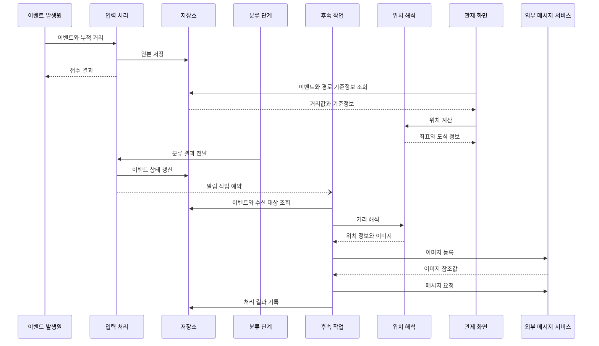

센서가 보낸 거리값은 관제 화면에서 좌표와 도식이 되고 분류된 이벤트에서는 알림의 위치 설명과 이미지가 된다. 두 흐름은 같은 위치 해석을 쓰지만 화면을 위한 조회·도식 데이터와 외부 메시지의 발송·기록은 서로 다른 운영 문제를 만든다.

여섯 편을 데이터 흐름에 따라 읽는다. 원본 이벤트와 후속 작업을 분리하고 선형참조와 기준점 선택으로 위치를 만든 뒤, 관제 화면의 도식과 쿼리를 다룬다. 마지막 두 편은 같은 위치 결과를 화면과 알림에 표현하고 외부 발송 결과를 운영 기록으로 남기는 문제를 살핀다.

관제 화면은 이벤트를 조회해 위치를 표시하고 분류가 끝난 이벤트는 별도 작업을 거쳐 알림으로 전달된다. 두 경로는 같은 거리·위치 모델을 사용하지만 조회와 외부 발송의 운영 조건은 다르다.

각 글은 이 흐름의 서로 다른 결정을 살핀다.

1. [원본과 계산 결과를 나눠 두는 이유](/2026/09/event-distance-to-mms-series/01-event-ingest-and-trigger)

   원본 거리와 나중에 계산하는 좌표를 분리하고 이벤트 저장과 후속 알림을 나누는 이유를 다룬다.

2. [하드웨어는 한 가지의 데이터를 단 한번만 말한다.](/2026/09/linear-referencing)

   선형 센서의 원본 거리에서 좌표를 계산하는 선형참조 모델과 데이터 흐름을 설명한다.

3. [보간식보다 기준점을 먼저 고른다](/2026/09/event-distance-to-mms-series/02-distance-to-coordinate)

   좌표와 위치 설명에 필요한 기준점을 구분하고 정보가 모자랄 때 추정을 멈추는 이유를 살핀다.

4. [이름으로 조인하던 쿼리를 외래키로 바꾸다](/2026/09/2026-09-18-query-tuning)

   관제 도식의 노드 관계를 명시적으로 옮기고 쿼리와 실행계획을 검증한 과정을 다룬다.

5. [위치 결과 하나로 그림과 문장을 만든다](/2026/09/event-distance-to-mms-series/03-map-image-and-message)

   하나의 위치 결과를 관제용 지도·도식과 알림 문장에 재사용해 표현이 어긋나지 않게 한다.

6. [외부 요청과 기록 사이의 틈](/2026/09/event-distance-to-mms-series/04-send-history-and-operations)

   외부 메시지 요청과 결과 기록 사이의 경계, 개인정보와 재시도 문제를 살펴본다.

예시에 나온 설명, 좌표, 거리와 식별자는 가상의 값이다. 특정 조직이나 시스템보다 판단에 영향을 준 조건과 그 선택이 남긴 한계를 중심으로 읽을 수 있다.
