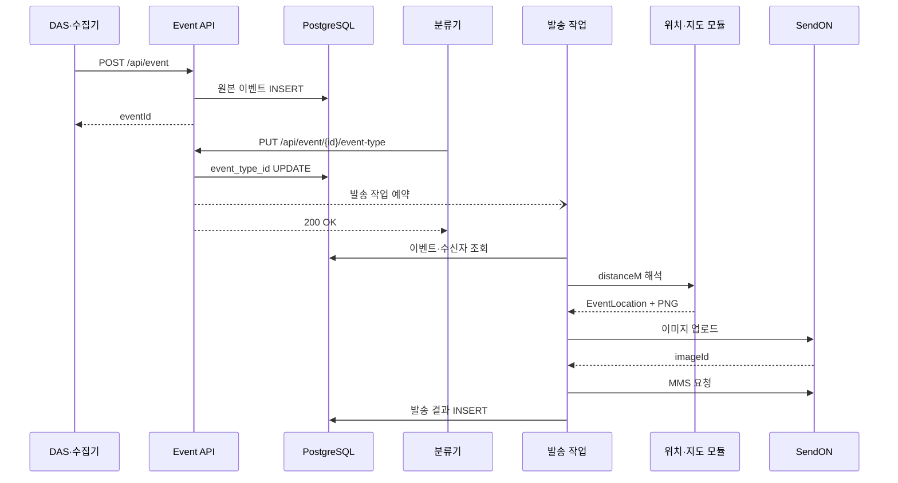

이 시리즈는 KEPCO-Monitoring의 한 기능을 모범답안으로 평가하려는 글이 아니다. 내가 확인한 코드에서 데이터가 어느 경계를 넘는지, 그 경계를 Java와 SQL로 어떻게 표현했는지 적는다.

DAS·수집기는 채널 시작점에서 잰 누적거리 `distanceM`을 보낸다. 서버는 이 숫자를 이벤트 원본으로 저장한다. 위치 기준점으로 좌표를 계산하고, 좌표가 있으면 지도 이미지를 만든다. 발송 서비스는 이미지와 위치 설명을 SendON 요청에 묶는다.

네 편은 같은 흐름을 반복해서 설명하지 않는다.

1. [원본 이벤트와 비동기 부작용을 분리하기](/2026/09/event-distance-to-mms-series/01-event-ingest-and-trigger)

   `distanceM`을 그대로 저장하는 이유와 분류 결과 갱신 뒤에 발송을 예약하는 이유를 다룬다.

2. [선형 보간보다 기준점 선택이 어렵다](/2026/09/event-distance-to-mms-series/02-distance-to-coordinate)

   구간 검색, 동률 처리, 경계값, 좌표와 설명에 서로 다른 기준점을 쓰는 이유를 살핀다.

3. [하나의 위치 결과로 지도와 메시지를 만들기](/2026/09/event-distance-to-mms-series/03-map-image-and-message)

   지도 렌더러와 계통도 렌더러의 역할, 폴백 조건, `EventDiagramResult`가 중복 계산을 막는 방식을 정리한다.

4. [외부 발송을 상태와 부작용으로 읽기](/2026/09/event-distance-to-mms-series/04-send-history-and-operations)

   암호화된 전화번호의 수명, 이미지 업로드와 발송 사이의 틈, `SUCCESS`와 `FAILED`가 실제로 뜻하는 범위를 기록한다.

예시에 나온 클래스명과 SQL은 2026-09-18 저장소에서 확인한 이름이다. 운영 값은 넣지 않았다.
