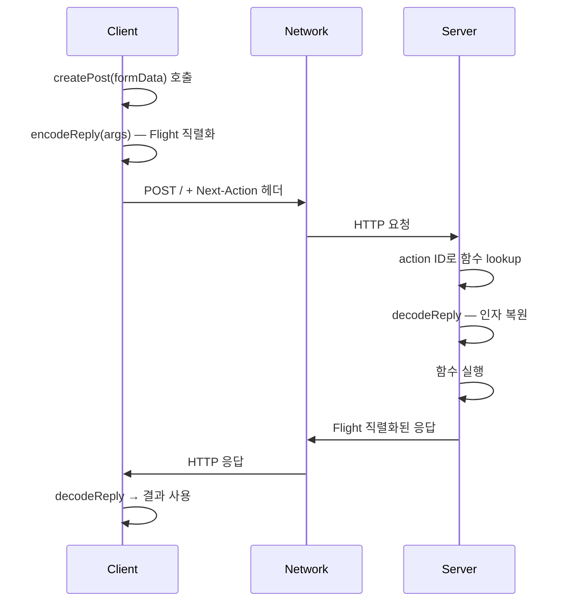

# `'use server'` 디렉티브 딥다이브 🌐

## RPC의 끝까지

> 디렉티브 3부작 — Part 2
>
> 한 줄 뒤에 숨은 RPC, 직렬화, 그리고 보안

---

## 오늘 다룰 것

1. `'use server'`는 함수를 **서버 엔드포인트**로 만든다
2. 본질은 **RPC** — 1984년부터 있던 패턴
3. 빌드 타임에 함수가 reference object로 변환된다
4. 클로저는 **암호화되어** 클라이언트로 나간다
5. 보안은 자동이 아니다 — 인증·인가는 별도

---

## 시작은 한 줄

```tsx
async function createPost(formData: FormData) {
  'use server'
  const title = formData.get('title')
  await db.posts.create({title})
}
```

- 호출은 클라이언트에서, 실행은 서버에서
- 라우터, 파서, 직렬화 — 다 자동
- 진짜 그럴까? 어떻게 동작하는가?

---

## 용어 정리

React 공식 문서 (2024-09 이후):

- **서버 함수(Server Function)**: `"use server"`로 표시된 모든 비동기 함수
- **서버 액션(Server Action)**: 서버 함수 중 `action` prop에 전달되거나 action 안에서 호출되는 것

> 모든 Server Action은 Server Function이지만, 모든 Server Function이 Server Action은 아니다.

---

## RPC: 뿌리부터

```ts
// 전통: HTTP 요청 직접 작성
const res = await fetch('/api/posts', {
  method: 'POST',
  headers: {'Content-Type': 'application/json'},
  body: JSON.stringify({title}),
})
const post = await res.json()

// RPC: 네트워크가 사라진 듯이
const post = await createPost({title})
```

**RPC = 네트워크 통신의 추상화.**
직렬화/역직렬화가 가능하게 만든다.

---

## 분산 컴퓨팅의 8가지 거짓말

1984년 Sun에서 정리, 1994년 보강. 개발자가 무의식적으로 하는 잘못된 가정 8개.

프론트엔드가 직접 부딪히는 건 4개.

---

## 부딪히는 4개

| 거짓말               | 실제                                |
| -------------------- | ----------------------------------- |
| 네트워크는 신뢰 가능 | 언제든 실패할 수 있음               |
| 지연은 0             | ms~s 단위. 100번 호출하면 100번 RTT |
| 대역폭은 무한        | 직렬화 크기 = 네트워크 비용         |
| 네트워크는 안전      | 가로채기·변조 가능                  |

> RPC가 과거 (Java RMI, CORBA, DCOM) 모두 실패한 이유다.

---

## React 팀의 해법

> "Hide the network, but expose network characteristics."

네트워크는 숨기되, **네트워크의 특성은 드러낸다**.

- `useTransition` — pending 상태
- `useActionState` — 에러 처리
- Optimistic update 패턴

이 도구들이 RPC의 함정을 메워준다.

---

## 빌드 타임 변환

`"use server"`는 런타임 효과가 없다. **빌드 타임**이 본체다.

번들러(webpack, Turbopack)가 함수를 발견하면:

1. 함수에 메타데이터를 박는다 (`registerServerReference`)
2. 클라이언트 측에서는 함수 본문을 RPC 호출로 바꾼다
3. 서버 actions 매니페스트에 등록한다

---

## registerServerReference

```js
// react-server-dom-webpack/.../ReactFlightWebpackReferences.js
const SERVER_REFERENCE_TAG = Symbol.for('react.server.reference')

export function registerServerReference(reference, id, exportName) {
  return Object.defineProperties(reference, {
    $$typeof: {value: SERVER_REFERENCE_TAG},
    $$id: {value: exportName === null ? id : id + '#' + exportName},
    $$bound: {value: null, configurable: true},
    bind: {value: bind, configurable: true},
  })
}
```

**핵심:** `Object.defineProperties`로 함수에 메타데이터 4개를 박는다.

---

## 메타데이터 4개

| 속성       | 값                                     | 의미                               |
| ---------- | -------------------------------------- | ---------------------------------- |
| `$$typeof` | `Symbol.for('react.server.reference')` | server reference 식별 태그         |
| `$$id`     | `"moduleId#exportName"`                | 서버에서 함수를 찾는 ID            |
| `$$bound`  | `null`                                 | `.bind()`로 묶은 인자              |
| `bind`     | 함수                                   | 새 bound reference를 만드는 메서드 |

`$$id`는 Next.js에서 **42자 hash**로 변환된다.

---

## 클라이언트 측 구현

```js
// 클라이언트에서는 같은 함수 자리에...
import {createServerReference} from 'react-server-dom-webpack/client'

export const createPost = createServerReference(
  'moduleId#createPost', // $$id
  callServer, // RPC 호출자
)
```

**원본 함수 본문은 클라이언트 번들에 들어가지 않는다.**
대신 `callServer`를 호출하는 reference object가 들어간다.

---

## 호출 흐름



---

## encodeReply

React의 Flight 직렬화기. JSON보다 강력.

**가능:**

- 원시값
- 일반 객체, 배열
- `Date`, `Map`, `Set`, `BigInt`
- `TypedArray`, `ArrayBuffer`, `FormData`
- React element (pass-through)

**불가능:**

- 클래스 인스턴스, 일반 함수, `Symbol`, `URL`

---

## Next-Action 헤더

```http
POST / HTTP/1.1
Next-Action: 7f8a3b2c...  ← 42자 hash
Content-Type: multipart/form-data; boundary=----...

------...
Content-Disposition: form-data; name="0"
{"title": "New Post"}
------...
```

- URL은 페이지 경로
- 어느 함수를 호출하는지는 **`Next-Action` 헤더**로 식별
- 인자는 multipart body로 전송

---

## 서버 측 처리

```js
// 단순화
async function handleAction(req) {
  const actionId = req.headers.get('Next-Action')
  const fn = actionsManifest[actionId] // 매니페스트 lookup
  const args = await decodeReply(req.body) // 역직렬화
  const result = await fn(...args) // 함수 실행
  return encodeReply(result) // 직렬화 응답
}
```

actions 매니페스트는 빌드 타임에 만들어진다.

---

## actions 매니페스트

```json
{
  "7f8a3b2c...": {
    "workers": {
      "app/posts/page": {
        "moduleId": "app/posts/actions.ts",
        "exportName": "createPost",
        "async": true
      }
    },
    "layer": {"rsc": "..."}
  }
}
```

actionId → 어느 모듈의 어느 export인가의 매핑.

---

## 클로저 처리: bound args

```tsx
async function MyComponent({user}) {
  async function deletePost(formData) {
    'use server'
    const id = formData.get('id')
    await db.delete({id, userId: user.id}) // user를 클로저로 참조
  }
  return <form action={deletePost}>...</form>
}
```

클로저로 잡힌 `user`는 어떻게 서버로 전달되는가?

---

## bind로 박힌다

빌드 타임에 클로저 변수가 추출되어 `.bind()`로 묶인다.

```js
// 변환 후 (개념)
async function $$action_deletePost(boundUser, formData) {
  const id = formData.get('id')
  await db.delete({id, userId: boundUser.id})
}

// 컴포넌트 안에서
const deletePost = $$action_deletePost.bind(null, user)
```

`bound` 값은 클라이언트로 나간다 — 그러면 변조 가능?

---

## 보안 1: bound 변수 암호화

React는 bound 변수를 **빌드 타임 키로 암호화**해서 직렬화한다.

```js
// 단순화
$$bound: {
  value: encrypt([user], buildKey),  // 클라이언트 못 봄
}
```

- 클라이언트는 암호문만 들고 있음
- 서버에서만 복호화 가능
- 사용자가 변조해도 복호화 실패 → 에러

---

## 보안 2: 인증·인가는 자동이 아니다

```ts
'use server'

export async function deleteUser(id: string) {
  await db.users.delete({id}) // ❌ 누구나 호출 가능
}
```

`'use server'` 함수는 **퍼블릭 엔드포인트**다. 자동 인증 없다.

```ts
'use server'

export async function deleteUser(id: string) {
  const session = await auth()
  if (!session?.user.isAdmin) throw new Error('Unauthorized')
  await db.users.delete({id})
}
```

매 함수마다 직접 체크해야 한다.

---

## 보안 3: 인자 검증

```ts
'use server'

export async function updatePost(id: string, title: string) {
  // ❌ 검증 없이 DB에
  await db.posts.update({id, title})
}
```

클라이언트가 보낸 인자는 **신뢰할 수 없다**. zod 같은 스키마 라이브러리로 검증.

```ts
const schema = z.object({id: z.string().uuid(), title: z.string().max(200)})
const validated = schema.parse({id, title})
```

---

## useActionState 패턴

```tsx
'use client'

import {useActionState} from 'react'
import {createPost} from './actions'

export function CreatePostForm() {
  const [state, formAction, isPending] = useActionState(createPost, null)

  return (
    <form action={formAction}>
      <input name="title" />
      <button disabled={isPending}>Submit</button>
      {state?.error && <p>{state.error}</p>}
    </form>
  )
}
```

- `state`: 마지막 실행 결과
- `formAction`: form에 넘기면 자동 처리
- `isPending`: 진행 중 표시

---

## useTransition으로 fine-grained 제어

```tsx
'use client'

const [isPending, startTransition] = useTransition()

const handleClick = () => {
  startTransition(async () => {
    await createPost({title})
  })
}
```

`useActionState`보다 자유도가 높지만, 직접 상태 관리 필요.

---

## Optimistic update

```tsx
'use client'

const [optimisticPosts, addOptimistic] = useOptimistic(
  posts,
  (state, newPost) => [...state, {...newPost, pending: true}],
)

const handleSubmit = async (formData) => {
  addOptimistic({title: formData.get('title')})
  await createPost(formData)
}
```

서버 응답 전에 UI를 미리 업데이트 → 사용자 체감 속도 ↑

---

## 함정 1: 인자 직렬화 실수

```tsx
class User {
  /* ... */
}

async function update(user: User) {
  'use server'
  // ❌ 클래스 인스턴스 전달 불가
}
```

직렬화 가능한 형태로 변환해서 넘길 것.

```tsx
async function update(userData: {id: string; name: string}) {
  'use server'
}
```

---

## 함정 2: 큰 객체 전달

```tsx
async function uploadFile(file: ArrayBuffer) {
  'use server'
  // 100MB 넘는 ArrayBuffer를 매번 전송?
}
```

- 큰 파일은 server function보다 **별도 업로드 endpoint** 권장
- presigned URL → S3 직접 업로드 패턴

---

## 함정 3: 호출 빈도

```tsx
{
  items.map((item) => <button onClick={() => syncItem(item.id)}>Sync</button>)
}
```

100개 아이템 × 100번 클릭 = 100번 HTTP RTT.

batch 함수로 묶거나, 클라이언트 측 dedup 필요.

---

## 함정 4: 에러 처리

```tsx
async function deletePost(id: string) {
  'use server'
  await db.delete(id) // ❌ throw하면?
}
```

서버에서 던진 에러는 클라이언트로 그대로 가지 않는다 (보안). 에러 객체를 직렬화 가능한 형태로 반환:

```ts
return {success: false, error: 'Cannot delete'}
```

---

## 'use client' vs 'use server'

|             | `'use client'`      | `'use server'`        |
| ----------- | ------------------- | --------------------- |
| 변환 대상   | 모듈                | 함수                  |
| 박히는 ID   | 모듈 ID + chunk     | SHA1 함수 ID          |
| 경계의 의미 | RSC → Client (참조) | Client → Server (RPC) |
| 직렬화기    | Flight              | Flight (encodeReply)  |

---

## 전체 아키텍처

```mermaid
flowchart TD
  A["async fn() { 'use server' }"] --> B[Build: registerServerReference]
  B --> C[Client bundle: createServerReference]
  B --> D[Server: actions manifest]

  C --> E[fn(args) 호출]
  E --> F[encodeReply args]
  F --> G[POST + Next-Action header]
  G --> H[Server: actionId lookup]
  H --> I[decodeReply args]
  I --> J[fn 실행]
  J --> K[encodeReply result]
  K --> L[클라이언트 결과 받음]
```

---

## 핵심 정리

1. **'use server'는 함수를 RPC 엔드포인트로 변환** — 모듈 + export name → SHA1 hash가 ID
2. **registerServerReference** — `$$typeof`, `$$id`, `$$bound`, `bind` 메타데이터 박기
3. **클로저는 암호화** — bound 변수는 빌드 키로 암호화되어 직렬화
4. **인증·인가는 수동** — `'use server'` 함수는 퍼블릭 엔드포인트
5. **인자 검증 필수** — 클라이언트 데이터는 신뢰 불가
6. **8 fallacies는 살아있다** — useTransition/useActionState로 메우자

---

## 시리즈 — 다음 편

> 디렉티브 3부작
>
> ✅ Part 1: `'use client'` — 클라이언트 경계
> ✅ Part 2: `'use server'` (이번 편) — RPC 경계
> ▶️ **Part 3: `'use cache'` — 시간의 경계**

방향성:

- Part 1: 서버 → 클라이언트 (참조 직렬화)
- Part 2: 클라이언트 → 서버 (RPC 호출)
- Part 3: caller → cache (시간 너머의 lookup)

---

## 참고

- 블로그 원문: [React 서버 함수 딥다이브](https://yceffort.kr/2026/03/react-server-functions-deep-dive)
- [React docs: "use server"](https://react.dev/reference/rsc/use-server)
- React v19.2 source: `react-server-dom-webpack/`
- 8 Fallacies of Distributed Computing (Peter Deutsch, 1994)
